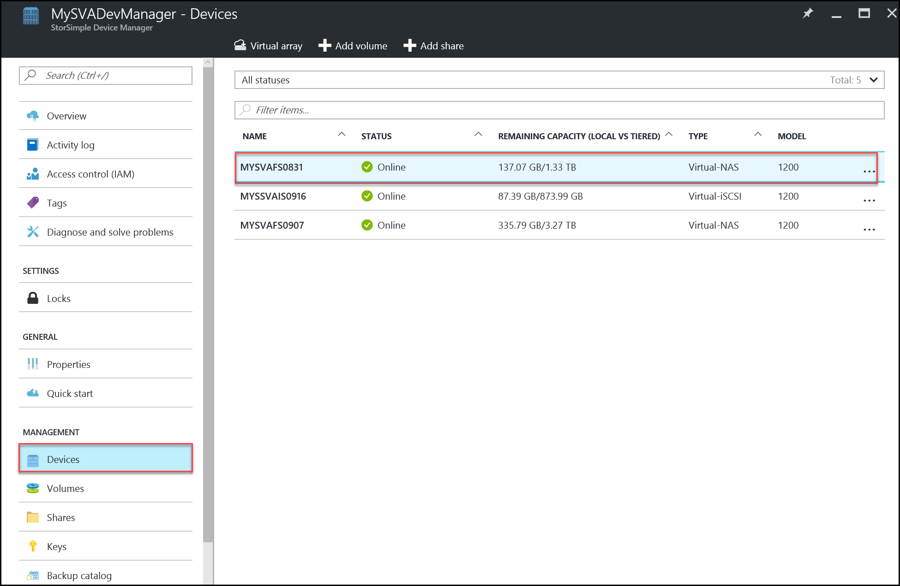
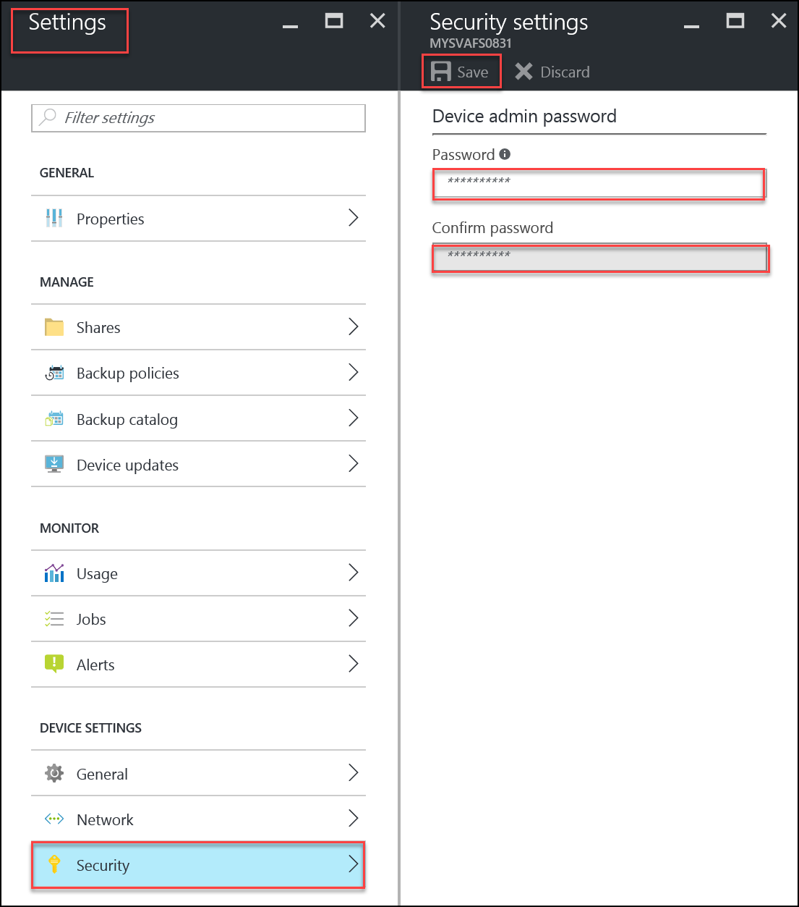
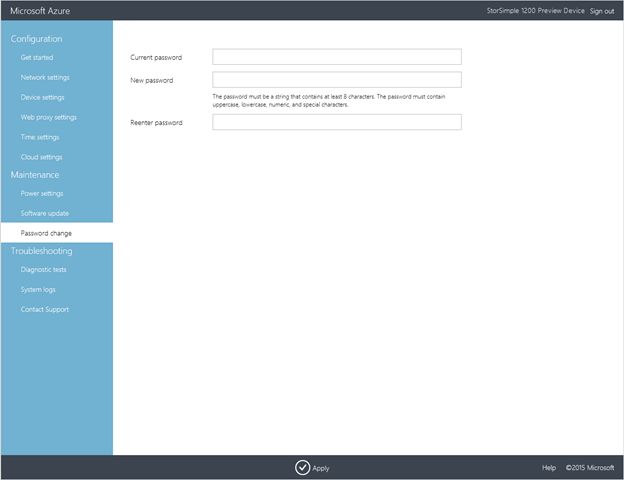
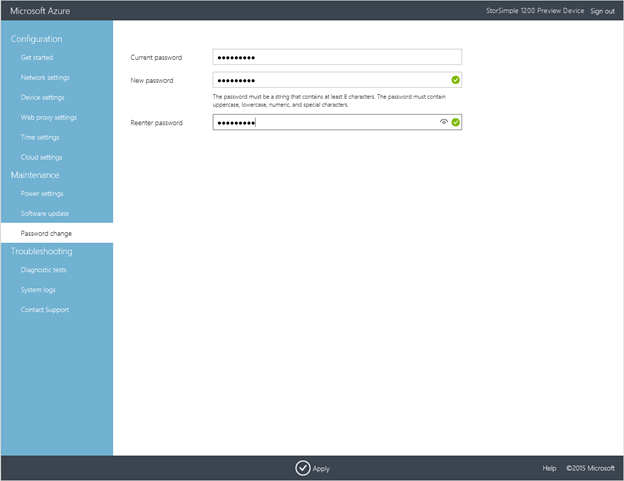

# Change the StorSimple Virtual Array device administrator password via StorSimple Device Manager

## Overview

When you use the Windows PowerShell interface to access the StorSimple Virtual Array, you are required to enter a device administrator password. When the StorSimple device is first provisioned and started, the default password is *Password1*. For the security of your data, the default password expires the first time that you sign in and you are required to change this password.

You can also use either the local web UI or the Azure portal to change the device administrator password at any time after the device is deployed in your production environment. Each of these procedures is described in this article.

 

## Use the Azure portal to change the password

Perform the following steps to change the device administrator password through the Azure portal.

#### To change the device administrator password via the Azure portal

1. On the service landing page, select your service, double-click the service name, and then within the **Management** section, click **Devices**. This opens the **Devices** blade that lists all your StorSimple Virtual Array devices.

2. In the **Devices** blade, double-click the device that requires a change of password.

3. In the **Settings** blade for your device, click **Security**.

4. In the **Security Settings** blade, do the following:
   
   1. Scroll down to the **Device Administrator Password** section. Provide an administrator password that contains from 8 to 15 characters.
   2. Confirm the password.
   3. Click **Save** at the top of the blade.

The device administrator password is now updated. You can use this modified password to access the device locally.

## Use the local web UI to change the password

Perform the following steps to change the device administrator password through the local web UI.

#### To change the device administrator password via the local web UI

1. In the local web UI, click **Maintenance** > **Password change** for your device.
   
    
2. Enter the **Current password**.
3. Provide a **New Password**. The password must be at least 8 characters long. It must contain 3 of 4 of the following: uppercase, lowercase, numeric, and special characters.
   
    Note that your password cannot be the same as the last 24 passwords.
4. Reenter the password to confirm it.
   
    
5. At the bottom of the page, click **Apply**. The new password is now applied. If the password change is not successful, you see the following error:
   
    
   
    After the password is successfully updated, you are notified. You can then use this modified password to access the device locally.

## Next steps
Learn how to [administer your StorSimple Virtual Array](storsimple-ova-web-ui-admin.md).

