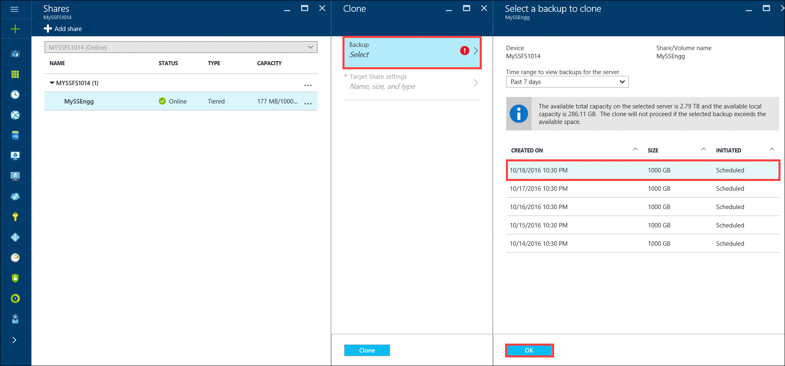
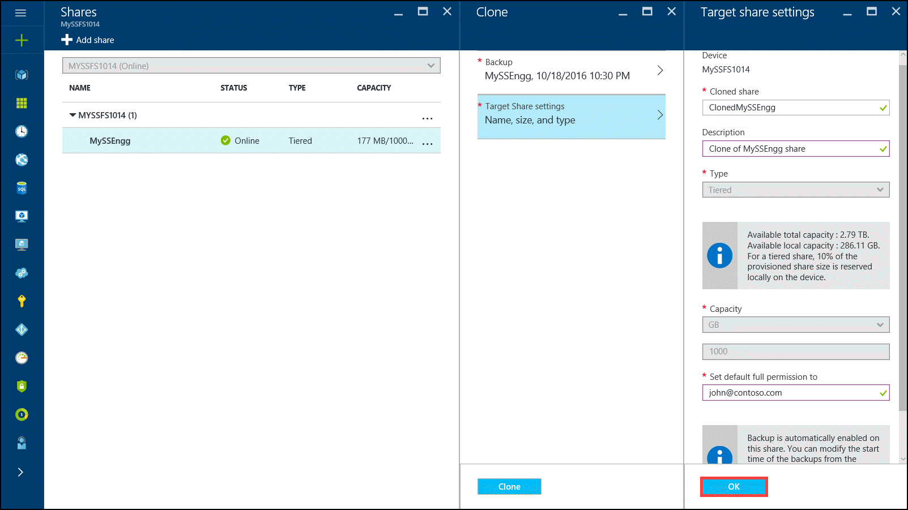
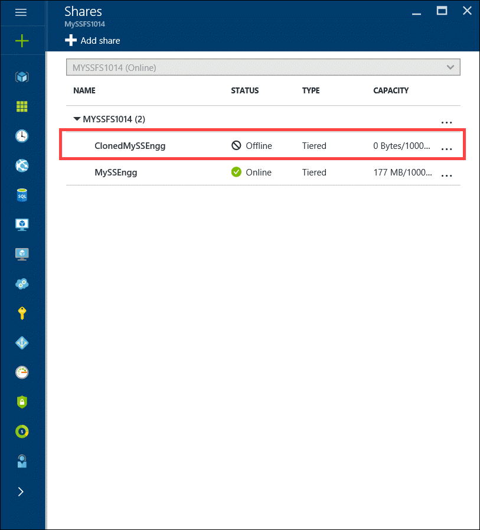
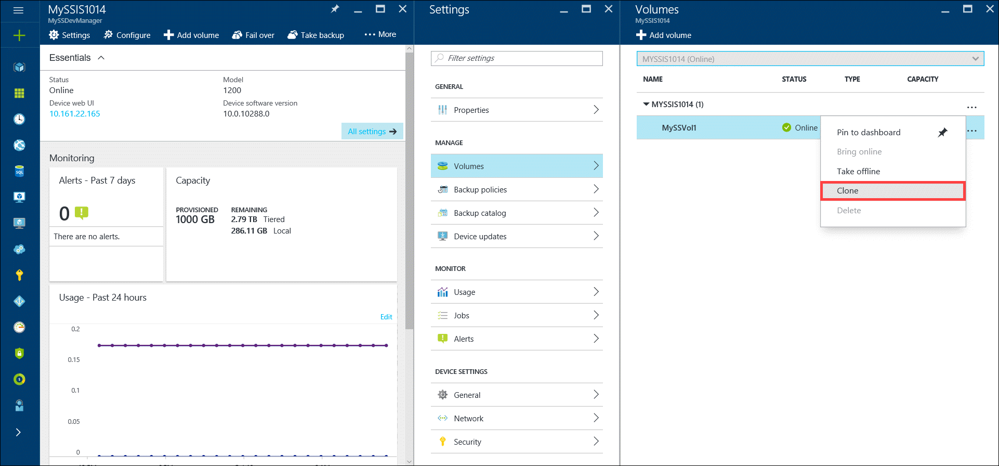
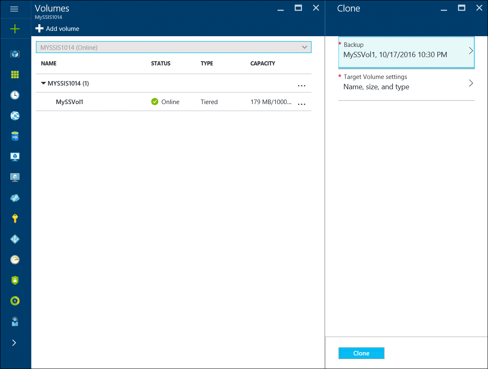
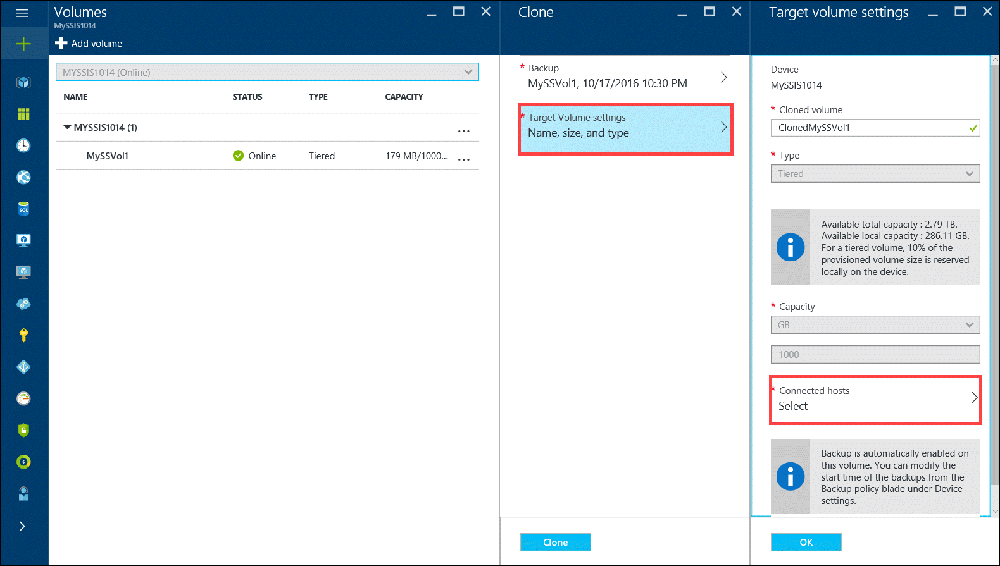
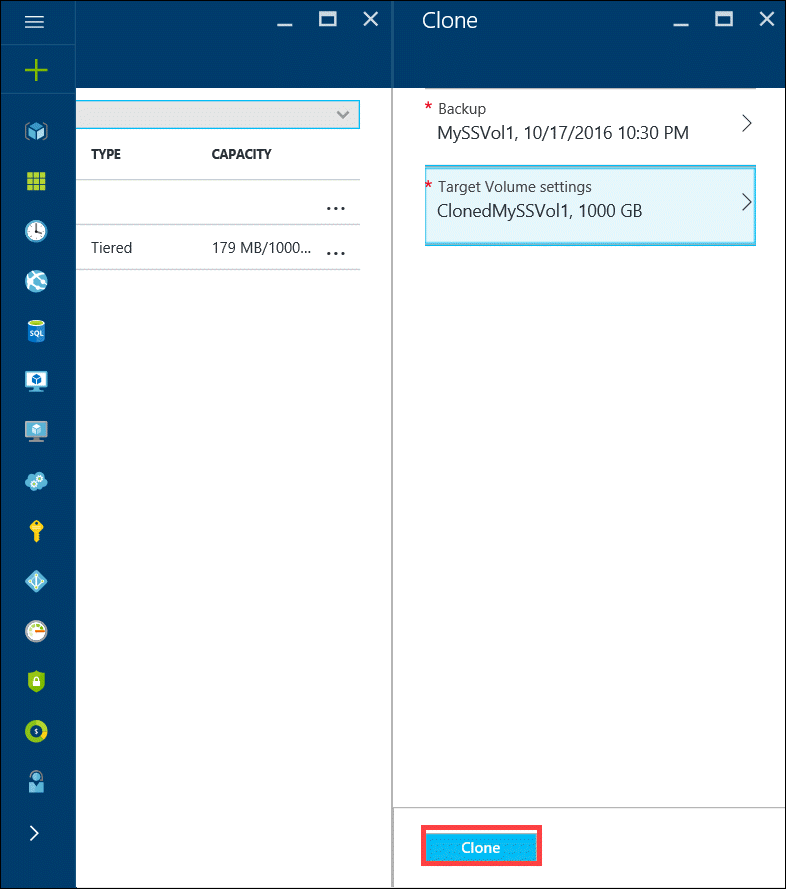
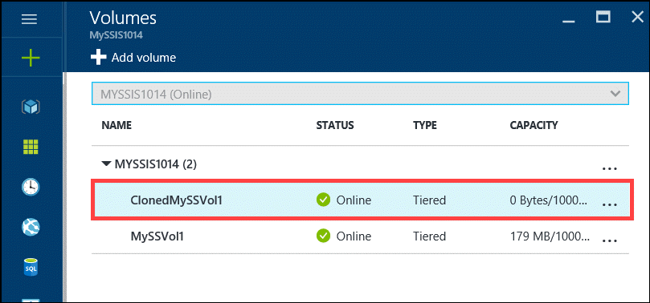

# Clone from a backup of your StorSimple Virtual Array

## Overview

This article describes step-by-step how to clone a backup set of your shares or volumes on your Microsoft Azure StorSimple Virtual Array. The cloned backup is used to recover a deleted or lost file. The article also includes detailed steps to perform an item-level recovery on your StorSimple Virtual Array configured as a file server.

## Clone shares from a backup set

**Before you try to clone shares, ensure that you have sufficient space on the device to complete this operation.** To clone from a backup, in the [Azure portal](https://portal.azure.com/), perform the following steps.

#### To clone a share

1. Browse to **Devices** blade. Select and click your device and then click **Shares**. Select the share that you want to clone, right-click the share to invoke the context menu. Select **Clone**.
   
   
2. In the **Clone** blade, click **Backup > Select** and then do the following: 
   
   a.    Filter a backup on this device based on the time range. You can choose from **Past 7 days**, **Past 30 days**, and **Past year**.
   
   b.    In the list of filtered backups displayed, select a backup to clone from.
   
   c.    Click **OK**.
   
   
3. In the **Clone** blade, click **Target settings** and then do the following:
   
   a.    Provide a share name. The share name must contain 3-127 characters.
   
   b.    Optionally provide a description for the cloned share.
   
   c.    You cannot change the type of the share you are restoring to. A tiered share is cloned as a tiered and a locally pinned share as locally pinned.
   
   d.    The capacity is set as equal to the size of the share you are cloning from.
   
   e.    Assign the administrators for this share. You will be able to modify the share properties via File Explorer after the clone is complete.
   
   f.    Click **OK**.
   
   

4. Click **Clone** to start a clone job. After the job is complete, the clone operation starts and you are notified. To monitor the progress of clone, go to the **Jobs** blade and click the job to view job details.
5. After the clone is successfully created, navigate back to the **Shares** blade on your device.
6. You can now view the new cloned share in the list of shares on your device. A tiered share is cloned as tiered and a locally pinned share as a locally pinned share.
   
   

## Clone volumes from a backup set

To clone from a backup, in the Azure portal, you have to perform steps similar to the ones when cloning a share. The clone operation clones the backup to a new volume on the same virtual device; you cannot clone to a different device.

#### To clone a volume

1. Browse to **Devices** blade. Select and click your device and then click **Volumes**. Select the volume that you want to clone, right-click the volume to invoke the context menu. Select **Clone**.
   
   
2. In the **Clone** blade, click **Backup** and then do the following: 
   
   a.    Filter a backup on this device based on the time range. You can choose from **Past 7 days**, **Past 30 days**, and **Past year**. 
   
   b.    In the list of filtered backups displayed, select a backup to clone from.
   
   c.    Click **OK**.
   
   
3. In the **Clone** blade, click **Target volume settings** and then do the following::
   
   a. The device name is automatically populated.
   
   b. Provide a volume name for the **cloned volume**. The volume name must contain 3 to 127 characters.
   
   c. The volume type is automatically set to the original volume. A tiered volume is cloned as tiered and a locally pinned volume as locally pinned.
   
   d. For the **Connected hosts**, click **Select**.
   
   
4. In  the **Connected hosts** blade, select from an existing ACR or add a new ACR. To add a new ACR, you will need to provide an ACR name and the host IQN. Click **Select**.
   
   
5. Click **Clone** to launch a clone job.
   
     
6. After the clone job is created, cloning will start. Once the clone is created, it is displayed on the Volumes blade on your device. Note that a tiered volume is cloned as tiered and a locally pinned volume is cloned as a locally pinned volume.
   
   
7. Once the volume appears online on the list of volumes, the volume is available for use. On the iSCSI initiator host, refresh the list of targets in iSCSI initiator properties window. A new target that contains the cloned volume name should appear as 'inactive' under the status column.
8. Select the target and click **Connect**. After the initiator is connected to the target, the status should change to **Connected**.
9. In the **Disk Management** window, the mounted volumes appear as shown in the following illustration. Right-click the discovered volume (click the disk name), and then click **Online**.

> [!IMPORTANT]
> When trying to clone a volume or a share from a backup set, if the clone job fails, a target volume or share may still be created in the portal. It is important that you delete this target volume or share in the portal to minimize any future issues arising from this element.
> 
> 

## Item-level recovery (ILR)

This release introduces the item-level recovery (ILR) on a StorSimple Virtual Array configured as a file server. The feature allows you to do granular recovery of files and folders from a cloud backup of all the shares on the StorSimple device. You can retrieve deleted files from recent backups using a self-service model.

Every share has a *.backups* folder that contains the most recent backups. You can navigate to the desired backup, copy relevant files and folders from the backup and restore them. This feature eliminates calls to administrators for restoring files from backups.

1. When performing the ILR, you can view the backups through File Explorer. Click the specific share that you want to look at the backup for. You will see a *.backups* folder created under the share that stores all the backups. Expand the *.backups* folder to view the backups. The folder shows the exploded view of the entire backup hierarchy. This view is created on-demand and usually takes only a couple of seconds to create.
   
   The last five backups are displayed in this way and can be used to perform an item-level recovery. The five recent backups include both the default scheduled and the manual backups.
   
   * **Scheduled backups** named as &lt;Device name&gt;DailySchedule-YYYYMMDD-HHMMSS-UTC.
   * **Manual backups** named as Ad-hoc-YYYYMMDD-HHMMSS-UTC.
     
     

2. Identify the backup containing the most recent version of the deleted file. Though the folder name contains a UTC timestamp in each of the preceding cases, the time at which the folder was created is the actual device time when the backup started. Use the folder timestamp to locate and identify the backups.

3. Locate the folder or the file that you want to restore in the backup that you identified in the previous step. Note you can only view the files or folders that you have permissions for. If you cannot access certain files or folders, contact a share administrator. The administrator can use File Explorer to edit the share permissions and give you access to the specific file or folder. It is a recommended best practice that the share administrator is a user group instead of a single user.

4. Copy the file or the folder to the appropriate share on your StorSimple file server.

## Next steps

Learn more about how to [administer your StorSimple Virtual Array using the local web UI](storsimple-ova-web-ui-admin.md).

