# Deploy StorSimple Virtual Array - Provision in VMware

## Overview

[!INCLUDE [storsimple-virtual-array-eol-banner](../../includes/storsimple-virtual-array-eol-banner.md)]

This tutorial describes how to provision and connect to a StorSimple Virtual Array on a host system running VMware ESXi 5.0, 5.5, 6.0 or 6.5. This article applies to the deployment of StorSimple Virtual Arrays in Azure portal and the Microsoft Azure Government Cloud.

You need administrator privileges to provision and connect to a virtual device. The provisioning and initial setup can take around 10 minutes to complete.

## Provisioning prerequisites
The prerequisites to provision a virtual device on a host system running VMware ESXi 5.0, 5.5, 6.0 or 6.5, are as follows.

### For the StorSimple Device Manager service
Before you begin, make sure that:

* You have completed all the steps in [Prepare the portal for StorSimple Virtual Array](storsimple-virtual-array-deploy1-portal-prep.md).
* You have downloaded the virtual device image for VMware from the Azure portal. For more information, see **Step 3: Download the virtual device image** of [Prepare the portal for StorSimple Virtual Array guide](storsimple-virtual-array-deploy1-portal-prep.md).

### For the StorSimple virtual device
Before you deploy a virtual device, make sure that:

* You have access to a host system running Hyper-V (2008 R2 or later) that can be used to a provision a device.
* The host system is able to dedicate the following resources to provision your virtual device:

  * A minimum of 4 cores.
  * At least 8 GB of RAM. If you plan to configure the virtual array as file server, 8 GB supports less than 2 million files. You need 16 GB RAM to support 2 - 4 million files.
  * One network interface.
  * A 500 GB virtual disk for system data.

### For the network in datacenter
Before you begin, make sure that:

* You have reviewed the networking requirements to deploy a StorSimple virtual device and configured the datacenter network as per the requirements. 

## Step-by-step provisioning
To provision and connect to a virtual device, you need to perform the following steps:

1. Ensure that the host system has sufficient resources to meet the minimum virtual device requirements.
2. Provision a virtual device in your hypervisor.
3. Start the virtual device and get the IP address.

## Step 1: Ensure host system meets minimum virtual device requirements
To create a virtual device, you will need:

* Access to a host system running VMware ESXi Server 5.0, 5.5, 6.0 or 6.5.
* VMware vSphere client on your system to manage the ESXi host.

  * A minimum of 4 cores.
  * At least 8 GB of RAM. If you plan to configure the virtual array as file server, 8 GB supports less than 2 million files. You need 16 GB RAM to support 2 - 4 million files.
  * One network interface connected to the network capable of routing traffic to Internet. The minimum Internet bandwidth should be 5 Mbps to allow for optimal working of the device.
  * A 500 GB virtual disk for data.

## Step 2: Provision a virtual device in hypervisor
Perform the following steps to provision a virtual device in your hypervisor.

1. Copy the virtual device image on your system. You downloaded this virtual image through the Azure portal.

   1. Ensure that you have downloaded the latest image file. If you downloaded the image earlier, download it again to ensure you have the latest image. The latest image has two files (instead of one).
   2. Make a note of the location where you copied the image as you are using this image later in the procedure.

2. Log in to the ESXi server using the vSphere client. You need to have administrator privileges to create a virtual machine.

   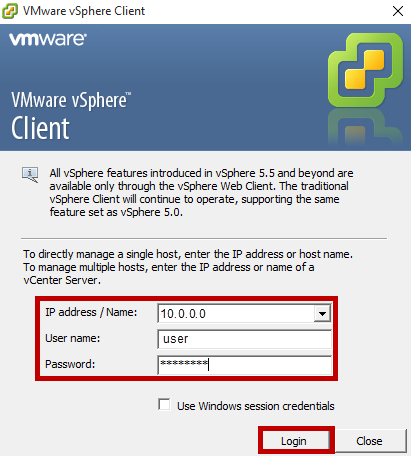
3. In the vSphere client, in the inventory section in the left pane, select the ESXi Server.

   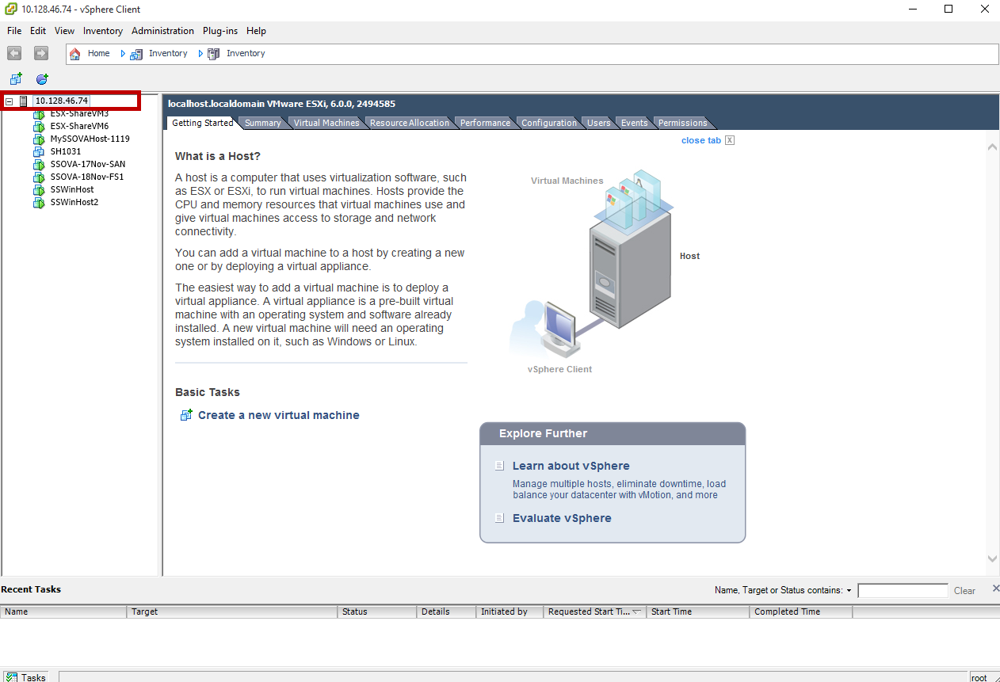
4. Upload the VMDK to the ESXi server. Navigate to the **Configuration** tab in the right pane. Under **Hardware**, select **Storage**.

   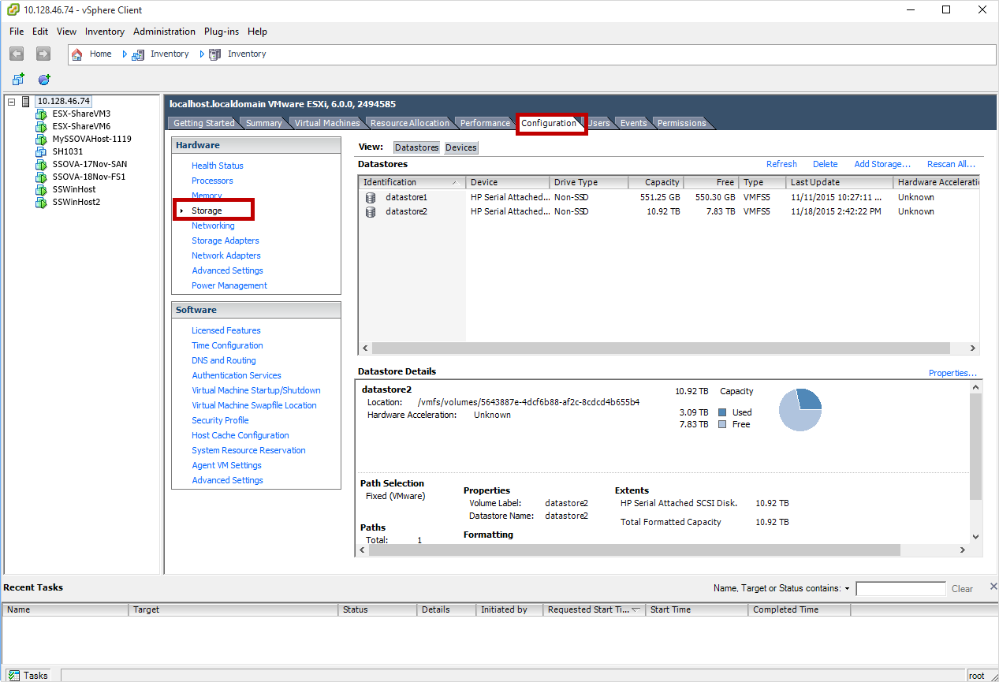
5. In the right pane, under **Datastores**, select the datastore where you want to upload the VMDK. The datastore must have enough free space for the OS and data disks.

   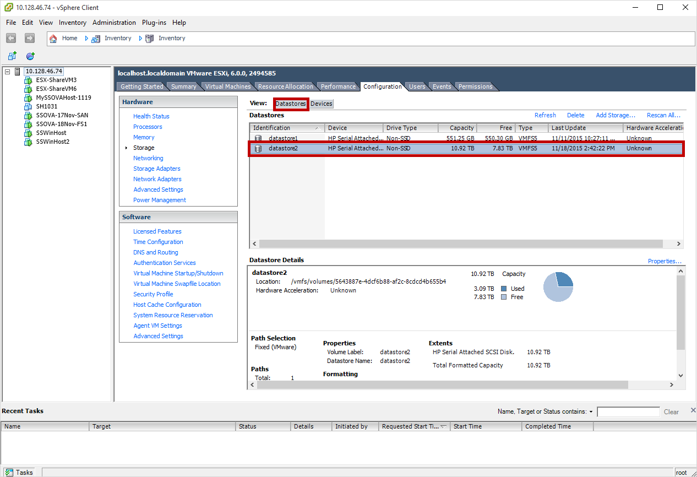
6. Right-click and select **Browse Datastore**.

   
7. A **Datastore Browser** window appears.

   
8. In the tool bar, click :::image type="icon" source="./media/storsimple-virtual-array-deploy2-provision-vmware/image7.png"::: icon to create a new folder. Specify the folder name and make a note of it. You will use this folder name later when creating a virtual machine (recommended best practice). Click **OK**.

   
9. The new folder appears in the left pane of the **Datastore Browser**.

   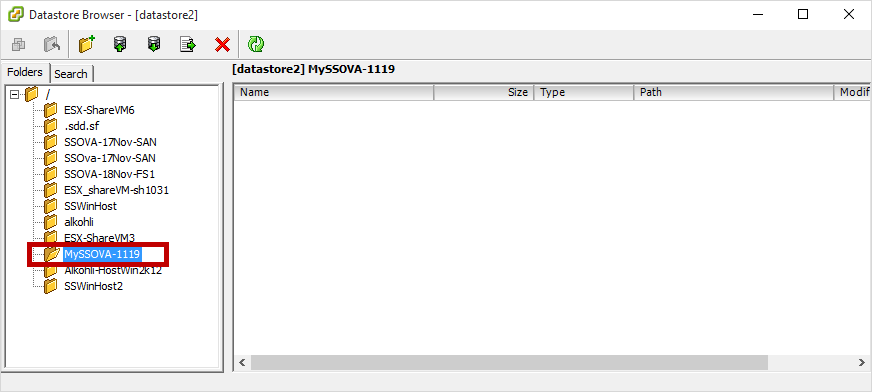
10. Click the Upload icon :::image type="icon" source="./media/storsimple-virtual-array-deploy2-provision-vmware/image10.png"::: and select **Upload File**.

    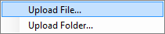
11. Browse and point to the VMDK files that you downloaded. There are two files. Select a file to upload.

    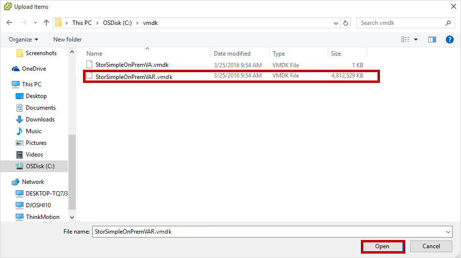
12. Click **Open**. The upload of the VMDK file to the specified datastore starts. It may take several minutes for the file to upload.
13. After the upload is complete, you see the file in the datastore in the folder you created.

    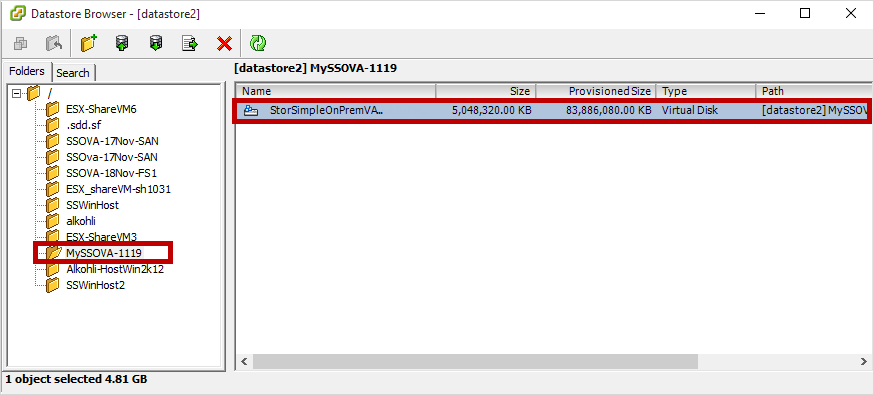

    Now upload the second VMDK file to the same datastore.
14. Return to the vSphere client window. With ESXi server selected, right-click and select **New Virtual Machine**.

    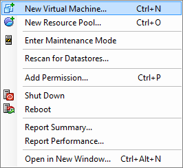
15. A **Create New Virtual Machine** window will appear. On the **Configuration** page, select the **Custom** option. Click **Next**.
    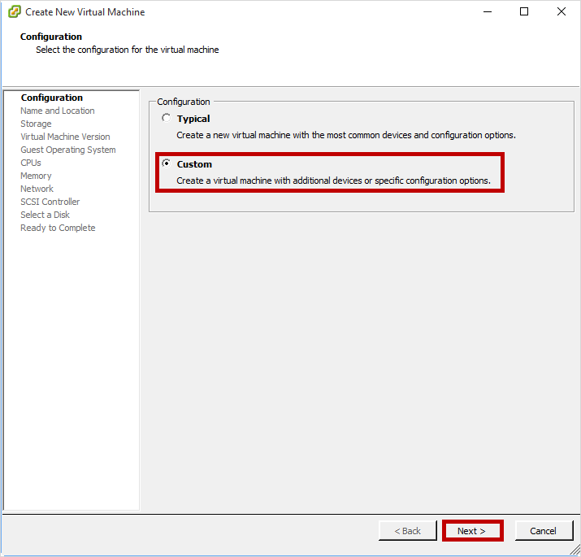
16. On the **Name and Location** page, specify the name of your virtual machine. This name should match the folder name (recommended best practice) you specified earlier in Step 8.

    
17. On the **Storage** page, select a datastore you want to use to provision your VM.

    
18. On the **Virtual Machine Version** page, select **Virtual Machine Version: 8**.

    
19. On the **Guest Operating System** page, select the **Guest Operating System** as **Windows**. For **Version**, from the dropdown list, select **Microsoft Windows Server 2012 (64-bit)**.

    
20. On the **CPUs** page, adjust the **Number of virtual sockets** and **Number of cores per virtual socket** so that the **Total number of cores** is 4 (or more). Click **Next**.

    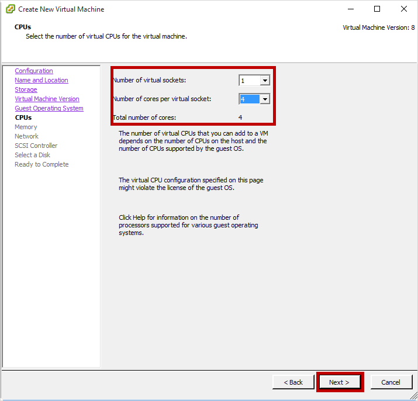
21. On the **Memory** page, specify 8 GB (or more) of RAM. Click **Next**.

    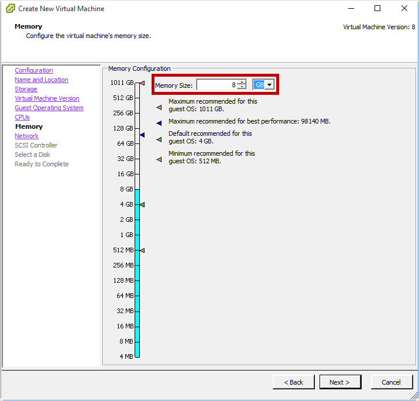
22. On the **Network** page, specify the number of the network interfaces. The minimum requirement is one network interface.

    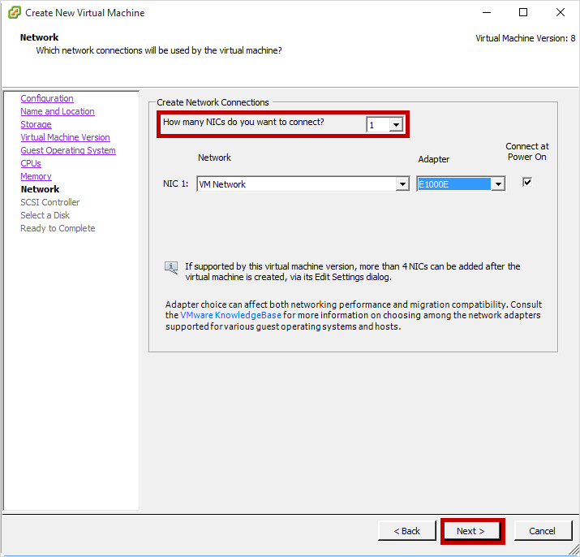
23. On the **SCSI Controller** page, accept the default **LSI Logic SAS controller**.

    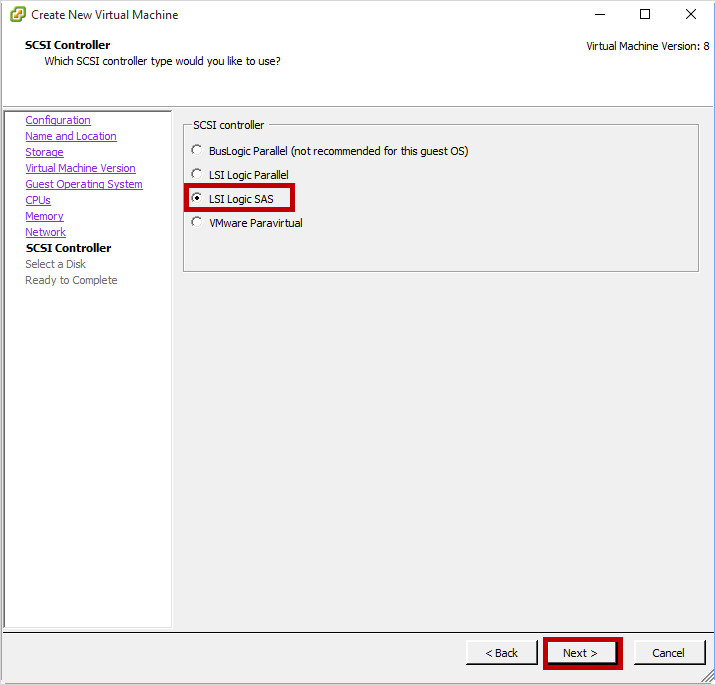
24. On the **Select a Disk** page, choose **Use an existing virtual disk**. Click **Next**.

    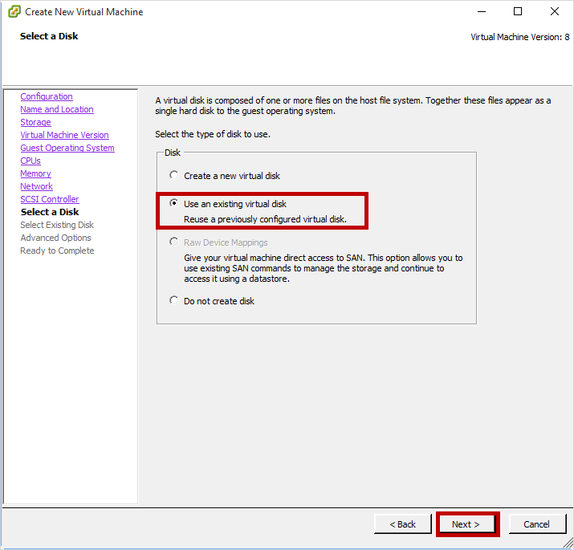
25. On the **Select Existing Disk** page, under **Disk File Path**, click **Browse**. This opens a **Browse Datastores** dialog. Navigate to the location where you uploaded the VMDK. You now see only one file in the datastore as the two files that you initially uploaded have been merged. Select the file and click **OK**. Click **Next**.

    
26. On the **Advanced Options** page, accept the default and click **Next**.

    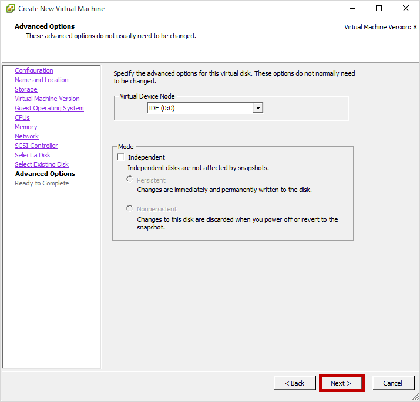
27. On the **Ready to Complete** page, review all the settings associated with the new virtual machine. Check **Edit the virtual machine settings before completion**. Click **Continue**.

    
28. On the **Virtual Machines Properties** page, in the **Hardware** tab, locate the device hardware. Select **New Hard Disk**. Click **Add**.

    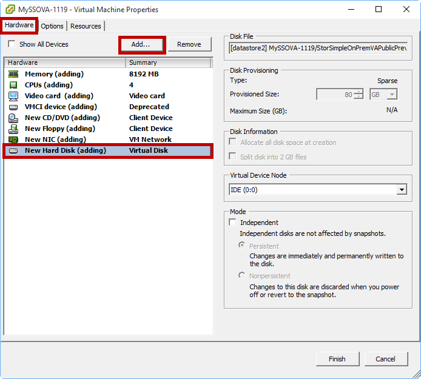
29. You see a **Add Hardware** window. On the **Device Type** page, under **Choose the type of device you wish to add**, select **Hard Disk**, and click **Next**.

    
30. On the **Select a Disk** page, choose **Create a new virtual disk**. Click **Next**.

    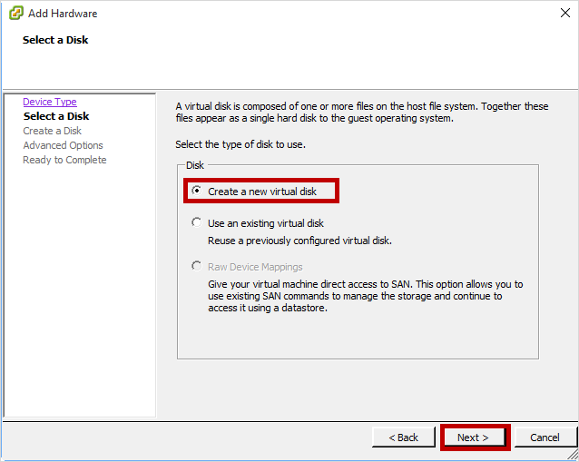
31. On the **Create a Disk** page, change the **Disk Size** to 500 GB (or more). While 500 GB is the minimum requirement, you can always provision a larger disk. Note that you cannot expand or shrink the disk once provisioned. For more information on the size of disk to provision, review the sizing section in the [best practices document](storsimple-ova-best-practices.md). Under **Disk Provisioning**, select **Thin Provision**. Click **Next**.

    
32. On the **Advanced Options** page, accept the default.

    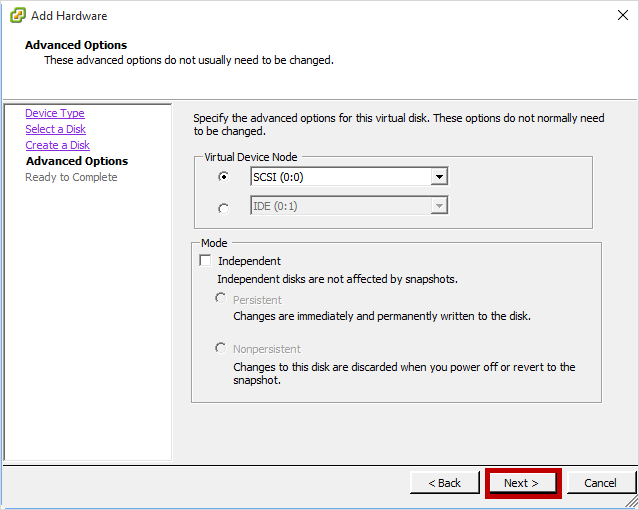
33. On the **Ready to Complete** page, review the disk options. Click **Finish**.

    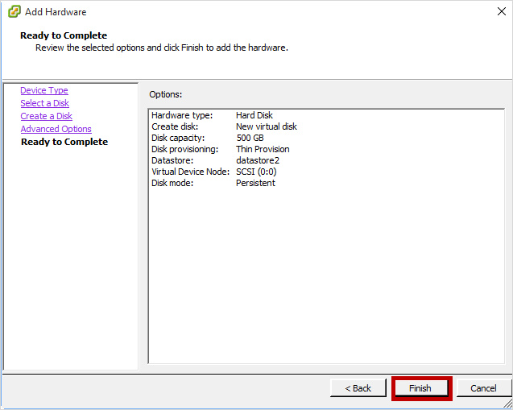
34. Return to the Virtual Machine Properties page. A new hard disk is added to your virtual machine. Click **Finish**.

    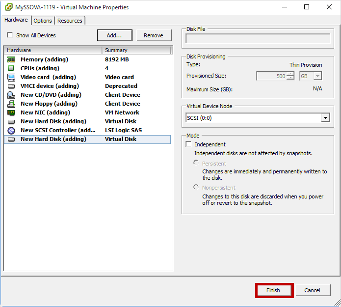
35. With your virtual machine selected in the right pane, navigate to the **Summary** tab. Review the settings for your virtual machine.

    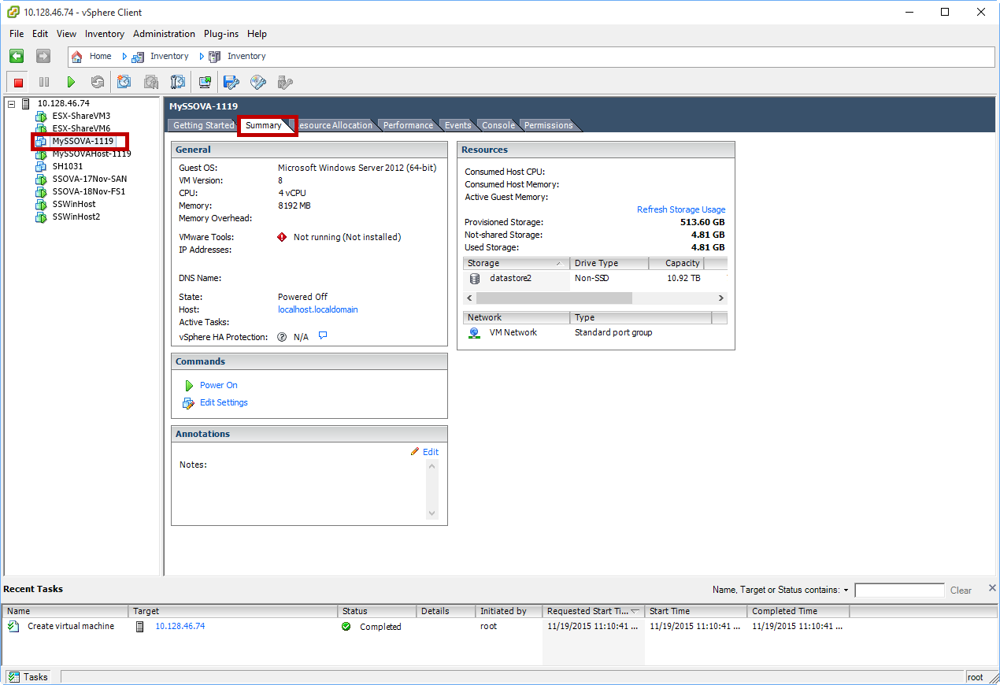

Your virtual machine is now provisioned. The next step is to power on this machine and get the IP address.

> [!NOTE]
> We recommend that you do not install VMware tools on your virtual array (as provisioned above). Installation of VMware tools will result in an unsupported configuration.

## Step 3: Start the virtual device and get the IP
Perform the following steps to start your virtual device and connect to it.

#### To start the virtual device
1. Start the virtual device. In the vSphere Configuration Manager, in the left pane, select your device and right-click to bring up the context menu. Select **Power** and then select **Power on**. This should power on your virtual machine. You can view the status in the bottom **Recent Tasks** pane of the vSphere client.

   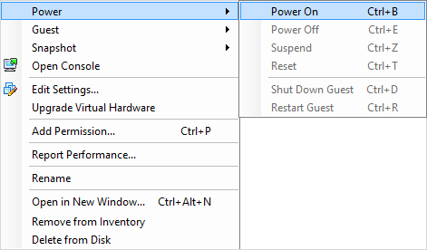
2. The setup tasks will take a few minutes to complete. Once the device is running, navigate to the **Console** tab. Send Ctrl+Alt+Delete to log in to the device. Alternatively, you can point the cursor on the console window and press Ctrl+Alt+Insert. The default user is *StorSimpleAdmin* and the default password is *Password1*.

   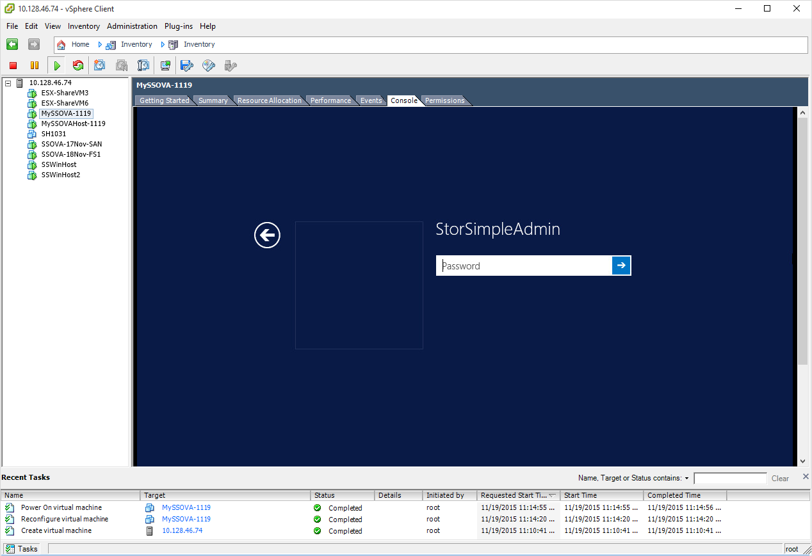
3. For security reasons, the device administrator password expires at the first logon. You are prompted to change the password.

   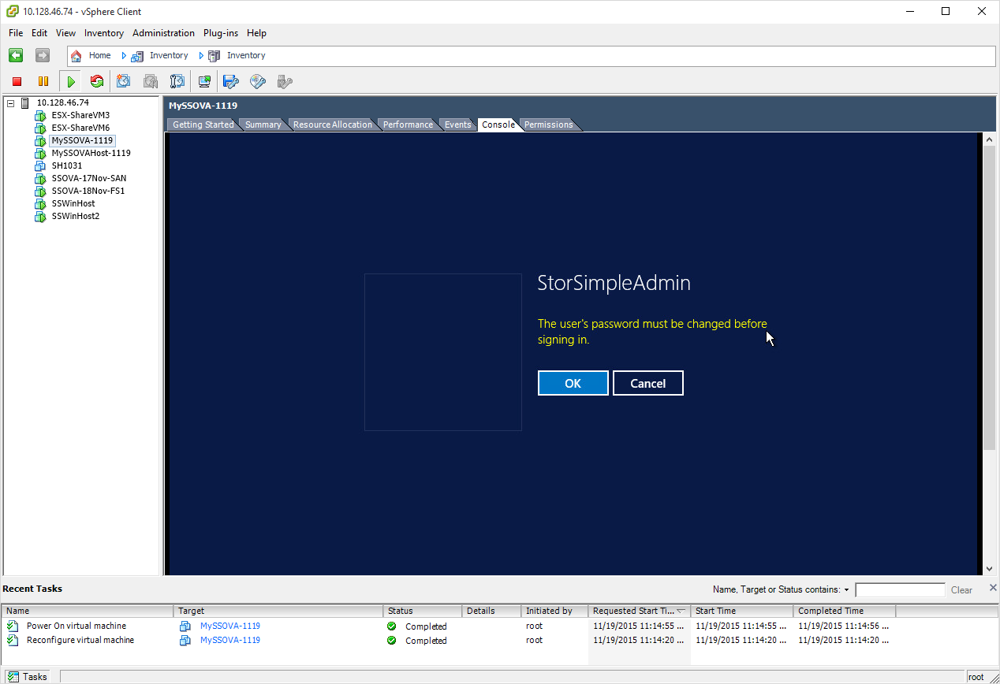
4. Enter a password that contains at least 8 characters. The password must contain 3 out of 4 of these requirements: uppercase, lowercase, numeric, and special characters. Reenter the password to confirm it. You will be notified that the password has changed.

   
5. After the password is successfully changed, the virtual device may reboot. Wait for the reboot to complete. The Windows PowerShell console of the device may be displayed along with a progress bar.

   
6. Steps 6-8 only apply when booting up in a non-DHCP environment. If you are in a DHCP environment, then skip these steps and go to step 9. If you booted up your device in non-DHCP environment, you will see the following screen.

   

   Next, configure the network.
7. Use the `Get-HcsIpAddress` command to list the network interfaces enabled on your virtual device. If your device has a single network interface enabled, the default name assigned to this interface is `Ethernet`.

   
8. Use the `Set-HcsIpAddress` cmdlet to configure the network. An example is shown below:

    `Set-HcsIpAddress –Name Ethernet –IpAddress 10.161.22.90 –Netmask 255.255.255.0 –Gateway 10.161.22.1`

    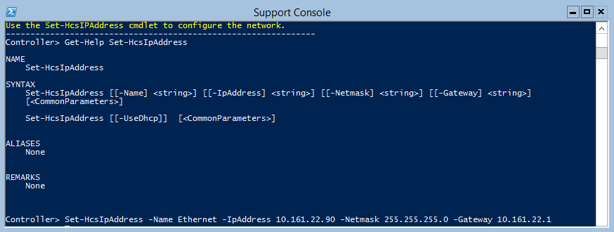
9. After the initial setup is complete and the device has booted up, you will see the device banner text. Make a note of the IP address and the URL displayed in the banner text to manage the device. You will use this IP address to connect to the web UI of your virtual device and complete the local setup and registration.

   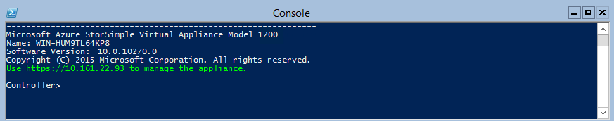
10. (Optional) Perform this step only if you are deploying your device in the Government Cloud. You will now enable the United States Federal Information Processing Standard (FIPS) mode on your device. The FIPS 140 standard defines cryptographic algorithms approved for use by US Federal government computer systems for the protection of sensitive data.

    1. To enable the FIPS mode, run the following cmdlet:

        `Enable-HcsFIPSMode`
    2. Reboot your device after you have enabled the FIPS mode so that the cryptographic validations take effect.

       > [!NOTE]
       > You can either enable or disable FIPS mode on your device. Alternating the device between FIPS and non-FIPS mode is not supported.
       >
       >

If your device does not meet the minimum configuration requirements, you will see an error in the banner text (shown below). You will need to modify the device configuration so that it has adequate resources to meet the minimum requirements. You can then restart and connect to the device. Refer to the minimum configuration requirements in [Step 1: Ensure that the host system meets minimum virtual device requirements](#step-1-ensure-host-system-meets-minimum-virtual-device-requirements).

If you face any other error during the initial configuration using the local web UI, refer to the following workflows:

* Run diagnostic tests to [troubleshoot web UI setup](storsimple-ova-web-ui-admin.md#troubleshoot-web-ui-setup-errors).
* [Generate log package and view log files](storsimple-ova-web-ui-admin.md#generate-a-log-package).

## Next steps
* [Set up your StorSimple Virtual Array as a file server](storsimple-virtual-array-deploy3-fs-setup.md)
* [Set up your StorSimple Virtual Array as an iSCSI server](storsimple-virtual-array-deploy3-iscsi-setup.md)
