# Deploy StorSimple Virtual Array - Set up as file server via Azure portal

## Introduction
This article describes how to perform initial setup, register your StorSimple file server, complete the device setup, and create and connect to SMB shares. This is the last article in the series of deployment tutorials required to completely deploy your virtual array as a file server or an iSCSI server.

The setup and configuration process can take around 10 minutes to complete. The information in this article applies only to the deployment of the StorSimple Virtual Array. For the deployment of StorSimple 8000 series devices, go to:
[Deploy your StorSimple 8000 series device running Update 2](storsimple-deployment-walkthrough-u2.md).

## Setup prerequisites
Before you configure and set up your StorSimple Virtual Array, make sure that:

* You have provisioned a virtual array and connected to it as detailed in the [Provision a StorSimple Virtual Array in Hyper-V](storsimple-virtual-array-deploy2-provision-hyperv.md) or [Provision a StorSimple Virtual Array in VMware](storsimple-virtual-array-deploy2-provision-vmware.md).
* You have the service registration key from the StorSimple Device Manager service that you created to manage StorSimple Virtual Arrays. For more information, see [Step 2: Get the service registration key](storsimple-virtual-array-deploy1-portal-prep.md#step-2-get-the-service-registration-key) for StorSimple Virtual Array.
* If this is the second or subsequent virtual array that you are registering with an existing StorSimple Device Manager service, you should have the service data encryption key. This key was generated when the first device was successfully registered with this service. If you have lost this key, see [Get the service data encryption key](storsimple-ova-web-ui-admin.md#get-the-service-data-encryption-key) for your StorSimple Virtual Array.

## Step-by-step setup
Use the following step-by-step instructions to set up and configure your StorSimple Virtual Array.

## Step 1: Complete the local web UI setup and register your device
#### To complete the setup and register the device
1. Open a browser window and connect to the local web UI. Type:
   
   `https://<ip-address of network interface>`
   
   Use the connection URL noted in the previous step. You see an error indicating that there is a problem with the website’s security certificate. Click **Continue to this webpage**.
   
   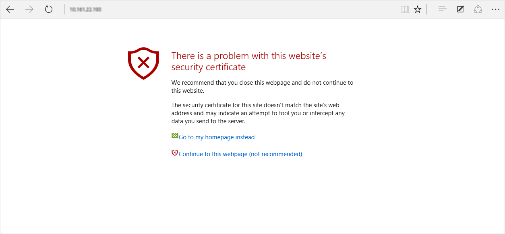
2. Sign in to the web UI of your virtual array as **StorSimpleAdmin**. Enter the device administrator password that you changed in Step 3: Start the virtual array in [Provision a StorSimple Virtual Array in Hyper-V](storsimple-virtual-array-deploy2-provision-hyperv.md) or in [Provision a StorSimple Virtual Array in VMware](storsimple-virtual-array-deploy2-provision-vmware.md).
   
   
3. You are taken to the **Home** page. This page describes the various settings required to configure and register the virtual array with the StorSimple Device Manager service. The **Network settings**, **Web proxy settings**, and **Time settings** are optional. The only required settings are **Device settings** and **Cloud settings**.
   
   
4. In the **Network settings** page under **Network interfaces**, DATA 0 will be automatically configured for you. Each network interface is set by default to get IP address automatically (DHCP). Hence, an IP address, subnet, and gateway are automatically assigned (for both IPv4 and IPv6).
   
   
   
   If you added more than one network interface during the provisioning of the device, you can configure them here. Note you can configure your network interface as IPv4 only or as both IPv4 and IPv6. IPv6 only configurations are not supported.
5. DNS servers are required because they are used when your device attempts to communicate with your cloud storage service providers or to resolve your device by name when configured as a file server. In the **Network settings** page under the **DNS servers**:
   
   1. A primary and secondary DNS server are automatically configured. If you choose to configure static IP addresses, you can specify DNS servers. For high availability, we recommend that you configure a primary and a secondary DNS server.
   2. Click **Apply** to apply and validate the network settings.
6. In the **Device settings** page:
   
   1. Assign a unique **Name** to your device. This name can be 1-15 characters and can contain letter, numbers and hyphens.
   2. Click the **File server** icon  for the **Type** of device that you are creating. A file server will allow you to create shared folders.
   3. As your device is a file server, you will need to join the device to a domain. Enter a **Domain name**.
   4. Click **Apply**.
7. A dialog box will appear. Enter your domain credentials in the specified format. Click the check icon. The domain credentials are verified. You see an error message if the credentials are incorrect.
   
   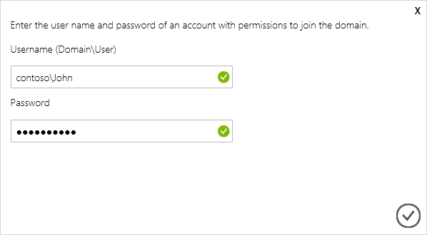
8. Click **Apply**. This will apply and validate the device settings.
   
   
   
   > [!NOTE]
   > Ensure that your virtual array is in its own organizational unit (OU) for Active Directory and no group policy objects 
   > (GPO) are applied to it or inherited. Group policy may install applications such as anti-virus software on the StorSimple Virtual Array. Installing additional software is not supported and could lead to data corruption. 
   > 
   > 
9. (Optionally) configure your web proxy server. Although web proxy configuration is optional, be aware that if you use a web proxy, you can only configure it here.
   
   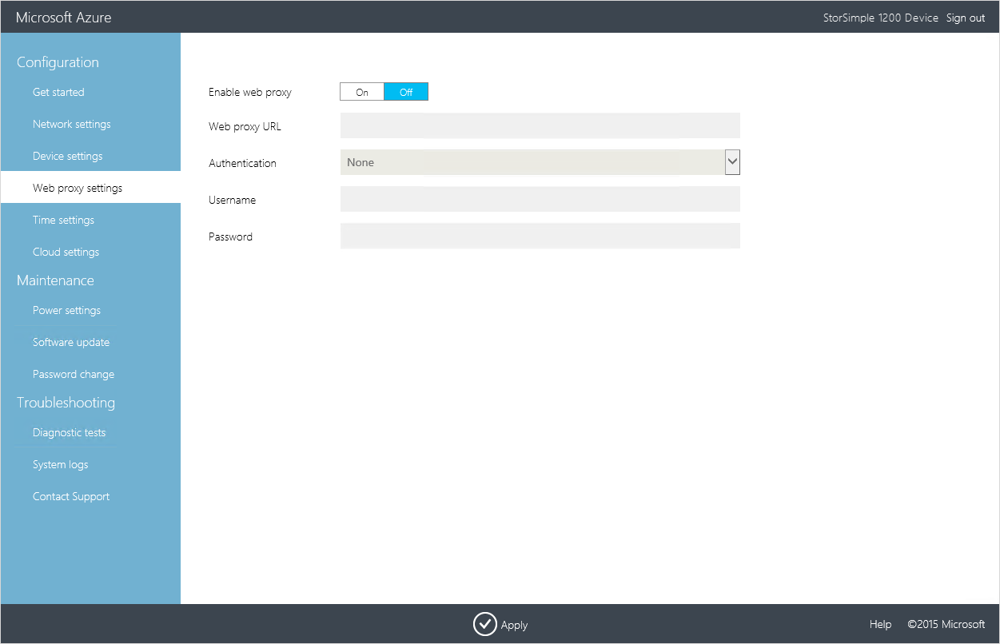
   
   In the **Web proxy** page:
   
   1. Supply the **Web proxy URL** in this format: *http://&lt;host-IP address or FQDN&gt;:Port number*. Note that HTTPS URLs are not supported.
   2. Specify **Authentication** as **Basic** or **None**.
   3. If using authentication, you will also need to provide a **Username** and **Password**.
   4. Click **Apply**. This will validate and apply the configured web proxy settings.
10. (Optionally) configure the time settings for your device, such as time zone and the primary and secondary NTP servers. NTP servers are required because your device must synchronize time so that it can authenticate with your cloud service providers.
    
    
    
    In the **Time settings** page:
    
    1. From the dropdown list, select the **Time zone** based on the geographic location in which the device is being deployed. The default time zone for your device is PST. Your device will use this time zone for all scheduled operations.
    2. Specify a **Primary NTP server** for your device or accept the default value of time.windows.com. Ensure that your network allows NTP traffic to pass from your datacenter to the Internet.
    3. Optionally specify a **Secondary NTP server** for your device.
    4. Click **Apply**. This will validate and apply the configured time settings.
11. Configure the cloud settings for your device. In this step, you will complete the local device configuration and then register the device with your StorSimple Device Manager service.
    
    1. Enter the **Service registration key** that you got in [Step 2: Get the service registration key](storsimple-virtual-array-deploy1-portal-prep.md#step-2-get-the-service-registration-key) for StorSimple Virtual Array.
    2. If this is your first device registering with this service, you will be presented with the **Service data encryption key**. Copy this key and save it in a safe location. This key is required with the service registration key to register additional devices with the StorSimple Device Manager service. 
       
       If this is not the first device that you are registering with this service, you will need to provide the service data encryption key. For more information, refer to get the [service data encryption key](storsimple-ova-web-ui-admin.md#get-the-service-data-encryption-key) on your local web UI.
    3. Click **Register**. This will restart the device. You may need to wait for 2-3 minutes before the device is successfully registered. After the device has restarted, you will be taken to the sign in page.
       
       
12. Return to the Azure portal. Go to **All resources**, search for your StorSimple Device Manager service.
    
    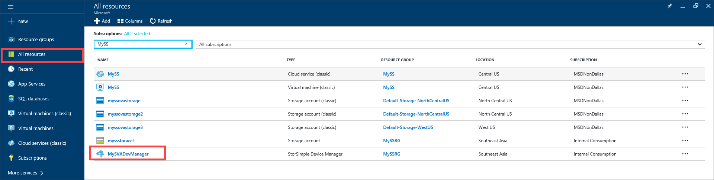 
13. In the filtered list, select your StorSimple Device Manager service and then navigate to **Management > Devices**. In the **Devices** blade, verify that the device has successfully connected to the service and has the status **Ready to set up**.
    
    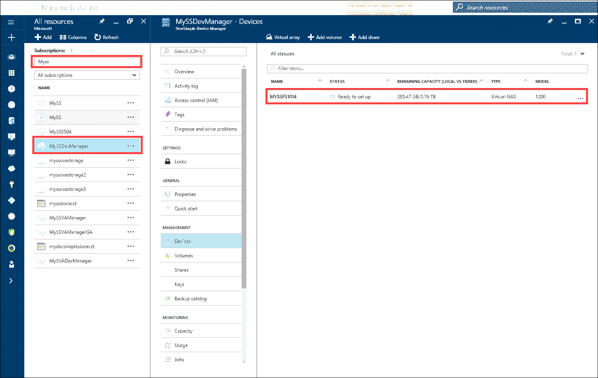

## Step 2: Configure the device as file server
Perform the following steps in the [Azure portal](https://portal.azure.com/) to complete the required device setup.

#### To configure the device as file server
1. Go to your StorSimple Device Manager service and then go to  **Management > Devices**. In the **Devices** blade, select the device you just created. This device would show up as **Ready to set up**.
   
    
2. Click the device and you will see a banner message indicating that the device is ready to setup.
   
    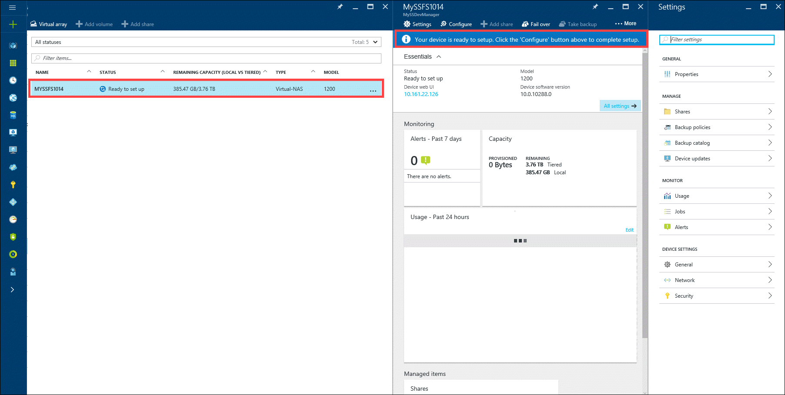
3. Click **Configure** on the command bar. This opens up the **Configure** blade. In the **Configure** blade, do the following:
   
   1. The file server name is automatically populated.
    
   2. Make sure the cloud storage encryption is set to **Enabled**. This will encrypt all the data that is sent to the cloud. 
    
   3. A 256-bit AES key is used with the user-defined key for encryption. Specify a 32 character key and then reenter the key to confirm it. Record the key in a key management app for future reference.
    
   4. Click **Configure required settings** to specify storage account credentials to be used with your device. Click **Add new** if there are no storage account credentials configured. **Ensure that the storage account you use supports block blobs. Page blobs are not supported.** More information about [blocks blobs and page blobs](https://docs.microsoft.com/rest/api/storageservices/understanding-block-blobs--append-blobs--and-page-blobs).
   
      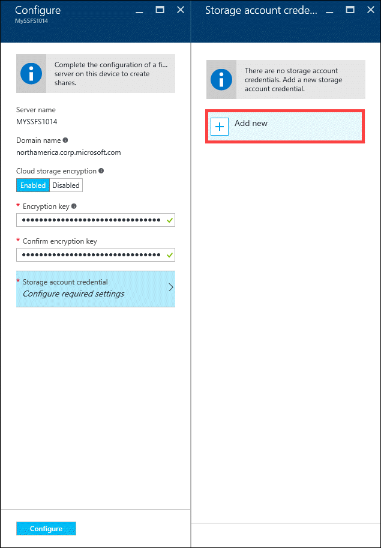 
4. In the **Add a storage account credentials** blade, do the following: 

    1. Choose current subscription if the storage account is in the same subscription as the service. Specify other is the storage account is outside of the service subscription. 
    
    2. From the dropdown list, choose an existing storage account. 
    
    3. The location will be automatically populated based on the specified storage account. 
    
    4. Enable SSL to ensure a secure network communication channel between the device and the cloud.
    
    5. Click **Add** to add this storage account credential. 
   
        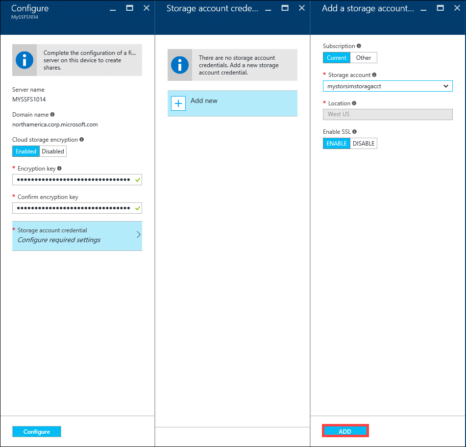

5. Once the storage account credential is successfully created, the **Configure** blade will be updated to display the specified storage account credentials. Click **Configure**.
   
   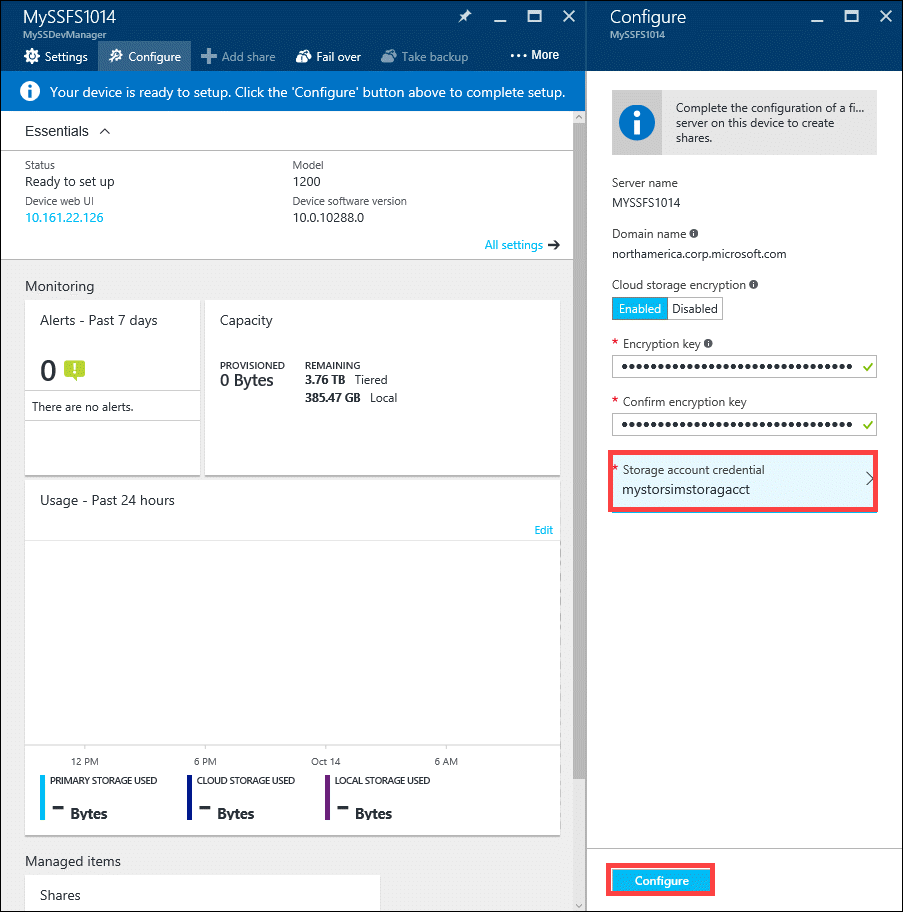
   
   You will see a that a file server is being created. Once the file server is successfully created, you will be notified.
   
   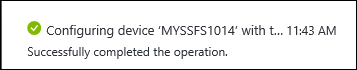
   
   The device status will also change to **Online**.
   
   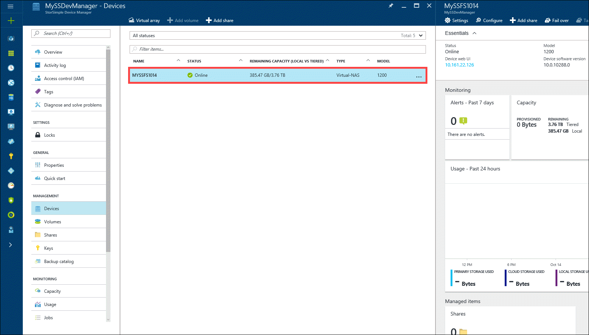
   
   You can proceed to add a share.

## Step 3: Add a share
Perform the following steps in the [Azure portal](https://portal.azure.com/) to create a share.

#### To create a share
1. Select the file server device you configured in the preceding step and click **...** (or right-click). In the context menu, select **Add share**. Alternatively, you can click **+ Add Share** on the device command bar.
   
   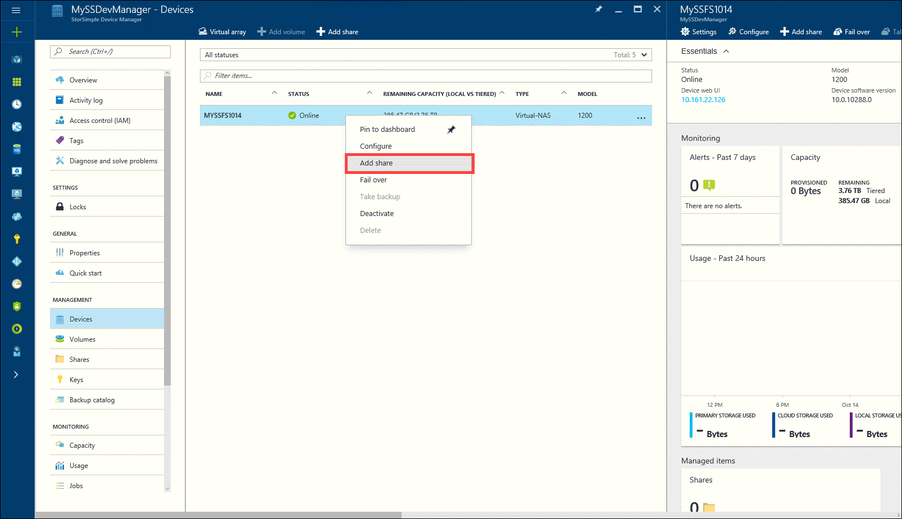
2. Specify the following share settings:

   1. A unique name for your share. The name must be a string that contains 3 to 127 characters.
    
   2. An optional **Description** for the share. The description will help identify the share owners.
    
   3. A **Type** for the share. The type can be **Tiered** or **Locally pinned**, with tiered being the default. For workloads that require local guarantees, low latencies, and higher performance, select a **Locally pinned** share. For all other data, select a **Tiered** share.
      A locally pinned share is thickly provisioned and ensures that the primary data on the share stays local to the device and does not spill to the cloud. A tiered share on the other hand is thinly provisioned. When you create a tiered share, 10% of the space is provisioned on the local tier and 90% of the space is provisioned in the cloud. For instance, if you provisioned a 1 TB volume, 100 GB would reside in the local space and 900 GB would be used in the cloud when the data tiers. This in turn implies that if you run out of all the local space on the device, you cannot provision a tiered share.
   
   4. In the **Set default full permissions to** field, assign the permissions to the user, or the group that is accessing this share. Specify the name of the user or the user group in *john\@contoso.com* format. We recommend that you use a user group (instead of a single user) to allow admin privileges to access these shares. After you have assigned the permissions here, you can then use File Explorer to modify these permissions.
   
   5. Click **Add** to create the share. 
    
       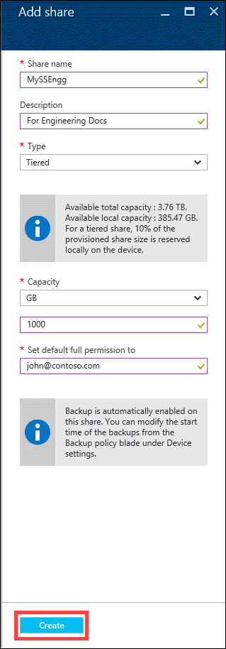
   
       You are notified that the share creation is in progress.
   
       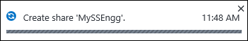
   
      After the share is created with the specified settings, the **Shares** blade will update to reflect the new share. By default, monitoring and backup are enabled for the share.
   
      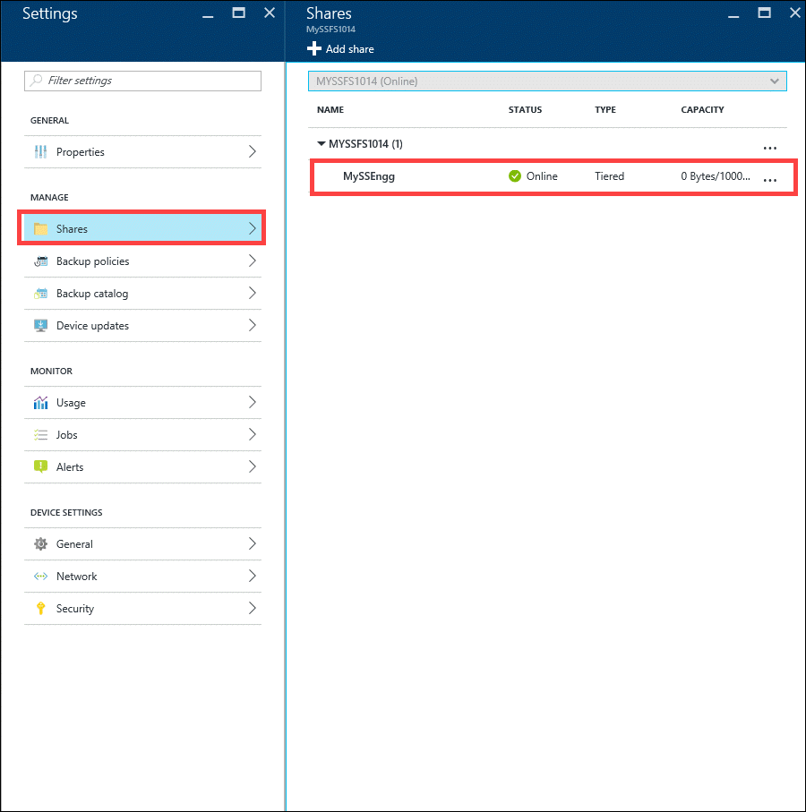

## Step 4: Connect to the share
You will now need to connect to one or more shares that you created in the previous step. Perform these steps on your Windows Server host connected to your StorSimple Virtual Array.

#### To connect to the share
1. Press  + R. In the Run window, specify the *&#92;&#92;&lt;file server name&gt;* as the path, replacing *file server name* with the device name that you assigned to your file server. Click **OK**.
   
   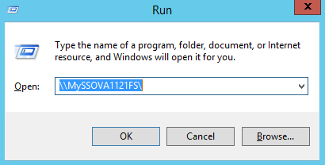
2. This opens up File Explorer. You should now be able to see the shares that you created as folders. Select and double-click a share (folder) to view the content.
   
   
3. You can now add files to these shares and take a backup.

## Next steps
Learn how to use the local web UI to [administer your StorSimple Virtual Array](storsimple-ova-web-ui-admin.md).

