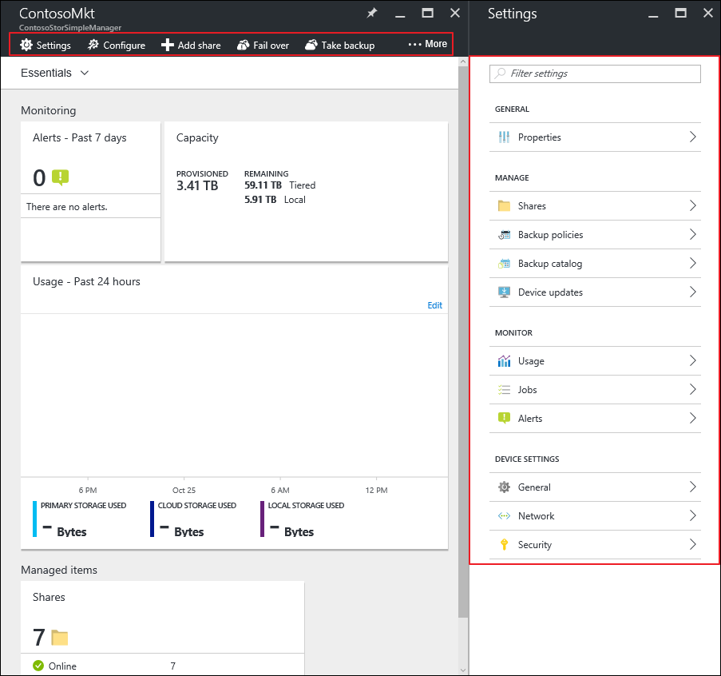
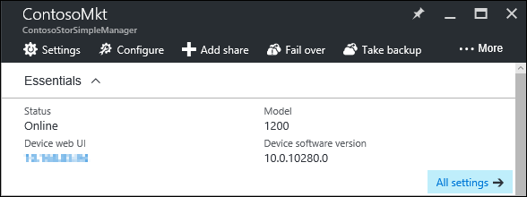

# Use the device summary blade for StorSimple Device Manager connected to StorSimple Virtual Array

## Overview

The StorSimple Device Manager device blade provides a summary view of a StorSimple Virtual Array that is registered with a given StorSimple Device Manager, highlighting those device issues that need a system administrator's attention. This tutorial introduces the device summary blade, explains the content and function, and describes the tasks that you can perform from this blade.

The device summary blade displays the following information:

## Management

In the StorSimple device blade, you see the options for managing your StorSimple device. You see the management commands across the top of the blade and on the left side. Use these options to add shares or volumes, or update or fail over your virtual array.

The essentials area captures some of the important properties such as, the status, model, software version as well as a link to the **Web UI** of the array. If you are on an internal network, you can directly launch the [local web UI](storsimple-ova-web-ui-admin.md) to administer your virtual array.

## StorSimple device summary

* The **Alerts** tile provides a snapshot of all the active alerts for your virtual array, grouped by alert severity. Click the tile to open the **Alerts** blade and then click an individual alert to view additional details about that alert, including any recommended actions. You can also clear the alert if the issue has been resolved.

* The **Capacity** tile displays the primary storage that is provisioned and remaining across the virtual device relative to the total storage available for the same. **Provisioned** refers to the amount of storage that is prepared and allocated for use, **Remaining** refers to the remaining capacity that can be provisioned across this device. The **Remaining Tiered** capacity is the available capacity that can be provisioned including cloud, while the **Remaining Local** is the capacity remaining on the disks attached to this virtual array.

* In the **Usage** chart, you can view the primary storage used across your virtual array, as well as the cloud storage consumed  over the past 7 days, the default time period. Use the **Edit** option in the top-right corner of the chart to choose a different time scale.

* The **Shares** or **Volumes** tile provides a summary of the number of shares or volumes in your device grouped by status. Click the tile to open the **Shares**  or **Volumes** list blade, and then click on an individual share or volume to view or modify its properties. For more information, see how to [manage shares](storsimple-virtual-array-manage-shares.md) or [manage volumes](storsimple-virtual-array-manage-volumes.md).

## Next steps
Learn how to:
- [Manage shares on a StorSimple Virtual Array](storsimple-virtual-array-manage-shares.md)
    
- [Manage volumes on a StorSimple Virtual Array](storsimple-virtual-array-manage-volumes.md)

