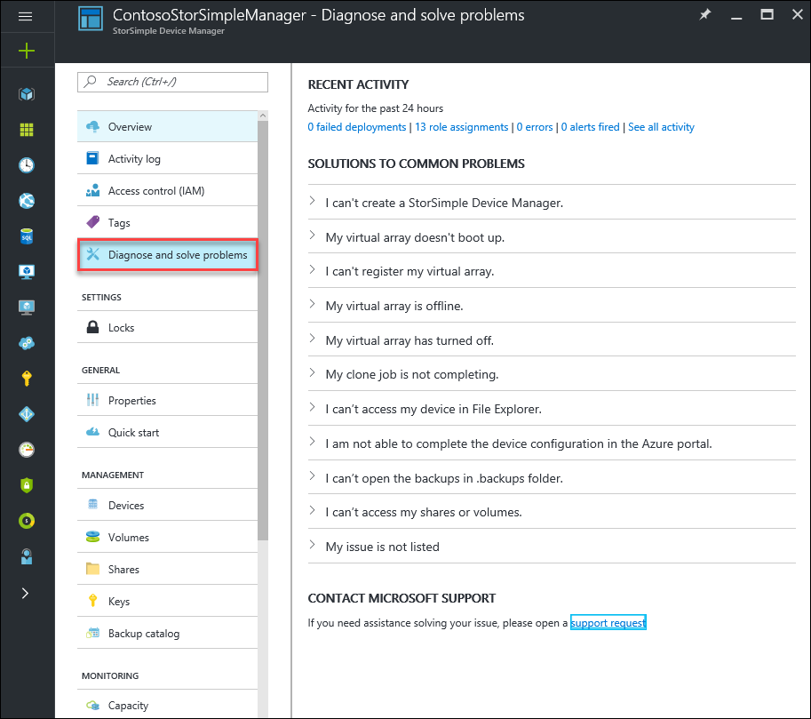
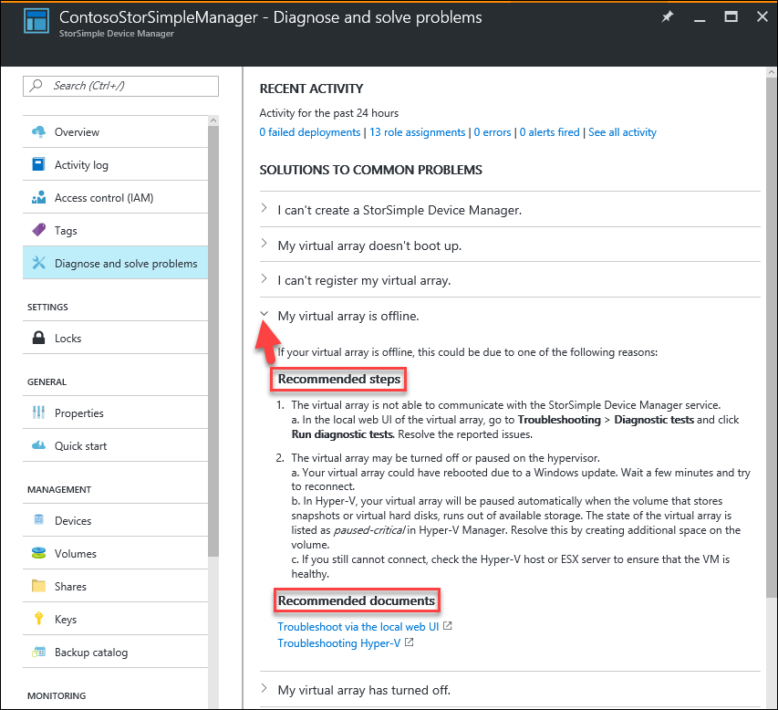

# Use the StorSimple Device Manager service to troubleshoot the StorSimple Virtual Array
## Overview

The StorSimple Device Manager provides a **Diagnose and solve problems** setting within the service summary blade, which highlights some of the commonly occurring issues that can occur with your virtual array and how to solve them. This tutorial introduces the self-serve troubleshooting capability provided within the StorSimple Device Manager service.

## Diagnose and solve issues

You can view some of the common problems with the StorSimple Virtual Array and review the solutions to those issues right from your StorSimple Device Manager service summary blade.

#### To diagnose an issue with your virtual array

1. Click **Diagnose and solve problems** setting in the left pane of your StorSimple Device Manager service summary blade to view a list of common problems.

2. **Expand** on the symptom of the issue you are encountering to review **Recommended steps** to aid you in troubleshooting the problem. If you wish, you can also review the detailed documentation links provided for further reference.
   
    

3. If you are unable to find a reference to your issue or resolve it, reach out to Microsoft Support for further assistance.

## Next steps
Learn how to [log a support ticket](storsimple-virtual-array-log-support-ticket.md)

