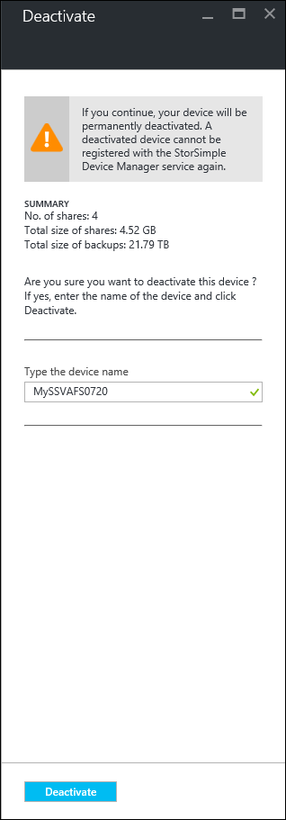
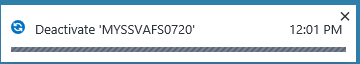
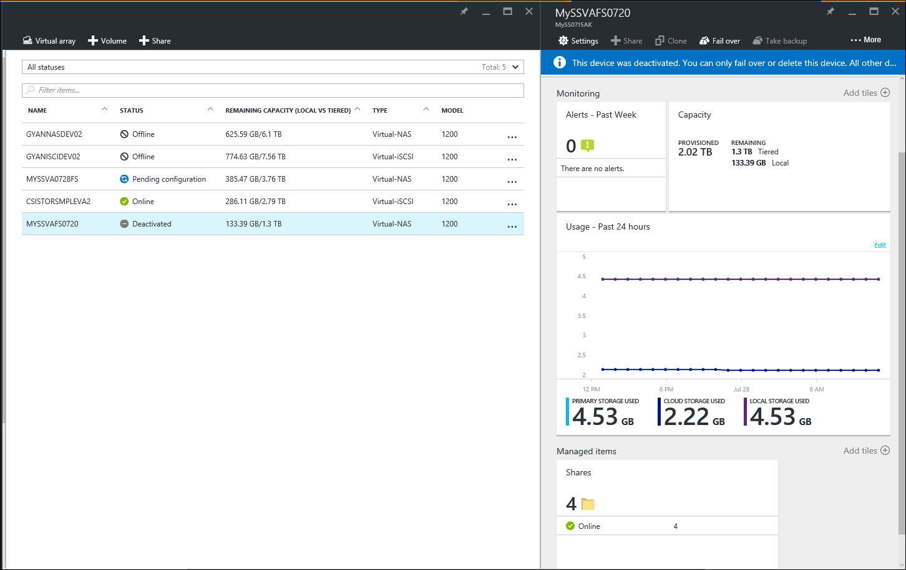
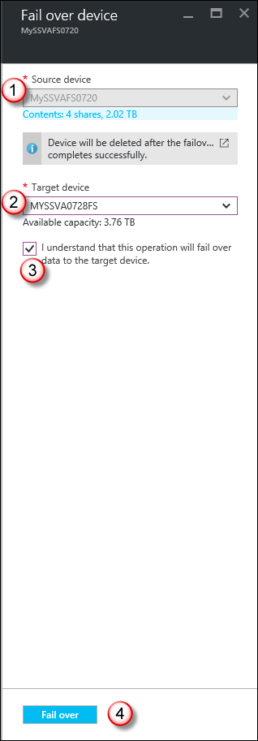
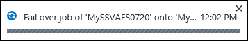
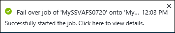
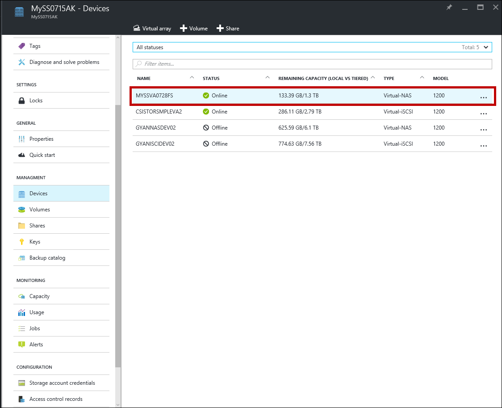

# Disaster recovery and device failover for your StorSimple Virtual Array via Azure portal

## Overview
This article describes the disaster recovery for your Microsoft Azure StorSimple Virtual Array including the detailed steps to fail over to another virtual array. A failover allows you to move your data from a *source* device in the datacenter to a *target* device. The target device may be located in the same or a different geographical location. The device failover is for the entire device. During failover, the cloud data for the source device changes ownership to that of the target device.

This article is applicable to StorSimple Virtual Arrays only. To fail over an 8000 series device, go to [Device failover and disaster recovery of your StorSimple device](storsimple-device-failover-disaster-recovery.md).

## What is disaster recovery and device failover?

In a disaster recovery (DR) scenario, the primary device stops functioning. In this scenario, you can move the cloud data associated with the failed device to another device. You can use the primary device as the *source* and specify another device as the *target*. This process is referred to as the *failover*. During failover, all the volumes or the shares from the source device change ownership and are transferred to the target device. No filtering of the data is allowed.

DR is modeled as a full device restore using the heat map–based tiering and tracking. A heat map is defined by assigning a heat value to the data based on read and write patterns. This heat map then tiers the lowest heat data chunks to the cloud first while keeping the high heat (most used) data chunks in the local tier. During a DR, StorSimple uses the heat map to restore and rehydrate the data from the cloud. The device fetches all the volumes/shares in the last recent backup (as determined internally) and performs a restore from that backup. The virtual array orchestrates the entire DR process.

> [!IMPORTANT]
> The source device is deleted at the end of device failover and hence a failback is not supported.
> 
> 

Disaster recovery is orchestrated through the device failover feature and is initiated from the **Devices** blade. This blade tabulates all the StorSimple devices connected to your StorSimple Device Manager service. For each device, you can see the friendly name, status, provisioned and maximum capacity, type, and model.

## Prerequisites for device failover

### Prerequisites

For a device failover, ensure that the following prerequisites are satisfied:

* The source device needs to be in a **Deactivated** state.
* The target device needs to show up as **Ready to set up** in the Azure portal. Provision a target virtual array of the same or higher capacity. Use the local web UI to configure and successfully register the target virtual array.
  
  > [!IMPORTANT]
  > Do not attempt to configure the registered virtual device through the service. No device configuration should be performed through the service.
  > 
  > 
* The target device cannot have the same name as the source device.
* The source and target device have to be the same type. You can only fail over a virtual array configured as a file server to another file server. The same is true for an iSCSI server.
* For a file server DR, we recommend that you join the target device to the same domain as the source. This configuration ensures that the share permissions are automatically resolved. Only the failover to a target device in the same domain is supported.
* The available target devices for DR are devices that have the same or larger capacity compared to the source device. The devices that are connected to your service but do not meet the criteria of sufficient space are not available as target devices.

### Other considerations

* For a planned failover:
  
  * We recommend that you take all the volumes or shares on the source device offline.
  * We recommend that you take a backup of the device and then proceed with the failover to minimize data loss.
* For an unplanned failover, the device uses the most recent backup to restore the data.

### Device failover prechecks

Before the DR begins, the device performs prechecks. These checks help ensure that no errors occur when DR commences. The prechecks include:

* Validating the storage account.
* Checking the cloud connectivity to Azure.
* Checking available space on the target device.
* Checking if an iSCSI server source device volume has
  
  * valid ACR names.
  * valid IQN (not exceeding 220 characters).
  * valid CHAP passwords (12-16 characters long).

If any of the preceding prechecks fail, you cannot proceed with the DR. Resolve those issues and then retry DR.

After the DR is successfully completed, the ownership of the cloud data on the source device is transferred to the target device. The source device is then no longer available in the portal. Access to all the volumes/shares on the source device is blocked and the target device becomes active.

> [!IMPORTANT]
> Though the device is no longer available, the virtual machine that you provisioned on the host system is still consuming resources. Once the DR is successfully complete, you can delete this virtual machine from your host system.
> 
> 

## Fail over to a virtual array

We recommend that you provision, configure, and register another StorSimple Virtual Array with your StorSimple Device Manager service before you run this procedure.

> [!IMPORTANT]
> 
> * You cannot fail over from a StorSimple 8000 series device to a 1200 virtual device.
> * You can fail over from a Federal Information Processing Standard (FIPS) enabled virtual device to another FIPS enabled device or to a non-FIPS device deployed in the Government portal.

Perform the following steps to restore the device to a target StorSimple virtual device.

1. Provision and configure a target device that meets the [prerequisites for device failover](#prerequisites). Complete the device configuration via the local web UI and register it to your StorSimple Device Manager service. If creating a file server, go to step 1 of [set up as file server](storsimple-virtual-array-deploy3-fs-setup.md#step-1-complete-the-local-web-ui-setup-and-register-your-device). If creating an iSCSI server, go to step 1 of [set up as iSCSI server](storsimple-virtual-array-deploy3-iscsi-setup.md#step-1-complete-the-local-web-ui-setup-and-register-your-device).

2. Take volumes/shares offline on the host. To take the volumes/shares offline, refer to the operating system–specific instructions for the host. If not already offline, you need to take all the volumes/shares offline on the device by doing the following.
   
    1. Go to **Devices** blade and select your device.
   
    2. Go to **Settings > Manage > Shares** (or **Settings > Manage > Volumes**). 
   
    3. Select a share/volume, right click and select **Take offline**. 
   
    4. When prompted for confirmation, check **I understand the impact of taking this share offline.** 
   
    5. Click **Take offline**.

3. In your StorSimple Device Manager service, go to **Management > Devices**. In the **Devices** blade, select and click your source device.

4. In your **Device dashboard** blade, click **Deactivate**.

5. In the **Deactivate** blade, you are prompted for confirmation. Device deactivation is a *permanent* process that cannot be undone. You are also reminded to take your shares/volumes offline on the host. Type the device name to confirm and click **Deactivate**.
   
    
6. The deactivation starts. You will receive a notification after the deactivation is successfully completed.
   
    
7. On the Devices page, the device state will now change to **Deactivated**.
    
8. In the **Devices** blade, select and click the deactivated source device for failover. 
9. In the **Device dashboard** blade, click **Fail over**. 
10. In the **Fail over device** blade, do the following:
    
    1. The source device field is automatically populated. Note the total data size for the source device. The data size should be lesser than the available capacity on the target device. Review the details associated with the source device such as device name, total capacity, and the names of the shares that are failed over.

    2. From the dropdown list of available devices, choose a **Target device**. Only the devices that have sufficient capacity are displayed in the dropdown list.

    3. Check that **I understand that this operation will fail over data to the target device**. 

    4. Click **Fail over**.
    
        
11. A failover job initiates and you receive a notification. Go to **Devices > Jobs** to monitor the failover.
    
     
12. In the **Jobs** blade, you see a failover job created for the source device. This job performs the DR prechecks.
    
    
    
     After the DR prechecks are successful, the failover job will spawn restore jobs for each share/volume that exists on your source device.
    
    
13. After the failover is complete, go to the **Devices** blade.
    
    1. Select and click the StorSimple device that was used as the target device for the failover process.
    2. Go to **Settings > Management > Shares** (or **Volumes** if iSCSI server). In the **Shares** blade, you can view all the shares (volumes) from the old device.
        
14. You will need to [create a DNS alias](https://support.microsoft.com/kb/168322) so that all the applications that are trying to connect can get redirected to the new device.

## Errors during DR

**Cloud connectivity outage during DR**

If the cloud connectivity is disrupted after DR has started and before the device restore is complete, the DR will fail. You receive a failure notification. The target device for DR is marked as *unusable.* You cannot use the same target device for future DRs.

**No compatible target devices**

If the available target devices do not have sufficient space, you see an error to the effect that there are no compatible target devices.

**Precheck failures**

If one of the prechecks is not satisfied, then you see precheck failures.

## Business continuity disaster recovery (BCDR)

A business continuity disaster recovery (BCDR) scenario occurs when the entire Azure datacenter stops functioning. This can affect your StorSimple Device Manager service and the associated StorSimple devices.

If there are StorSimple devices that were registered just before a disaster occurred, then these StorSimple devices may need to be deleted. After the disaster, you can recreate and configure those devices.

## Next steps

Learn more about how to [administer your StorSimple Virtual Array using the local web UI](storsimple-ova-web-ui-admin.md).

