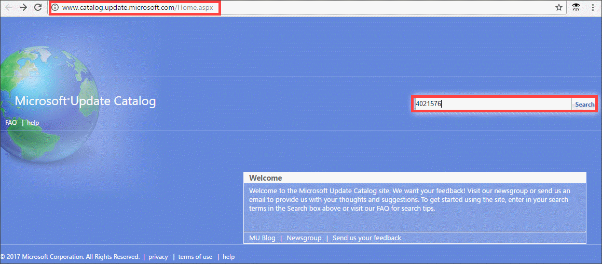
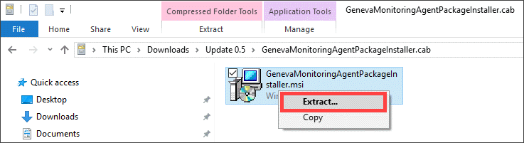
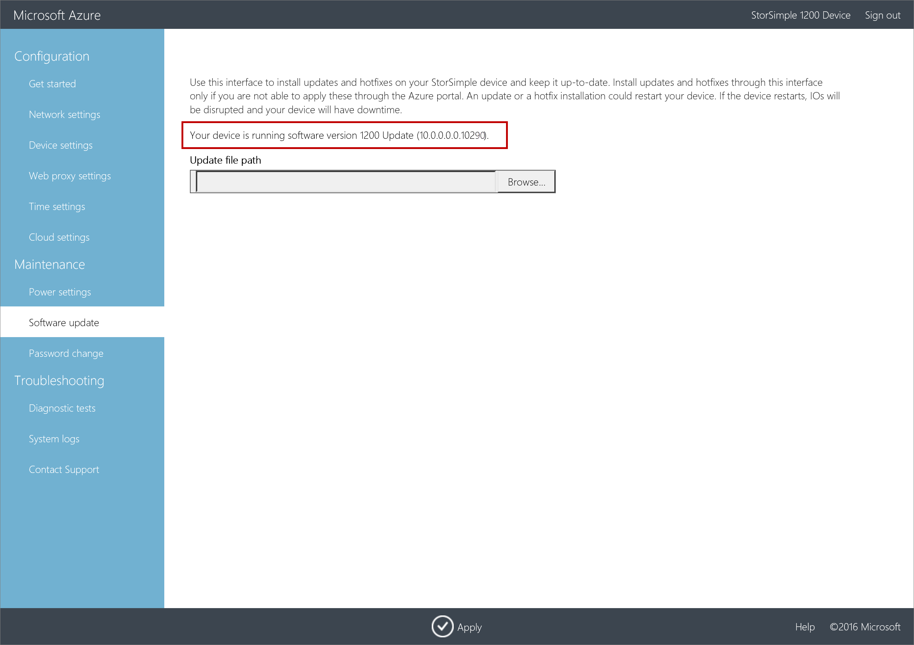

# Install Update 0.5 on your StorSimple Virtual Array

## Overview

This article describes the steps required to install Update 0.5 on your StorSimple Virtual Array via the local web UI and via the Azure portal. You need to apply software updates or hotfixes to keep your StorSimple Virtual Array up-to-date.

Before you apply an update, we recommend that you take the volumes or shares offline on the host first and then the device. This minimizes any possibility of data corruption. After the volumes or shares are offline, you should also take a manual backup of the device.

> [!IMPORTANT]
> - Update 0.5 corresponds to **10.0.10290.0** software version on your device. For information on what is new in this update, go to [Release notes for Update 0.5](storsimple-virtual-array-update-05-release-notes.md).
>
> - If you are running Update 0.2 or later, we recommend that you install the updates via the Azure portal. If you are running Update 0.1 or GA software versions, you must use the hotfix method via the local web UI to install Update 0.5.
>
> - Keep in mind that installing an update or hotfix restarts your device. Given that the StorSimple Virtual Array is a single node device, any I/O in progress is disrupted and your device experiences downtime.

## Use the Azure portal

If running Update 0.2 and later, we recommend that you install updates through the Azure portal. The portal procedure requires the user to scan, download, and then install the updates. This procedure takes around 7 minutes to complete. Perform the following steps to install the update or hotfix.

[!INCLUDE [storsimple-virtual-array-install-update-via-portal](../../includes/storsimple-virtual-array-install-update-via-portal-04.md)]

After the installation is complete, go to your StorSimple Device Manager service. Select **Devices** and then select and click the device you just updated. Go to **Settings > Manage > Device Updates**. The displayed software version should be **10.0.10290.0**.

## Use the local web UI

There are two steps when using the local web UI:

* Download the update or the hotfix
* Install the update or the hotfix

### Download the update or the hotfix

Perform the following steps to download the software update from the Microsoft Update Catalog.

#### To download the update or the hotfix

1. Start Internet Explorer and navigate to [https://catalog.update.microsoft.com](https://catalog.update.microsoft.com).

2. If this is your first time using the Microsoft Update Catalog on this computer, click **Install** when prompted to install the Microsoft Update Catalog add-on.

3. In the search box of the Microsoft Update Catalog, enter the Knowledge Base (KB) number of the hotfix you want to download. Enter **4021576** for Update 0.5, and then click **Search**.
   
    The hotfix listing appears, for example, **StorSimple Virtual Array Update 0.5**.
   
    

4. Click **Download**. 

5. You should see two files to download, a *.msu* and a *.cab* file. Download each of those files to a folder. The folder can also be copied to a network share that is reachable from the device.

6. Open the folder where the files are located.
    

    You see:
    -  A Microsoft Update Standalone Package file `WindowsTH-KB3011067-x64`. This file is used to update the device software.
    - A Geneva Monitoring Agent Package file `GenevaMonitoringAgentPackageInstaller`. This file is used to update the Monitoring and Diagnostics service (MDS) agent. Double-click the cab file. A .msi is displayed. Select the file, right-click, and then **Extract** the file. You will use the _.msi_ file to update the agent.

        
        
    

### Install the update or the hotfix

Prior to the update or hotfix installation, make sure that you have the update or the hotfix downloaded either locally on your host or accessible via a network share.

Use this method to install updates on a device running GA or Update 0.1 software versions. This procedure takes less than 2 minutes to complete. Perform the following steps to install the update or hotfix.

#### To install the update or the hotfix

1. In the local web UI, go to **Maintenance** > **Software Update**.
   
    

2. In **Update file path**, enter the file name for the update or the hotfix. You can also browse to the update or hotfix installation file if placed on a network share. Click **Apply**.
   
    

3. A warning is displayed. Given this is a single node device, after the update is applied, the device restarts and there is downtime. Click the check icon.
   
   

4. The update starts. After the device is successfully updated, it restarts. The local UI is not accessible in this duration.
   
    

5. After the restart is complete, you are taken to the **Sign in** page. To verify that the device software has updated, in the local web UI, go to **Maintenance** > **Software Update**. The displayed software version should be **10.0.0.0.0.10290.0** for Update 0.5.
   
   > [!NOTE]
   > We report the software versions in a slightly different way in the local web UI and the Azure portal. For example, the local web UI reports **10.0.0.0.0.10290** and the Azure portal reports **10.0.10290.0** for the same version.
   
    

6. The next step is to update the MDS agent. In the **Software Update** page, go to the **Update file path** and browse to the `GenevaMonitoringAgentPackageInstaller.msi` file. Repeat steps 2-4. After the virtual array restarts, sign into the local web UI.

The update is now complete.

## Next steps

Learn more about [administering your StorSimple Virtual Array](storsimple-ova-web-ui-admin.md).

