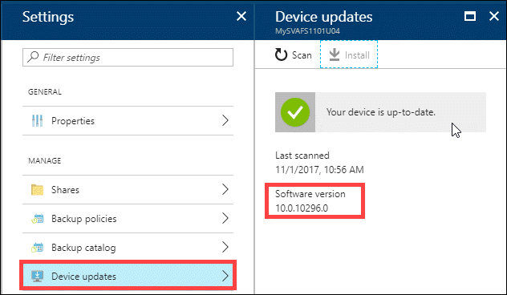
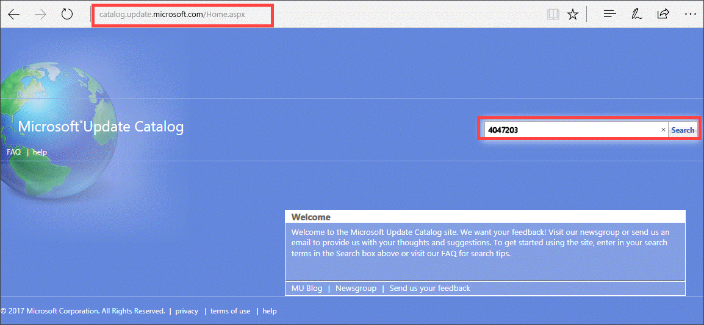
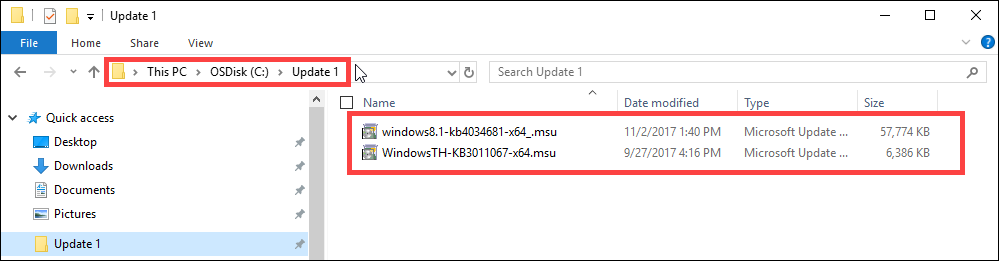
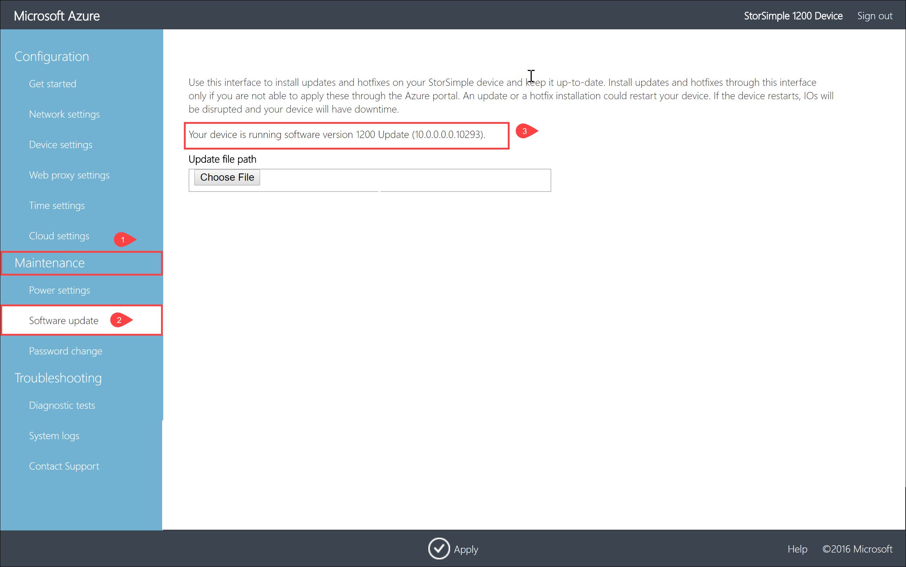
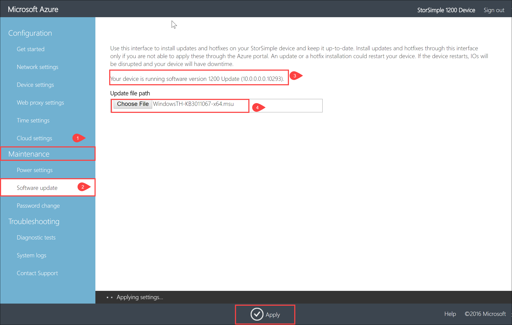
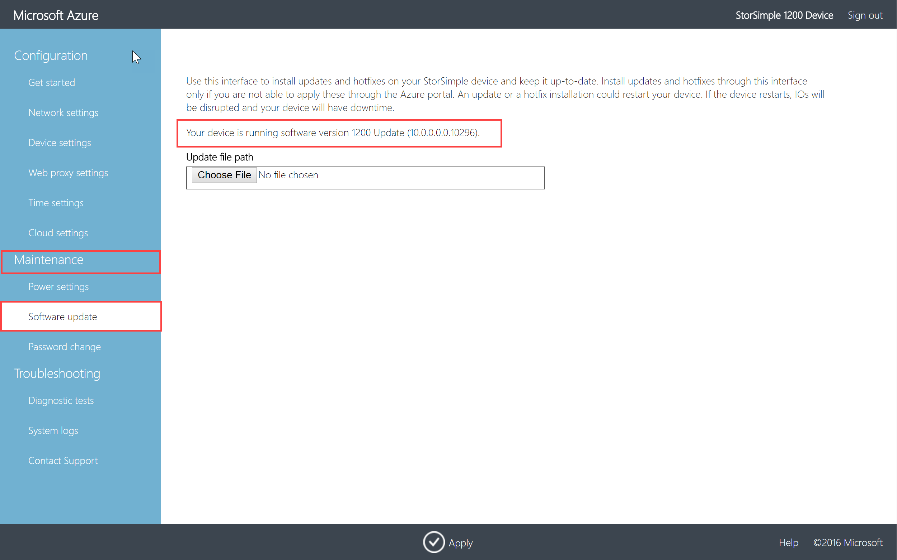

# Install Update 1.0 on your StorSimple Virtual Array

## Overview

This article describes the steps required to install Update 1.0 on your StorSimple Virtual Array via the local web UI and via the Azure portal.

You apply the software updates or hotfixes to keep your StorSimple Virtual Array up-to-date. Before you apply an update, we recommend that you take the volumes or shares offline on the host first and then the device. This minimizes any possibility of data corruption. After the volumes or shares are offline, you should also take a manual backup of the device.

> [!IMPORTANT]
> - Update 1.0 corresponds to **10.0.10296.0** software version on your device. For information on what is new in this update, go to [Release notes for Update 1.0](storsimple-virtual-array-update-1-release-notes.md).
>
> - Keep in mind that installing an update or hotfix restarts your device. Given that the StorSimple Virtual Array is a single node device, any I/O in progress is disrupted and your device experiences downtime.
>
> - Update 1 is available in the Azure portal only if the virtual array is running Update 0.6. For virtual arrays running pre-Update 0.6 versions, you must install Update 0.6 first and then install Update 1.

## Use the Azure portal

If running Update 0.2 and later, we recommend that you install updates through the Azure portal. The portal procedure requires the user to scan, download, and then install the updates. Depending upon the software version your virtual array is running, applying update via the Azure portal is different.

 - If your virtual array is running Update 0.6, the Azure portal directly installs Update 1 (10.0.10296.0) on your device. This procedure takes around 7 minutes to complete.
 - If your virtual array is running a version prior to Update 0.6, update is done in two stage. The Azure portal first installs Update 0.6 (10.0.10293.0) on your device. The virtual array reboots and the portal then installs Update 1 (10.0.10296.0) on your device. This procedure takes around 15 minutes to complete.

[!INCLUDE [storsimple-virtual-array-install-update-via-portal](../../includes/storsimple-virtual-array-install-update-via-portal-1.md)]

After the installation is complete, go to your StorSimple Device Manager service. Select **Devices** and then select and click the device you just updated. Go to **Settings > Manage > Device Updates**. The displayed software version should be **10.0.10296.0**.

## Use the local web UI

There are two steps when using the local web UI:

* Download the update or the hotfix
* Install the update or the hotfix

> [!IMPORTANT] 
> **Proceed with this update only if you are running Update 0.6 (10.0.10293.0). If you are running an earlier version, [Install Update 0.6](storsimple-virtual-array-install-update-06.md) on your device first and then apply Update 1.**

### Download the update or the hotfix

If your virtual array is running Update 0.6, perform the following steps to download Update 1 from the Microsoft Update Catalog.

#### To download the update or the hotfix

1. Start Internet Explorer and navigate to [https://catalog.update.microsoft.com](https://catalog.update.microsoft.com).

2. If you are using the Microsoft Update Catalog for the first time on this computer, click **Install** when prompted to install the Microsoft Update Catalog add-on.

3. In the search box of the Microsoft Update Catalog, enter the Knowledge Base (KB) number of the hotfix you want to download. Enter **4047203** for Update 1.0, and then click **Search**.
   
    The hotfix listing appears, for example, **StorSimple Virtual Array Update 1.0**.
   
    

4. Click **Download**.

5. Download the two files to a folder. You can also copy the folder to a network share that is reachable from the device.

6. Open the folder where the files are located.

    

    You see two files:
    -  A Microsoft Update Standalone Package file `WindowsTH-KB3011067-x64`. This file is used to update the device software.
    - A file that contains cumulative updates for August `windows8.1-kb4034681-x64`. For more information on what is included in this rollup, go to [August monthly security rollup](https://support.microsoft.com/help/4034681/windows-8-1-windows-server-2012-r2-update-kb40346810).

### Install the update or the hotfix

Prior to the update or hotfix installation, make sure that:

 - You have the update or the hotfix downloaded either locally on your host or accessible via a network share.
 - Your virtual array is running Update 0.6 (10.0.10293.0). If you are running a version prior to Update 0.6, [Install Update 0.6](storsimple-virtual-array-install-update-06.md) first and then install Update 1.

This procedure takes around 4 minutes to complete. Perform the following steps to install the update or hotfix.

#### To install the update or the hotfix

1. In the local web UI, go to **Maintenance** > **Software Update**. Make a note of the software version that you are running. **Proceed with this update only if you are running Update 0.6 (10.0.10293.0). If you are running an earlier version, [Install Update 0.6](storsimple-virtual-array-install-update-06.md) on your device first and then apply Update 1.**
   
    

2. In **Update file path**, enter the file name for the update or the hotfix. You can also browse to the update or hotfix installation file if placed on a network share. Click **Apply**.
   
    

3. A warning is displayed. Given the virtual array is a single node device, after the update is applied, the device restarts and there is downtime. Click the check icon.
   
   

4. The update starts. After the device is successfully updated, it restarts. The local UI is not accessible in this duration.
   
    

5. After the restart is complete, you are taken to the **Sign in** page. To verify that the device software has updated, in the local web UI, go to **Maintenance** > **Software Update**. The displayed software version should be **10.0.0.0.0.10296** for Update 1.0.
   
   > [!NOTE]
   > We report the software versions in a slightly different way in the local web UI and the Azure portal. For example, the local web UI reports **10.0.0.0.0.10296** and the Azure portal reports **10.0.10296.0** for the same version.
   
    

6. Repeat steps 2-4 to install the Windows security fix using file `windows8.1-kb4012213-x64`. The virtual array restarts after the install and you need to sign into the local web UI.

> [!NOTE]
> If you directly applied Update 1 to a device running a version prior to Update 0.6, you are missing some updates. Please contact Microsoft Support for next steps.

## Next steps

Learn more about [administering your StorSimple Virtual Array](storsimple-ova-web-ui-admin.md).
