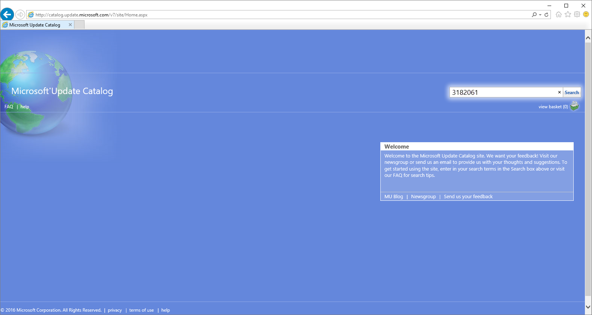
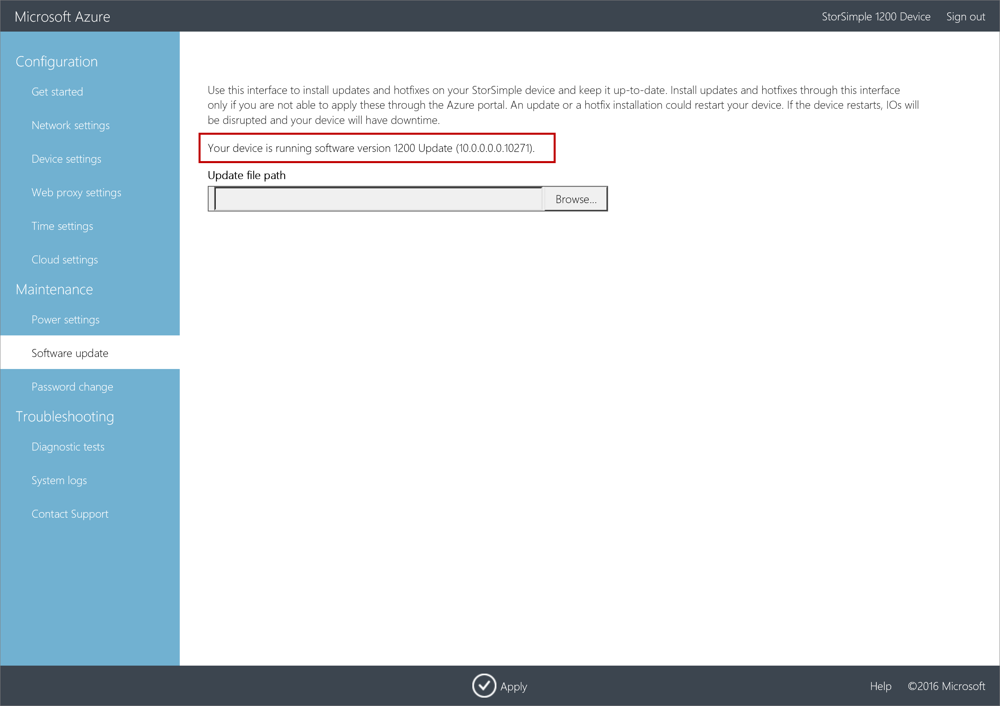

# Install Updates on your StorSimple Virtual Array - Azure portal

## Overview

This article describes the steps required to install updates on your StorSimple Virtual Array via the local web UI and via the Azure portal. You need to apply software updates or hotfixes to keep your StorSimple Virtual Array up-to-date. 

Keep in mind that installing an update or hotfix restarts your device. Given that the StorSimple Virtual Array is a single node device, any I/O in progress is disrupted and your device experiences downtime. 

Before you apply an update, we recommend that you take the volumes or shares offline on the host first and then the device. This minimizes any possibility of data corruption.

> [!IMPORTANT]
> If you are running Update 0.1 or GA software versions, you must use the hotfix method via the local web UI to install update 0.3. If you are running Update 0.2, we recommend that you install the updates via the Azure classic portal.
 

## Use the local web UI

There are two steps when using the local web UI:

* Download the update or the hotfix
* Install the update or the hotfix

### Download the update or the hotfix

Perform the following steps to download the software update from the Microsoft Update Catalog.

#### To download the update or the hotfix

1. Start Internet Explorer and navigate to [https://catalog.update.microsoft.com](https://catalog.update.microsoft.com).

2. If this is your first time using the Microsoft Update Catalog on this computer, click **Install** when prompted to install the Microsoft Update Catalog add-on.

3. In the search box of the Microsoft Update Catalog, enter the Knowledge Base (KB) number of the hotfix you want to download. Enter **3182061** for Update 0.3, and then click **Search**.
   
    The hotfix listing appears, for example, **StorSimple Virtual Array Update 0.3**.
   
    

4. Click **Add**. The update is added to the basket.

5. Click **View Basket**.

6. Click **Download**. Specify or **Browse** to a local location where you want the downloads to appear. The updates are downloaded to the specified location and placed in a subfolder with the same name as the update. The folder can also be copied to a network share that is reachable from the device.

7. Open the copied folder, you should see a Microsoft Update Standalone Package file `WindowsTH-KB3011067-x64`. This file is used to install the update or hotfix.

### Install the update or the hotfix

Prior to the update or hotfix installation, make sure that you have the update or the hotfix downloaded either locally on your host or accessible via a network share. 

Use this method to install updates on a device running GA or Update 0.1 software versions. This procedure takes less than 2 minutes to complete. Perform the following steps to install the update or hotfix.

#### To install the update or the hotfix

1. In the local web UI, go to **Maintenance** > **Software Update**.
   
    

2. In **Update file path**, enter the file name for the update or the hotfix. You can also browse to the update or hotfix installation file if placed on a network share. Click **Apply**.
   
    

3. A warning is displayed. Given this is a single node device, after the update is applied, the device restarts and there is downtime. Click the check icon.
   
   

4. The update starts. After the device is successfully updated, it restarts. The local UI is not accessible in this duration.
   
    

5. After the restart is complete, you are taken to the **Sign in** page. To verify that the device software has updated, in the local web UI, go to **Maintenance** > **Software Update**. The displayed software version should be **10.0.0.0.0.10288.0** for Update 0.3.
   
   > [!NOTE]
   > We report the software versions in a slightly different way in the local web UI and the Azure portal. For example, the local web UI reports **10.0.0.0.0.10288** and the Azure portal reports **10.0.10288.0** for the same version.
   
    

## Use the Azure portal

If running Update 0.2, we recommend that you install updates through the Azure portal. The portal procedure requires the user to scan, download, and then install the updates. This procedure takes around 7 minutes to complete. Perform the following steps to install the update or hotfix.

[!INCLUDE [storsimple-virtual-array-install-update-via-portal](../../includes/storsimple-virtual-array-install-update-via-portal.md)]

After the installation is complete (as indicated by job status at 100 %), go to your StorSimple Device Manager service. Select **Devices** and then select and click the device you want to update from the list of devices connected to this service. In the **Settings** blade, go to **Manage** section and select **Device updates**. The displayed software version should be **10.0.10288.0**.

## Next steps

Learn more about [administering your StorSimple Virtual Array](storsimple-ova-web-ui-admin.md).

