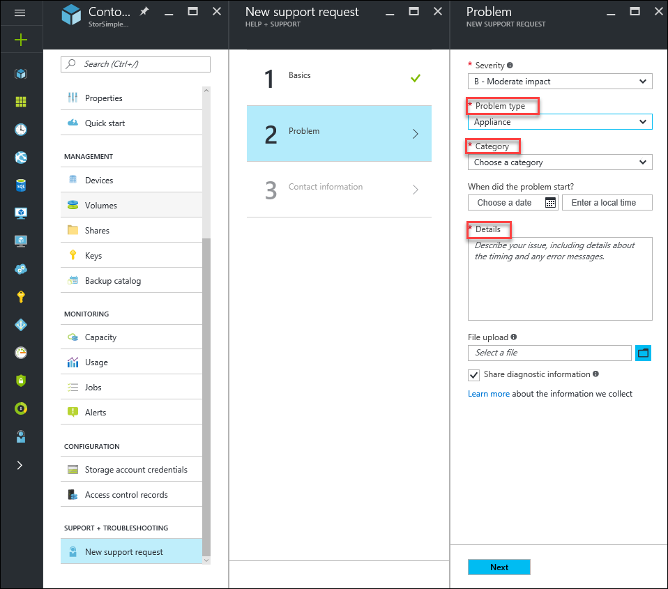
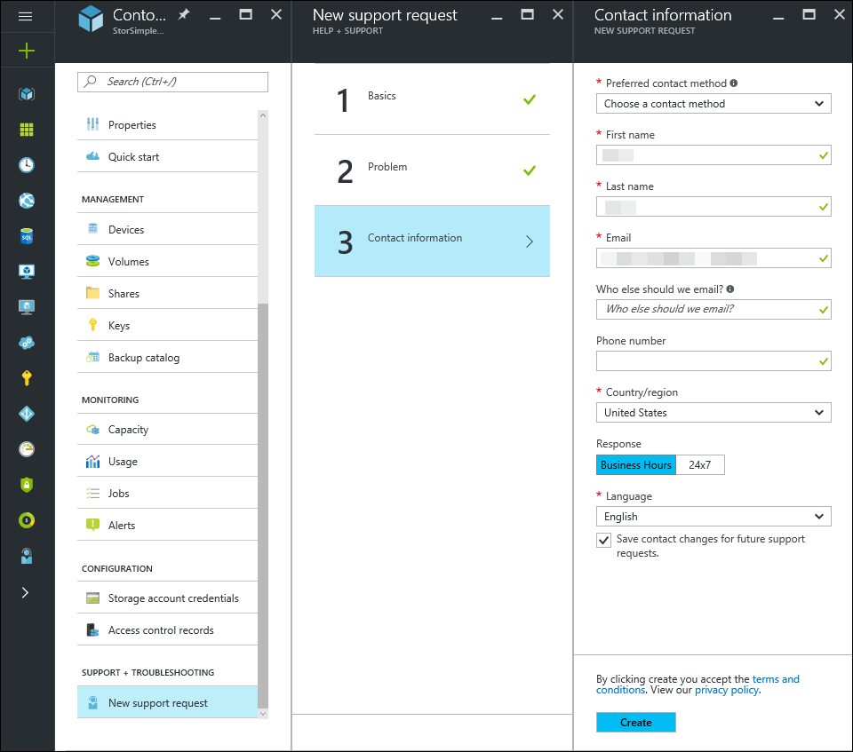
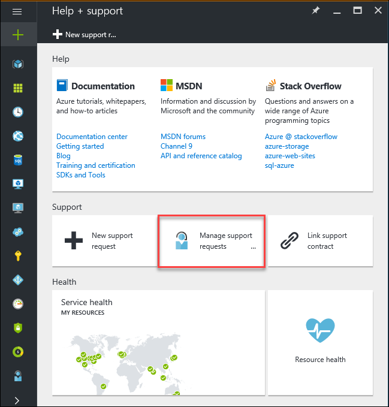

# Use the StorSimple Device Manager service to log a Support request for the StorSimple Virtual Array

## Overview

The StorSimple Device Manager provides the capability to **log a new support request** within the service summary blade. This article explains how you can log a new support request and manage its lifecycle from within the portal.

## New support request

Depending upon your [support plan](https://azure.microsoft.com/support/plans/), you can create support tickets for an issue on your StorSimple Virtual array directly from the StorSimple Device Manager service summary blade.

#### To log a new request

1. Go to your StorSimple Device Manager service. In the service summary blade settings, go to **SUPPORT + TROUBLESHOOTING** section and then click **New support request**.
   
    

2. In the **Basics** blade, do the following:

    1. From the **Issue type** dropdown list, select **Technical**. 
    
    2. The current **Subscription**, **Service** type, and the **Resource** (StorSimple Device Manager service) are automatically chosen. 

    3. Specify one or more devices registered to your service that are experiencing issues.

    4. Choose an appropriate **support plan** if you have multiple plans associated with your subscription. You need a paid support plan to enable Technical Support.

3. In **Step 2**, choose the **Severity** and specify if the issue is related to the array or the StorSimple Device Manager service. Also, choose a **Category** for this issue and provide more **Details** about the issue.
   
    

4. In **Step 3**, provide your contact information. Microsoft Support will use this information to reach out to you for further information, diagnosis, and resolution.
   
    

## Manage a support request

After creating a support ticket, you can manage the lifecycle of the ticket from within the portal.

#### To manage your support requests

To get to the help and support page, navigate to **Browse > Help + support**.

## Next steps

Learn how to [diagnose and solve problems related to your StorSimple Virtual array](storsimple-virtual-array-diagnose-problems.md)

