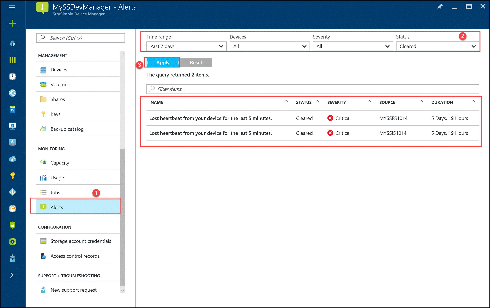
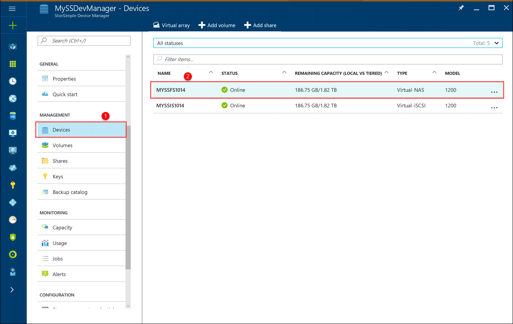
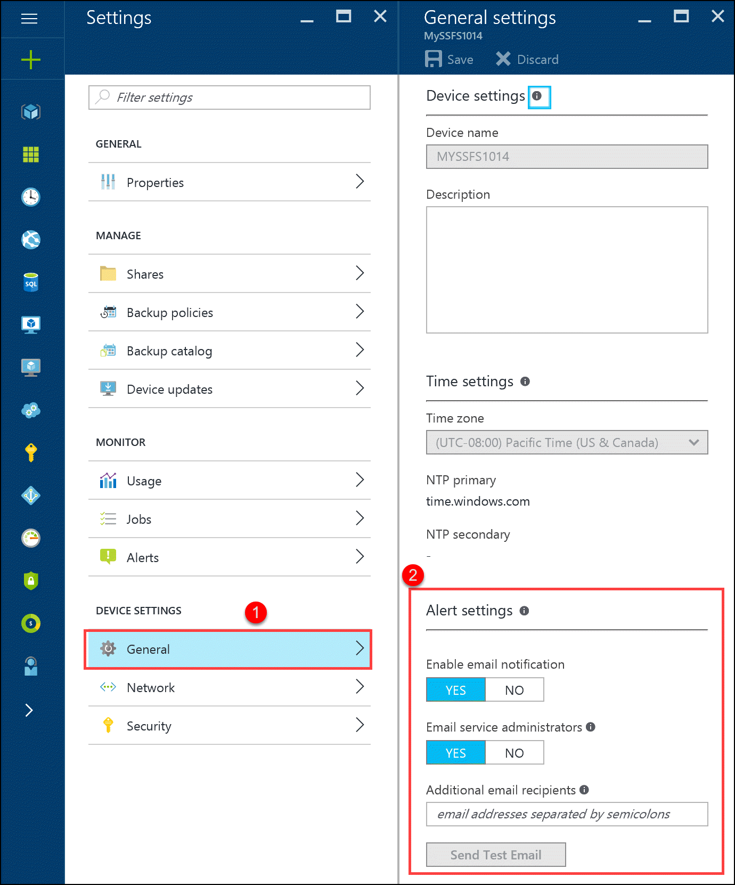
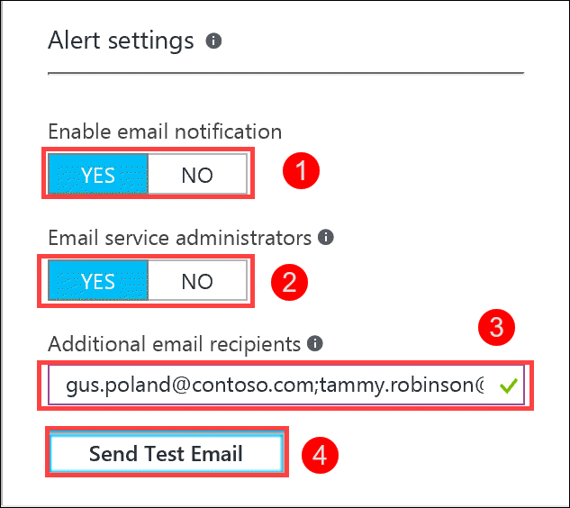
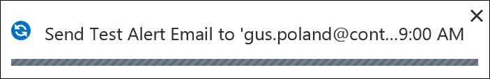
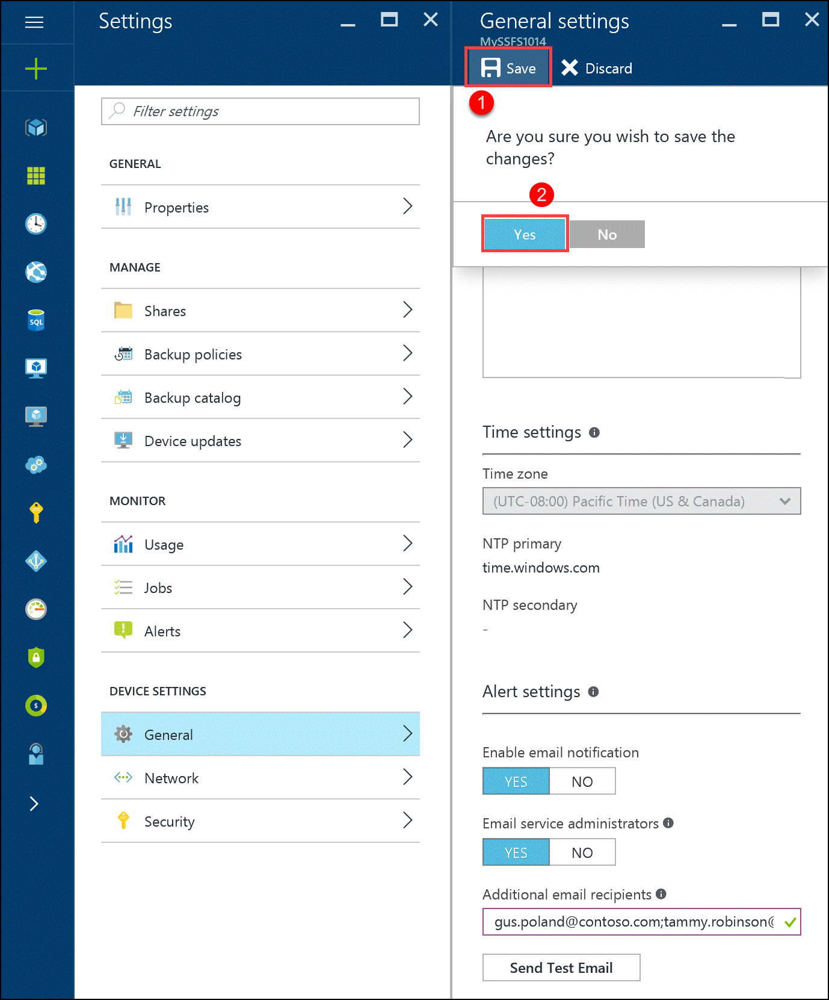
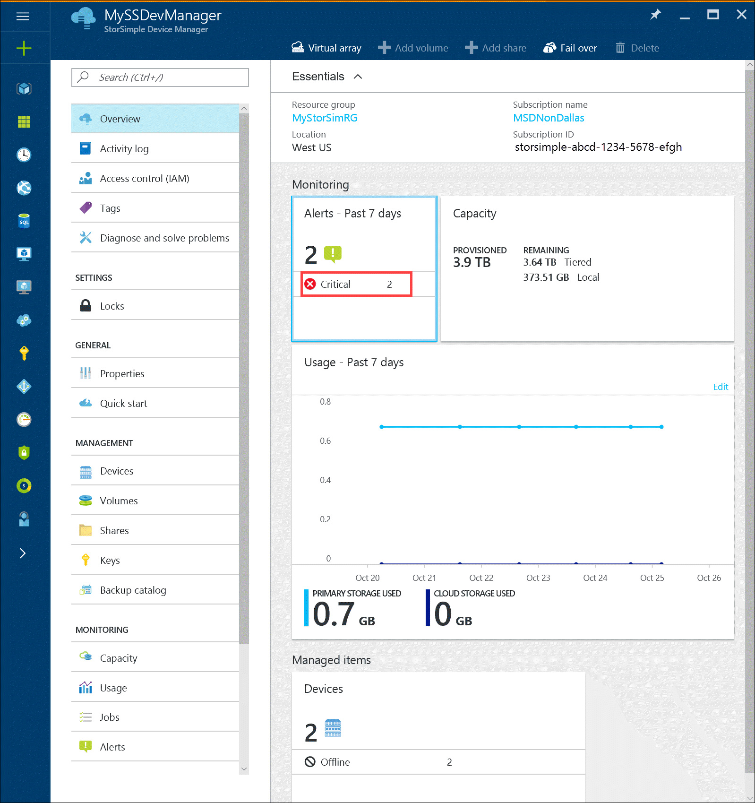
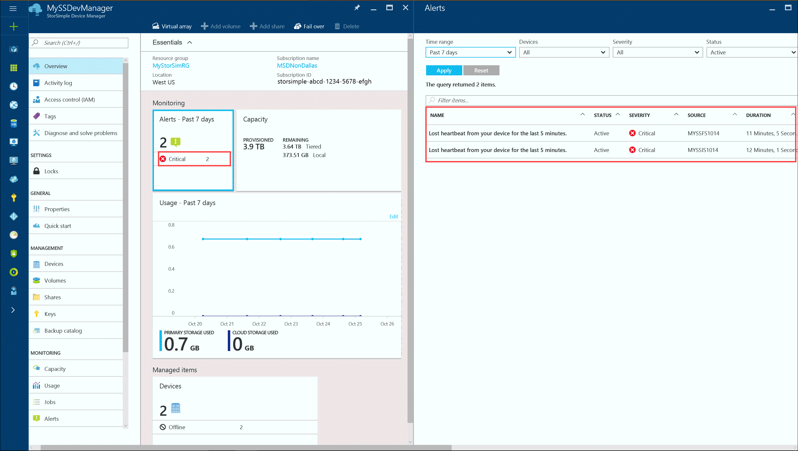
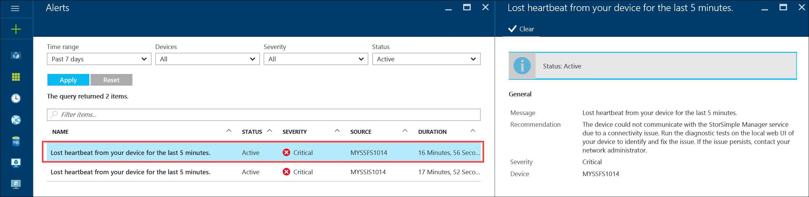
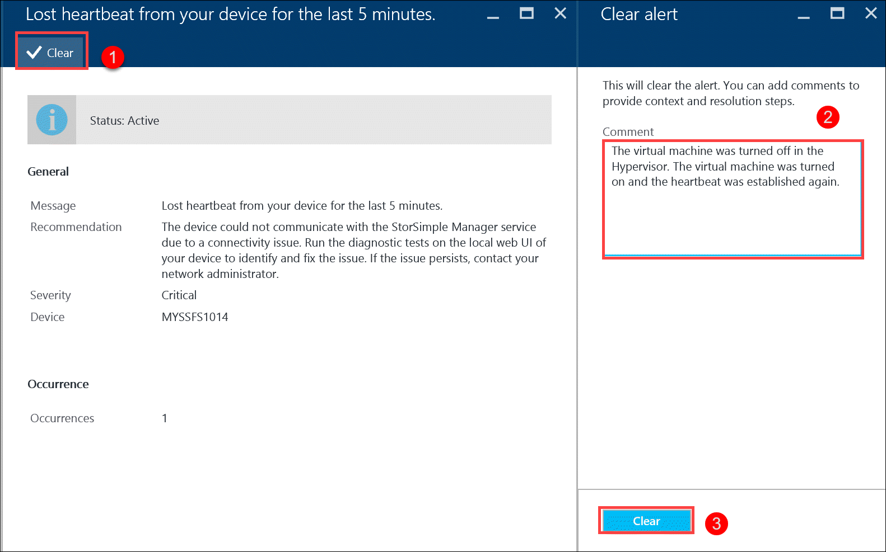

# Use StorSimple Device Manager to manage alerts for the StorSimple Virtual Array

## Overview

The alerts feature in the StorSimple Device Manager service provides a way for you to review and clear alerts related to StorSimple Virtual Arrays on a real-time basis. You can use the alerts on the **Service summary** blade to centrally monitor the health issues of your StorSimple Virtual Arrays and the overall Microsoft Azure StorSimple solution.

This tutorial describes how to configure alert notifications, common alert conditions, alert severity levels, and how to view and track alerts. Additionally, it includes alert quick reference tables, which enable you to quickly locate a specific alert and respond appropriately.

## Configure alert settings

You can choose whether you want to be notified by email of the alert conditions for each of your StorSimple Virtual Arrays. Additionally, you can identify other alert notification recipients by entering their email addresses in the **Additional email recipients** box, separated by semicolons.

> [!NOTE]
> You can enter a maximum of 20 email addresses per virtual array.

After you enable email notification for a virtual array, members of the notification list will receive an email message each time a critical alert occurs. The messages will be sent from *storsimple-alerts-noreply\@mail.windowsazure.com* and will describe the alert condition. Recipients can click **Unsubscribe** to remove themselves from the email notification list.

#### To enable email notification for alerts

1. Go to your StorSimple Device Manager service and in the **Management** section,select and click **Devices**. From the list of devices displayed, select and click your device.
   
    
2. This opens up the **Settings** blade. In the **Device settings** section, select **General**. This opens up the **General Settings** blade.
   
    
3. In the **General settings** blade, go to **Alert settings** section and set the following:
   
   1. In the **Enable email notification** field, select **YES**.
   2. In the **Email service administrators** field, select **YES** if you wish to have the service administrator and all co-administrators receive the alert notifications.
   3. In the **Additional email recipients** field, enter the email addresses of all other recipients who should receive the alert notifications. Enter names in the format *someone\@somewhere.com*. Use semicolons to separate the email addresses. You can configure a maximum of 20 email addresses per virtual device.
      
       
   4. To send a test email notification, click **Send test email**. The StorSimple Device Manager service will display status messages as it forwards the test notification.
      
       
      
      > [!NOTE]
      > If the test notification message can't be sent, the StorSimple Device Manager service will display an appropriate message. Click **OK**, wait a few minutes, and then try to send your test notification message again.
      >
      >
   5. At the bottom of the page, click **Save** to save your configuration. When prompted for confirmation, click **Yes**.
      
      

## Common alert conditions

Your StorSimple Virtual Array generates alerts in response to a variety of conditions. The following are the most common types of alert conditions:

* **Connectivity issues** – These alerts occur when there is difficulty in transferring data. Communication issues can occur during transfer of data to and from the Azure storage account or due to lack of connectivity between the virtual devices and the StorSimple Device Manager service. Communication issues are some of the hardest to fix because there are so many points of failure. You should always first verify that network connectivity and Internet access are available before continuing on to more advanced troubleshooting. For information about ports and firewall settings, go to [StorSimple Virtual Array system requirements](storsimple-ova-system-requirements.md). For help with troubleshooting, go to [Troubleshoot with the Test-Connection cmdlet](storsimple-troubleshoot-deployment.md).
* **Performance issues** – These alerts are caused when your system isn’t performing optimally, such as when it is under a heavy load.

In addition, you might see alerts related to security, updates, or job failures.

## Alert severity levels

Alerts have different severity levels, depending on the impact that the alert situation will have and the need for a response to the alert. The severity levels are:

* **Critical** – This alert is in response to a condition that is affecting the successful performance of your system. Action is required to ensure that the StorSimple service is not interrupted.
* **Warning** – This condition could become critical if not resolved. You should investigate the situation and take any action required to clear the issue.
* **Information** – This alert contains information that can be useful in tracking and managing your system.

## View and track alerts

The StorSimple Device Manager service summary blade provides you with a quick glance at the number of alerts on your virtual devices, arranged by severity level.

Click the severity level to open the **Alerts** blade. The results include only the alerts that match that severity level.

Click an alert in the list to get additional details for the alert, including the last time the alert was reported, the number of occurrences of the alert on the device, and the recommended action to resolve the alert.

You can copy the alert details to a text file if you need to send the information to Microsoft Support. After you have followed the recommendation and resolved the alert condition on-premises, you should clear the alert from the list. Select the alert from the list and then click **Clear**. To clear multiple alerts, select each alert, click any column except the **Alert** column, and then click **Clear** after you have selected all the alerts to be cleared.

When you click **Clear**, you will have the opportunity to provide comments about the alert and the steps that you took to resolve the issue.

Some events will be cleared by the system if another event is triggered with new information.

## Sort and review alerts

The **Alerts** blade can display up to 250 alerts. If you have exceeded that number of alerts, not all alerts will be displayed in the default view. You can combine the following fields to customize which alerts are displayed:

* **Status** – You can display either **Active** or **Cleared** alerts. Active alerts are still being triggered on your system, while cleared alerts have been either manually cleared by an administrator or programmatically cleared because the system updated the alert condition with new information.
* **Severity** – You can display alerts of all severity levels (critical, warning, information), or just a certain severity, such as only critical alerts.
* **Source** – You can display alerts from all sources, or limit the alerts to those that come from either the service or one or all the virtual devices.
* **Time range** – By specifying the **From** and **To** dates and time stamps, you can look at alerts during the time period that you are interested in.

## Alerts quick reference

The following tables list some of the StorSimple alerts that you might encounter, as well as additional information and recommendations where available. StorSimple Virtual Array alerts fall into one of the following categories:

* [Cloud connectivity alerts](#cloud-connectivity-alerts)
* [Configuration alerts](#configuration-alerts)
* [Job failure alerts](#job-failure-alerts)
* [Performance alerts](#performance-alerts)
* [Security alerts](#security-alerts)

### Cloud connectivity alerts

| Alert text | Event | More information / recommended actions |
|:--- |:--- |:--- |
| Device <*device name*> is not connected to the cloud. |The named device cannot connect to the cloud. |Could not connect to the cloud. This could be due to one of the following:<ul><li>There may be a problem with the network settings on your device.</li><li>There may be a problem with the storage account credentials.</li></ul>For more information on troubleshooting connectivity issues, go to the [local web UI](storsimple-ova-web-ui-admin.md) of the device. |

### Configuration alerts

| Alert text | Event | More information / recommended actions |
|:--- |:--- |:--- |
| On-premises virtual device configuration unsupported. |Slow performance. |The current configuration may result in performance degradation. Ensure that your server meets the minimum configuration requirements. For more information, go to [StorSimple Virtual Array Requirements](storsimple-ova-system-requirements.md). |
| You are running out of provisioned disk space on <*device name*\>. |Disk space warning. |You are running low on provisioned disk space. To free up space, consider moving workloads to another volume or share or deleting data. |

### Job failure alerts

| Alert text | Event | More information / recommended actions |
|:--- |:--- |:--- |
| Backup of <*device name*\> couldn’t be completed. |Backup job failure. |Could not create a backup. Consider one of the following:<ul><li>Connectivity issues could be preventing the backup operation from successfully completing. Ensure that there are no connectivity issues. For more information on troubleshooting connectivity issues, go to the [local web UI](storsimple-ova-web-ui-admin.md) for your virtual device.</li><li>You have reached the available storage limit. To free up space, consider deleting any backups that are no longer needed.</li></ul> Resolve the issues, clear the alert and retry the operation. |
| Clone of <*device name*\> couldn’t be completed. |Clone job failure. |Could not create a clone. Consider one of the following:<ul><li>Your backup list may not be valid. Refresh the list to verify it is still valid.</li><li>Connectivity issues could be preventing the clone operation from successfully completing. Ensure that there are no connectivity issues.</li><li>You have reached the available storage limit. To free up space, consider deleting any backups that are no longer needed.</li></ul>Resolve the issues, clear the alert and retry the operation. |

### Networking alerts

| Alert text | Event | More information / recommended actions |
|:--- |:--- |:--- |
| Could not connect to the authentication service. |Datapath error |The URL that is used to authenticate is not reachable. Ensure that your firewall rules include the URL patterns specified for the StorSimple device. For more information on URL patterns in Azure portal, go to [StorSimple Virtual Array networking requirements](storsimple-ova-system-requirements.md#url-patterns-for-firewall-rules).|

### Performance alerts

| Alert text | Event | More information / recommended actions |
|:--- |:--- |:--- |
| You are experiencing unexpected delays in data transfer. |Slow data transfer. |Throttling errors occur when you exceed the scalability targets of a storage service. The storage service does this to ensure that no single client or tenant can use the service at the expense of others. For more information on troubleshooting your Azure storage account, go to [Monitor, diagnose, and troubleshoot Microsoft Azure Storage](../storage/common/storage-monitoring-diagnosing-troubleshooting.md). |
| You are running low on local reservation disk space on <*device name*\>. |Slow response time. |10% of the total provisioned size for <*device name*\> is reserved on the local device and you are now running low on the reserved space. The workload on <*device name*\> is generating a higher rate of churn or you might have recently migrated a large amount of data. This may result in reduced performance. Consider one of the following actions to resolve this:<ul><li>Increase the cloud bandwidth to this device.</li><li>Reduce or move workloads to another volume or share.</li></ul> |

### Security alerts

| Alert text | Event | More information / recommended actions |
|:--- |:--- |:--- |
| Password for <*device name*\> will expire in <*number*\> days. |Password warning. |Your password will expire in <*number*\> days. Consider changing your password. For more information, go to [Change the StorSimple Virtual Array device administrator password](storsimple-virtual-array-change-device-admin-password.md). |

## Next steps

* [Learn about the StorSimple Virtual Array](storsimple-ova-overview.md).
