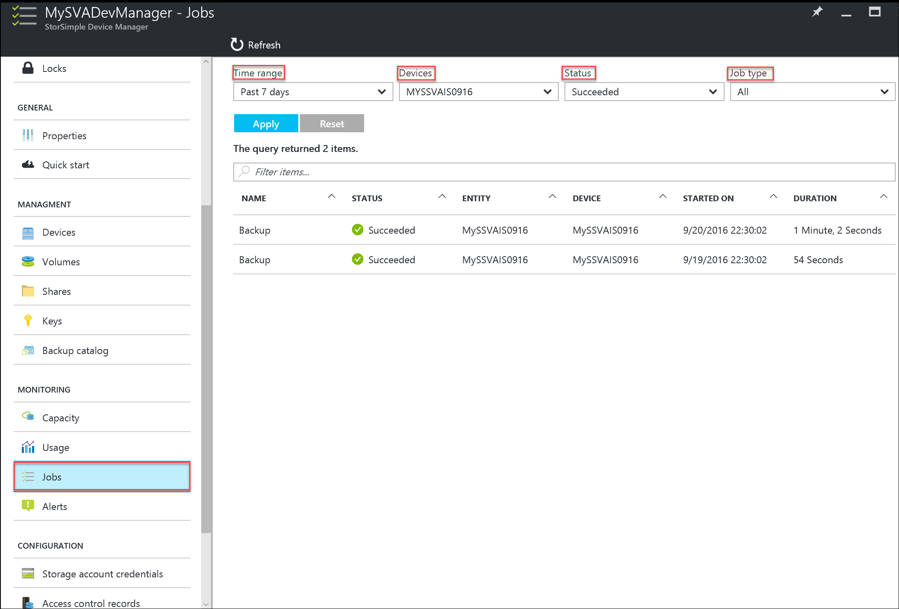
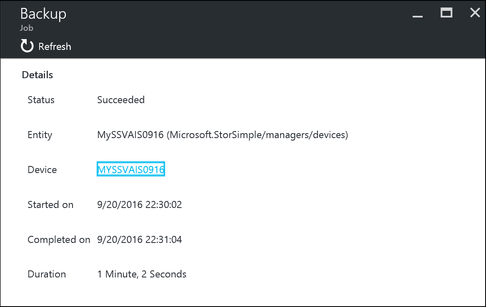

# Use the StorSimple Device Manager service to view jobs for the StorSimple Virtual Array
## Overview
The **Jobs** blade provides a single central portal for viewing and managing jobs that are started on virtual arrays that are connected to your StorSimple Device Manager service. You can view running, completed, and failed jobs for multiple virtual devices. Results are presented in a tabular format.

You can quickly find the jobs you are interested in by filtering on fields such as:

* **Time range** – Jobs can be filtered based on the date and time range.
* **Devices** – Jobs are initiated on a specific device connected to your service. The filtered jobs are then tabulated based on the following attributes:
  
  * **Name** – The job name can be **All**, **Backup**, **Clone**, **Fail over**, **Download updates**, or **Install updates**.
  * **Status** – Jobs can be **All**, **In progress**, **Succeeded**, or **Failed**, or **Canceled**.
  * **Entity** – The jobs can be associated with a volume, share, or device.
  * **Device** – The name of the device on which the job was started.
  * **Started on** – The time when the job was started.
  * **Duration** – The duration for on which the job was run.
* **Status** – You can search for all, running, completed, or failed jobs.
* **Job type** – The job type can be all, backup, restore, failover, download updates, or install updates.

The list of jobs is refreshed every 30 seconds.

## View job details
Perform the following steps to view the details of any job.

#### To view job details
1. On the **Jobs** blade, display the job(s) you are interested in by running a query with appropriate filters. You can search for completed or running jobs.
2. Select a job from the tabular list of jobs.
   
    
3. At the bottom of the page, click **Details**.
4. In the **Details** dialog box, you can view status, details, and time statistics. The following illustration shows an example of the **Backup Job Details** dialog box.
   
    

#### Job failures when the virtual machine is paused in the hypervisor
When a job is in progress on your StorSimple Virtual Array and the device (virtual machine provisioned in hypervisor) is paused for greater than 15 minutes, the job fails. This is due to your StorSimple Virtual Array time being out of sync with the Microsoft Azure time. 

You will see the following error: "Your device time is out of sync with the Microsoft Azure time by more than 15 minutes. Ensure that the hypervisor and the device times are synchronized with an NTP server. Verify that there are no connectivity issues. To troubleshoot connectivity issues, run diagnostic tests from the local web UI of your virtual device."

These failures apply to backup, restore, update, and failover jobs. If your virtual machine is provisioned in Hyper-V, the machine eventually synchronizes time with your hypervisor. Once that happens, you can restart your job.

## Next steps
[Learn how to use the local web UI to administer your StorSimple Virtual Array](storsimple-ova-web-ui-admin.md).

