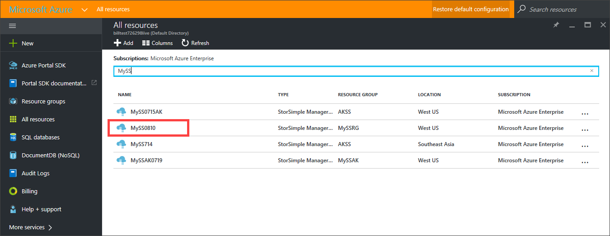
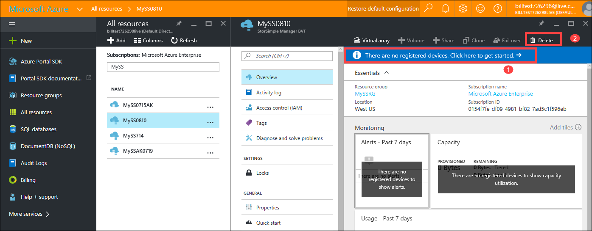
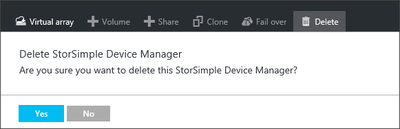
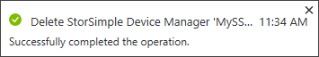
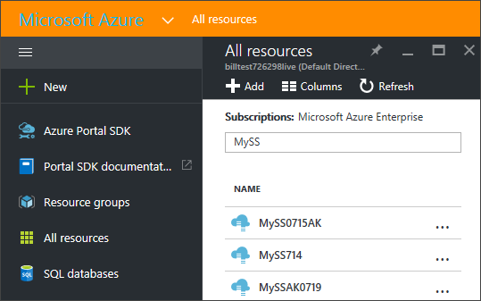
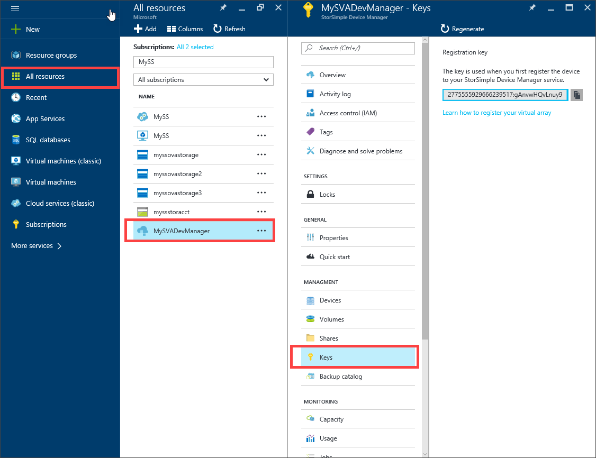
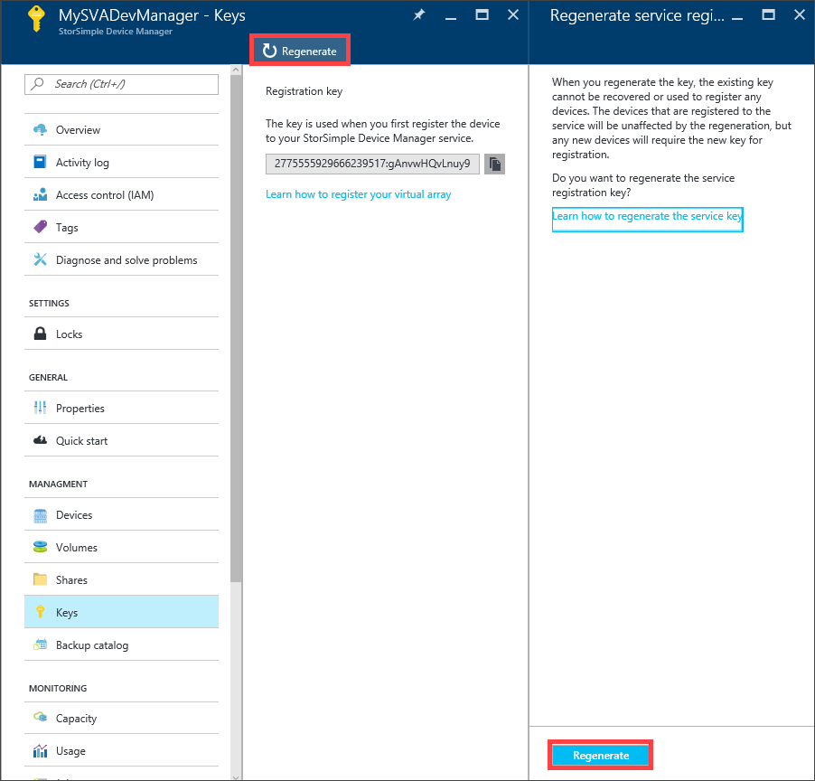
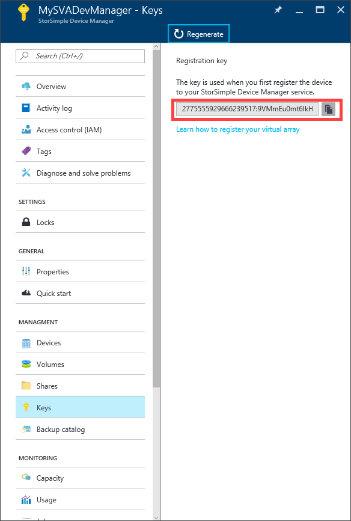

# Deploy the StorSimple Device Manager service for StorSimple Virtual Array

[!INCLUDE [storsimple-1200-eol-banner](../../includes/storsimple-1200-eol-banner.md)]

## Overview

The StorSimple Device Manager service runs in Microsoft Azure and connects to multiple StorSimple devices. After you create the service, you can use it to manage the devices from the Microsoft Azure portal running in a browser. This allows you to monitor all the devices that are connected to the StorSimple Device Manager service from a single, central location, thereby minimizing administrative burden.

The common tasks related to a StorSimple Device Manager service are:

* Create a service
* Delete a service
* Get the service registration key
* Regenerate the service registration key

This tutorial describes how to perform each of the preceding tasks. The information contained in this article is applicable only to StorSimple Virtual Arrays. For more information on StorSimple 8000 series, go to [deploy a StorSimple Manager service](./storsimple-8000-manage-service.md).

## Create a service

To create a service, you need to have:

* A subscription with an Enterprise Agreement
* An active Microsoft Azure storage account
* The billing information that is used for access management

You can also choose to generate a storage account when you create the service.

A single service can manage multiple devices. However, a device cannot span multiple services. A large enterprise can have multiple service instances to work with different subscriptions, organizations, or even deployment locations.

> [!NOTE]
> You need separate instances of StorSimple Device Manager service to manage StorSimple 8000 series devices and StorSimple Virtual Arrays.

Perform the following steps to create a service.

[!INCLUDE [storsimple-virtual-array-create-new-service](../../includes/storsimple-virtual-array-create-new-service.md)]

## Delete a service

Before you delete a service, make sure that no connected devices are using it. If the service is in use, deactivate the connected devices. The deactivate operation will sever the connection between the device and the service, but preserve the device data in the cloud.

> [!IMPORTANT]
> After a service is deleted, the operation cannot be reversed. Any device that was using the service will need to be factory reset before it can be used with another service. In this scenario, the local data on the device, as well as the configuration, will be lost.
 

Perform the following steps to delete a service.

#### To delete a service

1. Go to **All resources**. Search for your StorSimple Device Manager service. Select the service that you wish to delete.
   
    
2. Go to your service dashboard to ensure there are no devices connected to the service. If there are no devices registered with this service, you will also see a banner message to the effect. Click **Delete**.
   
    

3. When prompted for confirmation, click **Yes** in the confirmation notification. 
   
    
4. It may take a few minutes for the service to be deleted. After the service is successfully deleted, you will be notified.
   
    

The list of services will be refreshed.

 

## Get the service registration key
After you have successfully created a service, you will need to register your StorSimple device with the service. To register your first StorSimple device, you will need the service registration key. To register additional devices with an existing StorSimple service, you will need both the registration key and the service data encryption key (which is generated on the first device during registration). For more information about the service data encryption key, see [StorSimple security](./storsimple-8000-security.md). You can get the registration key by accessing the **Keys** blade for your service.

Perform the following steps to get the service registration key.

#### To get the service registration key
1. In the **StorSimple Device Manager** blade, go to **Management &gt;** **Keys**.
   
   
2. In the **Keys** blade, a service registration key appears. Copy the registration key using the copy icon. 

Keep the service registration key in a safe location. You will need this key, as well as the service data encryption key, to register additional devices with this service. After obtaining the service registration key, you will need to configure your device through the Windows PowerShell for StorSimple interface.

## Regenerate the service registration key
You will need to regenerate a service registration key if you are required to perform key rotation or if the list of service administrators has changed. When you regenerate the key, the new key is used only for registering subsequent devices. The devices that were already registered are unaffected by this process.

Perform the following steps to regenerate a service registration key.

#### To regenerate the service registration key
1. In the **StorSimple Device Manager** blade, go to **Management &gt;** **Keys**.
   
   
2. In the **Keys** blade, click **Regenerate**.
   
   
3. In the **Regenerate service registration key** blade, review the action required when the keys are regenerated. All the subsequent devices that are registered with this service will use the new registration key. Click **Regenerate** to confirm. You will be notified after the registration is complete.
   
   
4. A new service registration key will appear.
   
    
   
   Copy this key and save it for registering any new devices with this service.

## Next steps
* Learn how to [get started](storsimple-virtual-array-deploy1-portal-prep.md) with a StorSimple Virtual Array.
* Learn how to [administer your StorSimple device](storsimple-ova-web-ui-admin.md).