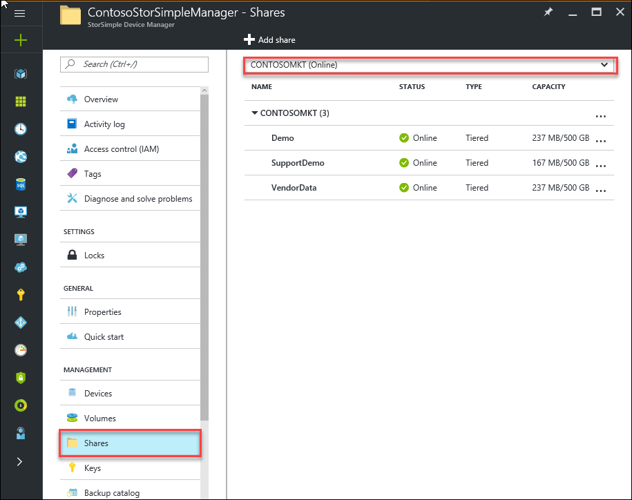
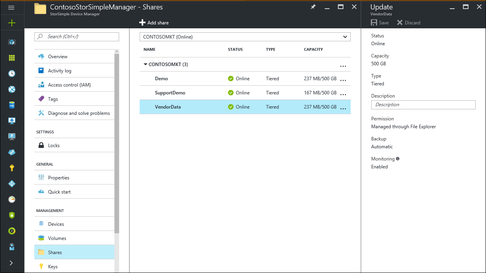
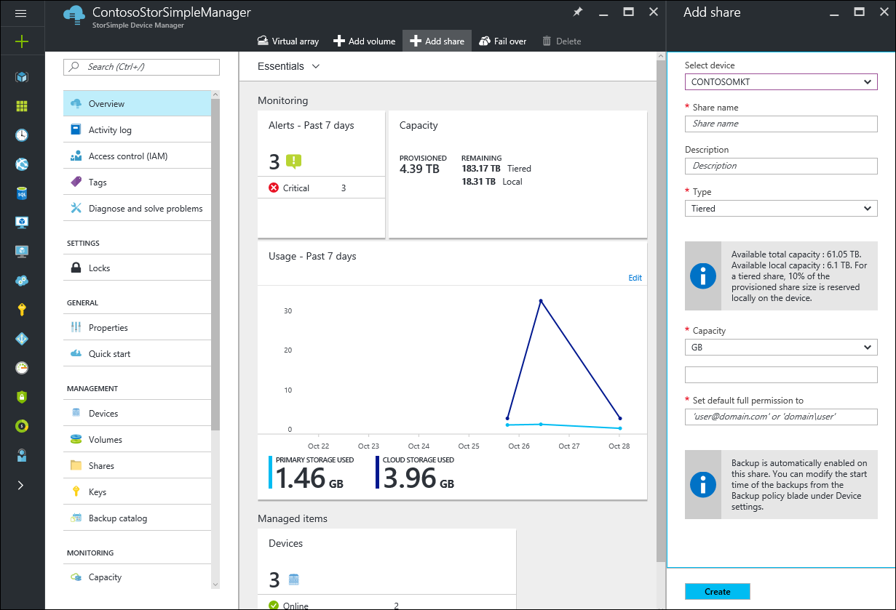
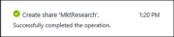
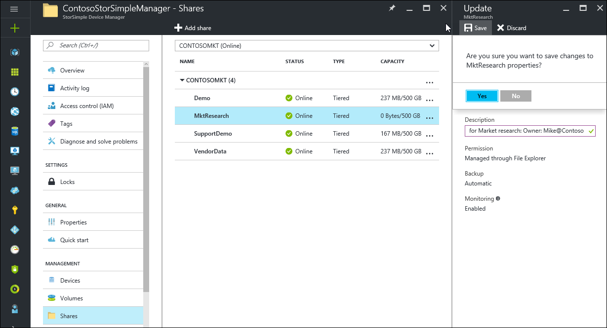
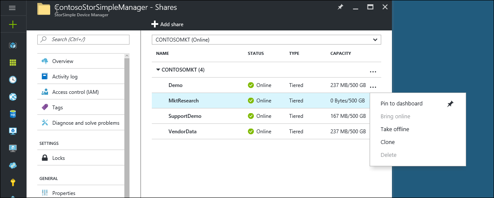
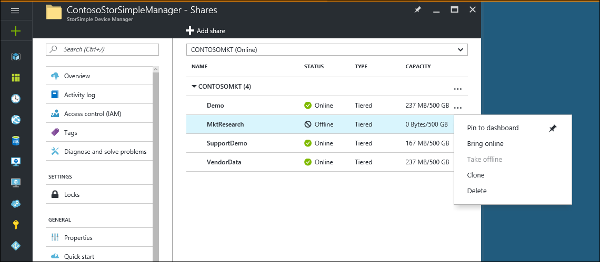

# Use the StorSimple Device Manager service to manage shares on the StorSimple Virtual Array

## Overview

This tutorial explains how to use the StorSimple Device Manager service to create and manage shares on your StorSimple Virtual Array.

The StorSimple Device Manager service is an extension in the Azure portal that lets you manage your StorSimple solution from a single web interface. In addition to managing shares and volumes, you can use the StorSimple Device Manager service to view and manage devices, view alerts, manage backup policies, and manage the backup catalog.

## Share Types

StorSimple shares can be:

* **Locally pinned**: Data in these shares stays on the array at all times and does not spill to the cloud.
* **Tiered**: Data in these shares can spill to the cloud. When you create a tiered share, approximately 10 % of the space is provisioned on the local tier and 90 % of the space is provisioned in the cloud. For example, if you provisioned a 1 TB share, 100 GB would reside in the local space and 900 GB would be used in the cloud when the data tiers. This in turn implies that if you run out of all the local space on the device, you cannot provision a tiered share (because the 10 % required on the local tier will not be available).

### Provisioned capacity

Refer to the following table for maximum provisioned capacity for each share type.

| **Limit identifier** | **Limit** |
| --- | --- |
| Minimum size of a tiered share |500 GB |
| Maximum size of a tiered share |20 TB |
| Minimum size of a locally pinned share |50 GB |
| Maximum size of a locally pinned share |2 TB |

## The Shares blade

The **Shares** menu on your StorSimple service summary blade displays the list of storage shares on a given StorSimple array and allows you to manage them.

A share consists of a series of attributes:

* **Share Name** – A descriptive name that must be unique and helps identify the share.
* **Status** – Can be online or offline. If a share is offline, users of the share will not be able to access it.
* **Type** – Indicates whether the share is **Tiered** (the default) or **Locally pinned**.
* **Capacity** – specifies the amount of data used as compared to the total amount of data that can be stored on the share.
* **Description** – An optional setting that helps describe the share.
* **Permissions** - The NTFS permissions to the share that can be managed through Windows Explorer.
* **Backup** – In case of the StorSimple Virtual Array, all shares are automatically enabled for backup.

Use the instructions in this tutorial to perform the following tasks:

* Add a share
* Modify a share
* Take a share offline
* Delete a share

## Add a share

1. From the StorSimple service summary blade, click **+ Add share** from the command bar. This opens up the **Add share** blade.

    

2. In the **Add share** blade, do the following:
   
   1. In the **Share name** field, enter a unique name for your share. The name must be a string that contains 3 to 127 characters.

   2. An optional **Description** for the share. The description will help identify the share owners.

   3. In the **Type** dropdown list, specify whether to create a **Tiered** or **Locally pinned** share. For workloads that require local guarantees, low latencies, and higher performance, select **Locally pinned share**. For all other data, select **Tiered** share.

   4. In the **Capacity** field, specify the size of the share. A tiered share must be between 500 GB and 20 TB and a locally pinned share must be between 50 GB and 2 TB.

   5. In the **Set default full permissions to** field, assign the permissions to the user, or the group that is accessing this share. Specify the name of the user or the user group in _john@contoso.com_ format. We recommend that you use a user group (instead of a single user) to allow admin privileges to access these shares. After you have assigned the permissions here, you can then use File Explorer to modify these permissions.
3. When you've finished configuring your share, click **Create**. A share will be created with the specified settings and you will see a notification. By default, backup will be enabled for the share.
4. To confirm that the share was successfully created, go to the **Shares** blade. You should see the share listed.
   
    

## Modify a share

Modify a share when you need to change the description of the share. No other share properties can be modified once the share is created.

#### To modify a share

1. From the **Shares** setting on the StorSimple service summary blade, select the virtual array on which the share you wish you to modify resides.
2. **Select** the share to view the current description and modify it.
3. Save your changes by clicking the **Save** command bar. Your specified settings will be applied and you will see a notification.
   
    

## Take a share offline

You may need to take a share offline when you are planning to modify it or delete it. When a share is offline, it is not available for read-write access. You will need to take the share offline on the host as well as on the device.

#### To take a share offline

1. Make sure that the share in question is not in use before taking it offline.
2. Take the share on the array offline by performing the following steps:
   
    1. From the **Shares** setting on the StorSimple service summary blade, select the virtual array on which the share you wish you to take offline resides.

    2. **Select** the share and Click **...** (alternately right-click in this row) and from the context menu, select **Take offline**.
     
        

    3. Review the information in the **Take offline** blade and confirm your acceptance of the operation. Click **Take offline** to take the share offline. You will see a notification of the operation in progress.

    4. To confirm that the share was successfully taken offline, go to the **Shares** blade. You should see the status of the share as offline.

## Delete a share

> [!IMPORTANT]
> You can delete a share only if it is offline.

Complete the following steps to delete a share.

#### To delete a share

1. From the **Shares** setting on the StorSimple service summary blade, select the virtual array on which the share you wish to delete resides.
2. **Select** the share and Click **...** (alternately right-click in this row) and from the context menu, select **Delete**.
   
    
3. Check the status of the share you want to delete. If the share you want to delete is not offline, take it offline first. Follow the steps in [Take a share offline](#take-a-share-offline).
4. When prompted for confirmation in the **Delete** blade, accept the confirmation and click **Delete**. The share will now be deleted and the **Shares** blade shows the updated list of shares within the virtual array.

## Next steps
Learn how to [clone a StorSimple share](storsimple-virtual-array-clone.md).

