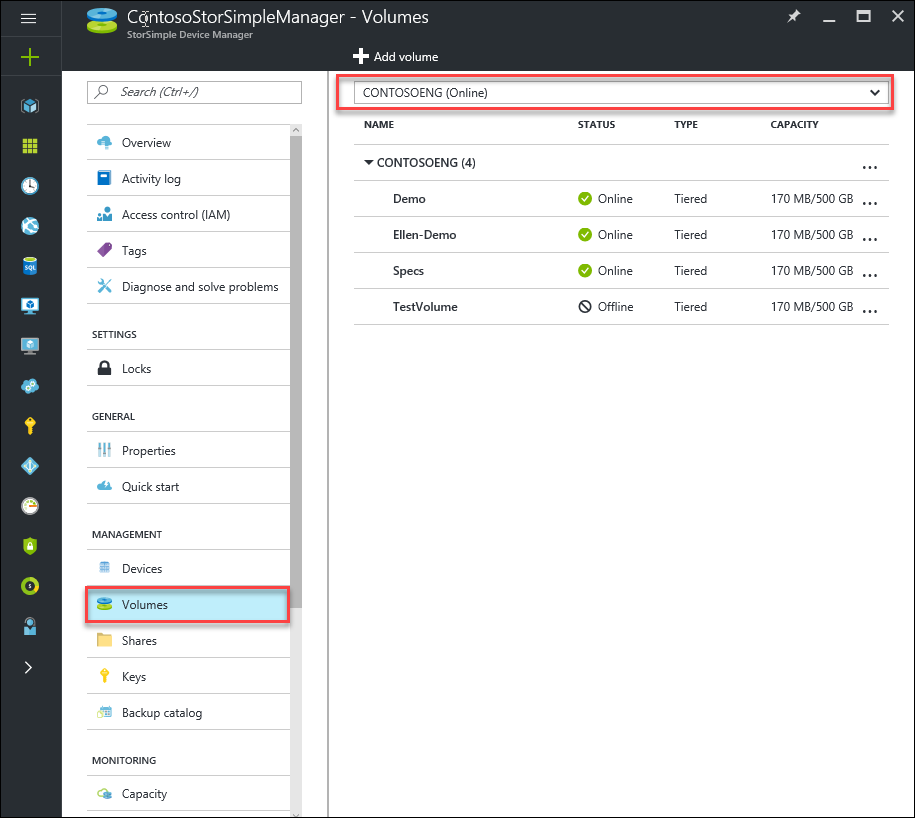
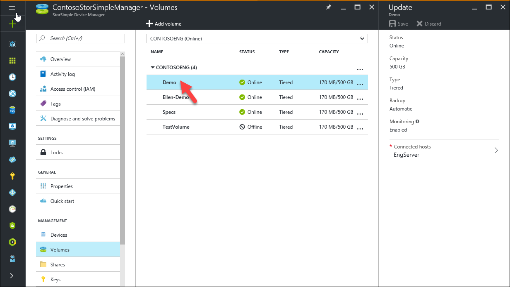
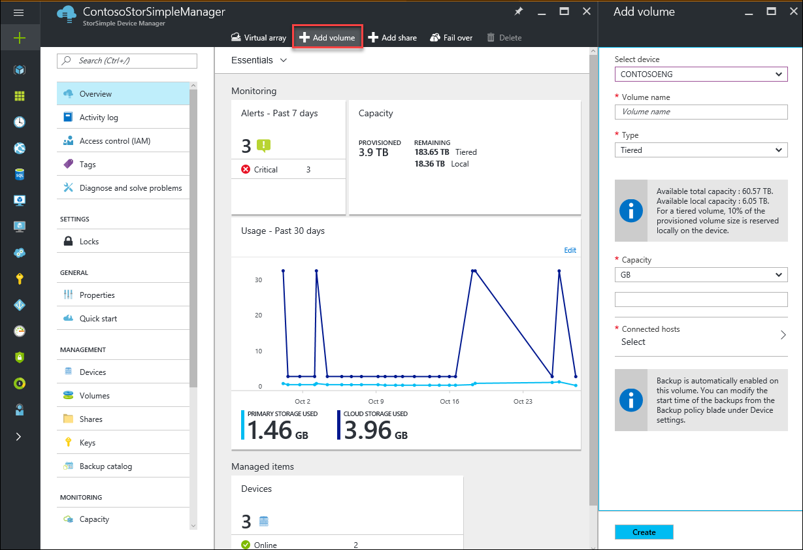
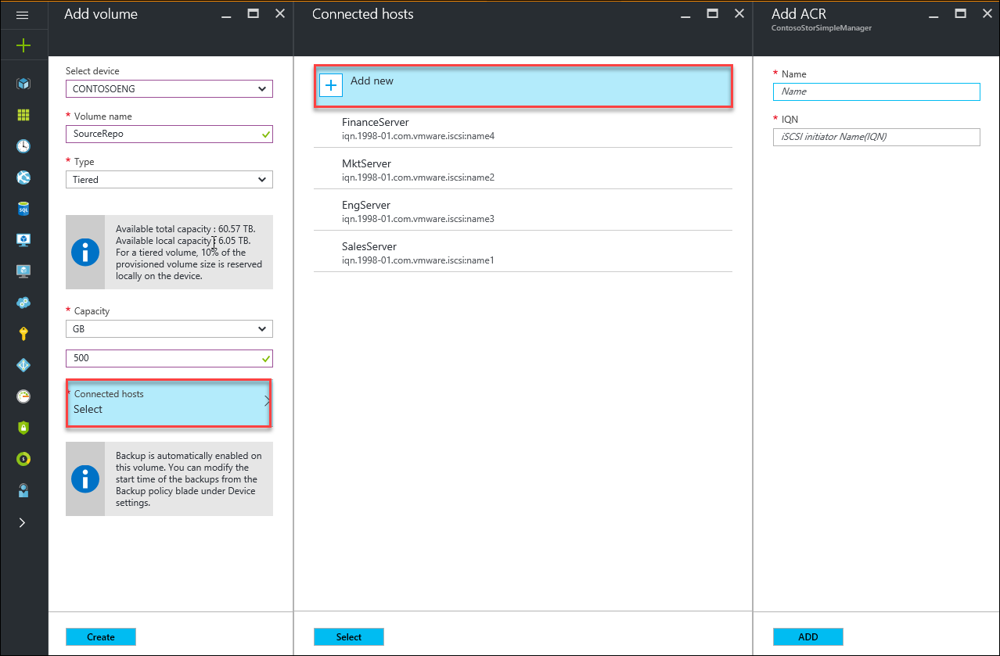
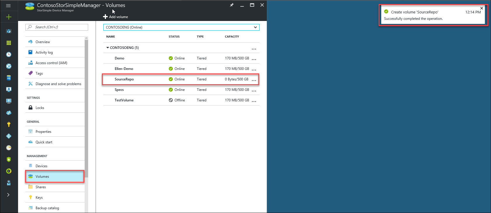
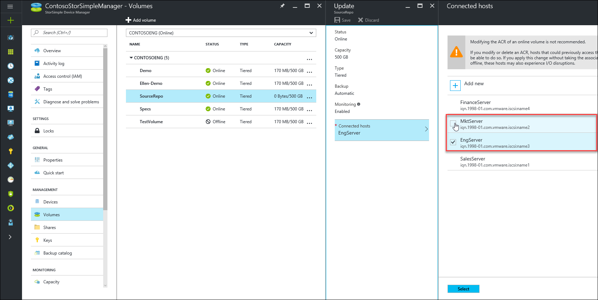
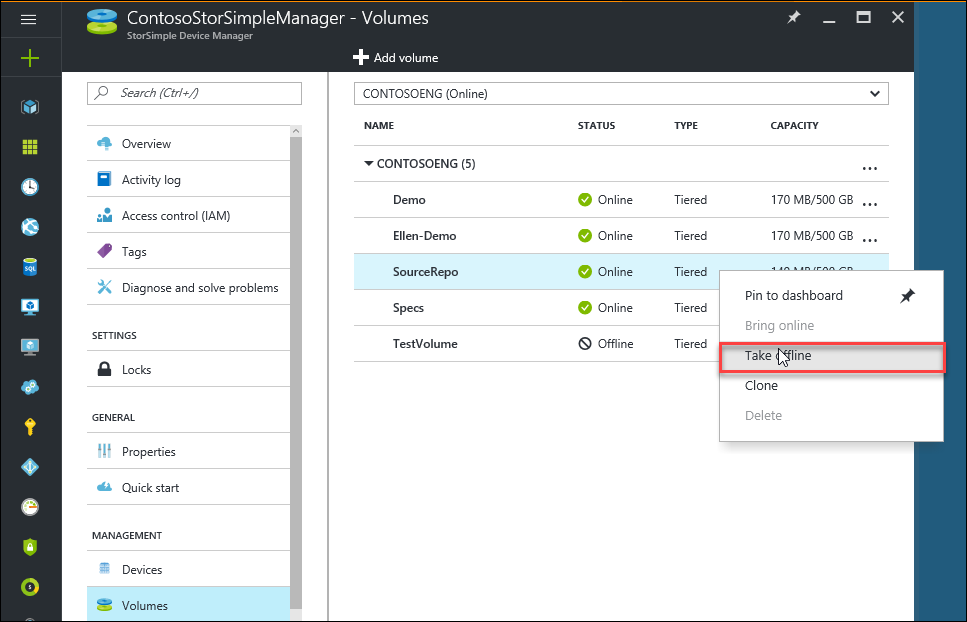
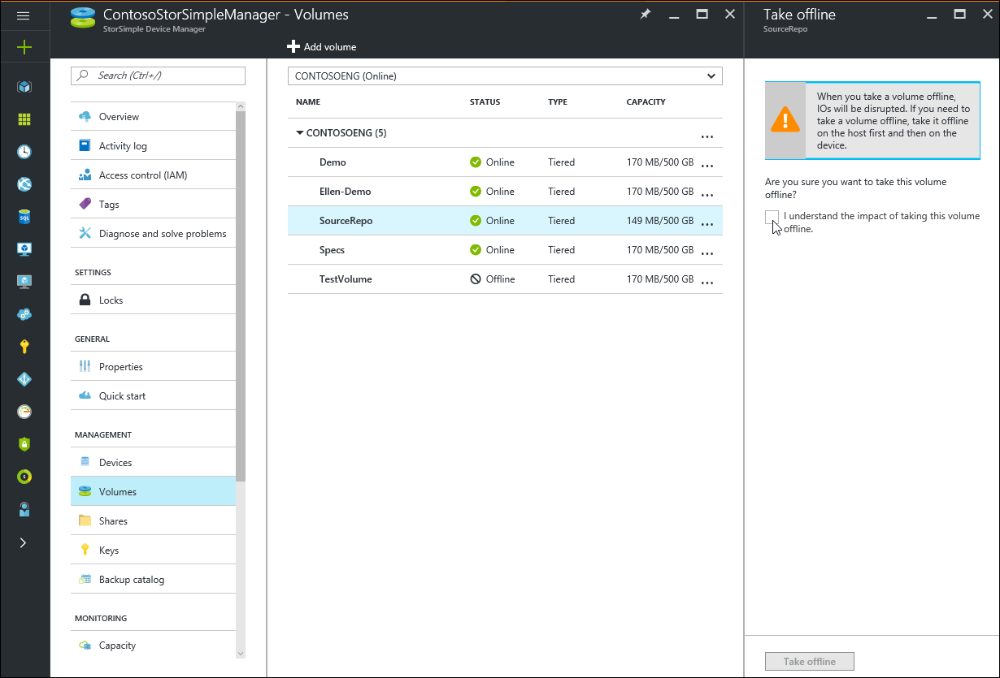
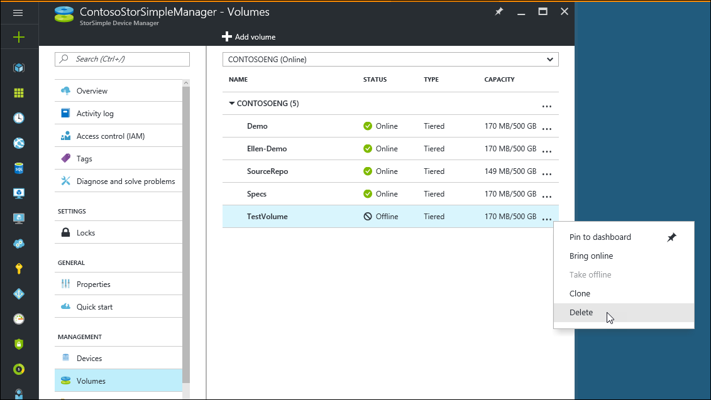

# Use StorSimple Device Manager service to manage volumes on the StorSimple Virtual Array

## Overview

This tutorial explains how to use the StorSimple Device Manager service to create and manage volumes on your StorSimple Virtual Array.

The StorSimple Device Manager service is an extension in the Azure portal that lets you manage your StorSimple solution from a single web interface. In addition to managing shares and volumes, you can use the StorSimple Device Manager service to view and manage devices, view alerts, and view and manage backup policies and the backup catalog.

## Volume Types

StorSimple volumes can be:

* **Locally pinned**: Data in these volumes stays on the array at all times and does not spill to the cloud.
* **Tiered**: Data in these volumes can spill to the cloud. When you create a tiered volume, approximately 10 % of the space is provisioned on the local tier and 90 % of the space is provisioned in the cloud. For example, if you provisioned a 1 TB volume, 100 GB would reside in the local space and 900 GB would be used in the cloud when the data tiers. This in turn implies that if you run out of all the local space on the device, you cannot provision a tiered volume (because the 10 % required on the local tier will not be available).

### Provisioned capacity
Refer to the following table for maximum provisioned capacity for each volume type.

| **Limit identifier**                                       | **Limit**     |
|------------------------------------------------------------|---------------|
| Minimum size of a tiered volume                            | 500 GB        |
| Maximum size of a tiered volume                            | 5 TB          |
| Minimum size of a locally pinned volume                    | 50 GB         |
| Maximum size of a locally pinned volume                    | 200 GB        |

## The Volumes blade
The **Volumes** menu on your StorSimple service summary blade displays the list of storage volumes on a given StorSimple array and allows you to manage them.

A volume consists of a series of attributes:

* **Volume Name** – A descriptive name that must be unique and helps identify the volume.
* **Status** – Can be online or offline. If a volume is offline, it is not visible to initiators (servers) that are allowed access to use the volume.
* **Type** – Indicates whether the volume is **Tiered** (the default) or **Locally pinned**.
* **Capacity** – specifies the amount of data used as compared to the total amount of data that can be stored by the initiator (server).
* **Backup** – In case of the StorSimple Virtual Array, all volumes are automatically enabled for backup.
* **Connected hosts** – Specifies the initiators (servers) that are allowed access to this volume.

Use the instructions in this tutorial to perform the following tasks:

* Add a volume
* Modify a volume
* Take a volume offline
* Delete a volume

## Add a volume

1. From the StorSimple service summary blade, click **+ Add volume** from the command bar. This opens up the **Add volume** blade.
   
    
2. In the **Add volume** blade, do the following:
   
   * In the **Volume name** field, enter a unique name for your volume. The name must be a string that contains 3 to 127 characters.
   * In the **Type** dropdown list, specify whether to create a **Tiered** or **Locally pinned** volume. For workloads that require local guarantees, low latencies, and higher performance, select **Locally pinned volume**. For all other data, select **Tiered** volume.
   * In the **Capacity** field, specify the size of the volume. A tiered volume must be between 500 GB and 5 TB and a locally pinned volume must be between 50 GB and 500 GB.
   * * Click **Connected hosts**, select an access control record (ACR) corresponding to the iSCSI initiator that you want to connect to this volume, and then click **Select**.
3. To add a new connected host, click **Add new**, enter a name for the host and its iSCSI Qualified Name (IQN), and then click **Add**.
   
    
4. When you've finished configuring your volume, click **Create**. A volume will be created with the specified settings and you will see a notification on the successful creation of the same. By default backup will be enabled for the volume.
5. To confirm that the volume was successfully created, go to the **Volumes** blade. You should see the volume listed.
   
    

## Modify a volume

Modify a volume when you need to change the hosts that access the volume. The other attributes of a volume cannot be modified once the volume has been created.

#### To modify a volume

1. From the **Volumes** setting on the StorSimple service summary blade, select the virtual array on which the volume you wish you to modify resides.
2. **Select** the volume and click **Connected hosts** to view the currently connected host and modify it to a different server.
   
    
3. Save your changes by clicking the **Save** command bar. Your specified settings will be applied and you will see a notification.

## Take a volume offline

You may need to take a volume offline when you are planning to modify it or delete it. When a volume is offline, it is not available for read-write access. You will need to take the volume offline on the host as well as on the device.

#### To take a volume offline

1. Make sure that the volume in question is not in use before taking it offline.
2. Take the volume offline on the host first. This eliminates any potential risk of data corruption on the volume. For specific steps, refer to the instructions for your host operating system.
3. After the volume on the host is offline, take the volume on the array  offline by performing the following steps:
   
   * From the **Volumes** setting on the StorSimple service summary blade, select the virtual array on which the volume you wish you to take offline resides.
   * **Select** the volume and click **...** (alternately right-click in this row) and from the context menu, select **Take offline**.
     
        
   * Review the information in the **Take offline** blade and confirm your acceptance of the operation. Click **Take offline** to take the volume offline. You will see a notification of the operation in progress.
   * To confirm that the volume was successfully taken offline, go to the **Volumes** blade. You should see the status of the volume as offline.
     
       

## Delete a volume

> [!IMPORTANT]
> You can delete a volume only if it is offline.
> 
> 

Complete the following steps to delete a volume.

#### To delete a volume

1. From the **Volumes** setting on the StorSimple service summary blade, select the virtual array on which the volume you wish you to delete resides.
2. **Select** the volume and click **...** (alternately right-click in this row) and from the context menu, select **Delete**.
   
    
3. Check the status of the volume you want to delete. If the volume you want to delete is not offline, take it offline first, following the steps in [Take a volume offline](#take-a-volume-offline).
4. When prompted for confirmation in the **Delete** blade, accept the confirmation and click **Delete**. The volume will now be deleted and the **Volumes** blade will show the updated list of volumes within the virtual array.

## Next steps

Learn how to [clone a StorSimple volume](storsimple-virtual-array-clone.md).

