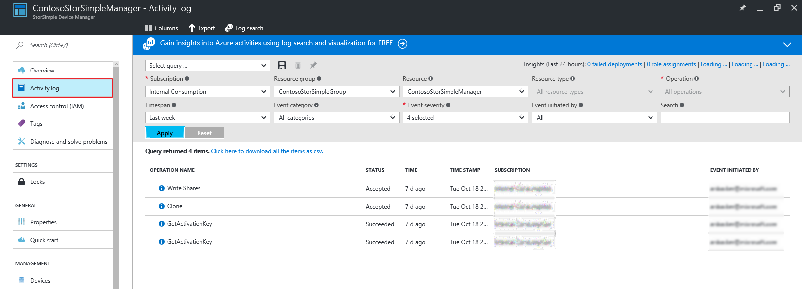

# Use the service summary blade for StorSimple Device Manager connected to StorSimple Virtual Array
## Overview
The service summary blade for the StorSimple Device Manager provides a summary view of the StorSimple Virtual Arrays (also known as StorSimple on-premises virtual devices or virtual devices) that are connected to your service, highlighting those that need a system administrator's attention. This tutorial introduces the service summary blade, explains the content and function, and describes the tasks that you can perform from this blade.

## Management commands and essentials
In the StorSimple summary blade, you see the options for managing your StorSimple Device Manager service as well as the virtual arrays registered to this service. You see the management commands across the top of the blade and on the left side.

Use these options to perform various operations such as add shares or volumes, or monitor the various jobs running on the virtual arrays.

The essentials area captures some of the important properties such as, the resource group, location, and subscription in which your StorSimple Device Manager was created.

## StorSimple Device Manager service summary
* The **Alerts** tile provides a snapshot of all the active alerts across all virtual devices, grouped by alert severity. Clicking the tile opens the **Alerts** blade, where you can click an individual alert to view additional details about that alert, including any recommended actions. You can also clear the alert if the issue has been resolved.
* The **Capacity** tile displays shows the primary storage that is provisioned and remaining across all virtual devices relative to the total storage available across all virtual devices. **Provisioned** refers to the amount of storage that is prepared and allocated for use, **Remaining** refers to the remaining capacity that can be provisioned across all virtual devices. The **Remaining Tiered** capacity is the available capacity that can be provisioned including cloud, while the **Remaining Local** is the capacity remaining on the disks attached to the virtual arrays.
* In the **Usage** chart, you can see the relevant metrics for your virtual devices. You can view the primary storage used across all virtual devices, as well as the cloud storage consumed by virtual devices over the past 7 days, the default time period. Use the **Edit** option in the top-right corner of the chart to choose a different time scale.
* The **Devices** tile provides a summary of the number of virtual arrays in your StorSimple Device Manager grouped by device status. Click this tile to open the **Devices** list blade and then click an individual device to drill into the device summary specific to the device. You can also perform device specific actions from a given device summary blade. For more information about the device summary blade, go to [Device summary blade](storsimple-virtual-array-device-summary.md).

## View the activity logs
To view the various operations carried out within your StorSimple Device Manager, click the **Activity logs** link on the left side of your StorSimple service summary blade. This takes you to the **Activity logs** blade, where you can see a summary of the recent operations carried out.

## Next steps
Learn how to [use the local web UI to administer your StorSimple Virtual Array](storsimple-ova-web-ui-admin.md).

