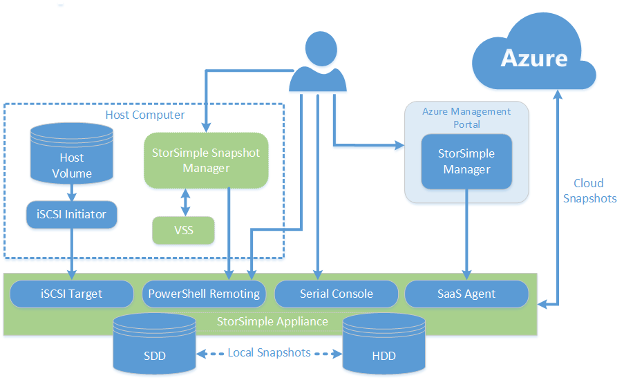
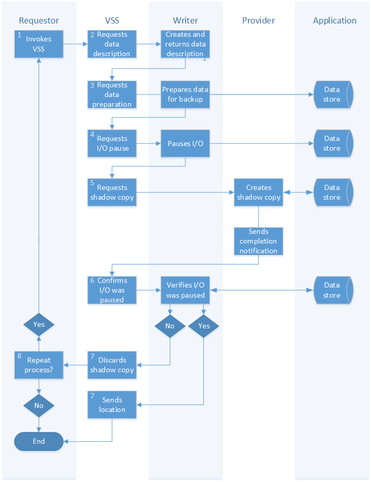

# An introduction to StorSimple Snapshot Manager

## Overview
StorSimple Snapshot Manager is a Microsoft Management Console (MMC) snap-in that simplifies data protection and backup management in a Microsoft Azure StorSimple environment. With StorSimple Snapshot Manager, you can manage Microsoft Azure StorSimple data in the data center and in the cloud as a single integrated storage solution, thus simplifying backup processes and reducing costs.

This overview introduces the StorSimple Snapshot Manager, describes its features, and explains its role in Microsoft Azure StorSimple. 

For an overview of the entire Microsoft Azure StorSimple system, including the StorSimple device, StorSimple Manager service, StorSimple Snapshot Manager, and StorSimple Adapter for SharePoint, see [StorSimple 8000 series: a hybrid cloud storage solution](storsimple-overview.md). 

> [!NOTE]
> * You cannot use StorSimple Snapshot Manager to manage Microsoft Azure StorSimple Virtual Arrays (also known as StorSimple on-premises virtual devices).
> * If you plan to install StorSimple Update 2 on your StorSimple device, be sure to download the latest version of StorSimple Snapshot Manager and install it **before you install StorSimple Update 2**. The latest version of StorSimple Snapshot Manager is backward compatible and works with all released versions of Microsoft Azure StorSimple. If you are using the previous version of StorSimple Snapshot Manager, you will need to update it (you do not need to uninstall the previous version before you install the new version).
> 
> 

## StorSimple Snapshot Manager purpose and architecture
StorSimple Snapshot Manager provides a central management console that you can use to create consistent, point-in-time backup copies of local and cloud data. For example, you can use the console to:

* Configure, back up, and delete volumes.
* Configure volume groups to ensure that backed up data is application-consistent.
* Manage backup policies so that data is backed up on a predetermined schedule.
* Create local and cloud snapshots, which can be stored in the cloud and used for disaster recovery.

The StorSimple Snapshot Manager fetches the list of applications registered with the VSS provider on the host. Then, to create application-consistent backups, it checks the volumes used by an application and suggests volume groups to configure. StorSimple Snapshot Manager uses these volume groups to generate backup copies that are application-consistent. (Application consistency exists when all related files and databases are synchronized and represent the true state of the application at a specific point in time.) 

StorSimple Snapshot Manager backups take the form of incremental snapshots, which capture only the changes since the last backup. As a result, backups require less storage and can be created and restored quickly. StorSimple Snapshot Manager uses the Windows Volume Shadow Copy Service (VSS) to ensure that snapshots capture application-consistent data. (For more information, go to the Integration with Windows Volume Shadow Copy Service section.) With StorSimple Snapshot Manager, you can create backup schedules or take immediate backups as needed. If you need to restore data from a backup, StorSimple Snapshot Manager lets you select from a catalog of local or cloud snapshots. Azure StorSimple restores only the data that is needed as it is needed, which prevents delays in data availability during restore operations.)

**StorSimple Snapshot Manager architecture** 

## Support for multiple volume types
You can use the StorSimple Snapshot Manager to configure and back up the following types of volumes: 

* **Basic volumes** – A basic volume is a single partition on a basic disk. 
* **Simple volumes** – A simple volume is a dynamic volume that contains disk space from a single dynamic disk. A simple volume consists of a single region on a disk or multiple regions that are linked together on the same disk. (You can create simple volumes only on dynamic disks.) Simple volumes are not fault tolerant.
* **Dynamic volumes** – A dynamic volume is a volume created on a dynamic disk. Dynamic disks use a database to track information about volumes that are contained on dynamic disks in a computer. 
* **Dynamic volumes with mirroring** – Dynamic volumes with mirroring are built on the RAID 1 architecture. With RAID 1, identical data is written on two or more disk, producing a mirrored set. A read request can then be handled by any disk that contains the requested data.
* **Cluster-shared volumes** – With cluster-shared volumes (CSVs), multiple nodes in a failover cluster can simultaneously read or write to the same disk. Failover from one node to another node can occur quickly, without requiring a change in drive ownership or mounting, dismounting, and removing a volume. 

> [!IMPORTANT]
> Do not mix CSVs and non-CSVs in the same snapshot. Mixing CSVs and non-CSVs in a snapshot is not supported. 
> 
> 

You can use StorSimple Snapshot Manager to restore entire volume groups or clone individual volumes and recover individual files.

* [Volumes and volume groups](#volumes-and-volume-groups) 
* [Backup types and backup policies](#backup-types-and-backup-policies) 

For more information about StorSimple Snapshot Manager features and how to use them, see [StorSimple Snapshot Manager user interface](storsimple-use-snapshot-manager.md).

## Volumes and volume groups
With StorSimple Snapshot Manager, you create volumes and then configure them into volume groups. 

StorSimple Snapshot Manager uses volume groups to create backup copies that are application-consistent. Application consistency exists when all related files and databases are synchronized and represent the true state of an application at a specific point in time. Volume groups (which are also known as *consistency groups*) form the basis of a backup or restore job.

Volume groups are not the same as volume containers. A volume container contains one or more volumes that share a cloud storage account and other attributes, such as encryption and bandwidth consumption. A single volume container can contain up to 256 thinly provisioned StorSimple volumes. For more information about volume containers, go to [Manage your volume containers](storsimple-manage-volume-containers.md). Volume groups are collections of volumes that you configure to facilitate backup operations. If you select two volumes that belong to different volume containers, place them in a single volume group, and then create a backup policy for that volume group, each volume will be backed up in the appropriate volume container, using the appropriate storage account.

> [!NOTE]
> All volumes in a volume group must come from a single cloud service provider.
> 
> 

## Integration with Windows Volume Shadow Copy Service
StorSimple Snapshot Manager uses the Windows Volume Shadow Copy Service (VSS) to capture application-consistent data. VSS facilitates application consistency by communicating with VSS-aware applications to coordinate the creation of incremental snapshots. VSS ensures that the applications are temporarily inactive, or quiescent, when snapshots are taken. 

The StorSimple Snapshot Manager implementation of VSS works with SQL Server and generic NTFS volumes. The process is as follows: 

1. A requestor, which is typically a data management and protection solution (such as StorSimple Snapshot Manager) or a backup application, invokes VSS and asks it to gather information from the writer software in the target application.
2. VSS contacts the writer component to retrieve a description of the data. The writer returns the description of the data to be backed up. 
3. VSS signals the writer to prepare the application for backup. The writer prepares the data for backup by completing open transactions, updating transaction logs, and so on, and then notifies VSS.
4. VSS instructs the writer to temporarily stop the application's data stores and make sure that no data is written to the volume while the shadow copy is created. This step ensures data consistency, and takes no more than 60 seconds.
5. VSS instructs the provider to create the shadow copy. Providers, which can be software- or hardware-based, manage the volumes that are currently running and create shadow copies of them on demand. The provider creates the shadow copy, and notifies VSS when it is completed.
6. VSS contacts the writer to notify the application that I/O can resume and also to confirm that I/O was paused successfully during shadow copy creation. 
7. If the copy was successful, VSS returns the copy's location to the requestor. 
8. If data was written while the shadow copy was created, then the backup will be inconsistent. VSS deletes the shadow copy and notifies the requestor. The requestor can either repeat the backup process automatically or notify the administrator to retry it at a later time.

See the following illustration.

**Windows Volume Shadow Copy Service process** 

## Backup types and backup policies
With StorSimple Snapshot Manager, you can back up data and store it locally and in the cloud. You can use StorSimple Snapshot Manager to back up data immediately, or you can use a backup policy to create a schedule for taking backups automatically. Backup policies also enable you to specify how many snapshots will be retained. 

### Backup types
You can use StorSimple Snapshot Manager to create the following types of backups:

* **Local snapshots** – Local snapshots are point-in-time copies of volume data that are stored on the StorSimple device. Typically, this type of backup can be created and restored quickly. You can use a local snapshot as you would a local backup copy.
* **Cloud snapshots** – Cloud snapshots are point-in-time copies of volume data that are stored in the cloud. A cloud snapshot is equivalent to a snapshot replicated on a different, off-site storage system. Cloud snapshots are particularly useful in disaster recovery scenarios.

### On-demand and scheduled backups
With StorSimple Snapshot Manager, you can initiate a one-time backup to be created immediately, or you can use a backup policy to schedule recurring backup operations.

A backup policy is a set of automated rules that you can use to schedule regular backups. A backup policy allows you to define the frequency and parameters for taking snapshots of a specific volume group. You can use policies to specify start and expiration dates, times, frequencies, and retention requirements, for both local and cloud snapshots. A policy is applied immediately after you define it. 

You can use StorSimple Snapshot Manager to configure or reconfigure backup policies whenever necessary. 

You configure the following information for each backup policy that you create:

* **Name** – The unique name of the selected backup policy.
* **Type** – The type of backup policy; either local snapshot or cloud snapshot.
* **Volume group** – The volume group to which the selected backup policy is assigned.
* **Retention** – The number of backup copies to retain. If you check the **All** box, all backup copies are retained until the maximum number of backup copies per volume is reached, at which point the policy will fail and generate an error message. Alternatively, you can specify a number of backups to retain (between 1 and 64).
* **Date** – The date when the backup policy was created.

For information about configuring backup policies, go to [Use StorSimple Snapshot Manager to create and manage backup policies](storsimple-snapshot-manager-manage-backup-policies.md).

### Backup job monitoring and management
You can use the StorSimple Snapshot Manager to monitor and manage upcoming, scheduled, and completed backup jobs. Additionally, StorSimple Snapshot Manager provides a catalog of up to 64 completed backups. You can use the catalog to find and restore volumes or individual files. 

For information about monitoring backup jobs, go to [Use StorSimple Snapshot Manager to view and manage backup jobs](storsimple-snapshot-manager-manage-backup-jobs.md).

## Next steps
* Learn more about [using StorSimple Snapshot Manager to administer your StorSimple solution](storsimple-snapshot-manager-admin.md).
* Download [StorSimple Snapshot Manager](https://www.microsoft.com/download/details.aspx?id=44220).

