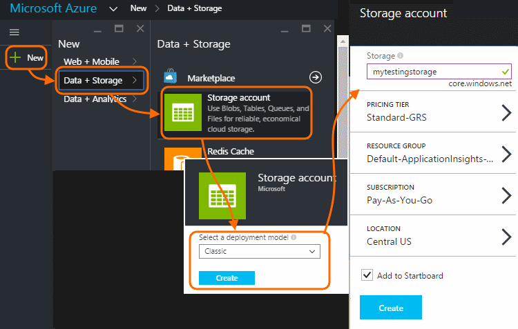
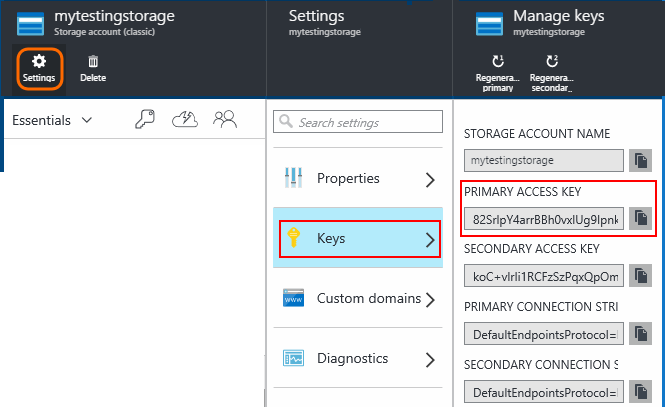
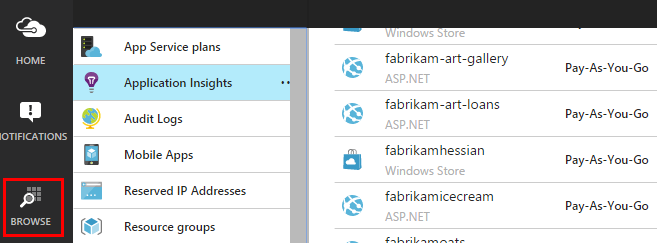
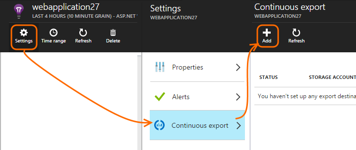
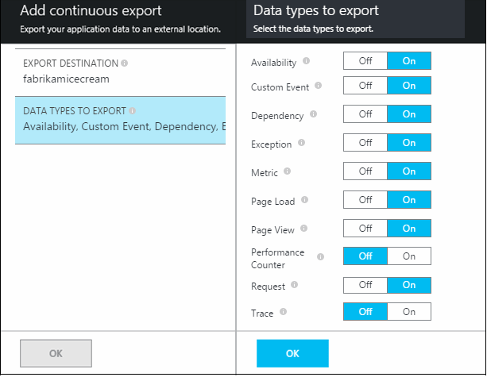
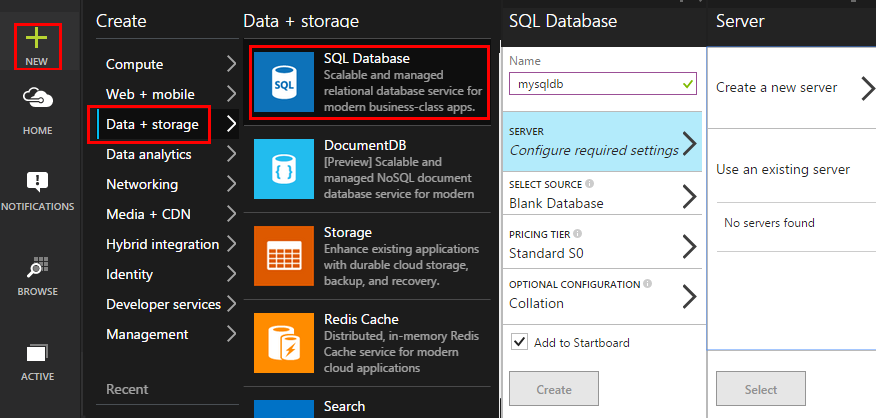
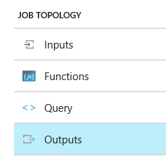
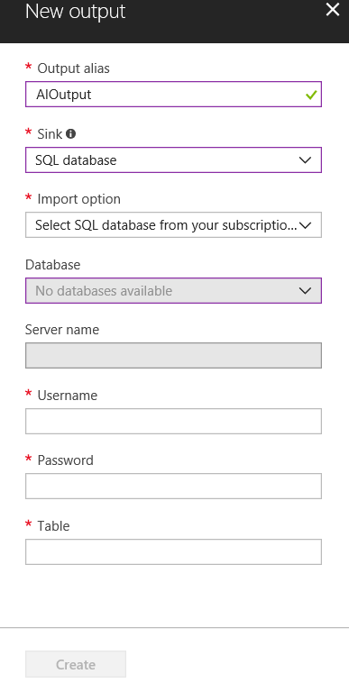

# Walkthrough: Export to SQL from Application Insights using Stream Analytics
This article shows how to move your telemetry data from [Azure Application Insights][start] into Azure SQL Database by using [Continuous Export][export] and [Azure Stream Analytics](https://azure.microsoft.com/services/stream-analytics/). 

Continuous export moves your telemetry data into Azure Storage in JSON format. We'll parse the JSON objects using Azure Stream Analytics and create rows in a database table.

(More generally, Continuous Export is the way to do your own analysis of the telemetry your apps send to Application Insights. You could adapt this code sample to do other things with the exported telemetry, such as aggregation of data.)

We'll start with the assumption that you already have the app you want to monitor.

In this example, we will be using the page view data, but the same pattern can easily be extended to other data types such as custom events and exceptions. 

> [!IMPORTANT]
> Continuous export will be deprecated on February 29, 2024 and is only supported for classic Application Insights resources. Azure Stream Analytics does not support reading from AppInsights with diagnostic settings.

## Add Application Insights to your application 
To get started:

1. [Set up Application Insights for your web pages](../azure-monitor/app/javascript.md). 
   
    (In this example, we'll focus on processing page view data from the client browsers, but you could also set up Application Insights for the server side of your [Java](../azure-monitor/app/opentelemetry-enable.md?tabs=java) or [ASP.NET](../azure-monitor/app/asp-net.md) app and process request, dependency and other server telemetry.)
2. Publish your app, and watch telemetry data appearing in your Application Insights resource.

## Create storage in Azure
Continuous export always outputs data to an Azure Storage account, so you need to create the storage first.

1. Create a storage account in your subscription in the [Azure portal](https://portal.azure.com).
   
    
2. Create a container
   
    
3. Copy the storage access key
   
    You'll need it soon to set up the input to the stream analytics service.
   
    

## Start continuous export to Azure storage
1. In the Azure portal, browse to the Application Insights resource you created for your application.
   
    
2. Create a continuous export.
   
    

    Select the storage account you created earlier:

    

    Set the event types you want to see:

    


1. Let some data accumulate. Sit back and let people use your application for a while. Telemetry will come in and you'll see statistical charts in [metric explorer](../azure-monitor/essentials/metrics-charts.md) and individual events in [diagnostic search](../azure-monitor/app/search-and-transaction-diagnostics.md?tabs=transaction-search). 
   
    And also, the data will export to your storage. 
2. Inspect the exported data, either in the portal - choose **Browse**, select your storage account, and then **Containers** - or in Visual Studio. In Visual Studio, choose **View / Cloud Explorer**, and open Azure / Storage. (If you don't have this menu option, you need to install the Azure SDK: Open the New Project dialog and open Visual C# / Cloud / Get Microsoft Azure SDK for .NET.)
   
    
   
    Make a note of the common part of the path name, which is derived from the application name and instrumentation key. 

The events are written to blob files in JSON format. Each file may contain one or more events. So we'd like to read the event data and filter out the fields we want. There are all kinds of things we could do with the data, but our plan today is to use Stream Analytics to move the data to SQL Database. That will make it easy to run lots of interesting queries.

## Create an Azure SQL Database
Once again starting from your subscription in [Azure portal](https://portal.azure.com), create the database (and a new server, unless you've already got one) to which you'll write the data.



Make sure that the server allows access to Azure services:


## Create a table in Azure SQL Database
Connect to the database created in the previous section with your preferred management tool. In this walkthrough, we will be using [SQL Server Management Tools](/sql/ssms/sql-server-management-studio-ssms) (SSMS).


Create a new query, and execute the following T-SQL:

```SQL

CREATE TABLE [dbo].[PageViewsTable](
    [pageName] [nvarchar](max) NOT NULL,
    [viewCount] [int] NOT NULL,
    [url] [nvarchar](max) NULL,
    [urlDataPort] [int] NULL,
    [urlDataprotocol] [nvarchar](50) NULL,
    [urlDataHost] [nvarchar](50) NULL,
    [urlDataBase] [nvarchar](50) NULL,
    [urlDataHashTag] [nvarchar](max) NULL,
    [eventTime] [datetime] NOT NULL,
    [isSynthetic] [nvarchar](50) NULL,
    [deviceId] [nvarchar](50) NULL,
    [deviceType] [nvarchar](50) NULL,
    [os] [nvarchar](50) NULL,
    [osVersion] [nvarchar](50) NULL,
    [locale] [nvarchar](50) NULL,
    [userAgent] [nvarchar](max) NULL,
    [browser] [nvarchar](50) NULL,
    [browserVersion] [nvarchar](50) NULL,
    [screenResolution] [nvarchar](50) NULL,
    [sessionId] [nvarchar](max) NULL,
    [sessionIsFirst] [nvarchar](50) NULL,
    [clientIp] [nvarchar](50) NULL,
    [continent] [nvarchar](50) NULL,
    [country] [nvarchar](50) NULL,
    [province] [nvarchar](50) NULL,
    [city] [nvarchar](50) NULL
)

CREATE CLUSTERED INDEX [pvTblIdx] ON [dbo].[PageViewsTable]
(
    [eventTime] ASC
)WITH (PAD_INDEX = OFF, STATISTICS_NORECOMPUTE = OFF, SORT_IN_TEMPDB = OFF, DROP_EXISTING = OFF, ONLINE = OFF, ALLOW_ROW_LOCKS = ON, ALLOW_PAGE_LOCKS = ON)

```


In this sample, we are using data from page views. To see the other data available, inspect your JSON output, and see the [export data model](/previous-versions/azure/azure-monitor/app/export-telemetry#application-insights-export-data-model).

## Create an Azure Stream Analytics instance
From the [Azure portal](https://portal.azure.com/), select the Azure Stream Analytics service, and create a new Stream Analytics job:


When the new job is created, select **Go to resource**.


#### Add a new input


Set it to take input from your Continuous Export blob:


Now you'll need the Primary Access Key from your Storage Account, which you noted earlier. Set this as the Storage Account Key.

#### Set path prefix pattern

**Be sure to set the Date Format to YYYY-MM-DD (with dashes).**

The Path Prefix Pattern specifies how Stream Analytics finds the input files in the storage. You need to set it to correspond to how Continuous Export stores the data. Set it like this:

```sql
webapplication27_12345678123412341234123456789abcdef0/PageViews/{date}/{time}
```

In this example:

* `webapplication27` is the name of the Application Insights resource, **all in lower case**. 
* `1234...` is the instrumentation key of the Application Insights resource **with dashes removed**. 
* `PageViews` is the type of data we want to analyze. The available types depend on the filter you set in Continuous Export. Examine the exported data to see the other available types, and see the [export data model](/previous-versions/azure/azure-monitor/app/export-telemetry#application-insights-export-data-model).
* `/{date}/{time}` is a pattern written literally.

To get the name and iKey of your Application Insights resource, open Essentials on its overview page, or open Settings.

> [!TIP]
> Use the Sample function to check that you have set the input path correctly. If it fails: Check that there is data in the storage for the sample time range you chose. Edit the input definition and check you set the storage account, path prefix and date format correctly.

 
## Set query
Open the query section:

Replace the default query with:

```SQL

    SELECT flat.ArrayValue.name as pageName
    , flat.ArrayValue.count as viewCount
    , flat.ArrayValue.url as url
    , flat.ArrayValue.urlData.port as urlDataPort
    , flat.ArrayValue.urlData.protocol as urlDataprotocol
    , flat.ArrayValue.urlData.host as urlDataHost
    , flat.ArrayValue.urlData.base as urlDataBase
    , flat.ArrayValue.urlData.hashTag as urlDataHashTag
      ,A.context.data.eventTime as eventTime
      ,A.context.data.isSynthetic as isSynthetic
      ,A.context.device.id as deviceId
      ,A.context.device.type as deviceType
      ,A.context.device.os as os
      ,A.context.device.osVersion as osVersion
      ,A.context.device.locale as locale
      ,A.context.device.userAgent as userAgent
      ,A.context.device.browser as browser
      ,A.context.device.browserVersion as browserVersion
      ,A.context.device.screenResolution.value as screenResolution
      ,A.context.session.id as sessionId
      ,A.context.session.isFirst as sessionIsFirst
      ,A.context.location.clientip as clientIp
      ,A.context.location.continent as continent
      ,A.context.location.country as country
      ,A.context.location.province as province
      ,A.context.location.city as city
    INTO
      AIOutput
    FROM AIinput A
    CROSS APPLY GetElements(A.[view]) as flat


```

Notice that the first few properties are specific to page view data. Exports of other telemetry types will have different properties. See the [detailed data model reference for the property types and values.](/previous-versions/azure/azure-monitor/app/export-telemetry#application-insights-export-data-model)

## Set up output to database
Select SQL as the output.



Specify the database.



Close the wizard and wait for a notification that the output has been set up.

## Start processing
Start the job from the action bar:


You can choose whether to start processing the data starting from now, or to start with earlier data. The latter is useful if you have had Continuous Export already running for a while.

After a few minutes, go back to SQL Server Management Tools and watch the data flowing in. For example, use a query like this:

```sql
SELECT TOP 100 *
FROM [dbo].[PageViewsTable]
```

## Next steps
* [detailed data model reference for the property types and values.](/previous-versions/azure/azure-monitor/app/export-telemetry#application-insights-export-data-model)
* [Continuous Export in Application Insights](/previous-versions/azure/azure-monitor/app/export-telemetry)

<!--Link references-->

[diagnostic]: ../azure-monitor/app/search-and-transaction-diagnostics.md?tabs=transaction-search
[export]: /previous-versions/azure/azure-monitor/app/export-telemetry
[metrics]: ../azure-monitor/essentials/metrics-charts.md
[start]: ../azure-monitor/app/app-insights-overview.md
