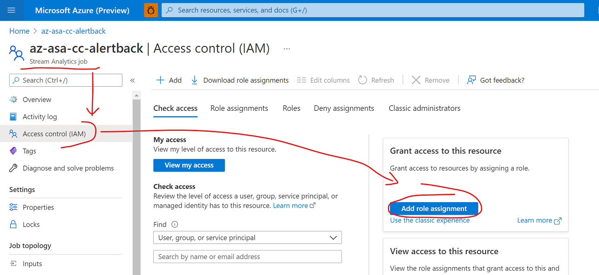
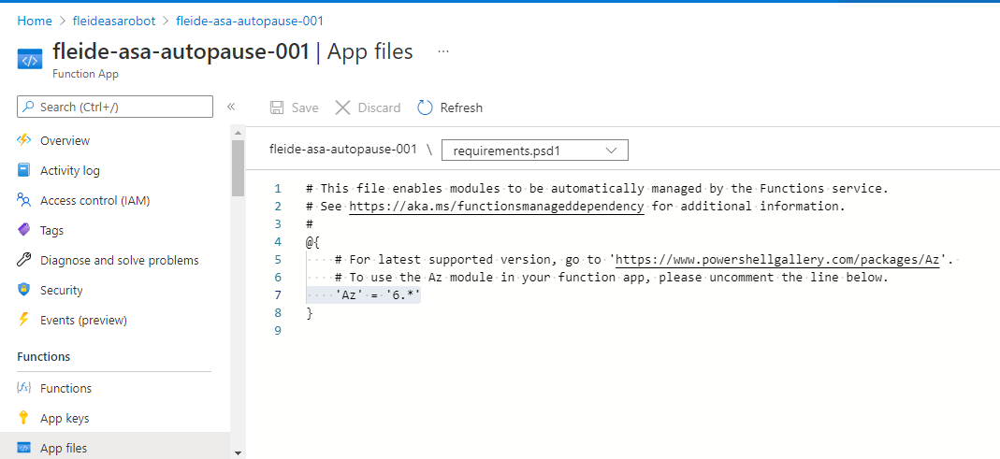
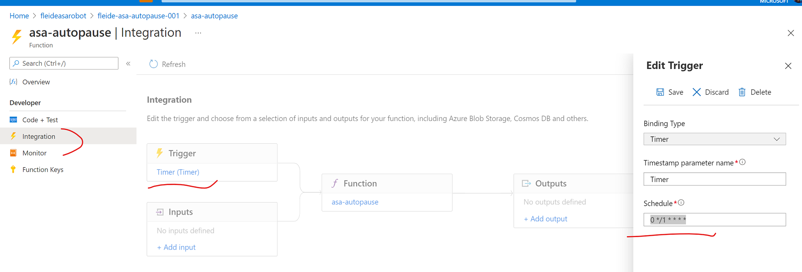
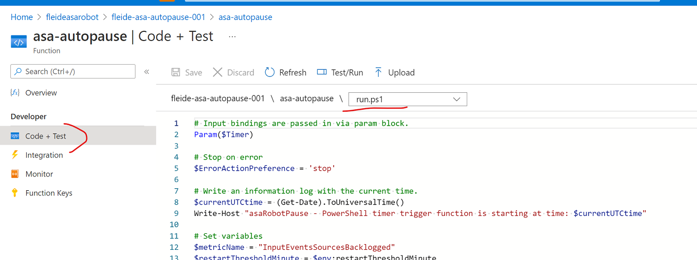
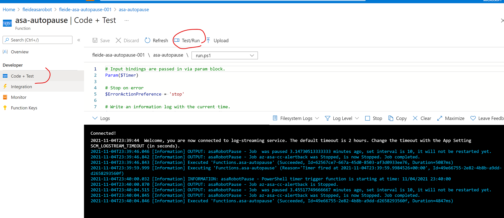
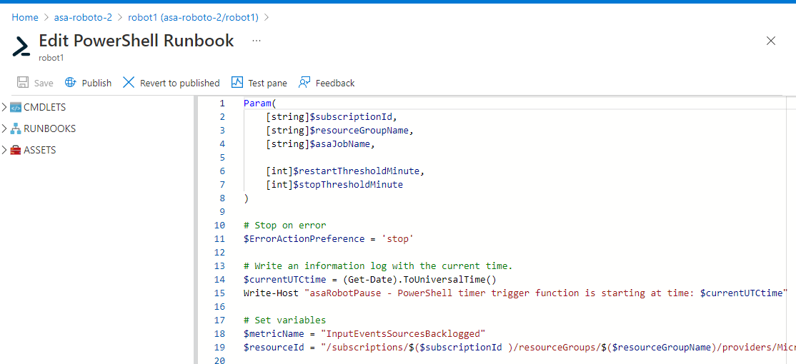
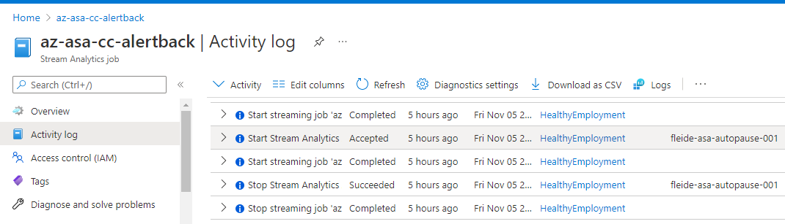
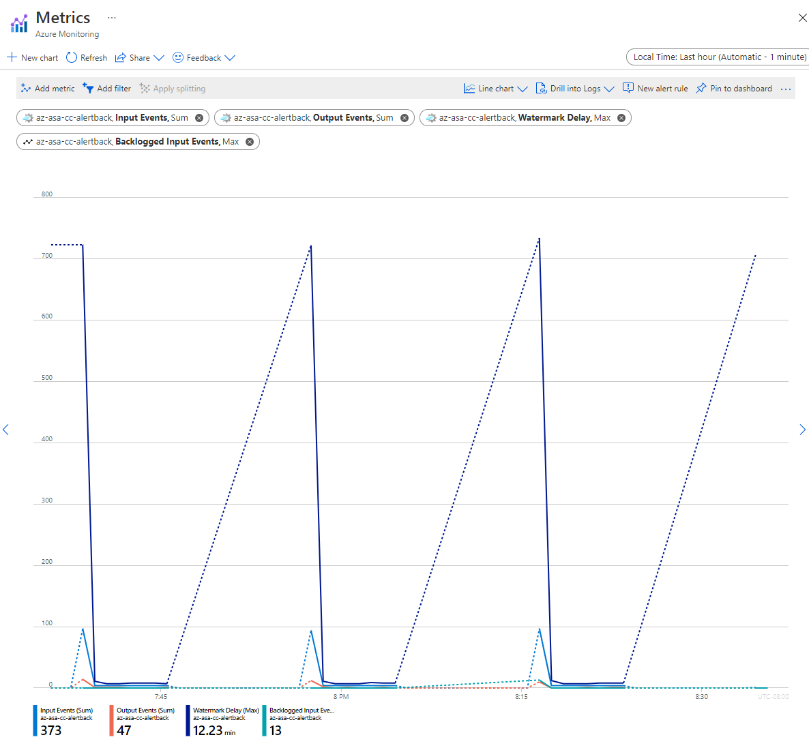

# Auto-pause a job with PowerShell and Azure Functions or Azure Automation

Some applications require a stream processing approach, made easy with [Azure Stream Analytics](./stream-analytics-introduction.md) (ASA), but don't strictly need to run continuously. The reasons are various:

- Input data arriving on a schedule (top of the hour...)
- A sparse or low volume of incoming data (few records per minute)
- Business processes that benefit from time-windowing capabilities, but are running in batch by essence (Finance or HR...)
- Demonstrations, prototypes, or tests that involve **long running jobs at low scale**

The benefit of not running these jobs continuously will be **cost savings**, as Stream Analytics jobs are [billed](https://azure.microsoft.com/pricing/details/stream-analytics/) per Streaming Unit **over time.**

This article will explain how to set up auto-pause for an Azure Stream Analytics job. In it, we configure a task that automatically pauses and resumes a job on a schedule. If we're using the term **pause**, the actual job [state](./job-states.md) is **stopped**, as to avoid any billing.

We'll discuss the overall design first, then go through the required components, and finally discuss some implementation details.

> [!NOTE]
> There are downsides to auto-pausing a job. The main ones being the loss of the low latency / real time capabilities, and the potential risks from allowing the input event backlog to grow unsupervised while a job is paused. Auto-pausing should not be considered for most production scenarios running at scale

## Design

For this example, we want our job to run for N minutes, before pausing it for M minutes. When the job is paused, the input data won't be consumed, accumulating upstream. After the job is started, it will catch-up with that backlog, process the data trickling in, before being shut down again.


When running, the task shouldn't stop the job until its metrics are healthy. The metrics of interest will be the input backlog and the [watermark](./stream-analytics-time-handling.md#background-time-concepts). We'll check that both are at their baseline for at least N minutes. This behavior translates to two actions:

- A stopped job is restarted after M minutes
- A running job is stopped anytime after N minutes, as soon as its backlog and watermark metrics are healthy


As an example, let's consider N = 5 minutes, and M = 10 minutes. With these settings, a job has at least 5 minutes to process all the data received in 15. Potential cost savings are up to 66%.

To restart the job, we'll use the `When Last Stopped` [start option](./start-job.md#start-options). This option tells ASA to process all the events that were backlogged upstream since the job was stopped. There are two caveats in this situation. First, the job can't stay stopped longer than the retention period of the input stream. If we only run the job once a day, we need to make sure that the [event hub retention period](/azure/event-hubs/event-hubs-faq#what-is-the-maximum-retention-period-for-events-) is more than one day. Second, the job needs to have been started at least once for the mode `When Last Stopped` to be accepted (else it has literally never been stopped before). So the first run of a job needs to be manual, or we would need to extend the script to cover for that case.

The last consideration is to make these actions idempotent. This way, they can be repeated at will with no side effects, for both ease of use and resiliency.

## Components

### API calls

We anticipate the need to interact with ASA on the following **aspects**:

- **Get the current job status** (*ASA Resource Management*)
  - If running
    - **Get the time since started** (*Logs*)
    - **Get the current metric values** (*Metrics*)
    - If applicable, **stop the job** (*ASA Resource Management*)
  - If stopped
    - **Get the time since stopped** (*Logs*)
    - If applicable, **start the job** (*ASA Resource Management*)

For *ASA Resource Management*, we can use either the [REST API](/rest/api/streamanalytics/), the [.NET SDK](/dotnet/api/microsoft.azure.management.streamanalytics) or one of the CLI libraries ([Az CLI](/cli/azure/stream-analytics), [PowerShell](/powershell/module/az.streamanalytics)).

For *Metrics* and *Logs*, in Azure everything is centralized under [Azure Monitor](../azure-monitor/overview.md), with a similar choice of API surfaces. We have to remember that logs and metrics are always 1 to 3 minutes behind when querying the APIs. So setting N at 5 usually means the job will be running 6 to 8 minutes in reality. Another thing to consider is that metrics are always emitted. When the job is stopped, the API returns empty records. We'll have to clean up the output of our API calls to only look at relevant values.

### Scripting language

For this article, we decided to implement auto-pause in **PowerShell**. The first reason is that [PowerShell](/powershell/scripting/overview) is now cross-platform. It can run on any OS, which makes deployments easier. The second reason is that it takes and returns objects rather than strings. Objects make parsing and processing easy for automation tasks.

In PowerShell, we'll use the [Az PowerShell](/powershell/azure/new-azureps-module-az) module, which embarks [Az.Monitor](/powershell/module/az.monitor/) and [Az.StreamAnalytics](/powershell/module/az.streamanalytics/), for everything we need:

- [Get-AzStreamAnalyticsJob](/powershell/module/az.streamanalytics/get-azstreamanalyticsjob) for the current job status
- [Start-AzStreamAnalyticsJob](/powershell/module/az.streamanalytics/start-azstreamanalyticsjob) / [Stop-AzStreamAnalyticsJob](/powershell/module/az.streamanalytics/stop-azstreamanalyticsjob)
- [Get-AzMetric](/powershell/module/az.monitor/get-azmetric) with `InputEventsSourcesBacklogged` [(from ASA metrics)](../azure-monitor/essentials/metrics-supported.md#microsoftstreamanalyticsstreamingjobs)
- [Get-AzActivityLog](/powershell/module/az.monitor/get-azactivitylog) for event names beginning with `Stop Job`

### Hosting service

To host our PowerShell task, we'll need a service that offers scheduled runs. There are lots of options, but looking at serverless ones:

- [Azure Functions](../azure-functions/functions-overview.md), a serverless compute engine that can run almost any piece of code. Functions offer a [timer trigger](../azure-functions/functions-bindings-timer.md?tabs=csharp) that can run up to every second
- [Azure Automation](../automation/overview.md), a managed service built for operating cloud workloads and resources. Which fits the bill, but whose minimal schedule interval is 1 hour (less with [workarounds](../automation/shared-resources/schedules.md#schedule-runbooks-to-run-more-frequently)).

If we don't mind the workaround, Azure Automation is the easier way to deploy the task. But to be able to compare, in this article we'll be writing a local script first. Once we have a functioning script, we'll deploy it both in Functions and in an Automation Account.

### Developer tools

We highly recommend local development using [VSCode](https://code.visualstudio.com/), both for [Functions](../azure-functions/create-first-function-vs-code-powershell.md) and [ASA](./quick-create-visual-studio-code.md). Using a local IDE allows us to use source control and to easily repeat deployments. But for the sake of brevity, here we'll illustrate the process in the [Azure portal](https://portal.azure.com).

## Writing the PowerShell script locally

The best way to develop the script is locally. PowerShell being cross-platform, the script can be written and tested on any OS. On Windows we can use [Windows Terminal](https://www.microsoft.com/p/windows-terminal/9n0dx20hk701) with [PowerShell 7](/powershell/scripting/install/installing-powershell-on-windows), and [Az PowerShell](/powershell/azure/install-azure-powershell).

The final script that will be used is available for [Functions](https://github.com/Azure/azure-stream-analytics/blob/master/Samples/Automation/Auto-pause/run.ps1) (and [Azure Automation](https://github.com/Azure/azure-stream-analytics/blob/master/Samples/Automation/Auto-pause/runbook.ps1)). It's different than the one explained below, having been wired to the hosting environment (Functions or Automation). We'll discuss that aspect later. First, let's step through a version of it that only **runs locally**.

This script is purposefully written in a simple form, so it can be understood by all.

At the top, we set the required parameters, and check the initial job status:

```PowerShell

# Setting variables
$restartThresholdMinute = 10 # This is M
$stopThresholdMinute = 5 # This is N

$maxInputBacklog = 0 # The amount of backlog we tolerate when stopping the job (in event count, 0 is a good starting point)
$maxWatermark = 10 # The amount of watermark we tolerate when stopping the job (in seconds, 10 is a good starting point at low SUs)

$subscriptionId = "<Replace with your Subscription Id - not the name>"
$resourceGroupName = "<Replace with your Resource Group Name>"
$asaJobName = "<Replace with your ASA job name>"

$resourceId = "/subscriptions/$($subscriptionId )/resourceGroups/$($resourceGroupName )/providers/Microsoft.StreamAnalytics/streamingjobs/$($asaJobName)"

# If not already logged, uncomment and run the 2 following commands
# Connect-AzAccount
# Set-AzContext -SubscriptionId $subscriptionId

# Check current ASA job status
$currentJobState = Get-AzStreamAnalyticsJob  -ResourceGroupName $resourceGroupName -Name $asaJobName | Foreach-Object {$_.JobState}
Write-Output "asaRobotPause - Job $($asaJobName) is $($currentJobState)."

```

Then if the job is running, we check if the job has been running at least N minutes, its backlog, and its watermark.

```PowerShell

# Switch state
if ($currentJobState -eq "Running")
{
    # First we look up the job start time with Get-AzActivityLog
    ## Get-AzActivityLog issues warnings about deprecation coming in future releases, here we ignore them via -WarningAction Ignore
    ## We check in 1000 record of history, to make sure we're not missing what we're looking for. It may need adjustment for a job that has a lot of logging happening.
    ## There is a bug in Get-AzActivityLog that triggers an error when Select-Object First is in the same pipeline (on the same line). We move it down.
    $startTimeStamp = Get-AzActivityLog -ResourceId $resourceId -MaxRecord 1000 -WarningAction Ignore | Where-Object {$_.EventName.Value -like "Start Job*"}
    $startTimeStamp = $startTimeStamp | Select-Object -First 1 | Foreach-Object {$_.EventTimeStamp}

    # Then we gather the current metric values
    ## Get-AzMetric issues warnings about deprecation coming in future releases, here we ignore them via -WarningAction Ignore
    $currentBacklog = Get-AzMetric -ResourceId $resourceId -TimeGrain 00:01:00 -MetricName "InputEventsSourcesBacklogged" -DetailedOutput -WarningAction Ignore
    $currentWatermark = Get-AzMetric -ResourceId $resourceId -TimeGrain 00:01:00 -MetricName "OutputWatermarkDelaySeconds" -DetailedOutput -WarningAction Ignore

    # Metric are always lagging 1-3 minutes behind, so grabbing the last N minutes means checking N+3 actually. This may be overly safe and fined tune down per job.
    $Backlog =  $currentBacklog.Data |
                    Where-Object {$_.Maximum -ge 0} | # We remove the empty records (when the job is stopped or starting)
                    Sort-Object -Property Timestamp -Descending |
                    Where-Object {$_.Timestamp -ge $startTimeStamp} | # We only keep the records of the latest run
                    Select-Object -First $stopThresholdMinute | # We take the last N records
                    Measure-Object -Sum Maximum # We sum over those N records
    $BacklogSum = $Backlog.Sum

    $Watermark = $currentWatermark.Data |
                    Where-Object {$_.Maximum -ge 0} |
                    Sort-Object -Property Timestamp -Descending |
                    Where-Object {$_.Timestamp -ge $startTimeStamp} |
                    Select-Object -First $stopThresholdMinute |
                    Measure-Object -Average Maximum # Here we average
    $WatermarkAvg = [int]$Watermark.Average # Rounding the decimal value casting it to integer

    # Since we called Get-AzMetric with a TimeGrain of a minute, counting the number of records gives us the duration in minutes
    Write-Output "asaRobotPause - Job $($asaJobName) is running since $($startTimeStamp) with a sum of $($BacklogSum) backlogged events, and an average watermark of $($WatermarkAvg) sec, for $($Watermark.Count) minutes."

    # -le for lesser or equal, -ge for greater or equal
    if (
        ($BacklogSum -ge 0) -and ($BacklogSum -le $maxInputBacklog) -and ` # is not null and is under the threshold
        ($WatermarkAvg -ge 0) -and ($WatermarkAvg -le $maxWatermark) -and ` # is not null and is under the threshold
        ($Watermark.Count -ge $stopThresholdMinute) # at least N values
        )
    {
        Write-Output "asaRobotPause - Job $($asaJobName) is stopping..."
        Stop-AzStreamAnalyticsJob -ResourceGroupName $resourceGroupName -Name $asaJobName
    }
    else {
        Write-Output "asaRobotPause - Job $($asaJobName) is not stopping yet, it needs to have less than $($maxInputBacklog) backlogged events and under $($maxWatermark) sec watermark for at least $($stopThresholdMinute) minutes."
    }
}

```

If the job is stopped, we look in the log when was the last "Stop Job" action:

```PowerShell

elseif ($currentJobState -eq "Stopped")
{
    # First we look up the job start time with Get-AzActivityLog
    ## Get-AzActivityLog issues warnings about deprecation coming in future releases, here we ignore them via -WarningAction Ignore
    ## We check in 1000 record of history, to make sure we're not missing what we're looking for. It may need adjustment for a job that has a lot of logging happening.
    ## There is a bug in Get-AzActivityLog that triggers an error when Select-Object First is in the same pipeline (on the same line). We move it down.
    $stopTimeStamp = Get-AzActivityLog -ResourceId $resourceId -MaxRecord 1000 -WarningAction Ignore | Where-Object {$_.EventName.Value -like "Stop Job*"}
    $stopTimeStamp = $stopTimeStamp | Select-Object -First 1 | Foreach-Object {$_.EventTimeStamp}

    # Get-Date returns a local time, we project it to the same time zone (universal) as the result of Get-AzActivityLog that we extracted above
    $minutesSinceStopped = ((Get-Date).ToUniversalTime()- $stopTimeStamp).TotalMinutes

    # -ge for greater or equal
    if ($minutesSinceStopped -ge $restartThresholdMinute)
    {
        Write-Output "asaRobotPause - Job $($jobName) was paused $([int]$minutesSinceStopped) minutes ago, set interval is $($restartThresholdMinute), it is now starting..."
        Start-AzStreamAnalyticsJob -ResourceGroupName $resourceGroupName -Name $asaJobName -OutputStartMode LastOutputEventTime
    }
    else{
        Write-Output "asaRobotPause - Job $($jobName) was paused $([int]$minutesSinceStopped) minutes ago, set interval is $($restartThresholdMinute), it will not be restarted yet."
    }
}
else {
    Write-Output "asaRobotPause - Job $($jobName) is not in a state I can manage: $($currentJobState). Let's wait a bit, but consider helping is that doesn't go away!"
}
```

At the end, we log the job completion:

```PowerShell

# Final ASA job status check
$newJobState = Get-AzStreamAnalyticsJob  -ResourceGroupName $resourceGroupName -Name $asaJobName | Foreach-Object {$_.JobState}
Write-Output "asaRobotPause - Job $($asaJobName) was $($currentJobState), is now $($newJobState). Job completed."

```

## Option 1: Hosting the task in Azure Functions

For reference, the Azure Functions team maintains an exhaustive [PowerShell developer guide](../azure-functions/functions-reference-powershell.md?tabs=portal).

First we'll need a new **Function App**. A Function App is similar to a solution that can host multiple Functions.

The full procedure is [here](../azure-functions/functions-create-function-app-portal.md#create-a-function-app), but the gist is to go in the [Azure portal](https://portal.azure.com), and create a new Function App with:

- Publish: **Code**
- Runtime: **PowerShell Core**
- Version: **7+**

Once it's provisioned, let's start with its overall configuration.

### Managed identity for Azure Functions

The Function needs permissions to start and stop the ASA job. We'll assign these permissions via a [managed identity](../active-directory/managed-identities-azure-resources/overview.md).

The first step is to enable a **system-assigned managed identity** for the Function, following that [procedure](../app-service/overview-managed-identity.md?tabs=ps%2cportal&toc=/azure/azure-functions/toc.json).

Now we can grant the right permissions to that identity on the ASA job we want to auto-pause. For that, in the Portal for the **ASA job** (not the Function one), in **Access control (IAM)**, add a **role assignment** to the role *Contributor* for a member of type *Managed Identity*, selecting the name of the Function above.



In the PowerShell script, we can add a check that ensures the managed identity is set properly (the final script is available [here](https://github.com/Azure/azure-stream-analytics/blob/master/Samples/Automation/Auto-pause/run.ps1))

```PowerShell

# Check if managed identity has been enabled and granted access to a subscription, resource group, or resource
$AzContext = Get-AzContext -ErrorAction SilentlyContinue
if (-not $AzContext.Subscription.Id)
{
    Throw ("Managed identity is not enabled for this app or it has not been granted access to any Azure resources. Please see /azure/app-service/overview-managed-identity for additional details.")
}

```

We'll also add some logging info to make sure the Function is firing up:

```PowerShell

$currentUTCtime = (Get-Date).ToUniversalTime()

# Write an information log with the current time.
Write-Host "asaRobotPause - PowerShell timer trigger function is starting at time: $currentUTCtime"

```

### Parameters for Azure Functions

The best way to pass our parameters to the script in Functions is to use the Function App application settings as [environment variables](../azure-functions/functions-reference-powershell.md?tabs=portal#environment-variables).

To do so, the first step is in the Function App page, to define our parameters as **App Settings** following that [procedure](../azure-functions/functions-how-to-use-azure-function-app-settings.md?tabs=portal#settings). We'll need:

|Name|Value|
|-|-|
|maxInputBacklog|The amount of backlog we tolerate when stopping the job (in event count, 0 is a good starting point)|
|maxWatermark|The amount of watermark we tolerate when stopping the job (in seconds, 10 is a good starting point at low SUs)|
|restartThresholdMinute|M: the time (in minutes) until a stopped job is restarted|
|stopThresholdMinute|N: the time (in minutes) of cool down until a running job is stopped. The input backlog will need to stay at 0 during that time|
|subscriptionId|The SubscriptionId (not the name) of the ASA job to be auto-paused|
|resourceGroupName|The Resource Group Name of the ASA job to be auto-paused|
|asaJobName|The Name of the ASA job to be aut-paused|

We'll later need to update our PowerShell script to load the variables accordingly:

```PowerShell
$maxInputBacklog = $env:maxInputBacklog
$maxWatermark = $env:maxWatermark

$restartThresholdMinute = $env:restartThresholdMinute
$stopThresholdMinute = $env:stopThresholdMinute

$subscriptionId = $env:subscriptionId
$resourceGroupName = $env:resourceGroupName
$asaJobName = $env:asaJobName

```

### PowerShell module requirements

The same way we had to install Az PowerShell locally to use the ASA commands (like `Start-AzStreamAnalyticsJob`), we'll need to [add it to the Function App host](../azure-functions/functions-reference-powershell.md?tabs=portal#dependency-management).

To do that, we can go in `Functions` > `App files` of the Function App page, select `requirements.psd1`, and uncomment the line `'Az' = '6.*'`. For that change to take effect, the whole app will need to be restarted.



### Creating the function

Once all that configuration is done, we can create the specific function, inside the Function App, that will run our script.

We'll develop in the portal, a function triggered on a timer (every minute with `0 */1 * * * *`, which [reads](../azure-functions/functions-bindings-timer.md?tabs=csharp#ncrontab-expressions) "*on second 0 of every 1 minute*"):


If needed, we can change the timer value in `Integration`, by updating the schedule:



Then in `Code + Test`, we can copy our script in `run.ps1` and test it. The full script can be copied from [here](https://github.com/Azure/azure-stream-analytics/blob/master/Samples/Automation/Auto-pause/run.ps1), the business logic has been moved into a TRY/CATCH statement to generate proper errors if anything fails during processing.



We can check that everything runs fine via **Test/Run** in the `Code + Test` pane. We can also look at the `Monitor` pane, but it's always late of a couple of executions.



### Setting an alert on the function execution

Finally, we want to be notified via an alert if the function doesn't run successfully. Alerts have a minor cost, but they may prevent more expensive situations.

In the **Function App** page, under `Logs`, run the following query that returns all non-successful runs in the last 5 minutes:

```SQL
requests
| where success == false
| where timestamp > ago(5min)
| summarize failedCount=sum(itemCount) by operation_Name
| order by failedCount desc
```

In the query editor, pick `New alert rule`. In the following screen, define the **Measurement** as:

- Measure: failedCount
- Aggregation type: Total
- Aggregation granularity: 5 minutes

Next set up the **Alert logic** as follows:

- Operator: Greater than
- Threshold value: 0
- Frequency of evaluation: 5 minutes

From there, reuse or create a new [action group](../azure-monitor/alerts/action-groups.md?WT.mc_id=Portal-Microsoft_Azure_Monitoring), then complete the configuration.

To check that the alert was set up properly, we can add `throw "Testing the alert"` anywhere in the PowerShell script, and wait 5 minutes to receive an email.

## Option 2: Hosting the task in Azure Automation

First we'll need a new **Automation Account**. An Automation Account is similar to a solution that can host multiple runbooks.

The procedure is [here](../automation/quickstarts/create-azure-automation-account-portal.md). Here we can select to use a system-assigned managed identity directly in the `advanced` tab.

For reference, the Automation team has a [good tutorial](../automation/learn/powershell-runbook-managed-identity.md) to get started on PowerShell runbooks.

### Parameters for Azure Automation

With a runbook we can use the classic parameter syntax of PowerShell to pass arguments:

```PowerShell
Param(
    [string]$subscriptionId,
    [string]$resourceGroupName,
    [string]$asaJobName,

    [int]$restartThresholdMinute,
    [int]$stopThresholdMinute,

    [int]$maxInputBacklog,
    [int]$maxWatermark
)
```

### Managed identity for Azure Automation

The Automation Account should have received a managed identity during provisioning. But if needed, we can enable one using that [procedure](../automation/enable-managed-identity-for-automation.md).

Like for the function, we'll need to grant the right permissions on the ASA job we want to auto-pause.

For that, in the Portal for the **ASA job** (not the Automation page), in **Access control (IAM)**, add a **role assignment** to the role *Contributor* for a member of type *Managed Identity*, selecting the name of the Automation Account above.


In the PowerShell script, we can add a check that ensures the managed identity is set properly (the final script is available [here](https://github.com/Azure/azure-stream-analytics/blob/master/Samples/Automation/Auto-pause/runbook.ps1))

```PowerShell
# Ensures you do not inherit an AzContext in your runbook
Disable-AzContextAutosave -Scope Process | Out-Null

# Connect using a Managed Service Identity
try {
        $AzureContext = (Connect-AzAccount -Identity).context
    }
catch{
        Write-Output "There is no system-assigned user identity. Aborting.";
        exit
    }
```

### Creating the runbook

Once the configuration is done, we can create the specific runbook, inside the Automation Account, that will run our script. Here we don't need to add Az PowerShell as a requirement, it's already built in.

In the portal, under Process Automation, select `Runbooks`, then select `Create a runbook`, pick `PowerShell` as the runbook type and any version above `7` as the version (at the moment `7.1 (preview)`).

We can now paste our script and test it. The full script can be copied from [here](https://github.com/Azure/azure-stream-analytics/blob/master/Samples/Automation/Auto-pause/runbook.ps1), the business logic has been moved into a TRY/CATCH statement to generate proper errors if anything fails during processing.



We can check that everything is wired properly in the `Test Pane`.

After that we need to `Publish` the job, which will allow us to link the runbook to a schedule. Creating and linking the schedule is a straightforward process that won't be discussed here. Now is a good time to remember that there are [workarounds](../automation/shared-resources/schedules.md#schedule-runbooks-to-run-more-frequently) to achieve schedule intervals under 1 hour.

Finally, we can set up an alert. The first step is to enable logs via the [Diagnostic settings](../azure-monitor/essentials/diagnostic-settings.md?tabs=cli#create-diagnostic-settings) of the Automation Account. The second step is to capture errors via a query like we did for Functions.

## Outcome

Looking at our ASA job, we can see that everything is running as expected in two places.

In the Activity Log:



And via its Metrics:



Once the script is understood, it's straightforward to rework it to extend its scope. It can easily be updated to target a list of jobs instead of a single one. Larger scopes can be defined and processed via tags, resource groups, or even entire subscriptions.

## Get support

For further assistance, try our [Microsoft Q&A question page for Azure Stream Analytics](/answers/topics/azure-stream-analytics.html).

## Next steps

You've learned the basics of using PowerShell to automate the management of Azure Stream Analytics jobs. To learn more, see the following articles:

- [Introduction to Azure Stream Analytics](stream-analytics-introduction.md)
- [Get started using Azure Stream Analytics](stream-analytics-real-time-fraud-detection.md)
- [Scale Azure Stream Analytics jobs](stream-analytics-scale-jobs.md)
- [Azure Stream Analytics Management .NET SDK](/previous-versions/azure/dn889315(v=azure.100))
- [Azure Stream Analytics Query Language Reference](/stream-analytics-query/stream-analytics-query-language-reference)
- [Azure Stream Analytics Management REST API Reference](/rest/api/streamanalytics/)
