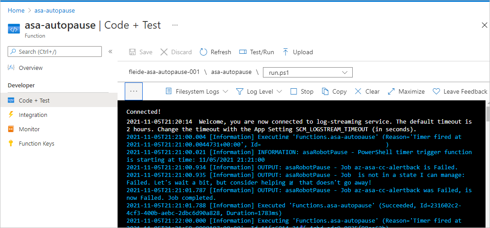

# Auto-pause a Stream Analytics job on a schedule with PowerShell via Azure Functions or Azure Automation

Some applications require a stream processing approach, made easy with [Azure Stream Analytics](https://docs.microsoft.com/en-us/azure/stream-analytics/stream-analytics-introduction) (ASA), but don't strictly need to run continuously.

The reasons are various:

- Input data arriving on a schedule (top of the hour...)
- A very sparse and low volume of incoming data (few records per minute)
- Business processes that benefit from time windowing capabilities, but are running in batch by essence (Finance or HR...)
- ...

These applications are usually either focused on narrow business scenarios, or more typically built for demonstrations, prototypes or tests that involve **long running jobs at low scale**.

The benefit of not running these jobs continuously will be **cost savings**, as Stream Analytics jobs are [billed](https://azure.microsoft.com/en-us/pricing/details/stream-analytics/) per Streaming Unit **over time.**

This article will explain how to set up auto-pause for a Azure Stream Analytics job. Please note that if we are using the term **pause** in this article, the actual job [state](https://docs.microsoft.com/en-us/azure/stream-analytics/job-states) is **stopped**, as to avoid any billing.

We will discuss the overall design first, then go through the required components, and finally discuss some implementation details.

> ! Note
> There are downsides to auto-pausing a job. The main ones being the loss of the low latency / real time capabilities, and the potential risks from allowing the input event backlog to grow unsupervised while a job is paused. This should not be considered for most production scenarios running at scale.

## Design

For this example, we want our job to run for N minutes, before pausing it for M minutes. When the job is paused, the input data will not be consumed, accumulating upstream. When the job is started, it will catch-up with that backlog, process the additional data trickling in, before being shut down again.


To make sure the job has time to process the entire input backlog during the it's running, we won't stop it again until there is no backlogged input events for a couple of minutes: this will actually be our N minutes. So in terms of behavior, we will need two actions:

- A running job needs to be stopped if it has no backlogged input events for at least N minutes
- A stopped job needs to be started after M minutes


To illustrate, with N at 5 minutes, and M at 10, a job has at least 5 minutes to process all the data that is received in input over 15. This also means potential cost savings of up to 66%.

Finally we will make these actions idempotent, meaning that they can be repeated at will with no side effects, for ease of use and resiliency.

## Components

### API calls

We anticipate the need to interact with ASA on the following **aspects**:

- **Get the current job status** (*ASA Resource Management*)
  - If running
    - **Get the current backlogged event count** (*Metrics*)
    - If applicable, **stop the job** (*ASA Resource Management*)
  - If stopped
    - **Get the time since stopped** (*Logs*)
    - If applicable, **start the job** (*ASA Resource Management*)

For *ASA Resource Management*, we can use either the [REST API](https://docs.microsoft.com/en-us/rest/api/streamanalytics/), the [.NET SDK](https://docs.microsoft.com/en-us/dotnet/api/microsoft.azure.management.streamanalytics?view=azure-dotnet) or one of the CLI libraries ([Az CLI](https://docs.microsoft.com/en-us/cli/azure/stream-analytics?view=azure-cli-latest), [PowerShell](https://docs.microsoft.com/en-us/powershell/module/az.streamanalytics/?view=azps-6.6.0)).

For *Metrics* and *Logs*, in Azure everything is centralized under [Azure Monitor](https://docs.microsoft.com/en-ca/azure/azure-monitor/overview), with a similar choice of API surfaces.

### Scripting language

For this article, we decided to implement auto-pause in **PowerShell**. [PowerShell](https://docs.microsoft.com/en-us/powershell/scripting/overview?view=powershell-7.1) is now cross-platform, and since it returns objects, it makes parsing and processing easy for automation tasks. That means we will use the [Az PowerShell](https://docs.microsoft.com/en-us/powershell/azure/new-azureps-module-az?view=azps-6.6.0) module, which embarks [Az.Monitor](https://docs.microsoft.com/en-us/powershell/module/az.monitor/?view=azps-6.6.0) and [Az.StreamAnalytics](https://docs.microsoft.com/en-us/powershell/module/az.streamanalytics/?view=azps-6.6.0) for everything we need here:

- [Get-AzStreamAnalyticsJob](https://docs.microsoft.com/en-us/powershell/module/az.streamanalytics/get-azstreamanalyticsjob?view=azps-6.6.0) for the current job status
- [Start-AzStreamAnalyticsJob](https://docs.microsoft.com/en-us/powershell/module/az.streamanalytics/start-azstreamanalyticsjob?view=azps-6.6.0) / [Stop-AzStreamAnalyticsJob](https://docs.microsoft.com/en-us/powershell/module/az.streamanalytics/stop-azstreamanalyticsjob?view=azps-6.6.0)
- [Get-AzMetric](https://docs.microsoft.com/en-us/powershell/module/az.monitor/get-azmetric?view=azps-6.6.0) with `InputEventsSourcesBacklogged` [(from ASA metrics)](https://docs.microsoft.com/en-us/azure/azure-monitor/essentials/metrics-supported#microsoftstreamanalyticsstreamingjobs)
- [Get-AzActivityLog](https://docs.microsoft.com/en-us/powershell/module/az.monitor/get-azactivitylog?view=azps-6.6.0) for event names beginning with `Stop Job`

### Hosting service

We will need a host for our PowerShell task, that offers scheduled runs. There are lots of options, but going as serverless as possible that leaves:

- [Azure Functions](https://docs.microsoft.com/en-us/azure/azure-functions/functions-overview), a serverless compute engine that can run almost any piece of code. Functions offer a [timer trigger](https://docs.microsoft.com/en-us/azure/azure-functions/functions-bindings-timer?tabs=csharp) that can run up to every second
- [Azure Automation](https://docs.microsoft.com/en-us/azure/automation/overview), a managed service built for operating cloud workloads and resources. Which fits the bill, but whose minimal schedule interval is 1h (but there are [workarounds](https://docs.microsoft.com/en-us/azure/automation/shared-resources/schedules#schedule-runbooks-to-run-more-frequently) for that).

If you don't mind the workaround to get a schedule down the minute, then Azure Automation is the easier way to deploy the task. Now in this article we will be writing a script that works locally first, and see how to deploy it both in Functions and in an Automation Account.

## Implementation details

We highly recommend local development in VSCode, both for [Functions](https://docs.microsoft.com/en-us/azure/azure-functions/create-first-function-vs-code-powershell) and [ASA](https://docs.microsoft.com/en-us/azure/stream-analytics/quick-create-visual-studio-code), if only to use source control. But for this article we will illustrate the process in the [Azure portal](https://portal.azure.com) for the sake of brevity.

### Writing the PowerShell Script locally

The best way to develop the entire job is to do it step by step, locally on Windows with [Windows Terminal](https://www.microsoft.com/p/windows-terminal/9n0dx20hk701), [PowerShell 7](https://docs.microsoft.com/en-us/powershell/scripting/install/installing-powershell-on-windows?view=powershell-7.1) and [Az PowerShell](https://docs.microsoft.com/en-us/powershell/azure/install-az-ps?view=azps-6.6.0), or any other OS really.

The final script that will be used is available for [Functions](https://github.com/Azure/azure-stream-analytics/blob/master/Samples/Automation/Auto-pause/run.ps1) (and [Azure Automation](https://github.com/Azure/azure-stream-analytics/blob/master/Samples/Automation/Auto-pause/runbook.ps1)). It will be different than the one explained below, as it will need to be wired to its hosting environment (Functions or Automation). We'll discuss that later.

So first, let's step through a version of it that only **runs locally**.

At the top, we set the required parameters, and check the initial job status:

```PowerShell

# Setting variables
$metricName = "InputEventsSourcesBacklogged"
$restartThresholdMinute = 10 # This is M
$stopThresholdMinute = 5 # This is N

$subscriptionId = "<Replace with your Subscription Id - not the name>"
$resourceGroupName = "<Replace with your Resource Group Name>"
$asaJobName = "<Replace with your ASA job name>"

$resourceId = "/subscriptions/$($subscriptionId )/resourceGroups/$($resourceGroupName )/providers/Microsoft.StreamAnalytics/streamingjobs/$($asaJobName)"

# If not already logged, uncomment and run the 2 following commands
# Connect-AzAccount
# Set-AzContext -SubscriptionId $subscriptionId

# Check current ASA job status
$currentJobState = Get-AzStreamAnalyticsJob  -ResourceGroupName $resourceGroupName -Name $asaJobName | Foreach-Object {$_.JobState}
Write-Output "asaRobotPause - Job $($asaJobName) is $($currentJobState)."

```

Then if the job is running, we check if the job has been at 0 backlog for at least N minutes:

```PowerShell

# Switch state
if ($currentJobState -eq "Running")
{
    # Get-AzMetric issues warnings about deprecation coming in future releases, here we ignore them via -WarningAction Ignore
    $currentMetricValues = Get-AzMetric -ResourceId $resourceId -TimeGrain 00:01:00 -MetricName $metricName -DetailedOutput -WarningAction Ignore

    # Metric are always lagging 1-3 minutes behind, so grabbing the last N minutes means checking N+3 actually. This may be overly safe and fined tune down per job.
    $lastMetricValues = $currentMetricValues.Data | Sort-Object -Property Timestamp -Descending | Select-Object -First $stopThresholdMinute | Measure-Object -Sum Maximum
    $lastMetricValue = $lastMetricValues.Sum

    Write-Output "asaRobotPause - Job $($asaJobName) is running with a sum of $($lastMetricValue) backlogged events over the last $($stopThresholdMinute) minutes."

    # -eq for equal
    if ($lastMetricValue -eq 0)
    {
        Write-Output "asaRobotPause - Job $($asaJobName) is stopping..."
        Stop-AzStreamAnalyticsJob -ResourceGroupName $resourceGroupName -Name $asaJobName
    }
    else {
        Write-Output "asaRobotPause - Job $($asaJobName) is not stopping yet, it needs to have 0 backlogged events over the last $($stopThresholdMinute) minutes."
    }
}

```

If the job is stopped, we look in the log when was the last "Stop Job" action:

```PowerShell

elseif ($currentJobState -eq "Stopped")
{
    # Get-AzActivityLog issues warnings about deprecation coming in future releases, here we ignore them via -WarningAction Ignore
    # We check in 1000 record of history, to make sure we're not missing what we're looking for. It may need adjustment for a job that has a lot of logging happening.
    # There is a bug in Get-AzActivityLog that triggers an error when Select-Object First is in the same pipeline (on the same line). We move it down.
    $stopTimeStamp = Get-AzActivityLog -ResourceId $resourceId -MaxRecord 1000 -WarningAction Ignore | Where-Object {$_.EventName.Value -like "Stop Job*"}
    $stopTimeStamp = $stopTimeStamp | Select-Object -First 1 | Foreach-Object {$_.EventTimeStamp}

    # Get-Date returns a local time, we project it to the same time zone (universal) as the result of Get-AzActivityLog that we extracted above
    $minutesSinceStopped = ((Get-Date).ToUniversalTime()- $stopTimeStamp).TotalMinutes

    # -ge for greater or equal
    if ($minutesSinceStopped -ge $restartThresholdMinute)
    {
        Write-Output "asaRobotPause - Job $($jobName) was paused $($minutesSinceStopped) minutes ago, set interval is $($restartThresholdMinute), it is now starting..."
        Start-AzStreamAnalyticsJob -ResourceGroupName $resourceGroupName -Name $asaJobName
    }
    else{
        Write-Output "asaRobotPause - Job $($jobName) was paused $($minutesSinceStopped) minutes ago, set interval is $($restartThresholdMinute), it will not be restarted yet."
    }
}
else {
    Write-Output "asaRobotPause - Job $($jobName) is not in a state I can manage: $($currentJobState). Let's wait a bit, but consider helping is that doesn't go away!"
}
```

Finally, we sign off:

```PowerShell

# Final ASA job status check
$newJobState = Get-AzStreamAnalyticsJob  -ResourceGroupName $resourceGroupName -Name $asaJobName | Foreach-Object {$_.JobState}
Write-Output "asaRobotPause - Job $($asaJobName) was $($currentJobState), is now $($newJobState). Job completed."

```

### Option 1 : Hosting the job in Azure Functions

For reference, the Azure Functions team maintains an exhaustive [PowerShell developer guide](https://docs.microsoft.com/en-us/azure/azure-functions/functions-reference-powershell?tabs=portal) that was very helpful here.

First we will need a new **Function App**. A Function App is similar to a solution that can host multiple Functions.

The full procedure is [here](https://docs.microsoft.com/en-us/azure/azure-functions/functions-create-function-app-portal#create-a-function-app), but the gist is to go in the [Azure portal](https://portal.azure.com), and create a a new Function App with:

- Publish: **Code**
- Runtime: **PowerShell Core**
- Version: **7+**

Once it's provisioned, let's start with its overall configuration.

#### Managed identity for Functions

For the Function to be able to start and stop the ASA job, it will need to assume an identity with the right level of permission. This is done here via a [managed identity](https://docs.microsoft.com/en-us/azure/active-directory/managed-identities-azure-resources/overview).

The first step is to enable a **system-assigned managed identity** for the Function, following that [procedure](https://docs.microsoft.com/en-us/azure/app-service/overview-managed-identity?toc=%2Fazure%2Fazure-functions%2Ftoc.json&tabs=dotnet#using-the-azure-portal).

Once this is done, we can grant the right permissions to that identity on the ASA job we want to auto-pause. For that, in the Portal for the **ASA job** (not the Function blade), in **Access control (IAM)**, add a **role assignment** to the role *Contributor* for a member of type *Managed Identity*, selecting the name of the Function above.


Finally in the PowerShell script, we will later add a check that ensures the managed identity is set properly (the final script is available [here](https://github.com/Azure/azure-stream-analytics/blob/master/Samples/Automation/Auto-pause/run.ps1))

```PowerShell

# Check if managed identity has been enabled and granted access to a subscription, resource group, or resource
$AzContext = Get-AzContext -ErrorAction SilentlyContinue
if (-not $AzContext.Subscription.Id)
{
    Throw ("Managed identity is not enabled for this app or it has not been granted access to any Azure resources. Please see https://docs.microsoft.com/en-us/azure/app-service/overview-managed-identity for additional details.")
}

```

We will also add some logging info to make sure the Function is firing up:

```PowerShell

$currentUTCtime = (Get-Date).ToUniversalTime()

# Write an information log with the current time.
Write-Host "asaRobotPause - PowerShell timer trigger function is starting at time: $currentUTCtime"

```

#### Parameters for Functions

The best way to pass our parameters to the script in Functions is to leverage the Function App application settings to feed [environment variables](https://docs.microsoft.com/en-us/azure/azure-functions/functions-reference-powershell?tabs=portal#environment-variables).

To do so, the first step is in the Function App page, to define our parameters as **App Settings** following that [procedure](https://docs.microsoft.com/en-us/azure/azure-functions/functions-how-to-use-azure-function-app-settings?tabs=portal#settings). We will need:

|Name|Value|
|-|-|
|restartThresholdMinute|M : the time in minutes after which a stopped job is restarted|
|stopThresholdMinute|N : the time in minutes during which a job needs to have its input backlog at 0 before being stopped|
|subscriptionId|The SubscriptionId (not the name) of the ASA job to be auto-paused|
|resourceGroupName|The Resource Group Name of the ASA job to be auto-paused|
|asaJobName|The Name of the ASA job to be aut-paused|

Once this is done, we will later need to update our PowerShell script to load its variable accordingly:

```PowerShell

$restartThresholdMinute = $env:restartThresholdMinute
$stopThresholdMinute = $env:stopThresholdMinute

$subscriptionId = $env:subscriptionId
$resourceGroupName = $env:resourceGroupName
$asaJobName = $env:asaJobName

```

#### PowerShell module requirements

The same way we had to install Az PowerShell locally to use the ASA commands (like `Start-AzStreamAnalyticsJob`), we will need to [add it to the Function App host](https://docs.microsoft.com/en-us/azure/azure-functions/functions-reference-powershell?tabs=portal#dependency-management).

To do that, we can go in `Functions` > `App files` of the Function App blade, select `requirements.psd1`, and uncomment the line `'Az' = '6.*'`. For that change to take effect, the whole app will need to be restarted.


#### Creating the function

Once all that configuration is done, we can create the specific function, inside the Function App, that will run our script.

We will develop in the portal, a function triggered on a timer (every minute or so):


Once this is done, we will need to upload our final script, and set the timer.

In `Integration`, we can change the timer to every minute by setting the [schedule](https://docs.microsoft.com/en-us/azure/azure-functions/functions-bindings-timer?tabs=csharp#ncrontab-expressions) to `0 */1 * * * *` (which reads: on second 0 for every minute):


Then in `Code + Test`, we can paste our script in `run.ps1` and test it. The full script can be copied from [here](https://github.com/Azure/azure-stream-analytics/blob/master/Samples/Automation/Auto-pause/run.ps1), the business logic has been moved into a TRY/CATCH statement to generate proper errors if anything fails during processing.


We can check that everything went according to plan in the `Monitor` pane (but it's always a couple of executions late) or via **Test/Run** in the `Code + Test` pane.



#### Setting an alert on the function execution

The final step will be to set up an alert, to make sure we're notified if the function doesn't run successfully. This has a minor cost, but can spare us a job not being stopped as it should be.

In the **Function App** blade, under `Logs`, run the following query that returns all non successful runs in the last 5 minutes :

```SQL
requests
| where success == false
| where timestamp > ago(5min)
| summarize failedCount=sum(itemCount) by operation_Name
| order by failedCount desc
```

In the query editor, pick `New alert rule`. In the following screen, define the **Measurement** as :

- Measure : failedCount
- Aggregation type : Total
- Aggregation granularity : 5 minutes

Next set up the **Alert logic** as follow:

- Operator : Greater than
- Threshold value : 0
- Frequency of evaluation : 5 minutes

From there, re-use or create an [action group](https://docs.microsoft.com/en-us/azure/azure-monitor/alerts/action-groups?WT.mc_id=Portal-Microsoft_Azure_Monitoring) (like getting notified via email) and fill the required details to finalize the alert.

To check that the alert was set up properly, we can add `throw "Testing the alert"` anywhere in the PowerShell script, and wait 5 minutes to receive an email.

### Option 2 : Hosting the job in Azure Automation

First we will need a new **Automation Account**. An Automation Account is similar to a solution that can host multiple runbooks.

The procedure is [here](https://docs.microsoft.com/en-us/azure/automation/quickstarts/create-account-portal). Here we can select to use a system-assigned managed identity directly in the `advanced` tab.

Once this is done, the Automation team has a [good tutorial](https://docs.microsoft.com/en-us/azure/automation/learn/powershell-runbook-managed-identity) to get started on PowerShell runbooks.

#### Parameters for Automation

With a runbook we can use the classic parameter syntax of PowerShell to pass arguments:

```PowerShell
Param(
    [string]$subscriptionId,
    [string]$resourceGroupName,
    [string]$asaJobName,

    [int]$restartThresholdMinute,
    [int]$stopThresholdMinute
)
```

#### Managed identity for Automation

If this wasn't set-up during the creation of the Automation Account, we can enable a system-assigned managed identity using that [procedure](https://docs.microsoft.com/en-us/azure/automation/enable-managed-identity-for-automation).

Once it's done, like for the function we will need to grant the right permissions to that identity on the ASA job we want to auto-pause.

For that, in the Portal for the **ASA job** (not the Automation blade), in **Access control (IAM)**, add a **role assignment** to the role *Contributor* for a member of type *Managed Identity*, selecting the name of the Automation Account above.


Finally in the PowerShell script, we will later add a check that ensures the managed identity is set properly (the final script is available [here](https://github.com/Azure/azure-stream-analytics/blob/master/Samples/Automation/Auto-pause/runbook.ps1))

```PowerShell
# Ensures you do not inherit an AzContext in your runbook
Disable-AzContextAutosave -Scope Process | Out-Null

# Connect using a Managed Service Identity
try {
        $AzureContext = (Connect-AzAccount -Identity).context
    }
catch{
        Write-Output "There is no system-assigned user identity. Aborting.";
        exit
    }
```

#### Creating the runbook

Once the configuration is done, we can create the specific runbook, inside the Automation Account, that will run our script. Here we don't need to add Az PowerShell as a requirement, it's already built in.

In the portal, under Process Automation, select `Runbooks`. In the blade select `Create a runbook`, pick `PowerShell` as the runbook type and any version above `7` as the version (at the moment `7.1 (preview)`).

We can now paste our script and test it. The full script can be copied from [here](https://github.com/Azure/azure-stream-analytics/blob/master/Samples/Automation/Auto-pause/runbook.ps1), the business logic has been moved into a TRY/CATCH statement to generate proper errors if anything fails during processing.


We can check that everything is wired properly in the `Test Pane`.

After that we need to `Publish` the job, which will allow us to link the runbook to a schedule. This is a straightforward process that won't be discussed here. Now is a good time to remember that there are [workarounds](https://docs.microsoft.com/en-us/azure/automation/shared-resources/schedules#schedule-runbooks-to-run-more-frequently) to achieve schedule intervals under 1h.

Finally, we can set up alerts by enabling logs in [Diagnostic settings](https://docs.microsoft.com/en-us/azure/azure-monitor/essentials/diagnostic-settings?tabs=CMD#create-in-azure-portal) of the Automation Account, and capturing errors via a query like we did for Functions.

## Outcome

Looking at our ASA job, we can see that everything is running as expected both in the Activity Log (here with Function and Automation competing to start and stop the same job!):


And via its metrics:


## Get support

For further assistance, try our [Microsoft Q&A question page for Azure Stream Analytics](/answers/topics/azure-stream-analytics.html).

## Next steps

You've learned the basics of using PowerShell to automate the management of Azure Stream Analytics jobs. To learn more, see the following articles:

* [Introduction to Azure Stream Analytics](stream-analytics-introduction.md)
* [Get started using Azure Stream Analytics](stream-analytics-real-time-fraud-detection.md)
* [Scale Azure Stream Analytics jobs](stream-analytics-scale-jobs.md)
* [Azure Stream Analytics Management .NET SDK](/previous-versions/azure/dn889315(v=azure.100)).
* [Azure Stream Analytics Query Language Reference](/stream-analytics-query/stream-analytics-query-language-reference)
* [Azure Stream Analytics Management REST API Reference](/rest/api/streamanalytics/)
