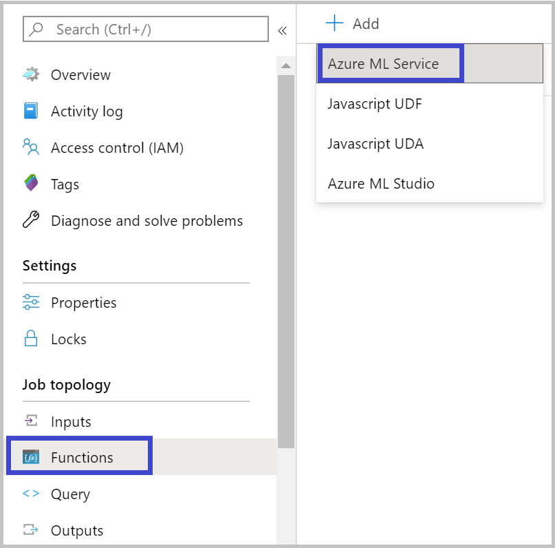
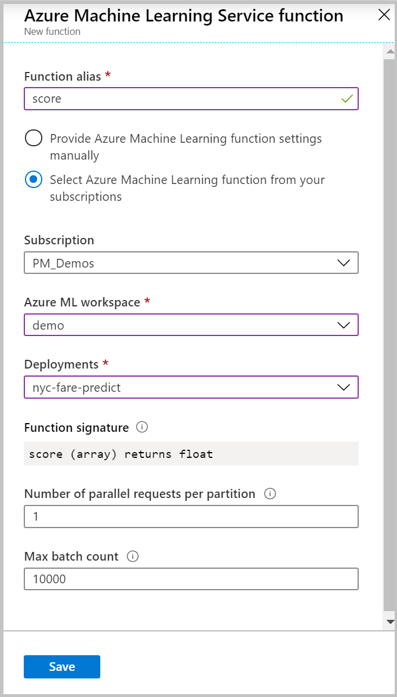

# Machine Learning Functions in Stream Analytics
Stream Analytics allows you to use your machine learning models as a function in your query to do real-time scoring or predictions on your streaming input data. [Azure Machine Learning service](https://docs.microsoft.com/azure/machine-learning/overview-what-is-azure-ml) allows you to use any popular open-source tools such as Tensorflow, scikit-learn and PyTorch to prep, train and deploy models.

## Pre-requisite to get started
You should take the following steps before you can add your model as a function to your Stream Analytics job.
1.	Use Azure Machine Learning service to [deploy your model as a web service](https://docs.microsoft.com/azure/machine-learning/how-to-deploy-and-where). 
2.	Your scoring script should have [sample input and output](https://docs.microsoft.com/azure/machine-learning/how-to-deploy-and-where#example-entry-script) which Azure Machine Learning service will automatically use to generate schema specification. This is how Stream Analytics understands the function signature of your web service. 
3.	Your web service accepts and returns JSON serialized data.
4.	It is recommended to deploy your model on [Azure Kubernetes Service](https://docs.microsoft.com/azure/machine-learning/how-to-deploy-and-where#choose-a-compute-target) for high-scale production deployments. If the web service is not able to handle the number of requests coming from your job, this will degrade the performance of your Stream Analytics job impacting latency.

## Properties of Azure ML Service Function in Stream Analytics
Stream Analytics makes it extremely easy for you to integrate your job with your model by just configuring some properties. 





The following table describes each property of Azure ML Service functions in Stream Analytics.

|Property|Description|
|--------|-----------|
|Function alias|This alias is what you will use in your query to invoke this function.|
|Subscription|Subscription which has your Azure Machine Learning workspace.|
|Azure ML workspace|	Your workspace which you used to deploy your model as a web service.|
|Deployment|	Your web service hosting your model which will be invoked for every function call in your Stream Analytics query.|
|Function Signature|	The signature of your web service inferred from the API’s schema specification. If your signature fails to load, you must ensure you have provided sample input and output in your scoring script to automatically generate this schema.|
|Number of parallel requests per partition|	This is an advanced configuration for optimizing high-scale throughput. This represents the number of concurrent requests sent per each partition of your job to the web service. Jobs with 6 SUs and lower have 1 partition. Jobs with 12 SUs have 2 partitions, 18 SUs have 3 partitions and so on.<br><br> For e.g., if your job has 2 partitions and you set this parameter to be 4, then there will be 8 concurrent requests from your job to your web service.|
|Max batch count|This is an advanced configuration for optimizing high-scale throughput. This represents the maximum number of events that will be batched together in a single request sent to your web service.|


## Supported types of input parameters
Every time your Azure ML UDF gets invoked in your Stream Analytics query, your job creates a JSON serialized request with model specific data structure and sends it to your web service expecting a response. Multiple input events may be batched together in a single request sent to your web service. 
You have provide a sample input and output in your scoring script to [automatically generate schema](https://docs.microsoft.com/azure/machine-learning/how-to-deploy-and-where#optional-automatic-schema-generation) for your web service. This allows Stream Analytics to construct the JSON serialized request to supported one of the many supported data types such as numpy, pandas and pyspark.
Here is an example of how you would invoke an Azure ML UDF from your query.
```SQL
SELECT udf.score(<model-specific-data-structure>)
INTO output
FROM input
```

Currently, Stream Analytics supports passing only one parameter for Azure ML functions. You may need to prepare the data before passing it as an input to this UDF.

## Passing multiple input parameters to the UDF
Most common examples of inputs to machine learning models are numpy arrays and dataframe. You can easily create an array using a JavaScript UDF and also create a JSON-serialized dataframe using WITH clause.

### Creating an array to be used as input to your Azure ML UDF
You can create a JavaScript UDF which accepts N number of inputs and creates an array which can then be used as input to your Azure ML UDF.
```JavaScript
function createArray(vendorid, weekday, pickuphour, passenger, distance) {
    'use strict';
    var array = [vendorid, weekday, pickuphour, passenger, distance]
    return array;
}
```

Once you have added this JavaScript UDF to your job, you can then invoke your Azure ML UDF as show below.
```SQL
SELECT udf.score(
udf.createArray(vendorid, weekday, pickuphour, passenger, distance)
)
INTO output
FROM input
```

The JSON serialized request for this query that gets sent to your web service would look like.
```JSON
{
    "data": [
        ["1","Mon","12","1","5.8"],
        ["2","Wed","10","2","10"]
    ]
}
```

### Creating a pandas or pyspark dataframe to be used as input to your Azure ML UDF
You can use the WITH clause to easily create a JSON serialized dataframe that can then be passed as input to your Azure ML UDF as shown below.
```SQL
--create a dataframe by selecting the necessary fields
WITH 
Dataframe AS (
SELECT vendorid, weekday, pickuphour, passenger, distance
FROM input
)

--use the dataframe as input to your Azure ML UDF
SELECT udf.score(Dataframe)
INTO output
FROM input
```

The JSON serialized request for this query that gets sent to your web service would look like:
```JSON
{
    "data": [{
            "vendorid": "1",
            "weekday": "Mon",
            "pickuphour": "12",
            "passenger": "1",
            "distance": "5.8"
        }, {
            "vendorid": "2",
            "weekday": "Tue",
            "pickuphour": "10",
            "passenger": "2",
            "distance": "10"
        }
    ]
}
```

## Optimizing performance of a job that uses Azure ML UDF
As part of deploying your model to Azure Kubernetes Service, you can [profile your model to determine resource utilization](https://docs.microsoft.com/azure/machine-learning/how-to-deploy-and-where#profilemodel). You can also [enable App Insights for your deployments](https://docs.microsoft.com/azure/machine-learning/how-to-enable-app-insights) to understand request rates, response times and failure rates.

If you have a scenario with high throughput of events flowing through your Stream Analytics job, you may require tweaking the following parameters in Stream Analytics to achieve optimal performance with low end-to-end latencies:
1.	Max batch count
2.	Number of parallel requests per partition

### Determining the right batch size
Every time your Azure ML function is invoked in the query, Stream Analytics constructs a HTTP request with a batch of events and sends it to your web service expecting a response. After you have your web service deployed, you can try sending a sample request with varying batch sizes starting from 50 and increasing it in order of hundreds (e.g., 200, 500, 1000, 2000 and so on). You will notice that after a certain batch size, the latency of the response will increase. This point after which latency of response increases should be the max batch count for your job.

### Determining the number of parallel requests per partition
For your Stream Analytics job to scale well, it should be able to send multiple parallel requests to your web service and get a response within few milliseconds. The latency of the web service’s response will directly impact the latency and performance of your Stream Analytics job. If the callout from your job to the web service takes a long time, you will likely see an increase in watermark delay and may also see an increase in number of backlogged input events.

To prevent such scenarios, you should ensure that your Azure Kubernetes Service (AKS) cluster has been provisioned with the [right number of nodes and replicas](https://docs.microsoft.com/azure/machine-learning/how-to-deploy-azure-kubernetes-service#using-the-cli). It is also critical that your web service is highly available to and returns success. If your job receives a service unavailable response (503) from your web service, it will continuously retry with exponential back off. Any response other than success (200) and service unavailable (503) will cause your job to go to a failed state.
