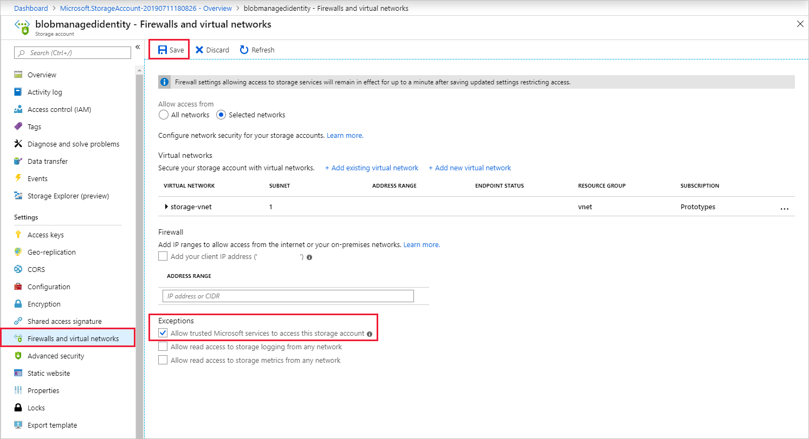

# Use Managed Identity to authenticate your Azure Stream Analytics job to Azure Blob Storage output

[Managed Identity authentication](../active-directory/managed-identities-azure-resources/overview.md) for output to Azure Blob storage gives Stream Analytics jobs direct access to a storage account instead of using a connection string. In addition to improved security, this feature also enables you to write data to a storage account in a Virtual Network (VNET) within Azure.

This article shows you how to enable Managed Identity for the Blob output(s) of a Stream Analytics job through the Azure portal and through an Azure Resource Manager deployment.

## Create the Stream Analytics job using the Azure portal

1. Create a new Stream Analytics job or open an existing job in the Azure portal. From the menu bar located on the left side of the screen, select **Managed Identity** located under **Configure**. Ensure that "Use System-assigned Managed Identity" is selected and then click the **Save** button on the bottom of the screen.

   

2. In the output properties window of the Azure Blob storage output sink, select the Authentication mode drop-down and choose **Managed Identity**. For information regarding the other output properties, see [Understand outputs from Azure Stream Analytics](./stream-analytics-define-outputs.md). When you are finished, click **Save**.

   

3. Now that the job is created, see the [Give the Stream Analytics job access to your storage account](#give-the-stream-analytics-job-access-to-your-storage-account) section of this article.

## Azure Resource Manager deployment

Using Azure Resource Manager allows you to fully automate the deployment of your Stream Analytics job. You can deploy Resource Manager templates using either Azure PowerShell or the [Azure CLI](https://docs.microsoft.com/cli/azure/?view=azure-cli-latest). The below examples use the Azure CLI.


1. You can create a **Microsoft.StreamAnalytics/streamingjobs** resource with a Managed Identity by including the following property in the resource section of your Resource Manager template:

    ```json
    "Identity": {
      "Type": "SystemAssigned",
    },
    ```

   This property tells Azure Resource Manager to create and manage the identity for your Stream Analytics job. Below is an example Resource Manager template that deploys a Stream Analytics job with Managed Identity enabled and a Blob output sink that uses Managed Identity:

    ```json
    {
        "$schema": "http://schema.management.azure.com/schemas/2015-01-01/deploymentTemplate.json#",
        "contentVersion": "1.0.0.0",
        "resources": [
            {
                "apiVersion": "2017-04-01-preview",
                "name": "MyStreamingJob",
                "location": "[resourceGroup().location]",
                "type": "Microsoft.StreamAnalytics/StreamingJobs",
                "identity": {
                    "type": "systemAssigned"
                },
                "properties": {
                    "sku": {
                        "name": "standard"
                    },
                    "outputs":[
                        {
                            "name":"output",
                            "properties":{
                                "serialization": {
                                    "type": "JSON",
                                    "properties": {
                                        "encoding": "UTF8"
                                    }
                                },
                                "datasource":{
                                    "type":"Microsoft.Storage/Blob",
                                    "properties":{
                                        "storageAccounts": [
                                            { "accountName": "MyStorageAccount" }
                                        ],
                                        "container": "test",
                                        "pathPattern": "segment1/{date}/segment2/{time}",
                                        "dateFormat": "yyyy/MM/dd",
                                        "timeFormat": "HH",
                                        "authenticationMode": "Msi"
                                    }
                                }
                            }
                        }
                    ]
                }
            }
        ]
    }
    ```

    The above job can be deployed to the Resource group **ExampleGroup** using the below Azure CLI command:

    ```azurecli
    az group deployment create --resource-group ExampleGroup -template-file StreamingJob.json
    ```

2. After the job is created, you can use Azure Resource Manager to retrieve the job's full definition.

    ```azurecli
    az resource show --ids /subscriptions/{SUBSCRIPTION_ID}/resourceGroups/{RESOURCE_GROUP}/providers/Microsoft.StreamAnalytics/StreamingJobs/{RESOURCE_NAME}
    ```

    The above command will return a response like the below:

    ```json
    {
        "id": "/subscriptions/{SUBSCRIPTION_ID}/resourceGroups/{RESOURCE_GROUP}/providers/Microsoft.StreamAnalytics/streamingjobs/{RESOURCE_NAME}",
        "identity": {
            "principalId": "{PRINCIPAL_ID}",
            "tenantId": "{TENANT_ID}",
            "type": "SystemAssigned",
            "userAssignedIdentities": null
        },
        "kind": null,
        "location": "West US",
        "managedBy": null,
        "name": "{RESOURCE_NAME}",
        "plan": null,
        "properties": {
            "compatibilityLevel": "1.0",
            "createdDate": "2019-07-12T03:11:30.39Z",
            "dataLocale": "en-US",
            "eventsLateArrivalMaxDelayInSeconds": 5,
            "jobId": "{JOB_ID}",
            "jobState": "Created",
            "jobStorageAccount": null,
            "jobType": "Cloud",
            "outputErrorPolicy": "Stop",
            "package": null,
            "provisioningState": "Succeeded",
            "sku": {
                "name": "Standard"
            }
        },
        "resourceGroup": "{RESOURCE_GROUP}",
        "sku": null,
        "tags": null,
        "type": "Microsoft.StreamAnalytics/streamingjobs"
    }
    ```

   Take note of the **principalId** from the job's definition, which identifies your job's Managed Identity within Azure Active Directory and will be used in the next step to grant the Stream Analytics job access to the storage account.

3. Now that the job is created, see the [Give the Stream Analytics job access to your storage account](#give-the-stream-analytics-job-access-to-your-storage-account) section of this article.


## Give the Stream Analytics job access to your storage account

There are two levels of access you can choose to give your Stream Analytics job:

1. **Container level access:** this option gives the job access to a specific existing container.
2. **Account level access:** this option gives the job general access to the storage account, including the ability to create new containers.

Unless you need the job to create containers on your behalf, you should choose **Container level access** since this option will grant the job the minimum level of access required. Both options are explained below for the Azure portal and the command-line.

### Grant access via the Azure portal

#### Container level access

1. Navigate to the container's configuration pane within your storage account.

2. Select **Access Control (IAM)** on the left-hand side.

3. Under the "Add a role assignment" section click **Add**.

4. In the role assignment pane:

    1. Set the **Role** to "Storage Blob Data Contributor"
    2. Ensure the **Assign access to** dropdown is set to "Azure AD user, group, or service principal".
    3. Type the name of your Stream Analytics job in the search field.
    4. Select your Stream Analytics job and click **Save**.

   

#### Account level access

1. Navigate to your storage account.

2. Select **Access Control (IAM)** on the left-hand side.

3. Under the "Add a role assignment" section click **Add**.

4. In the role assignment pane:

    1. Set the **Role** to "Storage Blob Data Contributor"
    2. Ensure the **Assign access to** dropdown is set to "Azure AD user, group, or service principal".
    3. Type the name of your Stream Analytics job in the search field.
    4. Select your Stream Analytics job and click **Save**.

   

### Grant access via the command line

#### Container level access

To give access to a specific container, run the following command using the Azure CLI:

   ```azurecli
   az role assignment create --role "Storage Blob Data Contributor" --assignee <principal-id> --scope /subscriptions/<subscription-id>/resourcegroups/<resource-group>/providers/Microsoft.Storage/storageAccounts/<storage-account>/blobServices/default/containers/<container-name>
   ```

#### Account level access

To give access to the entire account, run the following command using the Azure CLI:

   ```azurecli
   az role assignment create --role "Storage Blob Data Contributor" --assignee <principal-id> --scope /subscriptions/<subscription-id>/resourcegroups/<resource-group>/providers/Microsoft.Storage/storageAccounts/<storage-account>
   ```

## Enable VNET access

When configuring your storage account's **Firewalls and virtual networks**, you can optionally allow in network traffic from other trusted Microsoft services. When Stream Analytics authenticates using Managed Identity, it provides proof that the request is originating from a trusted service. Below are instructions to enable this VNET access exception.

1.	Navigate to the “Firewalls and virtual networks” pane within the storage account’s configuration pane.
2.	Ensure the “Allow trusted Microsoft services to access this storage account” option is enabled.
3.	If you enabled it, click **Save**.

   

## Limitations
Below are the current limitations of this feature:

1. Classic Azure Storage accounts.

2. Azure accounts without Azure Active Directory.

3. Multi-tenant access is not supported. The Service principal created for a given Stream Analytics job must reside in the same Azure Active Directory tenant in which the job was created, and cannot be used with a resource that resides in a different Azure Active Directory tenant.

4. [User Assigned Identity](../active-directory/managed-identities-azure-resources/overview.md) is not supported. This means the user is not able to enter their own service principal to be used by their Stream Analytics job. The service principal must be generated by Azure Stream Analytics.

## Next steps

* [Understand outputs from Azure Stream Analytics](./stream-analytics-define-outputs.md)
* [Azure Stream Analytics custom blob output partitioning](./stream-analytics-custom-path-patterns-blob-storage-output.md)
