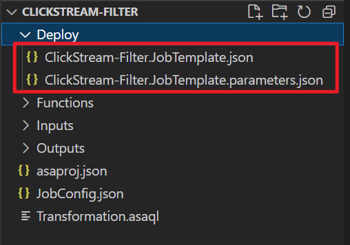
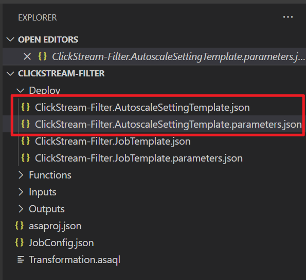
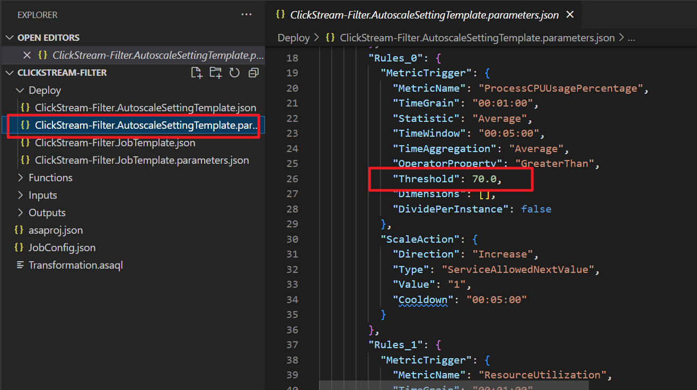

# Configure autoscale settings for a Stream Analytics job by using the CI/CD tool

Streaming units (SUs) represent the computing resources that are allocated to run an Azure Stream Analytics job. The higher the number of SUs, the more CPU and memory resources are allocated to your job. 

The autoscale feature dynamically adjusts SUs based on your rule definitions. You can configure autoscale settings for your Stream Analytics job in the Azure portal or by using the Stream Analytics continuous integration and continuous delivery (CI/CD) tool on your local machine.

This article explains how you can use the Stream Analytics CI/CD tool to configure autoscale settings for Stream Analytics jobs. If you want to learn more about autoscaling jobs in the Azure portal, see [Autoscale streaming units (preview)](stream-analytics-autoscale.md).

The Stream Analytics CI/CD tool allows you to specify the maximum number of streaming units and configure a set of rules for autoscaling your jobs. Then it determines whether to add SUs (to handle increases in load) or reduce the number of SUs (when computing resources are sitting idle).

Here's an example of an autoscale setting:

- If the maximum number of SUs is set to 12, increase SUs when the average SU utilization of the job over the last 2 minutes goes above 75 percent.

## Prerequisites

To complete the steps in this article, you need either:

- A Stream Analytics project on the local machine. Follow [this guide](quick-create-visual-studio-code.md) to create one.
- A running Stream Analytics job in Azure.

## Configure autoscale settings

### Scenario 1: Configure settings for a local Stream Analytics project

If you have a working Stream Analytics project on the local machine, follow these steps to configure autoscale settings:

1. Open your Stream Analytics project in Visual Studio Code.
2. On the **Terminal** panel, run the following command to install the Stream Analytics CI/CD tool:

    ```powershell
    npm install -g azure-streamanalytics-cicd
    ```

    Here's the list of supported commands for `azure-streamanalytics-cicd`:

    |Command        |Description    |
    |---------------|---------------|
    |`build`          |Generate a standard Azure Resource Manager template (ARM template) for a Stream Analytics project in Visual Studio Code.|
    |`localrun`       |Run locally for a Stream Analytics project in Visual Studio Code.|
    |`test`           |Test for a Stream Analytics project in Visual Studio Code.|
    |`addtestcase`    |Add test cases for a Stream Analytics project in Visual Studio Code.|
    |`autoscale`      |Generate an ARM template file for an autoscale setting.|
    |`help`           |Display more information on a specific command.|

3. Build the project:

    ```powershell
    azure-streamanalytics-cicd build --v2 --project ./asaproj.json --outputPath ./Deploy
    ```

    If you build the project successfully, two JSON files are created under the *Deploy* folder. One is the ARM template file, and the other is the parameter file.

    

    > [!NOTE]
    > We highly recommend that you use the `--v2` option for the updated ARM template schema. The updated schema has fewer parameters yet retains the same functionality as the previous version.
    >
    > The old ARM template will be deprecated in the future. After that, only templates that were created via `build --v2` will receive updates or bug fixes.

4. Configure the autoscale setting. Add parameter keys and values by using the `azure-streamanalytics-cicd autoscale` command.

    |Parameter key   | Value | Example|
    |----------------|-------|--------|
    |`capacity`| Maximum SUs (1/3, 2/3, 1, up to 66 SU V2s)|`2`|
    |`metrics` | Metrics used for autoscale rules | `ProcessCPUUsagePercentage` `ResourceUtilization`|
    |`targetJobName`| Project name| `ClickStream-Filter`|
    |`outputPath`| Output path for ARM templates | `./Deploy`|

    Here's an example:

    ```powershell
    azure-streamanalytics-cicd autoscale --capacity 2 --metrics ProcessCPUUsagePercentage ResourceUtilization --targetJobName ClickStream-Filter --outputPath ./Deploy
    ```

    If you configure the autoscale setting successfully, two JSON files are created under the *Deploy* folder. One is the ARM template file, and the other is the parameter file.

    

    Here's the list of metrics that you can use to define autoscale rules:

    |Metric                        | Description           |
    |------------------------------|-------------------|
    |`ProcessCPUUsagePercentage`      | CPU utilization percentage |
    |`ResourceUtilization`            | SU or memory utilization percentage |
    |`OutputWatermarkDelaySeconds`    | Watermark delay |
    |`InputEventsSourcesBacklogged`   | Backlogged input events |
    |`DroppedOrAdjustedEvents`        | Out-of-order events |
    |`Errors`                         | Runtime errors |
    |`InputEventBytes`                | Input event bytes |
    |`LateInputEvents`                | Late input events |
    |`InputEvents`                    | Input events |
    |`EarlyInputEvents`               | Early input events |
    |`InputEventsSourcesPerSecond`    | Input sources received |
    |`OutputEvents`                   | Output events |
    |`AMLCalloutRequests`             | Function requests |
    |`AMLCalloutFailedRequests`       | Failed function requests |
    |`AMLCalloutInputEvents`          | Function events |
    |`ConversionErrors`               | Data conversion errors |
    |`DeserializationError`           | Input deserialization error |

    The default value for all metric thresholds is `70`. If you want to set the metric threshold to another number, open the *\*.AutoscaleSettingTemplate.parameters.json* file and change the `Threshold` value. 

    

    To learn more about defining autoscale rules, see [Understand autoscale settings](../azure-monitor/autoscale/autoscale-understanding-settings.md).

5. Deploy to Azure.

    1. Connect to your Azure account:

        ```powershell
        # Connect to Azure
        Connect-AzAccount

        # Set the Azure subscription
        Set-AzContext [SubscriptionID/SubscriptionName]
        ```

    1. Deploy your Stream Analytics project:

        ```powershell
        $templateFile = ".\Deploy\ClickStream-Filter.JobTemplate.json"
        $parameterFile = ".\Deploy\ClickStream-Filter.JobTemplate.parameters.json"
        New-AzResourceGroupDeployment `
          -Name devenvironment `
          -ResourceGroupName myResourceGroupDev `
          -TemplateFile $templateFile `
          -TemplateParameterFile $parameterFile
        ```

    1. Deploy your autoscale settings:

        ```powershell
        $templateFile = ".\Deploy\ClickStream-Filter.AutoscaleSettingTemplate.json"
        $parameterFile = ".\Deploy\ClickStream-Filter.AutoscaleSettingTemplate.parameters.json"
        New-AzResourceGroupDeployment `
          -Name devenvironment `
          -ResourceGroupName myResourceGroupDev `
          -TemplateFile $templateFile `
          -TemplateParameterFile $parameterFile
        ```

After you deploy your project successfully, you can view the autoscale settings in the Azure portal.

### Scenario 2: Configure settings for a running Stream Analytics job in Azure

If you have a Stream Analytics job running in Azure, you can use the Stream Analytics CI/CD tool in PowerShell to configure autoscale settings.

Run the following command. Replace `$jobResourceId` with the resource ID of your Stream Analytics job.

```powershell
azure-streamanalytics-cicd autoscale --capacity 2 --metrics ProcessCPUUsagePercentage ResourceUtilization --targetJobResourceId $jobResourceId --outputPath ./Deploy
```

If you configure the settings successfully, ARM template and parameter files are created in the current directory.

Then you can deploy the autoscale settings to Azure by following the deployment steps in scenario 1.

## Get help

For more information about autoscale settings, run this command in PowerShell:

```powershell
azure-streamanalytics-cicd autoscale --help
```

If you have any problems with the Stream Analytics CI/CD tool, you can report them in [GitHub](https://github.com/microsoft/vscode-asa/issues).
