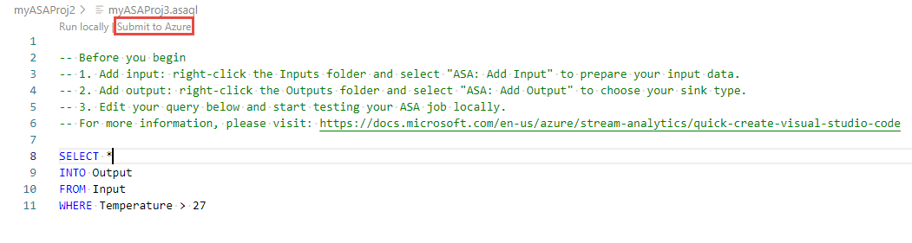

# Copy, back up and move your Azure Stream Analytics jobs between regions

If you want to move, copy or back up your Azure Stream Analytics jobs in Azure, the Azure Stream Analytics extension for Visual Studio Code allows you to export an existing job in Azure cloud to your local computer. All the configurations of your Stream Analytics job will be saved locally and you can resubmit it to another cloud region.

> [!NOTE] 
> * Copying a job to another region does not copy the last output time. Therefore, you cannot use [**When last stopped**](./start-job.md#start-options) option when starting the copied job.

## Before you begin
* If you don't have an Azure subscription, create a [free account](https://azure.microsoft.com/free/).

* Sign in to the [Azure portal](https://portal.azure.com/).

* Install [Azure Stream Analytics extension for Visual Studio Code](quick-create-visual-studio-code.md#install-the-azure-stream-analytics-tools-extension).

## Visual Studio Code

1. Select the **Azure** icon on the Visual Studio Code Activity Bar and then expand **Stream Analytics** node. Your jobs should appear under your subscriptions.

   

2. To export a job to a local project, locate the job you wish to export in the **Stream Analytics Explorer** in Visual Studio Code. Then select a folder for your project.

    

    The project is exported to the folder you select and added to your current workspace.

3. To publish the job to another region or backup using another name, select **Select from your subscriptions to publish** in the query editor (\*.asaql) and follow the instructions.

    

## Next steps

* [Quickstart: Create a Stream Analytics job by using Visual Studio Code](quick-create-visual-studio-code.md)