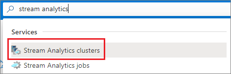
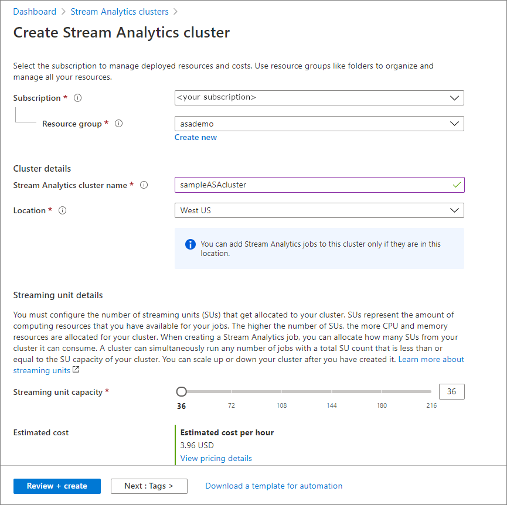

# Quickstart: Create a dedicated Stream Analytics cluster using Azure portal
This quickstart will show you how to create a Stream Analytics cluster. [Stream Analytics cluster](stream-analytics-cluster-overview.md) is a single-tenant deployment for customers with complex, demanding streaming use cases. After creating your cluster, you can run your Stream Analytics job on it.

## Before you begin

* If you don't have an Azure subscription, create a [free account](https://azure.microsoft.com/free/).

* Sign in to the [Azure portal](https://portal.azure.com/).

## Create a Stream Analytics cluster

1. Sign in to the Azure portal. Search for and select **Stream Analytics cluster**. 
   

1. Select **Add**.
2. On the **Stream Analytics cluster** page, enter the basic settings for your new cluster.

   |Setting|Value|Description |
    |---|---|---|
    |Subscription|Subscription name|Select the Azure subscription that you want to use for this Stream Analytics cluster. |
    |Resource Group|Resource group name|Select a resource group, or select **Create new**, then enter a unique name for the new resource group. |
    |Cluster Name|A unique name|Enter a name to identify your Stream Analytics cluster.|
    |Location|The region closest to your data sources and sinks|Select a geographic location to host your Stream Analytics cluster. Use the location that is closest to your data sources and sinks for low latency analytics.|
    |Streaming Unit Capacity|36 through 216 |Determine the size of the cluster by estimating how many Stream Analytics job you plan to run and the total SUs these job will require. You can start with 36 SUs and later scale up or down as required.|
    
3. Select **Review + create**. You can skip the **Tags** sections.
4. Review the cluster settings, and then select **Create**. Creating a cluster is a long running operation and can take approximately 60 mins to complete. Wait for the portal page to display **Your deployment is complete**. In the mean time, you can create and develop [Stream Analytics jobs](https://docs.microsoft.com/azure/stream-analytics/stream-analytics-quick-create-portal#create-a-stream-analytics-job) that you want to run on this cluster. 
5. Select **Go to resource** to go to the Stream Analytics cluster page.

### Getting started
You can follow the getting started experience to do 3 primary operations.
1. [Create private endpoints](stream-analytics-privateendpoints.md) in your cluster that securely connect your jobs to your resources such as Azure Event Hubs, Azure SQL Database etc.
2. [Add existing jobs](stream-analytics-manage-jobs-cluster.md) to your cluster and then start those jobs.
3. [Scale](stream-analytics-scale-cluster.md) up or down the capacity of your cluster.

### Delete cluster
You can delete your Stream Analytics cluster if you don't plan on running any Stream Analytics jobs on it in the near future. Delete your cluster by following steps on the Azure portal:
1. Go to **Stream Analytics jobs** under **Settings** and stop all jobs that are running.
2. Go to **Overview** of your cluster. Select **Delete** and follow the instructions to delete your cluster. 

## Next steps

You now have an overview of Azure Stream Analytics. Next, you can dive deep and create your first Stream Analytics job:

* [Manage private endpoints](stream-analytics-privateendpoints.md).
* [Managing Stream Analytics jobs in a Stream Analytics cluster](stream-analytics-manage-jobs-cluster.md).
* [Create a Stream Analytics job](stream-analytics-quick-create-portal.md).
   