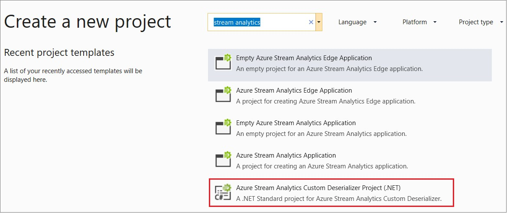
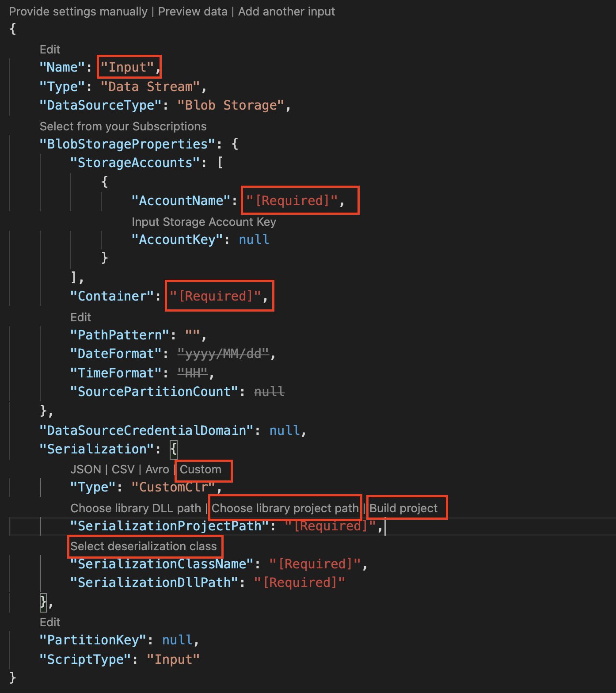
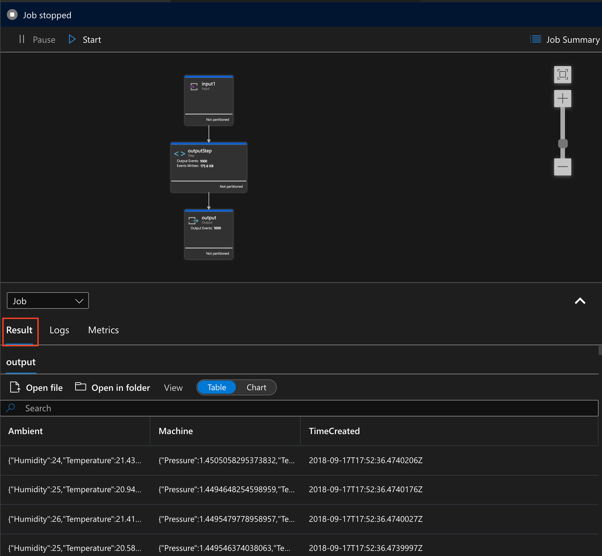
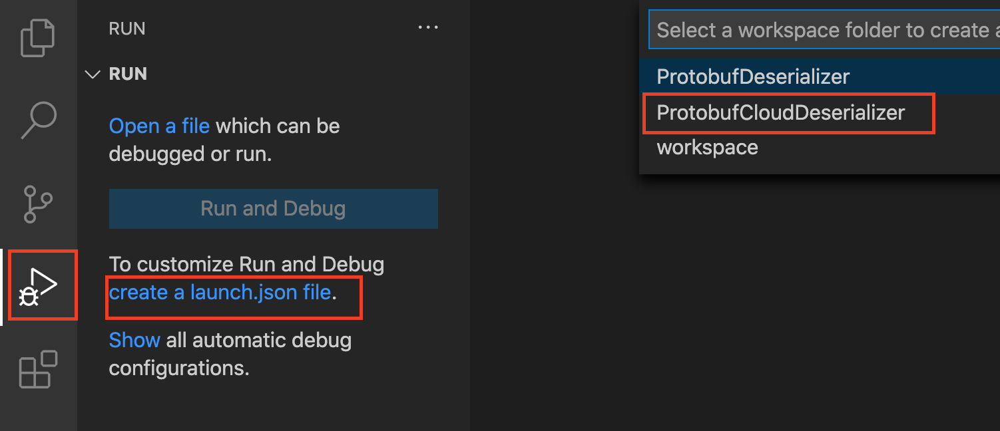
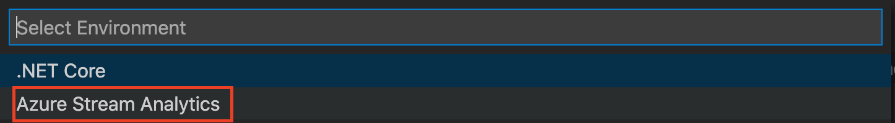
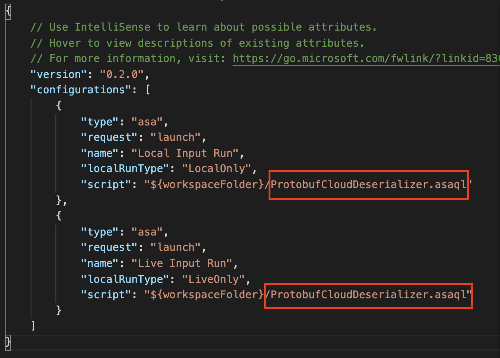

# Tutorial: Custom .NET deserializers for Azure Stream Analytics

Azure Stream Analytics has [built-in support for three data formats](stream-analytics-parsing-json.md): JSON, CSV, and Avro. With custom .NET deserializers, you can read data from other formats such as [Protocol Buffer](https://developers.google.com/protocol-buffers/), [Bond](https://github.com/Microsoft/bond) and other user defined formats for both cloud and edge jobs.

This tutorial demonstrates how to create a custom .NET deserializer for an Azure Stream Analytics cloud job using Visual Studio.

In this tutorial, you learn how to:

> [!div class="checklist"]
> * Create a custom deserializer for protocol buffer.
> * Create an Azure Stream Analytics job in Visual Studio or Visual Studio Code.
> * Configure your Stream Analytics job to use the custom deserializer.
> * Run your Stream Analytics job locally to test and debug the custom deserializer.


## Custom .NET deserializers in Visual Studio

### Prerequisites

* If you don't have an Azure subscription, create a [free account](https://azure.microsoft.com/free/?WT.mc_id=A261C142F).

* Install [Visual Studio 2019 (recommended)](https://www.visualstudio.com/downloads/) or [Visual Studio 2017](https://www.visualstudio.com/vs/older-downloads/). Enterprise (Ultimate/Premium), Professional, and Community editions are supported. Express edition isn't supported. 

* [Install the Stream Analytics tools for Visual Studio](stream-analytics-tools-for-visual-studio-install.md) or update to the latest version. 

* Open **Cloud Explorer** in Visual Studio, and sign in to your Azure subscription.

* Create a container in your Azure Storage Account.
The container you create will be used to store assets related to your Stream Analytics job. If you already have a storage account with existing containers, you may use them. If not, you'll need to [create a new container](../storage/blobs/storage-quickstart-blobs-portal.md).

### Create a custom deserializer

1. Open Visual Studio and select **File > New > Project**. Search for **Stream Analytics** and select **Azure Stream Analytics Custom Deserializer Project (.NET)**. Give the project a name, like **Protobuf Deserializer**.

   

2. In Solution Explorer, right-click your **Protobuf Deserializer** project and select **Manage NuGet Packages** from the menu. Then install the **Microsoft.Azure.StreamAnalytics** and **Google.Protobuf** NuGet packages.

3. Add the [MessageBodyProto class](https://github.com/Azure/azure-stream-analytics/blob/master/CustomDeserializers/Protobuf/MessageBodyProto.cs) and the [MessageBodyDeserializer class](https://github.com/Azure/azure-stream-analytics/blob/master/CustomDeserializers/Protobuf/MessageBodyDeserializer.cs) to your project.

4. Build the **Protobuf Deserializer** project.

### Add an Azure Stream Analytics project

1. In Solution Explorer, right-click the **Protobuf Deserializer** solution and select **Add > New Project**. Under **Azure Stream Analytics > Stream Analytics**, choose **Azure Stream Analytics Application**. Name it **ProtobufCloudDeserializer** and select **OK**. 

2. Right-click **References** under the **ProtobufCloudDeserializer** Azure Stream Analytics project. Under **Projects**, add **Protobuf Deserializer**. It should be automatically populated for you.

### Configure a Stream Analytics job

1. Double-click **JobConfig.json**. Use the default configurations, except for the following settings:

   |Setting|Suggested Value|
   |-------|---------------|
   |Global Storage Settings Resource|Choose data source from current account|
   |Global Storage Settings Subscription| < your subscription >|
   |Global Storage Settings Storage Account| < your storage account >|
   |Custom Code Storage Settings Resource|Choose data source from current account|
   |Custom Code Storage Settings Storage Account|< your storage account >|
   |Custom Code Storage Settings Container|< your storage container >|

2. Under **Inputs**, double-click **Input.json**. Use the default configurations, except for the following settings:

   |Setting|Suggested Value|
   |-------|---------------|
   |Source|Blob Storage|
   |Resource|Choose data source from current account|
   |Subscription|< your subscription >|
   |Storage Account|< your storage account >|
   |Container|< your storage container >|
   |Event Serialization Format|Other (Protobuf, XML, proprietary...)|
   |Resource|Load from ASA Project Reference or CodeBehind|
   |CSharp Assembly Name|ProtobufDeserializer.dll|
   |Class Name|MessageBodyProto.MessageBodyDeserializer|
   |Event Compression Type|None|

3. Add the following query to the **Script.asaql** file.

   ```sql
   SELECT * FROM Input
   ```

4. Download the [sample protobuf input file](https://github.com/Azure/azure-stream-analytics/blob/master/CustomDeserializers/Protobuf/SimulatedTemperatureEvents.protobuf). In the **Inputs** folder, right-click **Input.json** and select **Add Local Input**. Then, double-click **local_Input.json** and configure the following settings:

   |Setting|Suggested Value|
   |-------|---------------|
   |Input Alias|Input|
   |Source Type|Data Stream|
   |Event Serialization Format|Other (Protobuf, XML, proprietary...)|
   |CSharp Assembly Name|ProtobufDeserializer.dll|
   |Class Name|MessageBodyProto.MessageBodyDeserializer|
   |Local Input File Path|< the file path for the downloaded sample protobuf input file>|

### Execute the Stream Analytics job

1. Open **Script.asaql** and select **Run Locally**.

2. Observe the results in **Stream Analytics Local Run Results**.

You have successfully implemented a custom deserializer for your Stream Analytics job! In this tutorial, you tested the custom deserializer locally. For your actual data, you would properly configure the input and output. Then submit the job to Azure from Visual Studio to run your job in the cloud using the custom deserializer you just implemented.

### Debug your deserializer

You can debug your .NET deserializer locally the same way you debug standard .NET code. 

1. Add breakpoints in your function.

2. Press **F5** to start debugging. The program will stop at your breakpoints as expected.

## Custom .NET deserializers in Visual Studio Code

### Prerequisites

* If you don't have an Azure subscription, create a [free account](https://azure.microsoft.com/free/?WT.mc_id=A261C142F).

* Install [Visual Studio Code](https://code.visualstudio.com/Download).

* [Install and activate the Stream Analytics tools for Visual Studio Code](quick-create-visual-studio-code.md)

* Install [.NET Core SDK](https://dotnet.microsoft.com/).

* Create a container in your Azure Storage Account.
The container you create will be used to store assets related to your Stream Analytics job. If you already have a storage account with existing containers, you may use them. If not, you'll need to [create a new container](../storage/blobs/storage-quickstart-blobs-portal.md).

### Create a custom deserializer

1. Open a terminal and run following command to create a .NET class library in Visual Studio Code for your custom deserializer called **ProtobufDeserializer**.

  ```dotnetcli
  dotnet new classlib -o ProtobufDeserializer
  ```

2. Go to the **ProtobufDeserializer** project directory and install the [Microsoft.Azure.StreamAnalytics](https://www.nuget.org/packages/Microsoft.Azure.StreamAnalytics/) and [Google.Protobuf](https://www.nuget.org/packages/Google.Protobuf/) NuGet packages. 

  ```dotnetcli
  dotnet add package Microsoft.Azure.StreamAnalytics
  ```

  ```dotnetcli
  dotnet add package Google.Protobuf
  ```

3. Add the [MessageBodyProto class](https://github.com/Azure/azure-stream-analytics/blob/master/CustomDeserializers/Protobuf/MessageBodyProto.cs) and the [MessageBodyDeserializer class](https://github.com/Azure/azure-stream-analytics/blob/master/CustomDeserializers/Protobuf/MessageBodyDeserializer.cs) to your project. 


4. Build the **ProtobufDeserializer** project.

### Add an Azure Stream Analytics project

1. Open Visual Studio Code and select **Ctrl+Shift+P** to open the command palette. Then enter ASA and select **ASA: Create New Project**. Name it **ProtobufCloudDeserializer**.

### Configure a Stream Analytics job

1. Double-click **JobConfig.json**. Use the default configurations, except for the following settings:

   |Setting|Suggested Value|
   |-------|---------------|
   |Global Storage Settings Resource|Choose data source from current account|
   |Global Storage Settings Subscription| < your subscription >|
   |Global Storage Settings Storage Account| < your storage account >|
   |CustomCodeStorage Settings Storage Account|< your storage account >|
   |CustomCodeStorage Settings Container|< your storage container >|

2. Under **Inputs** folder open **input.json**. Select **Add live input** and add an input from Azure Data Lake Storage Gen2/Blob storage, choose **Select from your Azure subscription**. Use the default configurations, except for the following settings:

   |Setting|Suggested Value|
   |-------|---------------|
   |Name|Input|
   |Subscription|< your subscription >|
   |Storage Account|< your storage account >|
   |Container|< your storage container >|
   |Serialization Type|Choose **Custom**|
   |SerializationProjectPath|Select **Choose library project path** from CodeLens and select the **ProtobufDeserializer** library project created in previous section. Select **build project** to build the project|
   |SerializationClassName|Select **select deserialization class** from CodeLens to auto populate the class name and DLL path|
   |Class Name|MessageBodyProto.MessageBodyDeserializer|

    


3. Add the following query to the **ProtobufCloudDeserializer.asaql** file.

   ```sql
   SELECT * FROM Input
   ```

4. Download the [sample protobuf input file](https://github.com/Azure/azure-stream-analytics/blob/master/CustomDeserializers/Protobuf/SimulatedTemperatureEvents.protobuf). In the **Inputs** folder, right-click **input.json** and select **Add local input**. Then, double-click **local_input1.json** and use the default configurations, except for the following settings.

   |Setting|Suggested Value|
   |-------|---------------|
   |Select local file path|Click CodeLens to select < The file path for the downloaded sample protobuf input file>|

### Execute the Stream Analytics job

1. Open **ProtobufCloudDeserializer.asaql** and select **Run Locally** from CodeLens then choose **Use Local Input** from the dropdown list.

2. Observe the results in **Results** tab in job diagram view on the right. You can also click the steps in the job diagram to view intermediate result. More details please see [Debug locally using job diagram](debug-locally-using-job-diagram-vs-code).   

   


You have successfully implemented a custom deserializer for your Stream Analytics job! In this tutorial, you tested the custom deserializer locally with local input data. You can also test it [using live data input in the cloud](visual-studio-code-local-run-live-input.md). For running the job in the cloud, you would properly configure the input and output. Then submit the job to Azure from Visual Studio Code to run your job in the cloud using the custom deserializer you just implemented.

### Debug your deserializer

You can debug your .NET deserializer locally the same way you debug standard .NET code. 

1. Add breakpoints in your .NET function.

2. Click **Run** from Visual Studio Code Activity bar and select **create a launch.json file**. Choose **ProtobufCloudDeserializer** and then **Azure Stream Analytics** from the dropdown list. Edit the **launch.json** file to replace <ASAScript>.asaql with ProtobufCloudDeserializer.asaql.

   

    

   


3. Press **F5** to start debugging. The program will stop at your breakpoints as expected. This works for both local input and live input data.

   


## Clean up resources

When no longer needed, delete the resource group, the streaming job, and all related resources. Deleting the job avoids billing the streaming units consumed by the job. If you're planning to use the job in future, you can stop it and restart it later when you need. If you are not going to continue to use this job, delete all resources created by this tutorial by using the following steps:

1. From the left-hand menu in the Azure portal, select **Resource groups** and then select the name of the resource you created.  

2. On your resource group page, select **Delete**, type the name of the resource to delete in the text box, and then select **Delete**.

## Next steps

In this tutorial, you learned how to implement a custom .NET deserializer for the protocol buffer input serialization. To learn more about creating custom deserializers, continue to the following article:

> [!div class="nextstepaction"]
> * [Create different .NET deserializers for Azure Stream Analytics jobs](custom-deserializer-examples.md)
> * [Create .NET deserializers for Azure Stream Analytics jobs in Visual Studio Code](visual-studio-code-custom-deserializer.md)