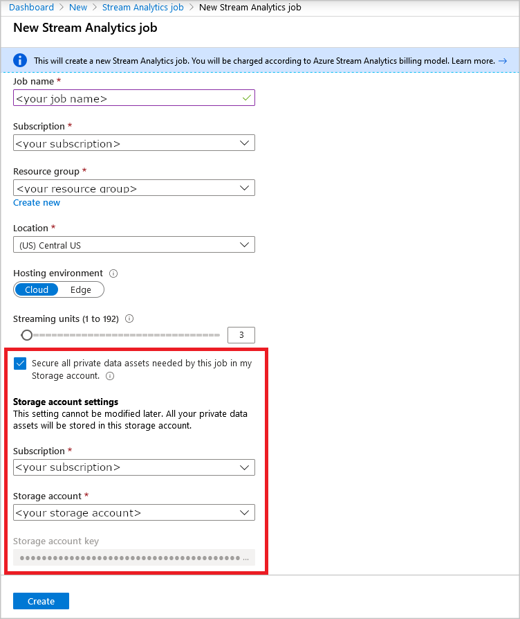

# Data protection in Azure Stream Analytics 

Azure Stream Analytics is a fully managed platform-as-a-service that allows you to build real-time analytics pipelines. All of the heavy lifting, such as cluster provisioning, scaling nodes to accommodate your usage, and managing internal checkpoints, is managed behind the scenes.

## Private data assets that are stored

Azure Stream Analytics persists the following metadata and data in order to run: 

* Query definition and their related configuration  

* User-defined functions or aggregates  

* Checkpoints needed by the Stream Analytics runtime

* Snapshots of reference data 

* Connection details of the resources used by your Stream Analytics job

## In-Region Data Residency

Azure Stream Analytics stores customer data and other metadata described above. Customer data is stored by Azure Stream Analytics in a single region by default, so this service automatically satisfies in region data residency requirements including those specified in the [Trust Center](https://azuredatacentermap.azurewebsites.net/).
Additionally, you can choose to store all data assets (customer data and other metadata) related to your stream analytics job in a single region by encrypting them in a storage account of your choice.

## Encrypt your data

Stream Analytics automatically employs best-in-class encryption standards across its infrastructure to encrypt and secure your data. You can simply trust Stream Analytics to securely store all your data so that you don't have to worry about managing the infrastructure.

If you want to use customer-managed keys to encrypt your data, you can use your own storage account (general purpose V1 or V2) to store any private data assets that are required by the Stream Analytics runtime. Your storage account can be encrypted as needed. None of your private data assets are stored permanently by the Stream Analytics infrastructure. 

This setting must be configured at the time of Stream Analytics job creation, and it can't be modified throughout the job's life cycle. Modification or deletion of storage that is being used by your Stream Analytics is not recommended. If you delete your storage account, you will permanently delete all private data assets, which will cause your job to fail. 

Updating or rotating keys to your storage account is not possible using the Stream Analytics portal. You can update the keys using the REST APIs. You can also connect to your job storage account using managed identity authentication with allow trusted services.

If the storage account you want to use is in an Azure Virtual Network, you must use managed identity authentication mode with **Allow trusted services**. For more information, visit: [Connect Stream Analytics jobs to resources in an Azure Virtual Network (VNet)](connect-job-to-vnet.md).

### Configure storage account for private data 

Encrypt your storage account to secure all of your data and explicitly choose the location of your private data. 

Use the following steps to configure your storage account for private data assets. This configuration is made from your Stream Analytics job, not from your storage account.

1. Sign in to the [Azure portal](https://portal.azure.com/).

1. Select **Create a resource** in the upper left-hand corner of the Azure portal. 

1. Select **Analytics** > **Stream Analytics job** from the results list. 

1. Fill out the Stream Analytics job page with necessary details such as name, region, and scale. 

1. Select the check box that says *Secure all private data assets needed by this job in my Storage account*.

1. Select a storage account from your subscription. Note that this setting cannot be modified throughout the life cycle of the job. You also cannot add this option once the job is created.

1. To authenticate with a connection string, select **Connection string** from the Authentication mode dropdown. The storage account key is automatically populated from your subscription.

   

1. To authenticate with Managed Identity, select **Managed Identity** from the Authentication mode dropdown. If you choose Managed Identity, you need to add your Stream Analytics job to the storage account's access control list with the *Storage Blob Data Contributor* role. If you do not give your job access, the job will not be able to perform any operations. For more information on how to grant access, see [Use Azure RBAC to assign a managed identity access to another resource](../active-directory/managed-identities-azure-resources/howto-assign-access-portal.md#use-azure-rbac-to-assign-a-managed-identity-access-to-another-resource).

   :::image type="content" source="media/data-protection/storage-account-create-msi.png" alt-text="Private data storage account settings with managed identity authentication":::

## Private data assets that are stored by Stream Analytics

Any private data that is required to be persisted by Stream Analytics is stored in your storage account. Examples of private data assets include: 

* Queries that you have authored and their related configurations  

* User-defined functions 

* Checkpoints needed by the Stream Analytics runtime

* Snapshots of reference data 

Connection details of your resources, which are used by your Stream Analytics job, are also stored. Encrypt your storage account to secure all of your data. 

## Enables Data Residency 
You may use this feature to enforce any data residency requirements you may have by providing a storage account accordingly.

## Next steps

* [Create an Azure Storage account](../storage/common/storage-account-create.md)
* [Understand inputs for Azure Stream Analytics](stream-analytics-add-inputs.md)
* [Checkpoint and replay concepts in Azure Stream Analytics jobs](stream-analytics-concepts-checkpoint-replay.md)
* [Using reference data for lookups in Stream Analytics](stream-analytics-use-reference-data.md)
