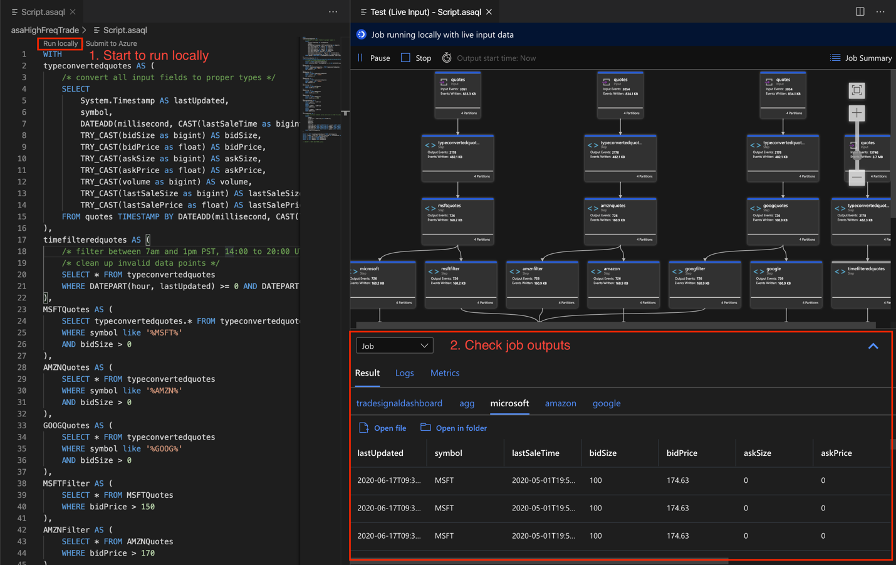
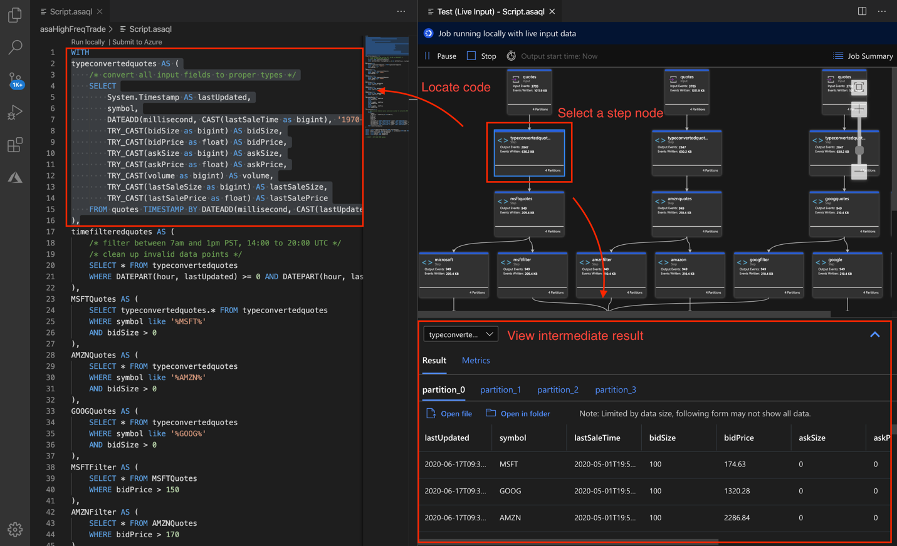
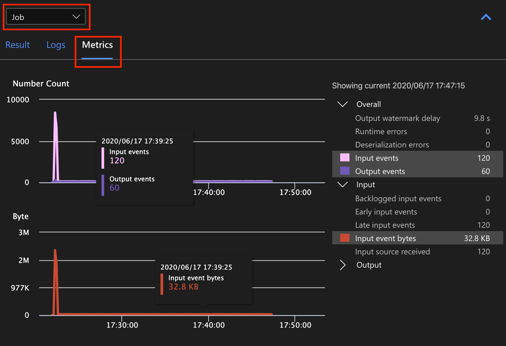
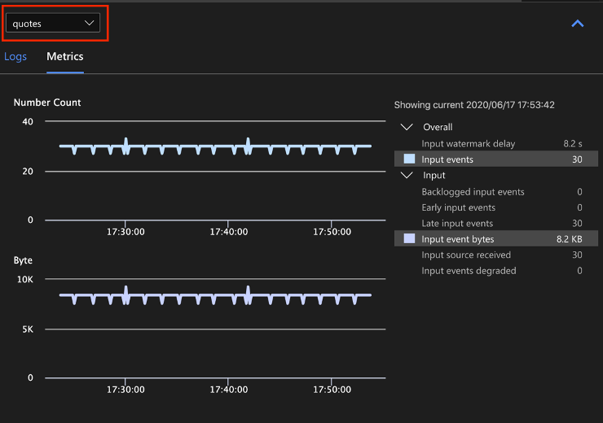
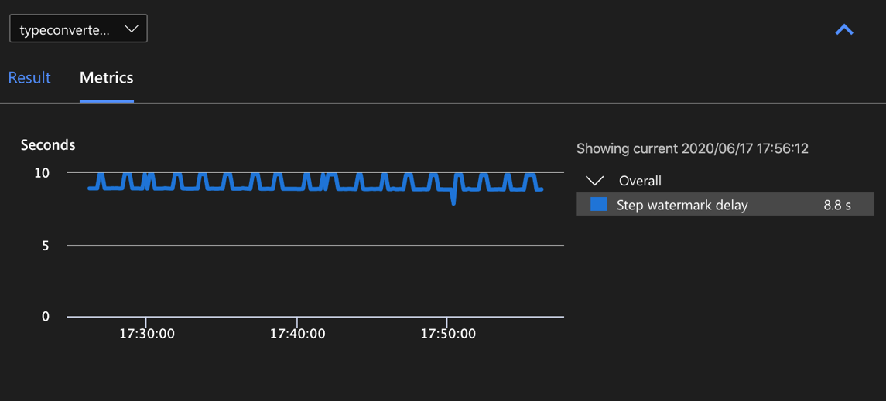
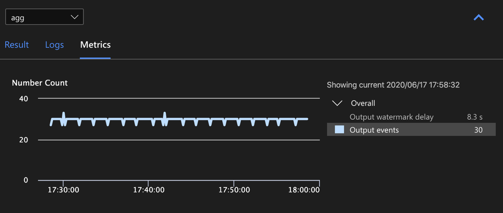
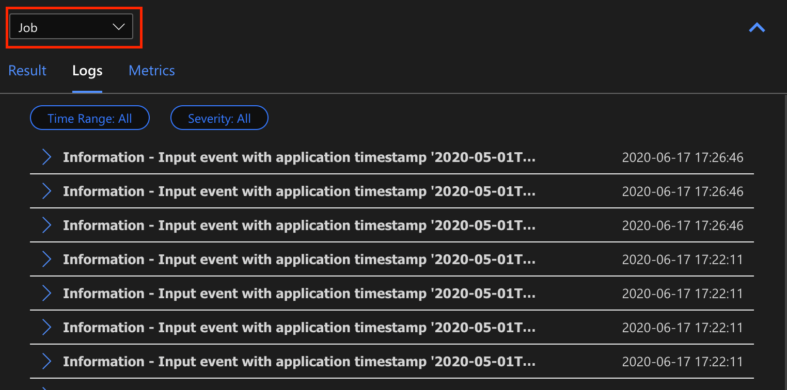
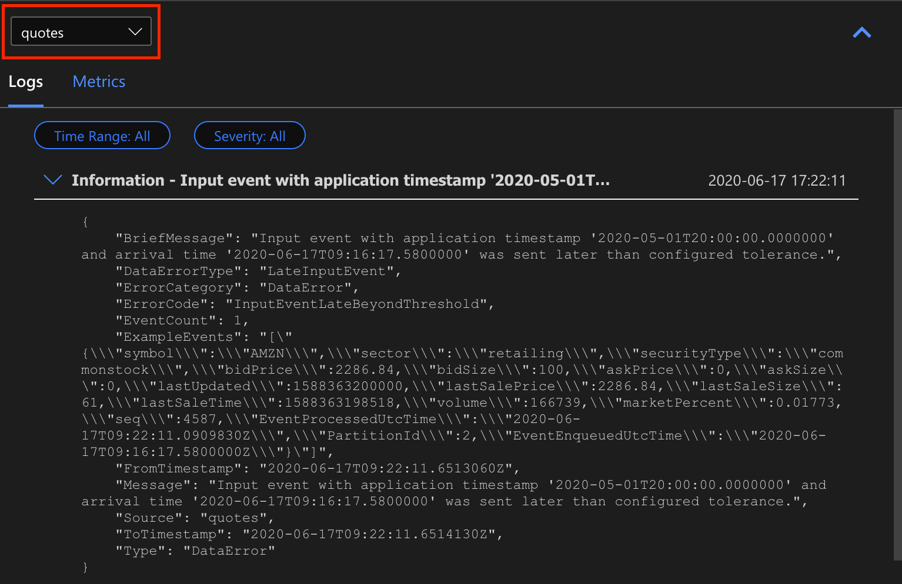
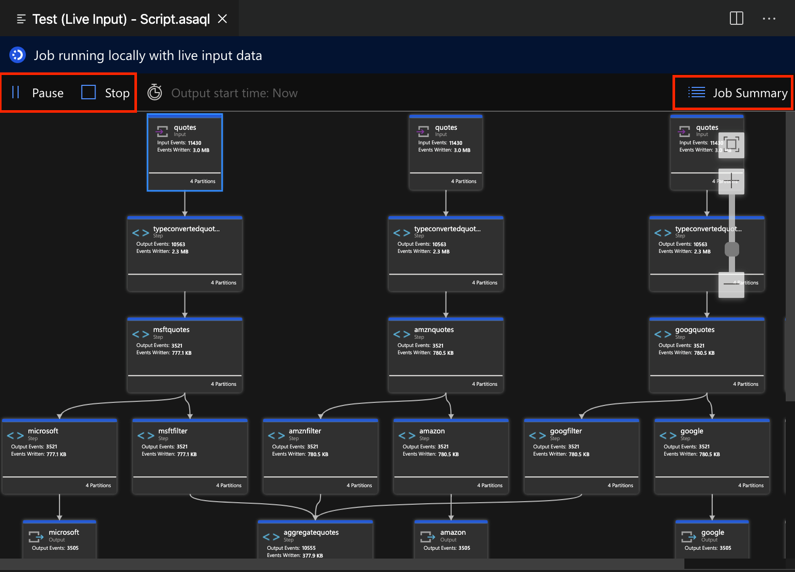
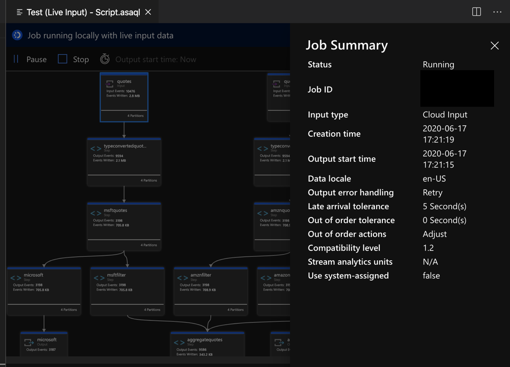

# Debug Azure Stream Analytics queries locally using job diagram in Visual Studio Code

Streaming jobs that output no result or unexpected results often need troubleshooting. The Visual Studio Code extension for Azure Stream Analytics integrates job diagrams, metrics, diagnostic logs, and intermediate results to help you quickly isolate the source of a problem. You can use the job diagram while testing your query locally to examine the intermediate result set and metrics for each step.

## Debug a query using job diagram

An Azure Stream Analytics script is used to transform input data to output data. The job diagram shows how data flows from input sources, like Event Hub or IoT Hub, through multiple query steps to output sinks. Each query step is mapped to a temporary result set defined in the script using a `WITH` statement. You can view the data as well as metrics of each query step in each intermediate result set to find the source of an issue.

> [!NOTE]
> This job diagram only shows the data and metrics for local testing in a single node. It should not be used for performance tuning and troubleshooting.

### Start local testing

Use this [Quickstart](quick-create-vs-code.md) to learn how to create a Stream Analytics job using Visual Studio Code or [export an existing job to a local project](visual-studio-code-explore-jobs.md). Credentials for inputs and outputs are automatically populated for exported jobs.

If you want to test the query with local input data, follow these [instructions](visual-studio-code-local-run.md). If you want to test with live input, [configure your input](stream-analytics-add-inputs.md) move to the next step. 

Open the *\.asaql* script file and select **Run locally**. Then, select **Use local input** or **Use live input**. The job diagram appears on the right side of the window.

### View the output and intermediate result set  

1. All the job outputs are displayed in the result window at the bottom-right side of the Visual Studio Code window.

   > [!div class="mx-imgBorder"]
   > 

2. Select the query step to navigate to the script. You're automatically directed to the corresponding script in the editor on the left. The intermediate result appears in the result window at the bottom-right side of the Visual Studio Code window.

   > [!div class="mx-imgBorder"]
   > 

### View metrics

In this section, you explore the metrics available for each part of the diagram.

1. Select the **Metrics** tab next to the **Result** tab on the bottom-right side of the Visual Studio Code window.

2. Select **Job** from the dropdown. You can select any empty space in a graph node to navigate to job level metrics. This view contains all the metrics, which are updated every 10 seconds when the job is running. You can select or unselect the metrics on the right side to view them in the charts.

   > [!div class="mx-imgBorder"]
   > 

3. Select the name of the input data source from the dropdown to see input metrics. The input source in the screenshot below is called *quotes*. For more information about input metrics, see [Understand Stream Analytics job monitoring and how to monitor queries](stream-analytics-monitoring.md).

   > [!div class="mx-imgBorder"]
   > 

4. Select a query step from the job diagram or select the step name from the dropdown to see step level metrics. Watermark delay is the only available step metric.

   > [!div class="mx-imgBorder"]
   > 

5. Select an output in the diagram or from the dropdown to see output-related metrics. For more information about output metrics, see [Understand Stream Analytics job monitoring and how to monitor queries](stream-analytics-monitoring.md). Live output sinks aren't supported.

   > [!div class="mx-imgBorder"]
   > 

### View diagnostic logs

Job level diagnostic logs contain diagnostic information for input data sources and output sinks. When you select an input node or output node, only the corresponding logs are shown. There are no logs shown if you select a query step. You can find all logs at the job level, and you can filter the logs by severity and time.

   > [!div class="mx-imgBorder"]
   > 

   Select a log entry to see the entire message.

   > [!div class="mx-imgBorder"]
   > 

## Other job diagram features

You can select **Stop** or **Pause** from the tool bar as needed. Once the job is paused, you can resume it from last output.

> [!div class="mx-imgBorder"]
> 

Select **Job Summary** at the top-right of the job diagram to see properties and configurations for your local job.

> [!div class="mx-imgBorder"]
> 

## Limitations

* Live output sinks aren't supported in local run.

* Run job locally with JavaScript function is only supported on the Windows operating system.

* C# custom code and Azure Machine Learning functions aren't supported. 

* Only cloud input options have [time policies](stream-analytics-out-of-order-and-late-events.md) support, while local input options don't.

## Next steps

* [Quickstart: Create a Stream Analytics job using Visual Studio Code](quick-create-vs-code.md)
* [Explore Azure Stream Analytics with Visual Studio Code](visual-studio-code-explore-jobs.md)
* [Test Stream Analytics queries locally with sample data using Visual Studio Code](visual-studio-code-local-run.md)
* [Test Azure Stream Analytics jobs locally with live input using Visual Studio Code](visual-studio-code-local-run-live-input.md)
