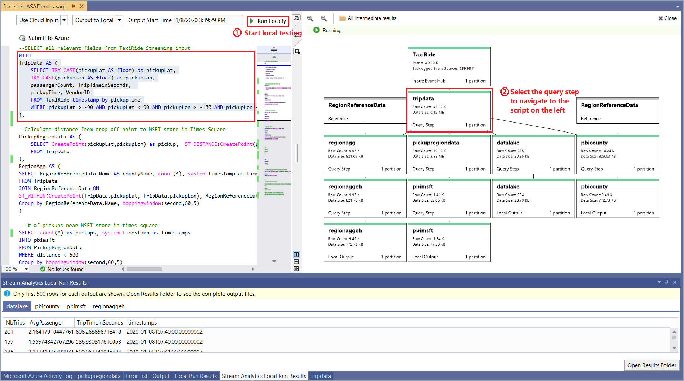
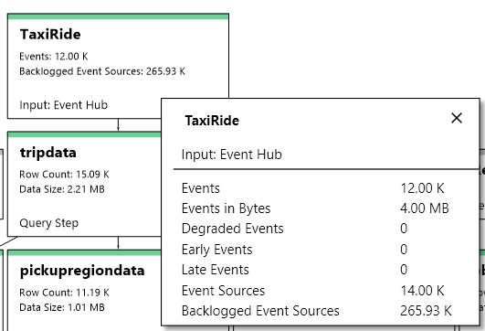
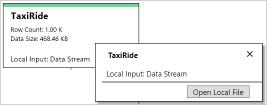
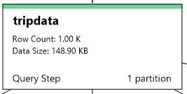

# Debug Azure Stream Analytics queries locally using job diagram in Visual Studio

Jobs that output no result or unexpected results are common troubleshooting scenarios for streaming queries. You can use the job diagram while testing your query locally in Visual Studio to examine the intermediate result set and metrics for each step. Job diagrams can help you quickly isolate the source of a problem when you troubleshoot issues.

## Debug a query using job diagram

An Azure Stream Analytics script is used to transform input data to output data. The job diagram shows how data flows from input sources (Event Hub, IoT Hub, etc.) through multiple query steps and, finally, to output sinks. Each query step is mapped to a temporary result set defined in the script using a `WITH` statement. You can view the data as well as metrics of each query step in each intermediate result set to find the source of an issue.

> [!NOTE]
> This job diagram only shows the data and metrics for local testing in a single node. It should not be used for performance tuning and troubleshooting.

### Start local testing

Use this [Quickstart](stream-analytics-quick-create-vs.md) to learn how to create a Stream Analytics job using Visual Studio or [export an existing job to a local project](stream-analytics-vs-tools.md#export-jobs-to-a-project). If you want to test the query with local input data, follow these [instructions](stream-analytics-live-data-local-testing.md). If you want to test with live input, move to the next step.

> [!NOTE]
> If you export a job to local project and want to test against a live input stream, you need to specify the credentials for all inputs again.  

Choose the input and output source from the script editor and select **Run locally**. The job diagram appears on the right side.

### View the intermediate result set  

1. Select the query step to navigate to the script. You are automatically directed to the corresponding script in the editor on the left.

   

2. Select the query step and select **Preview** in the popped up dialog. The result set is shown in a tab in the bottom result window.

   

### View step metrics

In this section, you explore the metrics available for each part of the diagram.

#### Input sources (Live stream)

|Metric|Description|
|-|-|
|**TaxiRide**| The name of the input.|
|**Event Hub** | Input source type.|
|**Events**|The number of events read.|
|**Backlogged Event Sources**|How many more messages need to be read for Event Hubs and IoT Hub inputs.|
|**Events in Bytes**|The number of bytes read.|
| **Degraded Events**|The count of events that had an issue other than with deserialization.|
|**Early Events**| The number of events that have an application timestamp before the high watermark.|
|**Late Events**| The number of events that have an application timestamp after the high watermark.|
|**Event Sources**| The number of data units read. For example, the number of blobs.|

#### Input sources (Local input)

|Metric|Description|
|-|-|
|**TaxiRide**| The name of the input.|
|**Row Count**| The number of rows generated from the step.|
|**Data Size**| The size of data generated from this step.|
|**Local input**| Use local data as input.|

#### Query steps

|Metric|Description|
|-|-|
|**TripData**|The name of the temporary result set.|
|**Row Count**| The number of rows generated from the step.|
|**Data Size**| The size of data generated from this step.|
  
#### Output sinks (Live output)

|Metric|Description|
|-|-|
|**regionaggEH**|The name of the output.|
|**Events**|The number of events output to sinks.|

#### Output sinks (Local output)

|Metric|Description|
|-|-|
|**regionaggEH**|The name of the output.|
|**Local Output**| Result output to a local file.|
|**Row Count**| The number of rows output to the local file.|
|**Data Size**| The size of data output to the local file.|

### Close job diagram

If you don't need the job diagram anymore, select **Close** on the top right corner. After closing the diagram window, you need to start local testing again to see it.

### View job level metrics and stop running

Other job level metrics shows up in the pop up console. Press **Ctrl+C** in the console if you want to stop the job.

## Limitations

* Power BI and Azure Data Lake Storage Gen1 output sinks are not supported due to authentication model limitations.

* Only cloud input options have [time policies](stream-analytics-out-of-order-and-late-events.md) support, while local input options do not.

## Next steps

* [Quickstart: Create a Stream Analytics job using Visual Studio](stream-analytics-quick-create-vs.md)
* [Use Visual Studio to view Azure Stream Analytics jobs](stream-analytics-vs-tools.md)
* [Test live data locally using Azure Stream Analytics tools for Visual Studio (Preview)](stream-analytics-live-data-local-testing.md)
