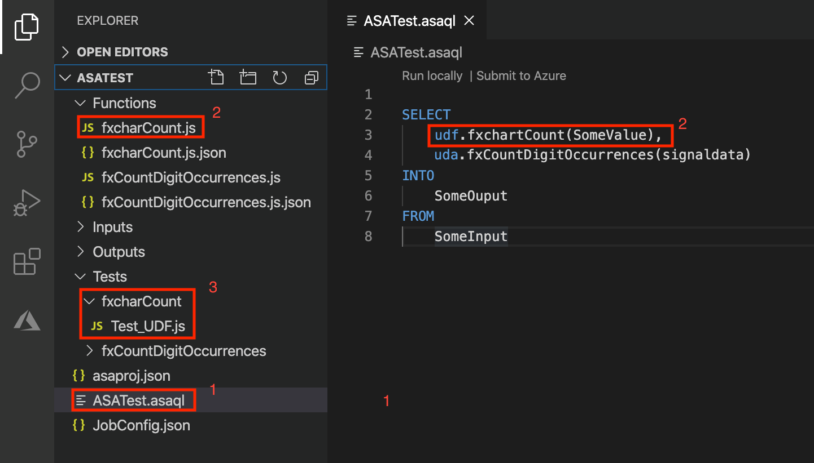
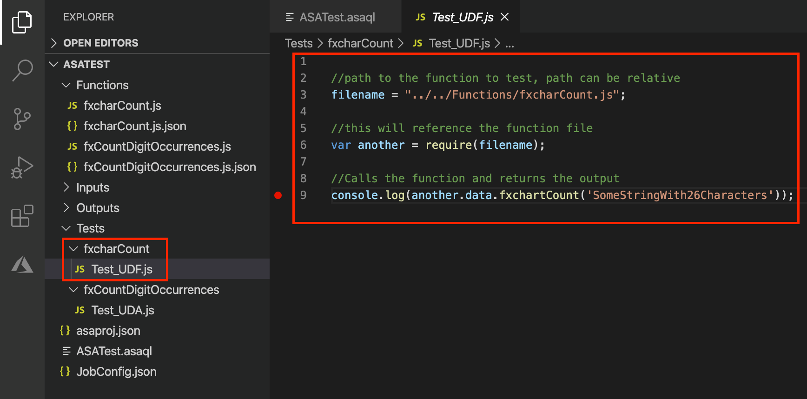
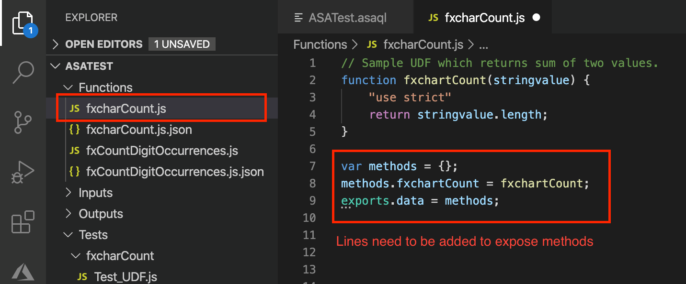
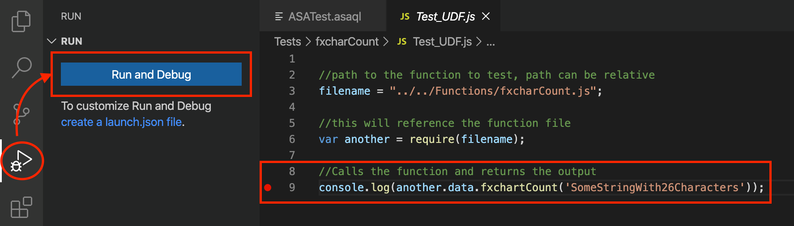
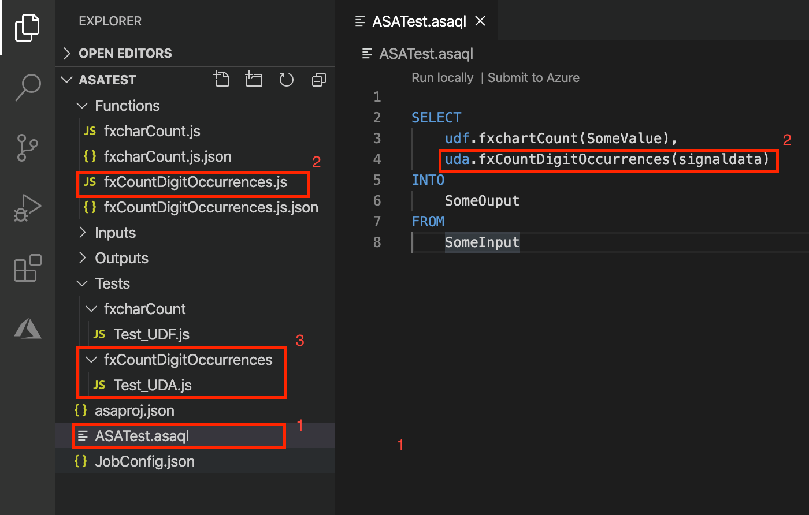
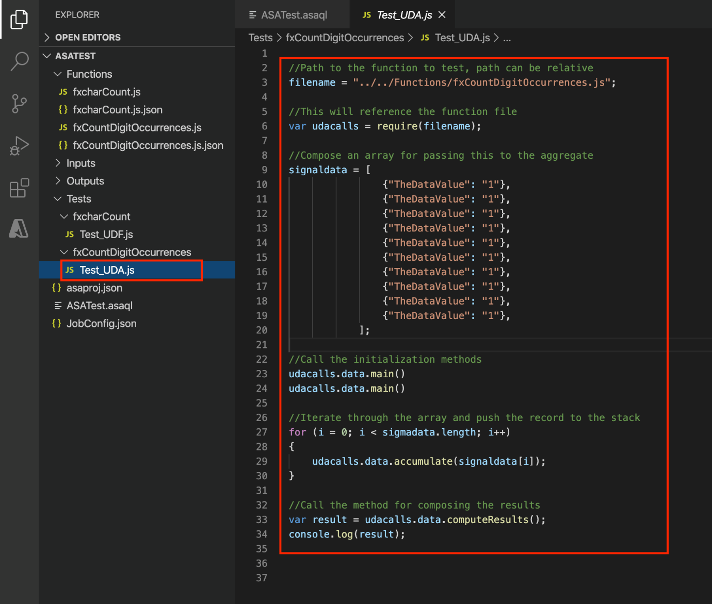
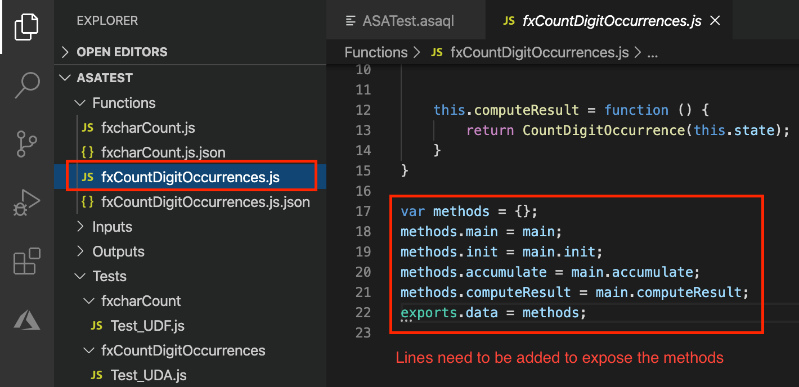
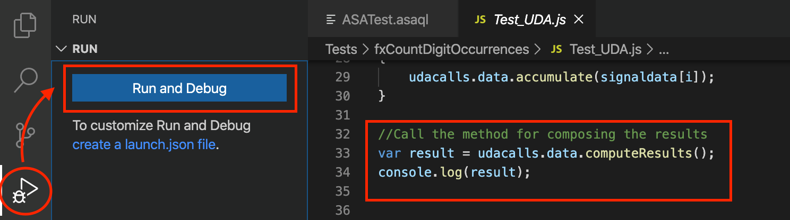

# Debug user-defined functions in Azure Stream Analytics 

When user-defined functions (UDF) don't work as you expect, you need to debug them to find the problem. You can debug UDFs for your Stream Analytics jobs when you run your jobs locally using [Visual Studio Code](visual-studio-code-local-run-live-input.md) or [Visual Studio](stream-analytics-vs-tools-local-run.md).

When you run your job against a live input stream locally, it mimics only the execution of the cloud Azure Stream Analytics engine on one node. Live data local testing can't replace the performance and scalability testing you do in the cloud, but you save time during functional testing by not having to submit your job to the cloud each time you want to test. Additionally, time policies are disabled for local run with local or sample data, but time policies are supported for live data testing.

## Pick your language

You can write UDFs for Azure Stream Analytics using .NET (C#) or JavaScript. 

### Functions in C# 

When you [write .NET UDFs using Visual Studio](stream-analytics-edge-csharp-udf-methods.md), you get the same level of support as you would for any .NET class project. This support includes:

* Compilation support, such as syntax checking and compiler support.

* The ability to add, build, and reference a C# project and artifacts in your Stream Analytics solution. 

* Easy reuse of code encapsulated in a sharable project. 

* Debug support in Visual Studio directly. Set the Stream Analytics project as start project and set breakpoints in C# code. Then, press **F5** to debug C# code as you would for any other C# project. 

### Functions in JavaScript

JavaScript is another option for creating functions in Stream Analytics. The JavaScript code is directly placed into the function area of the Stream Analytics project, which makes sharing across projects more difficult.

Compilation happens when the Stream Analytics project is compiled or executed. The chance of finding a problem only at runtime is higher. There is no debugging support for JavaScript functions in Stream Analytics directly.

## Debug options for JavaScript

Because there's no debugging support for JavaScript functions in Stream Analytics directly, you can debug by encapsulating the function in an HTML site and getting the output from there.

The following example shows you how to debug JavaScript UDFs with some limitations in an integrated runtime environment in [Visual Studio Code](quick-create-visual-studio-code.md).

### Prerequisites

Before you begin, be sure your Azure Stream Analytics project has the following items:

* An input 
* An output 
* A Stream Analytics query (.asaql) 
* A Stream Analytics job configuration (JobConfig.json)
* A JavaScript UDF

### Prepare files

In the following image, the *.asaql* query file includes only the call to the UDF, *fxcharCount*. This change ensures you're still able to compile the project after changes are made.

> [!div class="mx-imgBorder"]
> 

Create an additional folder in **Tests** to host the test file, which is called to execute the test with the JavaScript function. In this example, the name of the folder is *fxcharCount* and the name of the test is *Test_UDF.js*. 

The image below shows the code in the test file, which loads the function file and executes the function. This example is simple, but you could load additional test data files and loop through though additional tests to get the output. The notation of the function call is little different from the common calls because the file is referenced and not loaded into the runtime, making it possible to debug. 

> [!div class="mx-imgBorder"]
> 

In the function, add the following lines of code to the file to expose the methods. They don't affect the ability to compile the code in Visual Studio Code.

```javascript
var methods = {};
methods.fxchartCount = fxchartCount;
exports.data = methods;
``` 

> [!div class="mx-imgBorder"]
> 
  
## Install debug support

To debug, you must [download](https://nodejs.org/en/download/) and install **node.js**. Install the correct version according to the platform you're using. After you install the Node.js runtime, restart Visual Studio Code to implement the changes. 

Select **Run and Debug** or press **CTRL + SHIFT + D** to start debugging. A combo box appears where you can select **node.js** as the runtime. If you only have Node.js installed, it is used by default. You should be able to step through the code and into the satellite file if needed with F11. 

> [!div class="mx-imgBorder"]
> 

### Debug user-defined aggregates 

You can use the debug method for JavaScript UDFs to debug user-defined aggregates (UDA). In this example, a UDA is added to the *.asaql* query file and the test file.

As with the UDF, you include a call to the UDA to ensure that the project will compile after changes are made. 

> [!div class="mx-imgBorder"]
> 

In the *Test_UDA.js* file, you reference the UDA file as you did with the UDF. Additionally, you call `main()`, `init()`, and `accumulate()`. The `accumulate()` method is called in a loop to put the values to the state stack. The `computeresult()` method is called to compose the final query. 

> [!div class="mx-imgBorder"]
> 

As in the UDF example, some code needs to be added to the UDA itself to expose the relevant methods.

```javascript
var methods = {};
methods.main = main;
methods.init = main.init;
methods.accumulate = main.accumulate;
methods.computeResult = main.computeResult;
exports.data = methods;
``` 

> [!div class="mx-imgBorder"]
> 

Select **Run and Debug** or press **CTRL + SHIFT + D** to start debugging. A combo box appears where you can select **node.js** as the runtime. If you only have Node.js installed, it is used by default. You should be able to step through the code and into the satellite file if needed with F11.

> [!div class="mx-imgBorder"]
> 


## Next steps

* [Develop and debug Azure Stream Analytics jobs locally](develop-locally.md)
* [Debug Azure Stream Analytics queries locally using job diagram in Visual Studio](debug-locally-using-job-diagram.md)
* [User-defined functions in Azure Stream Analytics](functions-overview.md)
 
