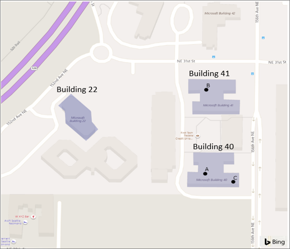
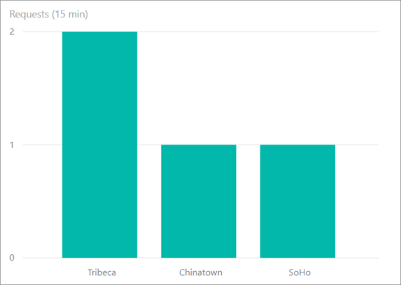

# Geofencing and geospatial aggregation scenarios with Azure Stream Analytics

With built-in geospatial functions, you can use Azure Stream Analytics to build applications for scenarios such as fleet management, ride sharing, connected cars, and asset tracking.

## Geofencing

Azure Stream Analytics supports low latency real-time geofencing computations in the cloud and on the IoT Edge runtime.

### Geofencing scenario

A manufacturing company needs to track assets on their buildings. They equipped every device with a GPS and want to receive notifications if a device leaves a certain area.

Reference data used in this example has the geofence information for the buildings and the devices that are allowed in each of the buildings. Remember that reference data could either be static or slow changing. Static reference data is used for this scenario. A stream of data continuously emits the device ID and its current position.

### Define geofences in reference data

A geofence can be defined using a GeoJSON object. For jobs with compatibility version 1.2 and higher, geofences can also be defined using Well Known Text (WKT) as `NVARCHAR(MAX)`. WKT is an Open Geospatial Consortium (OGC) standard that is used to represent spatial data in a textual format.

The built-in geospatial functions can use defined geofences to find out if an element is in or out of a specific geofence polygon.

The following table is an example of geofence reference data that could be stored in Azure blob storage or an Azure SQL table. Every site is represented by a geospatial polygon, and every device is associated with an allowed site ID.

|SiteID|SiteName|Geofence|AllowedDeviceID|
|------|--------|--------|---------------|
|1|"Redmond Building 41"|"POLYGON((-122.1337357922017 47.63782998329432,-122.13373042778369 47.637634793257305,-122.13346757130023 47.637642022530954,-122.13348902897235 47.637508280806806,-122.13361777500506 47.637508280806806,-122.13361241058703 47.63732393354484,-122.13265754417773 47.63730947490855,-122.13266290859576 47.637519124743164,-122.13302232460376 47.637515510097955,-122.13301696018573 47.63764925180358,-122.13272728161212 47.63764925180358,-122.13274873928424 47.63784082716388,-122.13373579220172 47.63782998329432))"|"B"|
|2|"Redmond Building 40"|"POLYGON((-122.1336154507967 47.6366745947009,-122.13361008637867 47.636483015064535,-122.13349206918201 47.636479400347675,-122.13349743360004 47.63636372927573,-122.13372810357532 47.63636372927573,-122.13373346799335 47.63617576323771,-122.13263912671528 47.63616491902258,-122.13264985555134 47.63635649982525,-122.13304682248554 47.636367344000604,-122.13305218690357 47.63650831807564,-122.13276250832996 47.636497473929516,-122.13277323716602 47.63668543881025,-122.1336154507967 47.6366745947009))"|"A"|
|3|"Redmond Building 22"|"POLYGON((-122.13611660248233 47.63758544698554,-122.13635263687564 47.6374083293018,-122.13622389084293 47.63733603619712,-122.13622389084293 47.63717699101473,-122.13581619507266 47.63692757827657,-122.13559625393344 47.637046862778135,-122.13569281345798 47.637144458985965,-122.13570890671207 47.637314348246214,-122.13611660248233 47.63758544698554))"|"C"|

### Generate alerts with geofence

Devices can emit their ID and location every minute through a stream called `DeviceStreamInput`. The following table is a stream of input.

|DeviceID|GeoPosition|
|--------|-----------|
|"A"|"POINT(-122.13292341559497 47.636318374032726)"|
|"B"|"POINT(-122.13338475554553 47.63743531308874)"|
|"C"|"POINT(-122.13354001095752 47.63627622505007)"|

You can write a query that joins the device stream with the geofence reference data and generates an alert every time a device is outside of an allowed building.

```SQL
SELECT DeviceStreamInput.DeviceID, SiteReferenceInput.SiteID, SiteReferenceInput.SiteName 
INTO Output
FROM DeviceStreamInput 
JOIN SiteReferenceInput
ON st_within(DeviceStreamInput.GeoPosition, SiteReferenceInput.Geofence) = 0
WHERE DeviceStreamInput.DeviceID = SiteReferenceInput.AllowedDeviceID
```

The following image represents the geofences. You can see where the devices are in accordance to the stream data input.



Device "C" is located inside building ID 2, which is not allowed according to the reference data. This device should be located inside building ID 3. Running this job will generate an alert for this specific violation.

### Site with multiple allowed devices

If a site allows multiple devices, an array of device IDs can be defined in `AllowedDeviceID` and a User-Defined Function can be used on the `WHERE` clause to verify if the stream device ID matches any device ID in that list. For more information, view the [Javascript UDF](stream-analytics-javascript-user-defined-functions.md) tutorial for cloud jobs and the [C# UDF](stream-analytics-edge-csharp-udf.md) tutorial for edge jobs.

## Geospatial aggregation

Azure Stream Analytics supports low latency real-time geospatial aggregation in the cloud and on the IoT Edge runtime.

### Geospatial aggregation scenario

A cab company wants to build a real-time application to guide their cab drivers looking for ride towards the areas of the cities currently experiencing higher demand.

The company stores logical regions of the city as reference data. Each region is defined by a RegionID, RegionName, and Geofence.

### Define the geofences

The following table is an example of geofence reference data that could be stored in Azure blob storage or an Azure SQL table. Every region is represented by a geospatial polygon, which is used to correlate with the requests coming from streaming data.

These polygons are for reference only and do not represent actual city logical or physical separations.

|RegionID|RegionName|Geofence|
|--------|----------|--------|
|1|"SoHo"|"POLYGON((-74.00279525078275 40.72833625216264,-74.00547745979765 40.721929158663244,-74.00125029839018 40.71893680218994,-73.9957785919998 40.72521409075776,-73.9972377137039 40.72557184584898,-74.00279525078275 40.72833625216264))"|
|2|"Chinatown"|"POLYGON((-73.99712367114876 40.71281582267133,-73.9901070123658 40.71336881907936,-73.99023575839851 40.71452359088633,-73.98976368961189 40.71554823078944,-73.99551434573982 40.717337246783735,-73.99480624255989 40.718491949759304,-73.99652285632942 40.719109951574,-73.99776740131233 40.7168005470334,-73.99903340396736 40.71727219249899,-74.00193018970344 40.71938642421256,-74.00409741458748 40.71688186545551,-74.00051398334358 40.71517415773184,-74.0004281526551 40.714377212470005,-73.99849696216438 40.713450141693166,-73.99748845157478 40.71405192594819,-73.99712367114876 40.71281582267133))"|
|3|"Tribeca"|"POLYGON((-74.01091641815208 40.72583120006787,-74.01338405044578 40.71436586362705,-74.01370591552757 40.713617702123415,-74.00862044723533 40.711308107057235,-74.00194711120628 40.7194238654018,-74.01091641815208 40.72583120006787))"|

### Aggregate data over a window of time

The following table contains streaming data of "rides."

|UserID|FromLocation|ToLocation|TripRequestedTime|
|------|------------|----------|-----------------|
|"A"|"POINT(-74.00726861389182 40.71610611981975)"|"POINT(-73.98615095917779 40.703107386025835)"|"2019-03-12T07:00:00Z"|
|"B"|"POINT(-74.00249841021645 40.723827238895666)"|"POINT(-74.01160699942085 40.71378884930115)"|"2019-03-12T07:01:00Z"|
|"C"|"POINT(-73.99680120565864 40.716439898624024)"|"POINT(-73.98289663412544 40.72582343969828)"|"2019-03-12T07:02:00Z"|
|"D"|"POINT(-74.00741090068288 40.71615626755086)"|"POINT(-73.97999843120539 40.73477895807408)"|"2019-03-12T07:03:00Z"|

The following query joins the device stream with the geofence reference data and calculates the number of requests per region on a time window of 15 minutes every minute.

```SQL
SELECT count(*) as NumberOfRequests, RegionsRefDataInput.RegionName 
FROM UserRequestStreamDataInput
JOIN RegionsRefDataInput 
ON st_within(UserRequestStreamDataInput.FromLocation, RegionsRefDataInput.Geofence) = 1
GROUP BY RegionsRefDataInput.RegionName, hoppingwindow(minute, 1, 15)
```

This query outputs a count of requests every minute for the last 15 minutes by each region within the city. This information can be displayed easily by Power BI dashboard, or can be broadcasted to all drivers as SMS text messages through integration with services like Azure functions.

The image below illustrates the output of the query to Power BI dashboard. 




## Next steps

* [Introduction to Stream Analytics geospatial functions](stream-analytics-geospatial-functions.md)
* [GeoSpatial Functions (Azure Stream Analytics)](https://docs.microsoft.com/stream-analytics-query/geospatial-functions)
