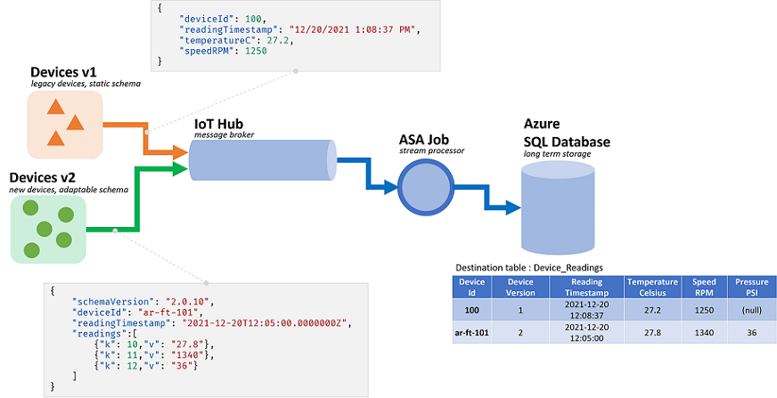

# Input validation in Azure Stream Analytics queries

**Input validation** is a technique to use to protect the main query logic from malformed or unexpected events. The query is upgraded to explicitly process and check records so they can't break the main logic.

To implement input validation, we add two initial steps to a query. We first make sure the schema submitted to the core business logic matches its expectations. We then triage exceptions, and optionally route invalid records into a secondary output.

A query with input validation will be structured as follows:

```SQL
WITH preProcessingStage AS (
	SELECT
		-- Rename incoming fields, used for audit and debugging
		field1 AS in_field1,
		field2 AS in_field2,
		...

		-- Try casting fields in their expected type
		TRY_CAST(field1 AS bigint) as field1,
		TRY_CAST(field2 AS array) as field2,
		...

	FROM myInput TIMESTAMP BY myTimestamp
),

triagedOK AS (
	SELECT -- Only fields in their new expected type
		field1,
		field2,
		...
	FROM preProcessingStage
	WHERE ( ... ) -- Clauses make sure that the core business logic expectations are satisfied
),

triagedOut AS (
	SELECT -- All fields to ease diagnostic
		*
	FROM preProcessingStage
	WHERE NOT (...) -- Same clauses as triagedOK, opposed with NOT
)

-- Core business logic
SELECT
	...
INTO myOutput
FROM triagedOK
...

-- Audit output. For human review, correction, and manual re-insertion downstream
SELECT
	*
INTO BlobOutput -- To a storage adapter that doesn't require strong typing, here blob/adls
FROM triagedOut
```

To see a comprehensive example of a query set up with input validation, see the section: [Example of query with input validation](#example-of-query-with-input-validation).

This article illustrates how to implement this technique.

## Context

Azure Stream Analytics (ASA) jobs process data coming from streams. Streams are sequences of raw data that are transmitted [serialized](https://en.wikipedia.org/wiki/Serialization) (CSV, JSON, AVRO...). To read from a stream, an application will need to know the specific serialization format used. In ASA, the **event serialization format** has to be defined when configuring a [streaming input](./stream-analytics-define-inputs.md).

Once the data is deserialized, **a schema needs to be applied to give it meaning**. By schema we mean the list of fields in the stream, and their respective data types. With ASA, the schema of the incoming data doesn't need to be set at the input level. ASA instead supports **dynamic input schemas** natively. It expects **the list of fields (columns), and their types, to change between events (rows)**. ASA will also infer data types when none is provided explicitly, and try to implicitly cast types when needed.

**Dynamic schema handling** is a powerful feature, key to stream processing. Data streams often contain data from multiple sources, with multiple event types, each with a unique schema. To route, filter, and process events on such streams, ASA has to ingest them all whatever their schema.



But the capabilities offered by dynamic schema handling come with a potential downside. Unexpected events can flow through the main query logic and break it. As an example, we can use [ROUND](/stream-analytics-query/round-azure-stream-analytics) on a field of type `NVARCHAR(MAX)`. ASA will implicitly cast it to float to match the signature of `ROUND`. Here we expect, or hope, this field will always contain numeric values. But when we do receive an event with the field set to `"NaN"`, or if the field is entirely missing, then the job may fail.

With input validation, we add preliminary steps to our query to handle such malformed events. We'll primarily use [WITH](/stream-analytics-query/with-azure-stream-analytics) and [TRY_CAST](/stream-analytics-query/try-cast-azure-stream-analytics) to implement it.

## Scenario: input validation for unreliable event producers

We'll be building a new ASA job that will ingest data from a single event hub. As is most often the case, we aren't responsible for the data producers. Here the producers are IoT devices sold by multiple hardware vendors.

Meeting with the stakeholders, we agree on a serialization format and a schema. All the devices will push such messages to a common event hub, input of the ASA job.

The schema contract is defined as follows:

|Field name|Field type|Field description|
|-|-|-|
|`deviceId`|Integer|Unique device identifier|
|`readingTimestamp`|Datetime|Message time, generated by a central gateway|
|`readingStr`|String||
|`readingNum`|Numeric||
|`readingArray`|Array of String||

Which in turns gives us the following sample message under JSON serialization:

```JSON
{
    "deviceId" : 1,
    "readingTimestamp" : "2021-12-10T10:00:00",
    "readingStr" : "A String",
    "readingNum" : 1.7,
    "readingArray" : ["A","B"]
}
```

We can already see a **discrepancy between the schema contract and its implementation**. In the JSON format, there's [no data type for datetime](https://en.wikipedia.org/wiki/JSON#Data_types). It will be transmitted as a string (see `readingTimestamp` above). ASA can easily address the issue, but it shows the need to validate and explicitly cast types. All the more for data serialized in CSV, since all values are then transmitted as string.

There's another discrepancy. **ASA uses its own type system** that doesn't match the incoming one. If ASA has [built-in types](/stream-analytics-query/data-types-azure-stream-analytics) for integer (bigint), datetime, string (nvarchar(max)) and arrays, it only supports numeric via float. This mismatch isn't an issue for most applications. But in certain edge cases, it could cause slight drifts in precision. In this case, we would convert the numeric value as string in a new field. Then downstream, we would use a system that supports fixed decimal to detect and correct potential drifts.

Back to our query, here we intend to:

- Pass `readingStr` to a [JavaScript UDF](./stream-analytics-javascript-user-defined-functions.md)
- Count the number of records in the array
- Round `readingNum` to the second decimal place
- Insert the data into a SQL table

The destination SQL table has the following schema:

```SQL
CREATE TABLE [dbo].[readings](
    [Device_Id] int NULL,
    [Reading_Timestamp] datetime2(7) NULL,
    [Reading_String] nvarchar(200) NULL,
    [Reading_Num] decimal(18,2) NULL,
    [Array_Count] int NULL
) ON [PRIMARY]
```

It's a good practice to map what happens to each field as it goes through the job:

|Field|Input (JSON)|Inherited type (ASA)|Output (Azure SQL)|Comment|
|-|-|-|-|-|
|`deviceId`|number|bigint|integer||
|`readingTimestamp`|string|nvarchar(MAX)|datetime2||
|`readingStr`|string|nvarchar(MAX)|nvarchar(200)|used by the UDF|
|`readingNum`|number|float|decimal(18,2)|to be rounded|
|`readingArray`|array(string)|array of nvarchar(MAX)|integer|to be counted|

## Prerequisites

We'll develop the query in **Visual Studio Code** using the **ASA Tools** extension. The first steps of this [tutorial](./quick-create-visual-studio-code.md) will guide you through installing the required components.

In VS Code, we'll use [local runs](./visual-studio-code-local-run-all.md) with **local** input/output to not incur any cost, and speed up the debugging loop. **We won't need** to set up an event hub or an Azure SQL Database.

## Base query

Let's start with a basic implementation, with **no input validation**. We'll add it in the next section.

In VS Code, we'll [create a new ASA project](./quick-create-visual-studio-code.md#create-a-stream-analytics-project)

In the `input` folder, we'll create a new JSON file called `data_readings.json` and add the following records to it:

```JSON
[
    {
        "deviceId" : 1,
        "readingTimestamp" : "2021-12-10T10:00:00",
        "readingStr" : "A String",
        "readingNum" : 1.7145,
        "readingArray" : ["A","B"]
    },
    {
        "deviceId" : 2,
        "readingTimestamp" : "2021-12-10T10:01:00",
        "readingStr" : "Another String",
        "readingNum" : 2.378,
        "readingArray" : ["C"]
    },
    {
        "deviceId" : 3,
        "readingTimestamp" : "2021-12-10T10:01:20",
        "readingStr" : "A Third String",
        "readingNum" : -4.85436,
        "readingArray" : ["D","E","F"]
    },
    {
        "deviceId" : 4,
        "readingTimestamp" : "2021-12-10T10:02:10",
        "readingStr" : "A Forth String",
        "readingNum" : 1.2126,
        "readingArray" : ["G","G"]
    }
]
```

Then we'll [define a local input](./visual-studio-code-local-run.md#define-a-local-input), called `readings`, referencing the JSON file we created above.

Once configured it should look like this:

```JSON
{
    "InputAlias": "readings",
    "Type": "Data Stream",
    "Format": "Json",
    "FilePath": "data_readings.json",
    "ScriptType": "InputMock"
}
```

With **preview data**, we can observe that our records are loaded properly.

We'll create a new **JavaScript UDF** called `udfLen` by right-clicking on the `Functions` folder and selecting `ASA: Add Function`. The code we'll use is:

```JavaScript
// Sample UDF that returns the length of a string for demonstration only: LEN will return the same thing in ASAQL
function main(arg1) {
    return arg1.length;
}
```

In [local runs](./visual-studio-code-local-run-all.md), we don't need to define outputs. We don't even need to use `INTO` unless there are more than one output. In the `.asaql` file, we can replace the existing query by:

```SQL
SELECT
	r.deviceId,
	r.readingTimestamp,
	SUBSTRING(r.readingStr,1,200) AS readingStr,
	ROUND(r.readingNum,2) AS readingNum,
	COUNT(a.ArrayValue) AS arrayCount
FROM readings AS r TIMESTAMP BY r.readingTimestamp
CROSS APPLY GetArrayElements(r.readingArray) AS a
WHERE UDF.udfLen(r.readingStr) >= 2
GROUP BY
	System.Timestamp(), --snapshot window
	r.deviceId,
	r.readingTimestamp,
	r.readingStr,
	r.readingNum
```

Let's quickly go through the query we submitted:

- To count the number of records in each array, we first need to unpack them. We'll use **[CROSS APPLY](/stream-analytics-query/apply-azure-stream-analytics)** and [GetArrayElements()](/stream-analytics-query/getarrayelements-azure-stream-analytics) (more [samples here](./stream-analytics-parsing-json.md))
  - Doing so, we surface two data sets in the query: the original input and the array values. To make sure we don't mix up fields, we define aliases (`AS r`) and use them everywhere
  - Then to actually `COUNT` the array values, we need to aggregate with **[GROUP BY](/stream-analytics-query/group-by-azure-stream-analytics)**
  - For that we must define a [time window](./stream-analytics-window-functions.md). Here since we don't need one for our logic, the [snapshot window](/stream-analytics-query/snapshot-window-azure-stream-analytics) is the  right choice
- We also have to `GROUP BY` all the fields, and project them all in the `SELECT`. Explicitly projecting fields is a good practice, as `SELECT *` will let errors flow through from the input to the output
  - If we define a time window, we may want to define a timestamp with **[TIMESTAMP BY](/stream-analytics-query/timestamp-by-azure-stream-analytics)**. Here it's not necessary for our logic to work. For local runs, without `TIMESTAMP BY` all records are loaded on a single timestamp, the run start time.
- We use the UDF to filter readings where `readingStr` has fewer than two characters. We should have used [LEN](/stream-analytics-query/len-azure-stream-analytics) here. We're using a UDF for demonstration purpose only

We can [start a run](./visual-studio-code-local-run.md#run-queries-locally) and observe the data being processed:

|deviceId|readingTimestamp|readingStr|readingNum|arrayCount|
|-|-|-|-|-|
|1|2021-12-10T10:00:00|A String|1.71|2|
|2|2021-12-10T10:01:00|Another String|2.38|1|
|3|2021-12-10T10:01:20|A Third String|-4.85|3|
|1|2021-12-10T10:02:10|A Forth String|1.21|2|

Now that we know our query is working, let's test it against more data. Let's replace the content of `data_readings.json` by the following records:

```JSON
[
    {
        "deviceId" : 1,
        "readingTimestamp" : "2021-12-10T10:00:00",
        "readingStr" : "A String",
        "readingNum" : 1.7145,
        "readingArray" : ["A","B"]
    },
    {
        "deviceId" : 2,
        "readingTimestamp" : "2021-12-10T10:01:00",
        "readingNum" : 2.378,
        "readingArray" : ["C"]
    },
    {
        "deviceId" : 3,
        "readingTimestamp" : "2021-12-10T10:01:20",
        "readingStr" : "A Third String",
        "readingNum" : "NaN",
        "readingArray" : ["D","E","F"]
    },
    {
        "deviceId" : 4,
        "readingTimestamp" : "2021-12-10T10:02:10",
        "readingStr" : "A Forth String",
        "readingNum" : 1.2126,
        "readingArray" : {}
    }
]
```

Here we can see the following issues:

- Device #1 did everything right
- Device #2 forgot to include a `readingStr`
- Device #3 sent `NaN` as a number
- Device #4 sent an empty record instead of an array

Running the job now shouldn't end well. We'll get one of the following error messages:

Device 2 will give us:

```LOG
[Error] 12/22/2021 10:05:59 PM : **System Exception** Function 'udflen' resulted in an error: 'TypeError: Unable to get property 'length' of undefined or null reference' Stack: TypeError: Unable to get property 'length' of undefined or null reference at main (Unknown script code:3:5)
[Error] 12/22/2021 10:05:59 PM :    at Microsoft.EventProcessing.HostedRuntimes.JavaScript.JavaScriptHostedFunctionsRuntime.
```

Device 3 will give us:

```LOG
[Error] 12/22/2021 9:52:32 PM : **System Exception** The 1st argument of function round has invalid type 'nvarchar(max)'. Only 'bigint', 'float' is allowed.
[Error] 12/22/2021 9:52:32 PM :    at Microsoft.EventProcessing.SteamR.Sql.Runtime.Arithmetics.Round(CompilerPosition pos, Object value, Object length)
```

Device 4 will give us:

```LOG
[Error] 12/22/2021 9:50:41 PM : **System Exception** Cannot cast value of type 'record' to type 'array' in expression 'r . readingArray'. At line '9' and column '30'. TRY_CAST function can be used to handle values with unexpected type.
[Error] 12/22/2021 9:50:41 PM :    at Microsoft.EventProcessing.SteamR.Sql.Runtime.Cast.ToArray(CompilerPosition pos, Object value, Boolean isUserCast)
```

Each time malformed records were allowed to flow from the input to the main query logic without being validated. Now we realize the value of input validation.

## Implementing input validation

Let's extend our query to validate the input.

The first step of input validation is to define the schema expectations of the core business logic. Looking back at original requirement, our main logic is to:

- Pass `readingStr` to a [JavaScript UDF](./stream-analytics-javascript-user-defined-functions.md) to measure its length
- Count the number of records in the array
- Round `readingNum` to the second decimal place
- Insert the data into a SQL table

For each point we can list the expectations:

- The UDF requires an argument of type string (nvarchar(max) here) that can't be null
- `GetArrayElements()` requires an argument of type array, or a null value
- `Round` requires an argument of type bigint or float, or a null value
- Instead of relying on the implicit casting of ASA, we should do it ourselves and handle type conflicts in the query

One way to go is to adapt the main logic to deal with these exceptions. But in this case, we believe our main logic to be perfect. So let's validate the incoming data instead.

First, let's use [WITH](/stream-analytics-query/with-azure-stream-analytics) to add an input validation layer as the first step of the query. We'll use [TRY_CAST](/stream-analytics-query/try-cast-azure-stream-analytics) to convert fields to their expected type, and set them to `NULL` if the conversion fails:

```SQL
WITH readingsValidated AS (
	SELECT
		-- Rename incoming fields, used for audit and debugging
		deviceId AS in_deviceId,
		readingTimestamp AS in_readingTimestamp,
		readingStr AS in_readingStr,
		readingNum AS in_readingNum,
		readingArray AS in_readingArray,

		-- Try casting fields in their expected type
		TRY_CAST(deviceId AS bigint) as deviceId,
		TRY_CAST(readingTimestamp AS datetime) as readingTimestamp,
		TRY_CAST(readingStr AS nvarchar(max)) as readingStr,
		TRY_CAST(readingNum AS float) as readingNum,
		TRY_CAST(readingArray AS array) as readingArray

	FROM readings TIMESTAMP BY readingTimestamp
)

-- For debugging only
SELECT * FROM readingsValidated
```

With the last input file we used (the one with errors), this query will return the following set:

|in_deviceId|in_readingTimestamp|in_readingStr|in_readingNum|in_readingArray|deviceId|readingTimestamp|readingStr|readingNum|readingArray|
|-|-|-|-|-|-|-|-|-|-|
|1|2021-12-10T10:00:00|A String|1.7145|["A","B"]|1|2021-12-10T10:00:00.0000000Z|A String|1.7145|["A","B"]|
|2|2021-12-10T10:01:00|NULL|2.378|["C"]|2|2021-12-10T10:01:00.0000000Z|NULL|2.378|["C"]|
|3|2021-12-10T10:01:20|A Third String|**NaN**|["D","E","F"]|3|2021-12-10T10:01:20.0000000Z|A Third String|**NULL**|["D","E","F"]|
|4|2021-12-10T10:02:10|A Forth String|1.2126|**{}**|4|2021-12-10T10:02:10.0000000Z|A Forth String|1.2126|**NULL**|

Already we can see two of our errors being addressed. We transformed `NaN` and `{}` into `NULL`. We're now confident these records will be inserted properly in the destination SQL table.

We now have to decide how to address the records with missing or invalid values. After some discussion, we decide to reject records with an empty/invalid `readingArray` or a missing `readingStr`.

So we add a second layer that will triage records between the validation one and the main logic:

```SQL
WITH readingsValidated AS (
	...
),

readingsToBeProcessed AS (
	SELECT
		deviceId,
		readingTimestamp,
		readingStr,
		readingNum,
		readingArray
	FROM readingsValidated
	WHERE
		readingStr IS NOT NULL
	AND readingArray IS NOT NULL
),

readingsToBeRejected AS (
	SELECT
		*
	FROM readingsValidated
	WHERE -- Same clauses as readingsToBeProcessed, opposed with NOT
	NOT (
		readingStr IS NOT NULL
	AND readingArray IS NOT NULL
	)
)

-- For debugging only
SELECT * INTO Debug1 FROM readingsToBeProcessed
SELECT * INTO Debug2 FROM readingsToBeRejected
```

It's good practice to write a single `WHERE` clause for both outputs, and use `NOT (...)` in the second one. That way no records can be excluded from both outputs and lost.

Now we get two outputs. **Debug1** has the records that will be sent to the main logic:

|deviceId|readingTimestamp|readingStr|readingNum|readingArray|
|-|-|-|-|-|
|1|2021-12-10T10:00:00.0000000Z|A String|1.7145|["A","B"]|
|3|2021-12-10T10:01:20.0000000Z|A Third String|NULL|["D","E","F"]|

**Debug2** has the records that will be rejected:

|in_deviceId|in_readingTimestamp|in_readingStr|in_readingNum|in_readingArray|deviceId|readingTimestamp|readingStr|readingNum|readingArray|
|-|-|-|-|-|-|-|-|-|-|
|2|2021-12-10T10:01:00|NULL|2.378|["C"]|2|2021-12-10T10:01:00.0000000Z|**NULL**|2.378|["C"]|
|4|2021-12-10T10:02:10|A Forth String|1.2126|{}|4|2021-12-10T10:02:10.0000000Z|A Forth String|1.2126|**NULL**|

The final step is to add our main logic back. We'll also add the output that gathers rejects. Here it's best to use an output adapter that doesn't enforce strong typing, like a storage account.

The full query can be found in the last section.

```SQL
WITH
readingsValidated AS (...),
readingsToBeProcessed AS (...),
readingsToBeRejected AS (...)

SELECT
	r.deviceId,
	r.readingTimestamp,
	SUBSTRING(r.readingStr,1,200) AS readingStr,
	ROUND(r.readingNum,2) AS readingNum,
	COUNT(a.ArrayValue) AS arrayCount
INTO SQLOutput
FROM readingsToBeProcessed AS r
CROSS APPLY GetArrayElements(r.readingArray) AS a
WHERE UDF.udfLen(r.readingStr) >= 2
GROUP BY
	System.Timestamp(), --snapshot window
	r.deviceId,
	r.readingTimestamp,
	r.readingStr,
	r.readingNum

SELECT
	*
INTO BlobOutput
FROM readingsToBeRejected
```

Which will give us the following set for **SQLOutput**, with no possible error:

|deviceId|readingTimestamp|readingStr|readingNum|**readingArray**|
|-|-|-|-|-|
|1|2021-12-10T10:00:00.0000000Z|A String|1.7145|**2**|
|3|2021-12-10T10:01:20.0000000Z|A Third String|NULL|**3**|

The other two records are sent to a BlobOutput for human review and post processing. Our query is now safe.

## Example of query with input validation

```SQL
WITH readingsValidated AS (
	SELECT
		-- Rename incoming fields, used for audit and debugging
		deviceId AS in_deviceId,
		readingTimestamp AS in_readingTimestamp,
		readingStr AS in_readingStr,
		readingNum AS in_readingNum,
		readingArray AS in_readingArray,

		-- Try casting fields in their expected type
		TRY_CAST(deviceId AS bigint) as deviceId,
		TRY_CAST(readingTimestamp AS datetime) as readingTimestamp,
		TRY_CAST(readingStr AS nvarchar(max)) as readingStr,
		TRY_CAST(readingNum AS float) as readingNum,
		TRY_CAST(readingArray AS array) as readingArray

	FROM readings TIMESTAMP BY readingTimestamp
),

readingsToBeProcessed AS (
	SELECT
		deviceId,
		readingTimestamp,
		readingStr,
		readingNum,
		readingArray
	FROM readingsValidated
	WHERE
		readingStr IS NOT NULL
	AND readingArray IS NOT NULL
),

readingsToBeRejected AS (
	SELECT
		*
	FROM readingsValidated
	WHERE -- Same clauses as readingsToBeProcessed, opposed with NOT
	NOT (
		readingStr IS NOT NULL
	AND readingArray IS NOT NULL
	)
)

-- Core business logic
SELECT
	r.deviceId,
	r.readingTimestamp,
	SUBSTRING(r.readingStr,1,200) AS readingStr,
	ROUND(r.readingNum,2) AS readingNum,
	COUNT(a.ArrayValue) AS arrayCount
INTO SQLOutput
FROM readingsToBeProcessed AS r
CROSS APPLY GetArrayElements(r.readingArray) AS a
WHERE UDF.udfLen(r.readingStr) >= 2
GROUP BY
	System.Timestamp(), --snapshot window
	r.deviceId,
	r.readingTimestamp,
	r.readingStr,
	r.readingNum

-- Rejected output. For human review, correction, and manual re-insertion downstream
SELECT
	*
INTO BlobOutput -- to a storage adapter that doesn't require strong typing, here blob/adls
FROM readingsToBeRejected
```

## Extending input validation

[GetType](/stream-analytics-query/gettype-azure-stream-analytics) can be used to explicitly check for a type. It works well with [CASE](/stream-analytics-query/case-azure-stream-analytics) in the projection, or [WHERE](/stream-analytics-query/where-azure-stream-analytics) at the set level. `GetType` can also be used to dynamically check the incoming schema against a metadata repository. The repository can be loaded via a reference data set.

[Unit-testing](./cicd-tools.md?tabs=visual-studio-code#automated-test) is a good practice to ensure our query is resilient. We'll build a series of tests that consist of input files and their expected output. Our query will have to match the output it generates to pass. In ASA, unit-testing is done via the [asa-streamanalytics-cicd](./cicd-tools.md?tabs=visual-studio-code#installation) npm module. Test cases with various malformed events should be created and tested in the deployment pipeline.

Finally, we can do some light integration testing in VS Code. We can insert records into the SQL table via a [local run to a live output](./visual-studio-code-local-run-all.md).

## Get support

For further assistance, try our [Microsoft Q&A question page for Azure Stream Analytics](/answers/topics/azure-stream-analytics.html).

## Next steps

* [Set up CI/CD pipelines and unit testing by using the npm package](./cicd-overview.md)
* [Overview of local Stream Analytics runs in Visual Studio Code with ASA Tools](visual-studio-code-local-run-all.md)
* [Test Stream Analytics queries locally with sample data using Visual Studio Code](visual-studio-code-local-run.md)
* [Test Stream Analytics queries locally against live stream input by using Visual Studio Code](visual-studio-code-local-run-live-input.md)
* [Explore Azure Stream Analytics jobs with Visual Studio Code (preview)](visual-studio-code-explore-jobs.md)