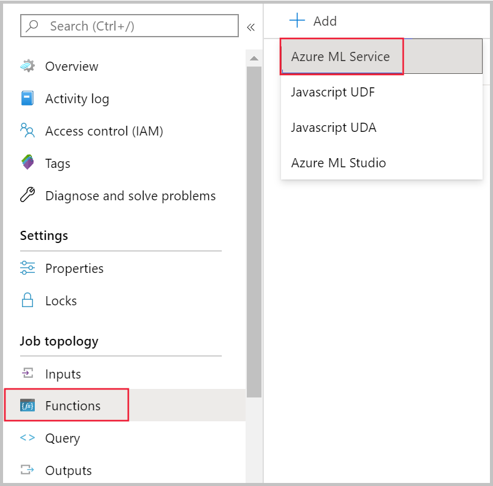
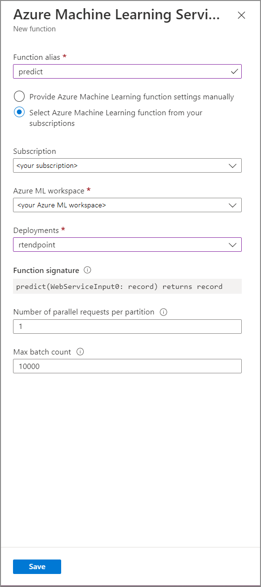

# Integrate Azure Stream Analytics with Azure Machine Learning

You can implement machine learning models as a user-defined function (UDF) in your Azure Stream Analytics jobs to do real-time scoring and predictions on your streaming input data. [Azure Machine Learning](../machine-learning/overview-what-is-azure-machine-learning.md) allows you to use any popular open-source tool, such as TensorFlow, scikit-learn, or PyTorch, to prep, train, and deploy models.

## Prerequisites

Complete the following steps before you add a machine learning model as a function to your Stream Analytics job:

1. Use Azure Machine Learning to [deploy your model as a web service](../machine-learning/how-to-deploy-managed-online-endpoints.md).

2. Your machine learning endpoint must have an associated [swagger](../machine-learning/v1/how-to-deploy-advanced-entry-script.md) that helps Stream Analytics understand the schema of the input and output. You can use this [sample swagger definition](https://github.com/Azure/azure-stream-analytics/blob/master/Samples/AzureML/asa-mlswagger.json) as a reference to ensure you have set it up correctly.

3. Make sure your web service accepts and returns JSON serialized data.

4. Deploy your model on [Azure Kubernetes Service](../machine-learning/how-to-deploy-managed-online-endpoints.md#use-different-cpu-and-gpu-instance-types) for high-scale production deployments. If the web service isn't able to handle the number of requests coming from your job, the performance of your Stream Analytics job will be degraded, which impacts latency. Models deployed on Azure Container Instances are supported only when you use the Azure portal.
## Add a machine learning model to your job

You can add Azure Machine Learning functions to your Stream Analytics job directly from the Azure portal or Visual Studio Code.

> [!VIDEO https://www.microsoft.com/en-us/videoplayer/embed/RE4RMir]

### Azure portal

1. Navigate to your Stream Analytics job in the Azure portal, and select **Functions** under **Job topology**. Then, select **Azure Machine Learning Service** from the **+ Add** dropdown menu.

   

2. Fill in the **Azure Machine Learning Service function** form with the following property values:

   

The following table describes each property of Azure Machine Learning Service functions in Stream Analytics.

|Property|Description|
|--------|-----------|
|Function alias|Enter a name to invoke the function in your query.|
|Subscription|Your Azure subscription. |
|Azure Machine Learning workspace|The Azure Machine Learning workspace you used to deploy your model as a web service.|
|Endpoint|The web service hosting your model.|
|Function signature|The signature of your web service inferred from the API's schema specification. If your signature fails to load, check that you have provided sample input and output in your scoring script to automatically generate the schema.|
|Number of parallel requests per partition|This is an advanced configuration to optimize high-scale throughput. This number represents the concurrent requests sent from each partition of your job to the web service. Jobs with six streaming units (SU) and lower have one partition. Jobs with 12 SUs have two partitions, 18 SUs have three partitions and so on.<br><br> For example, if your job has two partitions and you set this parameter to four, there will be eight concurrent requests from your job to your web service.|
|Max batch count|This is an advanced configuration for optimizing high-scale throughput. This number represents the maximum number of events be batched together in a single request sent to your web service.|

## Calling machine learning endpoint from your query

When your Stream Analytics query invokes an Azure Machine Learning UDF, the job creates a JSON serialized request to the web service. The request is based on a model-specific schema that Stream Analytics infers from the endpoint's swagger.

The following Stream Analytics query is an example of how to invoke an Azure Machine Learning UDF:

```SQL
SELECT udf.score(<model-specific-data-structure>)
INTO output
FROM input
WHERE <model-specific-data-structure> is not null
```

If your input data sent to the ML UDF is inconsistent with the schema that is expected, the endpoint will return a response with error code 400, which will cause your Stream Analytics job to go to a failed state. It's recommended that you [enable resource logs](stream-analytics-job-diagnostic-logs.md#send-diagnostics-to-azure-monitor-logs) for your job, which will enable you to easily debug and troubleshoot such problems. Therefore, it's strongly recommended that you:

- Validate input to your ML UDF isn't null
- Validate the type of every field that is an input to your ML UDF to ensure it matches what the endpoint expects

> [!NOTE]
> ML UDFs are evaluated for each row of a given query step, even when called via a conditional expression (i.e. `CASE WHEN [A] IS NOT NULL THEN udf.score(A) ELSE '' END`). If need be, use the [WITH](/stream-analytics-query/with-azure-stream-analytics) clause to create diverging paths, calling the ML UDF only where required, before using [UNION](/stream-analytics-query/union-azure-stream-analytics) to merge paths together again.

## Pass multiple input parameters to the UDF

Most common examples of inputs to machine learning models are numpy arrays and DataFrames. You can create an array using a JavaScript UDF, and create a JSON-serialized DataFrame using the `WITH` clause.

### Create an input array

You can create a JavaScript UDF which accepts *N* number of inputs and creates an array that can be used as input to your Azure Machine Learning UDF.

```javascript
function createArray(vendorid, weekday, pickuphour, passenger, distance) {
    'use strict';
    var array = [vendorid, weekday, pickuphour, passenger, distance]
    return array;
}
```

Once you've added the JavaScript UDF to your job, you can invoke your Azure Machine Learning UDF using the following query:

```SQL
WITH 
ModelInput AS (
#use JavaScript UDF to construct array that will be used as input to ML UDF
SELECT udf.createArray(vendorid, weekday, pickuphour, passenger, distance) as inputArray
FROM input
)

SELECT udf.score(inputArray)
INTO output
FROM ModelInput
#validate inputArray is not null before passing it to ML UDF to prevent job from failing
WHERE inputArray is not null
```

The following JSON is an example request:

```JSON
{
    "Inputs": {
        "WebServiceInput0": [
        ["1","Mon","12","1","5.8"],
        ["2","Wed","10","2","10"]
        ]
    }
}
```

### Create a Pandas or PySpark DataFrame

You can use the `WITH` clause to create a JSON serialized DataFrame that can be passed as input to your Azure Machine Learning UDF as shown below.

The following query creates a DataFrame by selecting the necessary fields and uses the DataFrame as input to the Azure Machine Learning UDF.

```SQL
WITH 
Dataframe AS (
SELECT vendorid, weekday, pickuphour, passenger, distance
FROM input
)

SELECT udf.score(Dataframe)
INTO output
FROM Dataframe
WHERE Dataframe is not null
```

The following JSON is an example request from the previous query:

```JSON
{
    "Inputs": {
        "WebServiceInput0": [
        {
            "vendorid": "1",
            "weekday": "Mon",
            "pickuphour": "12",
            "passenger": "1",
            "distance": "5.8"
        },
        {
            "vendorid": "2",
            "weekday": "Tue",
            "pickuphour": "10",
            "passenger": "2",
            "distance": "10"
        }]
    }
}
```

## Optimize the performance for Azure Machine Learning UDFs

When you deploy your model to Azure Kubernetes Service, you can [profile your model to determine resource utilization](../machine-learning/v1/how-to-deploy-profile-model.md). You can also [enable App Insights for your deployments](../machine-learning/v1/how-to-enable-app-insights.md) to understand request rates, response times, and failure rates.

If you have a scenario with high event throughput, you may need to change the following parameters in Stream Analytics to achieve optimal performance with low end-to-end latencies:

- Maximum batch count.
- Number of parallel requests per partition.

### Determine the right batch size

After you've deployed your web service, you send sample request with varying batch sizes starting from 50 and increasing it in order of hundreds. For example, 200, 500, 1000, 2000 and so on. You'll notice that after a certain batch size, the latency of the response increases. The point after which latency of response increases should be the max batch count for your job.

### Determine the number of parallel requests per partition

At optimal scaling, your Stream Analytics job should be able to send multiple parallel requests to your web service and get a response within few milliseconds. The latency of the web service's response can directly impact the latency and performance of your Stream Analytics job. If the call from your job to the web service takes a long time, you'll likely see an increase in watermark delay and may also see an increase in the number of backlogged input events.

You can achieve low latency by ensuring that your Azure Kubernetes Service (AKS) cluster has been provisioned with the [right number of nodes and replicas](../machine-learning/v1/how-to-deploy-azure-kubernetes-service.md?tabs=python#autoscaling). It's critical that your web service is highly available and returns successful responses. If your job receives an error that can be retried, such as service unavailable response (503), it will automatically retry with exponential back off. If your job receives one of these errors as a response from the endpoint, the job will go to a failed state.
* Bad Request (400)
* Conflict (409)
* Not Found (404)
* Unauthorized (401)

## Limitations

If you're using an Azure ML Managed Endpoint service, Stream Analytics can currently only access endpoints that have public network access enabled. Read more about it on the page about [Azure ML private endpoints](/azure/machine-learning/concept-secure-online-endpoint?view=azureml-api-2&tabs=cli#secure-inbound-scoring-requests).

## Next steps

* [Tutorial: Azure Stream Analytics JavaScript user-defined functions](stream-analytics-javascript-user-defined-functions.md)
