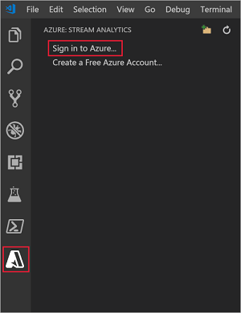
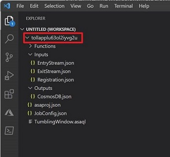
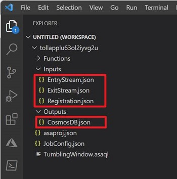
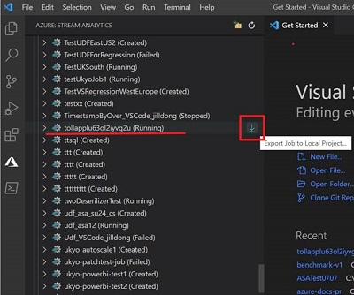
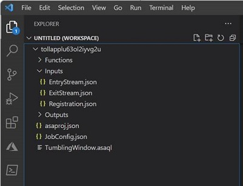
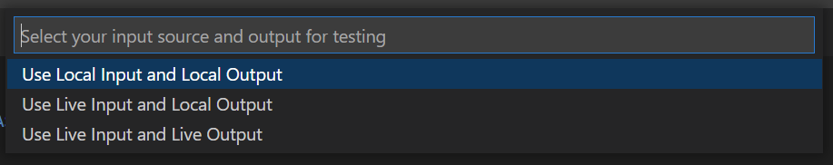
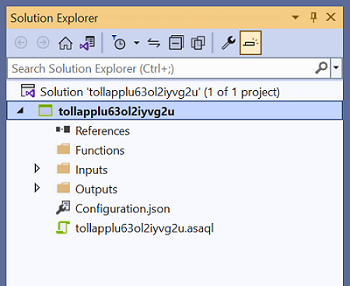
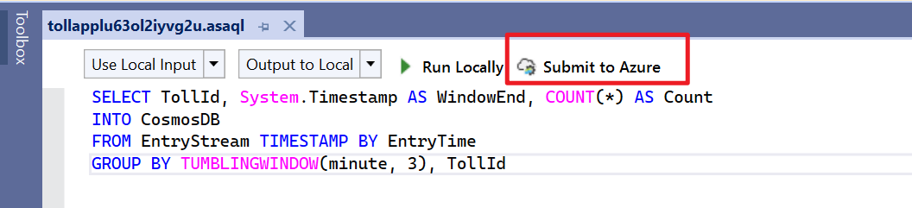
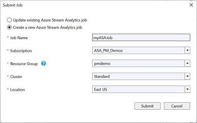
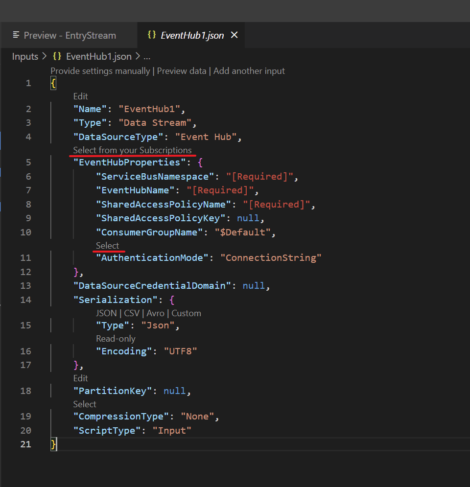

# How to Migrate ASA projects to Visual Studio Code

This article provides guidance for Visual Studio users migrating Azure Stream Analytics (ASA) projects to Visual Studio Code (VSCode). Please note that the ASA Tools extension for Visual Studio is no longer maintained. We recommend that you use the ASA tools extension in VSCode for local testing before you submit and start an ASA job. 

If you have a local ASA project in Visual Studio, follow [these steps](#faqs) to submit your ASA project to Azure portal. 

## Install VSCode and ASA Tools extension

1. Install [Visual Studio Code](https://code.visualstudio.com/)

2. Open Visual Studio Code, select **Extensions** on the left pane, search for **Stream Analytics** and select **Install** on the **Azure Stream Analytics Tools** extension.

   

3. After the extension is installed, verify that **Azure Stream Analytics Tools** is visible in **Enabled Extensions**.

4. Select the Azure icon on the Visual Studio Code activity bar. Under Stream Analytics on the side bar, select **Sign in to Azure**.

   

5. When you're signed in, your Azure account name appears on the status bar in the lower-left corner of the Visual Studio Code window.

## Export an ASA Job and open in VSCode

If you've created an ASA job in the Azure portal, you can export the ASA job to VSCode in your local machine. Two ways to export an ASA job:

### Option 1 – Export from the Azure portal

1. Sign in to Azure portal and open your ASA job. Under **Query** page, select **Open in VS Code** to export job.

    :::image type="content" source="./media/stream-analytics-migrate-to-vscode/portal-open-in-vscode.png" alt-text="Screenshot of the Azure portal using the Open in VSCode to launch VSCode in the local machine." lightbox= "./media/stream-analytics-migrate-to-vscode/portal-open-in-vscode.png" :::

2. Select a folder where you want to export the ASA project.
3. Then it will automatically create an ASA project and add it to your workspace in VSCode. You should see a folder with the same name as your ASA job.

    

4. A Stream Analytics project consists of three folders: **Inputs**, **Outputs**, and **Functions**. It also has the query script **(\*.asaql)**, a **JobConfig.json** file, and an **asaproj.json** configuration file. If you have configured multiple Input and Output sources for the job, it will create JSON files for each source under the folders respectively. 

    

### Option 2 - Export an ASA job in VSCode

1. Select the **Azure** icon on the VSCode activity bar. Find the **Subscription** where your ASA job is created, select **Export** to export the ASA job.

   

2. Once the export is completed, you'll see an ASA project created in your workspace.

   

3. If your ASA job has configured multiple input and output sources, it will create JSON files for each source under the **Inputs** and **Outputs** folders respectively.

## Run an ASA job in VSCode

After an ASA job is exported, you can run your query on the local machine. For input, data can be ingested from local files or live sources. Output results are either sent as files to a local folder, or to the live sinks. For more detail, visit [Run jobs locally with VS Code](./visual-studio-code-local-run-all.md).

Follow these steps to run your job with live input and save output results locally: 
1. Before you begin, install [.NET core SDK](https://dotnet.microsoft.com/download) and restart Visual Studio Code.

2. Go to. **\*.asaql** file, select **Run Locally**.
    
    :::image type="content" source="media/stream-analytics-migrate-to-vscode/run-locally-vscode.png" alt-text="Screenshot of the Visual Studio Coding using Run Locally to run an ASA job." lightbox= "media/stream-analytics-migrate-to-vscode/run-locally-vscode.png" :::

3. Then select **Use Live Input and Local Output** under the Command Palette.
    
    

4. If your job started successfully, you can view the output results, job diagram, and metrics for your ASA job.
    
    :::image type="content" source="./media/stream-analytics-migrate-to-vscode/vscode-job-diagram-metrics.png" alt-text="Screenshot of the Visual Studio Code using Job Diagram and Metric features. " lightbox= "./media/stream-analytics-migrate-to-vscode/vscode-job-diagram-metrics.png" :::

For more details about debugging, visit [Debug ASA queries locally using job diagram](./debug-locally-using-job-diagram-vs-code.md)

## FAQs

### How to migrate a local ASA project from Visual Studio to VSCode?

If you have a local ASA project in Visual Studio and not yet submitted, follow these steps to submit your ASA project to Azure.

1. Open your ASA project in Visual Studio, you should see the **Functions**, **Inputs** and **Outputs** folders in the **Solution Explorer**. 

   

2. Open the script **(\*.asaql)**, select **Submit to Azure** in the editor.

   

3. Select **Create a New Azure Stream Analytics job** and enter a **Job Name**. Choose the **Subscription**, **Resource Group**, and **Location** for the ASA project. 

   

4. Then you can go to the Azure portal and find the ASA job under your **Resource Group**. 

5. To learn how to export an ASA job in VSCode, see [here](#export-an-asa-job-and-open-in-vscode).

### Do I need to configure the input and output sources after an ASA job is exported?

No, if your ASA job has configured multiple Inputs and Outputs sources in the Azure portal, it will create JSON files for each source under the folders respectively. 

### How to add a new input source in VSCode?

1. Right-click the Inputs folder in your Stream Analytics project. Then select **ASA: Add Input** from the context menu.

    

2. Choose the input type and follow the instructions to edit your input JSON files.
    
    

3. Then you can preview data and verify if the new input source is added. 

    :::image type="content" source="./media/stream-analytics-migrate-to-vscode/preview-data.png" alt-text="Screenshot of the Visual Studio Code using Preview Data." lightbox= "./media/stream-analytics-migrate-to-vscode/preview-data.png" :::

## Next steps

To learn about Azure Stream Analytics Tools for Visual Studio Code, continue to the following articles:
* [Test Stream Analytics queries locally with sample data using Visual Studio Code](visual-studio-code-local-run.md)
* [Test Azure Stream Analytics jobs locally against live input with Visual Studio Code](visual-studio-code-local-run-live-input.md)
* [Use Visual Studio Code to view Azure Stream Analytics jobs](visual-studio-code-explore-jobs.md)
* [Set up CI/CD pipelines by using the npm package](./cicd-overview.md)