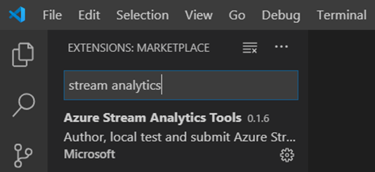
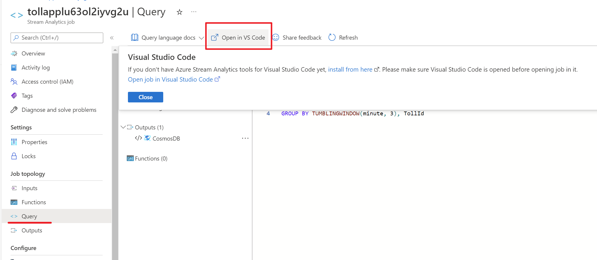
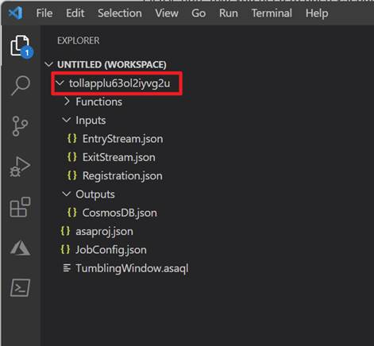
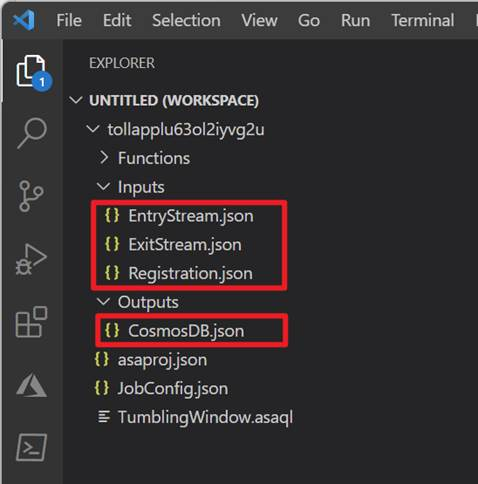
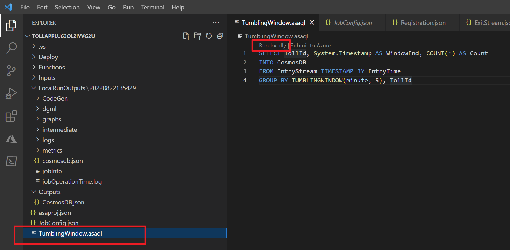
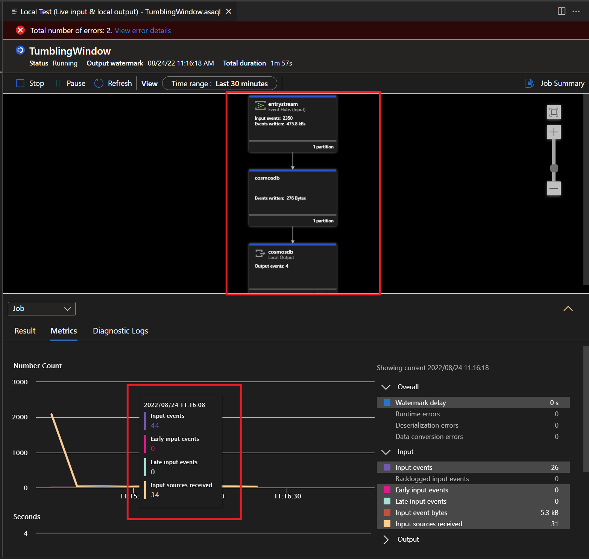
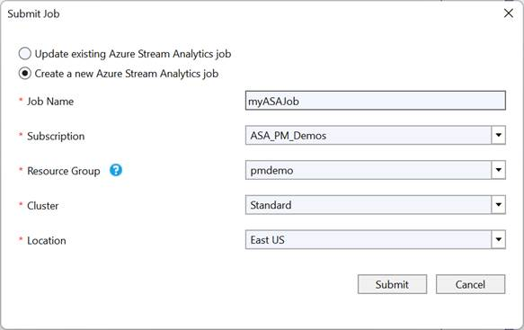
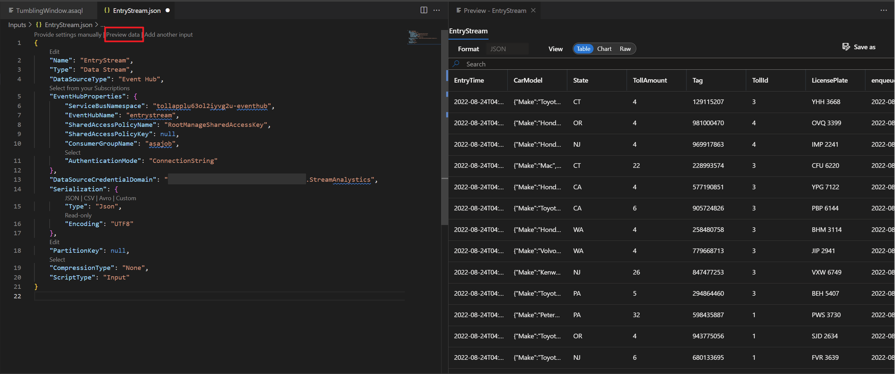

# How to Migrate ASA projects to Visual Studio Code

This article provides guidance for Visual Studio users migrating ASA projects to Visual Studio Code (VSCode). The ASA tools extension for Visual Studio is no longer maintained since 2020. We recommend that you use the ASA tools extension in VSCode for testing query locally before you submit and start an ASA job. 

If you have a local working ASA project in Visual Studio, follow [these steps](##faqs) to submit your ASA project to Azure portal. 

## Install VSCode and the ASA Tools Extension

1. Install [Visual Studio Code](https://code.visualstudio.com/)

2. Open Visual Studio Code, select **Extensions** on the left pane, search for **Stream Analytics** and select **Install** on the **Azure Stream Analytics Tools** extension.
   

3. After the extension is installed, verify that **Azure Stream Analytics Tools** is visible in **Enabled Extensions**.

4. Select the Azure icon on the Visual Studio Code activity bar. Under Stream Analytics on the side bar, select **Sign in to Azure**.

   

5. When you're signed in, your Azure account name appears on the status bar in the lower-left corner of the Visual Studio Code window.

## Export an ASA Job to VSCode

If you've created an ASA job in the Azure portal, you can export the ASA job to VSCode in your local machine. There are two ways to export an ASA job:

### Option 1 – Export from the Azure portal

1. Sign in to Azure portal and open your ASA job. Open **Query** in the menu and select **Open in VSCode** to export the job.
    

2. Select a folder where you want to save your ASA project.
3. Then it will automatically create an ASA project and add it to your workspace in VSCode. You should see a folder with the same name as your ASA job.

    

4. A Stream Analytics project consists of three folders: **Inputs**, **Outputs**, and **Functions**. It also has the query script **(\*.asaql)**, a **JobConfig.json** file, and an **asaproj.json** configuration file. If your ASA job has configured multiple Inputs and Outputs sources, it will create JSON files for each source under the folders respectively. 

    

### Option 2 - Find the ASA job in VSCode

1. Select the **Azure** icon on the VSCode activity bar. Find the **Subscription** where your ASA job is created, select **Export** to download the ASA job.

   

2. Once the export is completed, you'll see the ASA project added to your workspace.

   

3. If your ASA job has configured multiple inputs and outputs sources, it will create JSON files for each source under the **Inputs** and **Outputs** folders respectively.

## Run an ASA job in VSCode

After your ASA job is exported, you can run your query on the local machine. For input, data can be ingested from local files or live sources. Output results are either sent as files to a local folder, or to the live sinks. For more detail, please visit [Run jobs locally with VS Code](https://docs.microsoft.com/en-us/azure/stream-analytics/visual-studio-code-local-run-all).

### Before you begin
- install [.NET core SDK](https://dotnet.microsoft.com/en-us/download) and restart Visual Studio Code.

### Run an ASA job with live input and save output results to a local folder

1. Go to. **\*.asaql** file, select **Run Locally**.
    
2. Then select **Use Live Input and Local Output** under the Command Palette.
    
3. If your job started successfully, you can view the job diagram and metrics for your ASA job.
    

For more details about debugging query with job diagram, please visit [here](https://docs.microsoft.com/en-us/azure/stream-analytics/debug-locally-using-job-diagram-vs-code?view=azuresql)

## FAQs

### How to migrate a local ASA project from Visual Studio to VSCode?

If you have a local ASA project in Visual Studio and not yet submitted, follow these steps to submit your ASA project to Azure.

1. Open your ASA project in Visual Studio, you should see the **Functions**, **Inputs** and **Outputs** folders in the **Solution Explorer**. 

   

2. In the **Query Editor**, select **Submit to Azure** in the script editor.

   

3. Select **Create a New Azure Stream Analytics job** and enter a **Job Name**. Choose the **Subscription**, **Resource Group**, and **Location** for your ASA project.

   

4. After you select **Submit**, you can go to the Azure portal and find the ASA job under your **Resource Group**. 

5. Follow [these steps](##export-an-asa-job-to-vscode) to export an ASA job to VSCode. 

### Do I need to configure the input and output sources after an ASA job is exported?

No, if your ASA job has configured multiple Inputs and Outputs sources in the Azure portal, it will create JSON files for each source under the folders respectively. 

### How to add a new input source in VSCode?

1. Right-click the Inputs folder in your Stream Analytics project. Then select **ASA: Add Input** from the context menu.
    
2. Choose the input type and follow the instructions to edit your input JSON files.
    
3. Then you can preview data and verify if the new input source is added. 
    