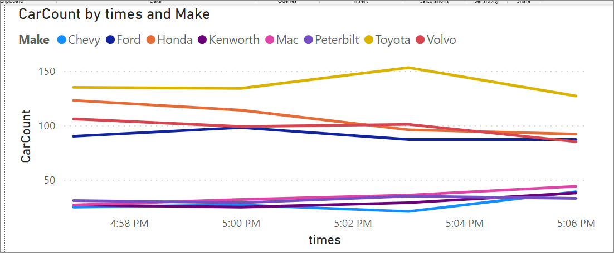

# Build real-time Power BI dashboards with Stream Analytics no code editor
This tutorial shows how you can use the Stream Analytics no code editor to compute aggregates on real time data streams and store it in Azure Synapse Analytics. 

In this tutorial, you learn how to:

> [!div class="checklist"]
> * Deploy an event generator that sends data to your event hub
> * Create a Stream Analytics job using the no code editor
> * Review input data and schema
> * Select fields to group by and define aggregations like count
> * Configure Azure Synapse Analytics to which results will be written
> * Run the Stream Analytics job
> * Visualize data in Power BI

## Prerequisites

Before you start, make sure you've completed the following steps:

1. If you don't have an Azure subscription, create a [free account](https://azure.microsoft.com/free/).
2. Deploy the TollApp event generator to Azure, use this link to [Deploy TollApp Azure Template](https://portal.azure.com/#create/Microsoft.Template/uri/https%3A%2F%2Fraw.githubusercontent.com%2FAzure%2Fazure-stream-analytics%2Fmaster%2FSamples%2FTollApp%2FVSProjects%2FTollAppDeployment%2Fazuredeploy.json). Set the 'interval' parameter to 1. And use a new resource group for this step.
3. Create an [Azure Synapse Analytics workspace](../synapse-analytics/get-started-create-workspace.md) with a [Dedicated SQL pool](../synapse-analytics/get-started-analyze-sql-pool.md#create-a-dedicated-sql-pool).
    > [!NOTE]
    > If you'd like to build the real-time Power BI dashboard directly without capturing the data into database, you can skip step#3 and 4, then go to this guide to [<u>build real-time dashboard with Power BI dataset produced by Stream Analytics job</u>](./no-code-build-power-bi-dashboard.md).

4. Create a table named `carsummary` using your Dedicated SQL pool. You can do it by running the following SQL script:
    ```SQL
    CREATE TABLE carsummary   
    (  
    Make nvarchar(20),  
    CarCount int,
	times datetime
	)
    WITH ( CLUSTERED COLUMNSTORE INDEX ) ;
    ``` 


## Use no code editor to create a Stream Analytics job
1. Locate the Resource Group in which the TollApp event generator was deployed. 
2. Select the Azure Event Hubs **namespace**. 
1. On the **Event Hubs Namespace** page, select **Event Hubs** under **Entities** on the left menu. 
1. Select `entrystream` instance.

    :::image type="content" source="./media/stream-analytics-no-code/select-event-hub.png" alt-text="Screenshot showing the selection of the event hub." lightbox="./media/stream-analytics-no-code/select-event-hub.png":::    
1. Go to **Process data** under Features section and then select **start** on the **Start with blank canvas** template.

    :::image type="content" source="./media/stream-analytics-no-code/start-blank-canvas.png" alt-text="Screenshot showing the selection of the Start button on the Start with a blank canvas tile." lightbox="./media/stream-analytics-no-code/start-blank-canvas.png":::    
1. Name your job `carsummary` and select **Create**.

    :::image type="content" source="./media/stream-analytics-no-code/job-name.png" alt-text="Screenshot of the New Stream Analytics job page." lightbox="./media/stream-analytics-no-code/job-name.png":::    
1. On the **event hub** configuration page, confirm the following settings, and then select **Connect**.
    - *Consumer Group*: Default
    - *Serialization type* of your input data: JSON
    - *Authentication mode* that the job will use to connect to your event hub: Connection string.

        :::image type="content" source="./media/stream-analytics-no-code/event-hub-configuration.png" alt-text="Screenshot of the configuration page for your event hub." lightbox="./media/stream-analytics-no-code/event-hub-configuration.png":::    
1. Within few seconds, you'll see sample input data and the schema. You can choose to drop fields, rename fields or change data type if you want.

    :::image type="content" source="./media/stream-analytics-no-code/data-preview-fields.png" alt-text="Screenshot showing the preview of data in the event hub and the fields." lightbox="./media/stream-analytics-no-code/data-preview-fields.png":::        
1. Select the **Group by** tile on the canvas and connect it to the event hub tile. 

    :::image type="content" source="./media/stream-analytics-no-code/connect-group.png" alt-text="Screenshot showing the Group tile connected to the Event Hubs tile." lightbox="./media/stream-analytics-no-code/connect-group.png":::
1. Configure the **Group by** tile by specifying:
    1. Aggregation as **Count**.
    1. Field as **Make** which is a nested field inside **CarModel**.
    1. Select **Save**.
    1. In the **Group by** settings, select **Make** and **Tumbling window** of **3 minutes**

        :::image type="content" source="./media/stream-analytics-no-code/group-settings.png" alt-text="Screenshot of the Group by configuration page." lightbox="./media/stream-analytics-no-code/group-settings.png":::    
1. Select **Add field** on the **Manage fields** page, and add the **Make** field as shown in the following image, and then select **Save**. 

    :::image type="content" source="./media/stream-analytics-no-code/add-make-field.png" alt-text="Screenshot showing the addition of the Make field." lightbox="./media/stream-analytics-no-code/add-make-field.png":::    
1. Select **Manage fields** on the command bar. Connect the **Manage Fields** tile to the **Group by tile** on canvas. Select **Add all fields** on the **Manage fields** configuration page. 

    :::image type="content" source="./media/stream-analytics-no-code/manage-fields.png" alt-text="Screenshot of the Manage fields page." lightbox="./media/stream-analytics-no-code/manage-fields.png":::    
1. Select **...** next to the fields, and select **Edit** to rename them.
    - **COUNT_make** to **CarCount**
    - **Window_End_Time** to **times**

        :::image type="content" source="./media/stream-analytics-no-code/rename-fields.png" alt-text="Screenshot of the Manage fields page with the fields renamed." lightbox="./media/stream-analytics-no-code/rename-fields.png":::
1. The **Manage fields** page should look as shown in the following image.
    
    :::image type="content" source="./media/stream-analytics-no-code/manage-fields-page.png" alt-text="Screenshot of the Manage fields page with three fields." lightbox="./media/stream-analytics-no-code/manage-fields-page.png":::    
1. Select **Synapse** on the command bar. Connect the **Synapse** tile to the **Manage fields** tile on your canvas.
1.  Configure Azure Synapse Analytics by specifying:
    * Subscription where your Azure Synapse Analytics is located
    * Database of the Dedicated SQL pool that you used to create the `carsummary` table in the previous section.
    * Username and password to authenticate
    * Table name as `carsummary`
    * Select **Connect**. You'll see sample results that will be written to your Synapse SQL table.

        :::image type="content" source="./media/stream-analytics-no-code/synapse-settings.png" alt-text="Screenshot of the Synapse tile settings." lightbox="./media/stream-analytics-no-code/synapse-settings.png":::
1. Select **Save** in the top ribbon to save your job and then select **Start**. Set Streaming Unit count to 3 and then select **Start** to run your job. Specify the storage account that will be used by Synapse SQL to load data into your data warehouse.

    :::image type="content" source="./media/stream-analytics-no-code/start-analytics-job.png" alt-text="Screenshot of the Start Stream Analytics Job page." lightbox="./media/stream-analytics-no-code/start-analytics-job.png":::    
1. You'll then see a list of all Stream Analytics jobs created using the no code editor. And within two minutes, your job will go to a **Running** state. Select the **Refresh** button on the page to see the status changing from Created -> Starting -> Running.

    :::image type="content" source="./media/stream-analytics-no-code/job-list.png" alt-text="Screenshot showing the list of jobs." lightbox="./media/stream-analytics-no-code/job-list.png":::  

## Create a Power BI visualization
1. Download the latest version of [Power BI desktop](https://powerbi.microsoft.com/desktop).
2. Use the Power BI connector for Azure Synapse SQL to connect to your database with **DirectQuery**.
3. Use this query to fetch data from your database
    ```SQL
    SELECT [Make],[CarCount],[times]
    FROM [dbo].[carsummary]
    WHERE times >= DATEADD(day, -1, GETDATE())
    ```
4. You can then create a line chart with
    * X-axis as times
    * Y-axis as CarCount
    * Legend as Make
    You'll then see a chart that can be published. You can configure [automatic page refresh](/power-bi/create-reports/desktop-automatic-page-refresh#authoring-reports-with-automatic-page-refresh-in-power-bi-desktop) and set it to 3 minutes to get a real-time view.
[](./media/stream-analytics-no-code/no-code-power-bi-real-time-dashboard.png#lightbox)

## More option

Except the Azure Synapse SQL, you can also use the SQL Database as the no-code editor output to receive the streaming data. And then use Power BI connector to connect the SQL Database with your database with **DirectQuery** as well to build the real-time dashboard.

It's also a good option to build the real-time dashboard with your streaming data. For more information about the SQL Database output, see [Transform and ingest to SQL Database](./no-code-transform-filter-ingest-sql.md).


## Clean up resources
1. Locate your Event Hubs instance and see the list of Stream Analytics jobs under **Process Data** section. Stop any jobs that are running.
2. Go to the resource group you used while deploying the TollApp event generator.
3. Select **Delete resource group**. Type the name of the resource group to confirm deletion.

## Next steps
In this tutorial, you created a Stream Analytics job using the no code editor to define aggregations and write results to Azure Synapse Analytics. You then used the Power BI to build a real-time dashboard to see the results produced by the job.

> [!div class="nextstepaction"]
> [No code stream processing with Azure Stream Analytics](https://aka.ms/asanocodeux)
