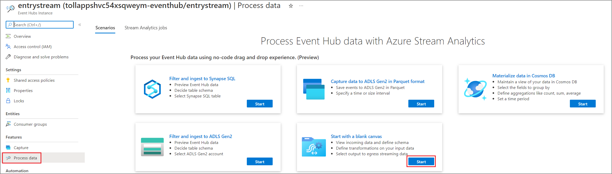
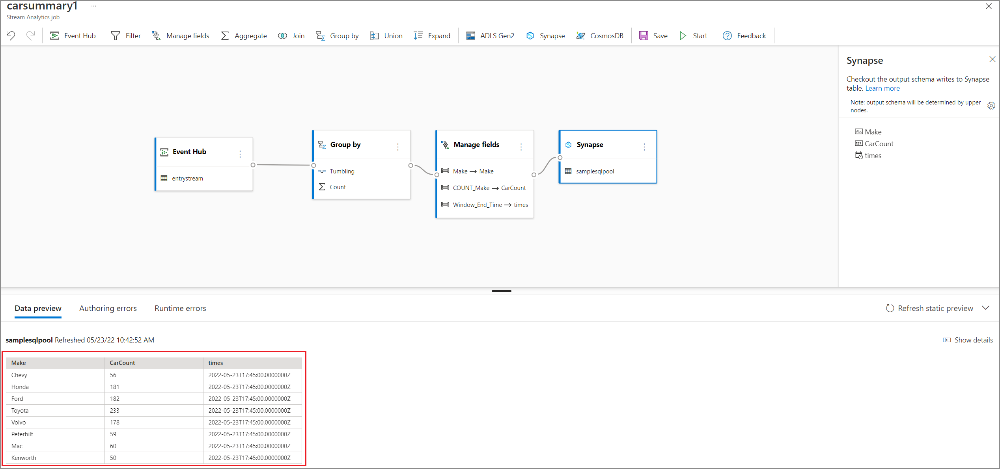

# Build real time Power BI dashboards with Stream Analytics no code editor
This tutorial shows how you can use the Stream Analytics no code editor to compute aggregates on real time data streams and store it in Azure Synapse Analytics. 

In this tutorial, you learn how to:

> [!div class="checklist"]
> * Deploy an event generator that sends data to your event hub
> * Create a Stream Analytics job using the no code editor
> * Review input data and schema
> * Select fields to group by and define aggregations like count
> * Configure Azure Synapse Analytics to which results will be written
> * Run the Stream Analytics job
> * Visualize data in Power BI

## Prerequisites

Before you start, make sure you've completed the following steps:

* If you don't have an Azure subscription, create a [free account](https://azure.microsoft.com/free/).
* Deploy the TollApp event generator to Azure, use this link to [Deploy TollApp Azure Template](https://portal.azure.com/#create/Microsoft.Template/uri/https%3A%2F%2Fraw.githubusercontent.com%2FAzure%2Fazure-stream-analytics%2Fmaster%2FSamples%2FTollApp%2FVSProjects%2FTollAppDeployment%2Fazuredeploy.json). Set the 'interval' parameter to 1. And use a new resource group for this.
* Create an [Azure Synapse Analytics workspace](../synapse-analytics/get-started-create-workspace.md) with a [Dedicated SQL pool](../synapse-analytics/get-started-analyze-sql-pool.md#create-a-dedicated-sql-pool).
* Create a table named **carsummary** using your Dedicated SQL pool. You can do this by running the following SQL script:
    ```SQL
    CREATE TABLE carsummary   
    (  
    Make nvarchar(20),  
    CarCount int,
	times datetime
	)
    WITH ( CLUSTERED COLUMNSTORE INDEX ) ;
    ``` 
## Use no code editor to create a Stream Analytics job
1. Locate the Resource Group in which the TollApp event generator was deployed. 
2. Select the Azure Event Hubs namespace. And then under the Event Hubs section, select **entrystream** instance.
3. Go to **Process data** under Features section and then click **start** on the **Start with blank canvas** template.
[](./media/stream-analytics-no-code/real-time-dashboard-power-bi.png#lightbox)
4. Name your job **carsummary** and select **Create**.
5. Configure your event hub input by specifying 
    * Consumer Group: Default
    * Serialization type of your input data: JSON
    * Authentication mode which the job will use to connect to your event hub: Connection String defaults
    * Click **Connect**
6. Within few seconds, you'll see sample input data and the schema. You can choose to drop fields, rename fields or change data type if you want.
7. Click the **Group by** tile on the canvas and connect it to the event hub tile. Configure the Group By tile by specifying:
    * Aggregation as **Count**
    * Field as **Make** which is a nested field inside **CarModel**
    * Click **Save**
    * In the **Group by** settings, select **Make** and **Tumbling window** of **3 minutes**
8. Click the **Manage Fields** tile and connect it to the Group by tile on canvas. Configure the **Manage Fields** tile by specifying:
    * Clicking on **Add all fields**
    * Rename the fields by clicking on the fields and changing the names from:
        * COUNT_make to CarCount
        * Window_End_Time to times
9. Click the **Azure Synapse Analytics** tile and connect it to Manage Fields tile on your canvas. Configure Azure Synapse Analytics by specifying:
    * Subscription where your Azure Synapse Analytics is located
    * Database of the Dedicated SQL pool which you used to create the Table in the previous section.
    * Username and password to authenticate
    * Table name as **carsummary**
    * Click **Connect**. You'll see sample results that will be written to your Synapse SQL table.
    [](./media/stream-analytics-no-code/synapse-output.png#lightbox)
8. Select **Save** in the top ribbon to save your job and then select **Start**. Set Streaming Unit count to 3 and then click **Start** to run your job. Specify the storage account that will be used by Synapse SQL to load data into your data warehouse.
9. You'll then see a list of all Stream Analytics jobs created using the no code editor. And within two minutes, your job will go to a **Running** state.
[](./media/stream-analytics-no-code/cosmos-db-running-state.png#lightbox)

## Create a Power BI visualization
1. Download the latest version of [Power BI desktop](https://powerbi.microsoft.com/desktop).
2. Use the Power BI connector for Azure Synapse SQL to connect to your database.
3. Use this query to fetch data from your database
    ```SQL
    SELECT [Make],[CarCount],[times]
    FROM [dbo].[carsummary]
    WHERE times >= DATEADD(day, -1, GETDATE())
    ```
4. You can then create a line chart with
    * X-axis as times
    * Y-axis as CarCount
    * Legend as Make
    You'll then see a chart that can be published. You can configure [automatic page refresh](https://docs.microsoft.com/power-bi/create-reports/desktop-automatic-page-refresh#authoring-reports-with-automatic-page-refresh-in-power-bi-desktop) and set it to 3 minutes to get a near-real time view.
[](./media/stream-analytics-no-code/no-code-power-bi-real-time-dashboard.png#lightbox)

## Clean up resources
1. Locate your Event Hubs instance and see the list of Stream Analytics jobs under **Process Data** section. Stop any jobs that are running.
2. Go to the resource group you used while deploying the TollApp event generator.
3. Select **Delete resource group**. Type the name of the resource group to confirm deletion.

## Next steps
In this tutorial, you created a Stream Analytics job using the no code editor to define aggregations and write results to Azure Synapse Analytics. You then used the Power BI to build a near-real time dashboard to see the results produced by the job.

> [!div class="nextstepaction"]
> [No code stream processing with Azure Stream Analytics](https://aka.ms/asanocodeux)
