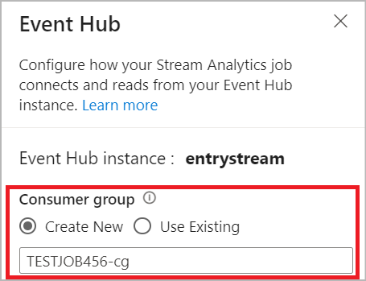
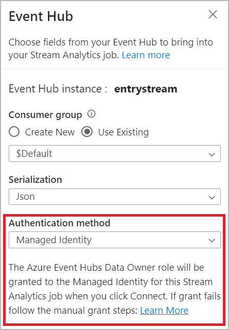
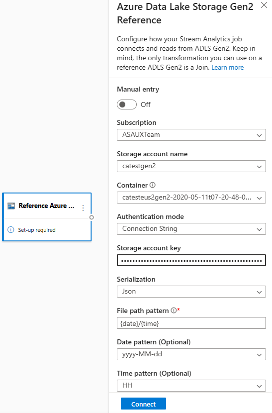
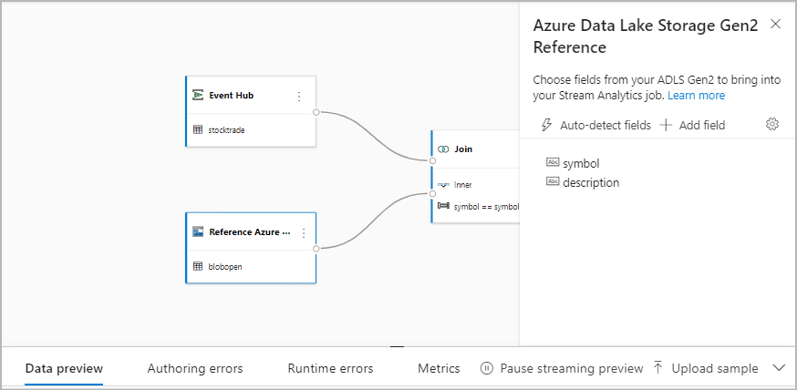
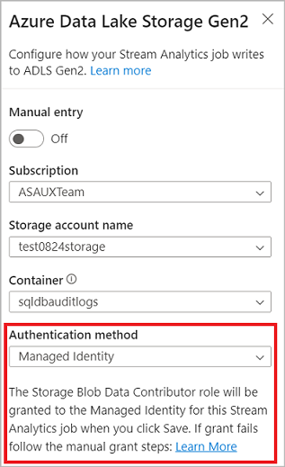

# No-code stream processing in Azure Stream Analytics

The no-code editor allows you to develop a Stream Analytics job effortlessly to process your real-time streaming data, using drag-and-drop functionality, without writing a single line of code. The experience provides a canvas that allows you to connect to input sources to quickly see your streaming data. Then you can transform it before writing to your destinations.

With the no-code editor, you can easily:

- Modify input schemas.
- Perform data preparation operations like joins and filters.
- Approach advanced scenarios like time-window aggregations (tumbling, hopping, and session windows) for group-by operations.

After you create and run your Stream Analytics jobs, you can easily operationalize production workloads. Use the right set of [built-in metrics](stream-analytics-job-metrics.md) for monitoring and troubleshooting purposes. Stream Analytics jobs are billed according to the [pricing model](https://azure.microsoft.com/pricing/details/stream-analytics/) when they're running.

## Prerequisites

Before you develop your Stream Analytics jobs by using the no-code editor, you must meet these requirements:

- The streaming input sources and target destination resources for the Stream Analytics job must be publicly accessible and can't be in an Azure virtual network.
- You must have the required permissions to access the streaming input and output resources.
- You must maintain permissions to create and modify Azure Stream Analytics resources.

> [!NOTE]
> The no-code editor is currently not available in the China region.

## Azure Stream Analytics job

A Stream Analytics job is built on three main components: _streaming inputs_, _transformations_, and _outputs_. You can have as many components as you want, including multiple inputs, parallel branches with multiple transformations, and multiple outputs. For more information, see [Azure Stream Analytics documentation](index.yml).

> [!NOTE]
> The following functionalities and output types are unavailable when using the no-code editor:
> - User defined-functions.
> - Query editing in Azure Stream Analytics query blade. However, you can view the query generated by the no-code editor in query blade.
> - Input/output adding in Azure Stream Analytics input/output blades. However, you can view the input/output generated by the no-code editor in input/output blade.
> - The following output types are not available: Azure Function, ADLS Gen1, PostgreSQL DB, Service Bus queue/topic, Table storage.

To access the no-code editor for building your stream analytics job, there are two approaches:

1. **Through Azure Stream Analytics portal (preview)**: Create a Stream Analytics job, and then select the no-code editor in the **Get started** tab in **Overview** blade, or select **No-code editor** in the left panel.

   :::image type="content" source="./media/no-code-stream-processing/no-code-on-asa-portal.png" alt-text="Screenshot that shows no-code on ASA portal locations." lightbox="./media/no-code-stream-processing/no-code-on-asa-portal.png" :::

2. **Through Azure Event Hubs portal**: Open an Event Hubs instance. Select **Process Data**, and then select any pre-defined template.

   :::image type="content" source="./media/no-code-stream-processing/new-stream-analytics-job.png" alt-text="Screenshot that shows selections to create a new Stream Analytics job." lightbox="./media/no-code-stream-processing/new-stream-analytics-job.png" :::

   The pre-defined templates can assist you in developing and running a job to address various scenarios, including:

    - [Build real-time dashboard with Power BI dataset](./no-code-build-power-bi-dashboard.md)
    - [Capture data from Event Hubs in Delta Lake format (preview)](./capture-event-hub-data-delta-lake.md)
    - [Filtering and ingesting to Azure Synapse SQL](./filter-ingest-synapse-sql.md)
    - [Capturing your Event Hubs data in Parquet format in Azure Data Lake Storage Gen2](./capture-event-hub-data-parquet.md)
    - [Materializing data in Azure Cosmos DB](./no-code-materialize-cosmos-db.md)
    - [Filter and ingest to Azure Data Lake Storage Gen2](./filter-ingest-data-lake-storage-gen2.md)
    - [Enrich data and ingest to event hub](./no-code-enrich-event-hub-data.md)
    - [Transform and store data to Azure SQL database](./no-code-transform-filter-ingest-sql.md)
    - [Filter and ingest to Azure Data Explorer](./no-code-filter-ingest-data-explorer.md)

The following screenshot shows a completed Stream Analytics job. It highlights all the sections available to you while you author.

:::image type="content" source="./media/no-code-stream-processing/created-stream-analytics-job.png" alt-text="Screenshot that shows the authoring interface sections." lightbox="./media/no-code-stream-processing/created-stream-analytics-job.png" :::

1. **Ribbon**: On the ribbon, sections follow the order of a classic analytics process: an event hub as input (also known as a data source), transformations (streaming ETL operations), outputs, a button to save your progress, and a button to start the job.
2. **Diagram view**: This is a graphical representation of your Stream Analytics job, from input to operations to outputs.
3. **Side pane**: Depending on which component you selected in the diagram view, you'll have settings to modify input, transformation, or output.
4. **Tabs for data preview, authoring errors, runtime logs, and metrics**: For each tile, the data preview will show you results for that step (live for inputs; on demand for transformations and outputs). This section also summarizes any authoring errors or warnings that you might have in your job when it's being developed. Selecting each error or warning will select that transform. It also provides the job metrics for you to monitor the running job's health.

## Streaming data input

The no-code editor supports streaming data input from three types of resources:

- Azure Event Hubs
- Azure IoT Hub
- Azure Data Lake Storage Gen2

For more information about the streaming data inputs, see [Stream data as input into Stream Analytics](./stream-analytics-define-inputs.md).

> [!NOTE]
> The no-code editor in the Azure Event Hubs portal only has **Event Hub** as an input option.

:::image type="content" source="./media/no-code-stream-processing/streaming-input-type.png" alt-text="Screenshot that shows the streaming input type." lightbox="./media/no-code-stream-processing/streaming-input-type.png" :::

### Azure Event Hubs as streaming input

Azure Event Hubs is a big-data streaming platform and event ingestion service. It can receive and process millions of events per second. Data sent to an event hub can be transformed and stored through any real-time analytics provider or batching/storage adapter.

To configure an event hub as an input for your job, select the **Event Hub** icon. A tile appears in the diagram view, including a side pane for its configuration and connection.

When you're connecting to your event hub in the no-code editor, we recommend that you create a new consumer group (which is the default option). This approach helps prevent the event hub from reaching the concurrent readers' limit. To understand more about consumer groups and whether you should select an existing consumer group or create a new one, see [Consumer groups](../event-hubs/event-hubs-features.md). 

If your event hub is in the Basic tier, you can use only the existing **$Default** consumer group. If your event hub is in a Standard or Premium tier, you can create a new consumer group.

When you're connecting to the event hub, if you select **Managed Identity** as the authentication mode, the Azure Event Hubs Data Owner role will be granted to the managed identity for the Stream Analytics job. To learn more about managed identities for an event hub, see [Use managed identities to access an event hub from an Azure Stream Analytics job](event-hubs-managed-identity.md).

Managed identities eliminate the limitations of user-based authentication methods. These limitations include the need to reauthenticate because of password changes or user token expirations that occur every 90 days.

After you set up your event hub's details and select **Connect**, you can add fields manually by using **+ Add field** if you know the field names. To instead detect fields and data types automatically based on a sample of the incoming messages, select **Autodetect fields**. Selecting the gear symbol allows you to edit the credentials if needed. 

When Stream Analytics jobs detect the fields, you'll see them in the list. You'll also see a live preview of the incoming messages in the **Data Preview** table under the diagram view.

#### Modify input data

You can edit the field names, or remove field, or change the data type, or change the event time (**Mark as event time**: TIMESTAMP BY clause if a datetime type field), by selecting the three-dot symbol next to each field. You can also expand, select, and edit any nested fields from the incoming messages, as shown in the following image.

> [!TIP]
> This applies to the input data from Azure IoT Hub and ADLS Gen2 as well.

:::image type="content" source="./media/no-code-stream-processing/event-hub-schema.png" alt-text="Screenshot that shows selections for adding, removing, and editing the fields for an event hub." lightbox="./media/no-code-stream-processing/event-hub-schema.png" :::

The available data types are:

- **DateTime**: Date and time field in ISO format.
- **Float**: Decimal number.
- **Int**: Integer number.
- **Record**: Nested object with multiple records.
- **String**: Text.

### Azure IoT Hub as the streaming input

Azure IoT Hub is a managed service hosted in the cloud that acts as a central message hub for communication between an IoT application and its attached devices. IoT device data sent to IoT hub can be used as an input for a Stream Analytics job.

> [!NOTE]
> Azure IoT Hub input is available in the no-code editor on Azure Stream Analytics portal.

To add an IoT hub as a streaming input for your job, select the **IoT Hub** under **Inputs** from the ribbon. Then fill in the needed information in the right panel to connect IoT hub to your job. To learn more about the details of each field, see [Stream data from IoT Hub to Stream Analytics job](./stream-analytics-define-inputs.md#stream-data-from-iot-hub).

:::image type="content" source="./media/no-code-stream-processing/iot-hub-input.png" alt-text="Screenshot that shows iot hub configuration." lightbox= "./media/no-code-stream-processing/iot-hub-input.png" :::

### Azure Data Lake Storage Gen2 as streaming input

Azure Data Lake Storage Gen2 (ADLS Gen2) is a cloud-based, enterprise data lake solution. It's designed to store massive amounts of data in any format, and to facilitate big data analytical workloads. The data stored in ADLS Gen2 can be processed as a data stream by Stream Analytics. To learn more about this type of input, see [Stream data from ADLS Gen2 to Stream Analytics job](./stream-analytics-define-inputs.md#stream-data-from-blob-storage-or-data-lake-storage-gen2)

> [!NOTE]
> Azure Data Lake Storage Gen2 input is available in the no-code editor on Azure Stream Analytics portal.

To add an ADLS Gen2 as a streaming input for your job, select the **ADLS Gen2** under **Inputs** from the ribbon. Then fill in the needed information in the right panel to connect ADLS Gen2 to your job. To learn more about the details of each field, see [Stream data from ADLS Gen2 to Stream Analytics job](./stream-analytics-define-inputs.md#stream-data-from-blob-storage-or-data-lake-storage-gen2)

:::image type="content" source="./media/no-code-stream-processing/adls-gen2-input.png" alt-text="Screenshot that shows Azure Data Lake Storage Gen2 input configuration." lightbox= "./media/no-code-stream-processing/adls-gen2-input.png" :::

## Reference data inputs

Reference data is static or changes slowly over time. It's typically used to enrich incoming streams and do lookups in your job. For example, you might join data stream input to reference data, much as you would perform a SQL join to look up static values. For more information about reference data inputs, see [Use reference data for lookups in Stream Analytics](stream-analytics-use-reference-data.md).

The no-code editor now supports two reference data sources:
- Azure Data Lake Storage Gen2
- Azure SQL Database

:::image type="content" source="./media/no-code-stream-processing/reference-data-sources.png" alt-text="Screenshot that shows a SQL Database reference input node." lightbox= "./media/no-code-stream-processing/reference-data-sources.png" :::

### Azure Data Lake Storage Gen2 as reference data

Reference data is modeled as a sequence of blobs in ascending order of the date/time combination specified in the blob name. You can add blobs to the end of the sequence only by using a date/time greater than the one that the last blob specified in the sequence. Blobs are defined in the input configuration.

First, under the **Inputs** section on the ribbon, select **Reference ADLS Gen2**. To see details about each field, see the section about Azure Blob Storage in [Use reference data for lookups in Stream Analytics](stream-analytics-use-reference-data.md#azure-blob-storage).

Then, upload a JSON array file. The fields in the file will be detected. Use this reference data to perform transformation with streaming input data from Event Hubs.

### Azure SQL Database as reference data

You can use Azure SQL Database as reference data for your Stream Analytics job in the no-code editor. For more information, see the section about SQL Database in [Use reference data for lookups in Stream Analytics](stream-analytics-use-reference-data.md#azure-sql-database). 

To configure SQL Database as reference data input, select **Reference SQL Database** under the **Inputs** section on the ribbon. Then fill in the information to connect your reference database and select the table with your needed columns. You can also fetch the reference data from your table by editing the SQL query manually.

:::image type="content" source="./media/no-code-stream-processing/sqldb-reference-data-no-code.png" alt-text="Screenshot that shows SQL Database reference input configuration." lightbox= "./media/no-code-stream-processing/sqldb-reference-data-no-code.png" :::

## Transformations

Streaming data transformations are inherently different from batch data transformations. Almost all streaming data has a time component, which affects any data-preparation tasks involved.

To add a streaming data transformation to your job, select the transformation symbol under the **Operations** section on the ribbon for that transformation. The respective tile will be dropped in the diagram view. After you select it, you'll see the side pane for that transformation to configure it.

:::image type="content" source="./media/no-code-stream-processing/transformation-operations.png" alt-text="Screenshot that shows the transformation operations." lightbox="./media/no-code-stream-processing/transformation-operations.png" :::

### Filter

Use the **Filter** transformation to filter events based on the value of a field in the input. Depending on the data type (number or text), the transformation will keep the values that match the selected condition.

:::image type="content" source="./media/no-code-stream-processing/filter-transformation.png" alt-text="Screenshot that shows selections for creating a filter." lightbox="./media/no-code-stream-processing/filter-transformation.png" :::

> [!NOTE]
> Inside every tile, you'll see information about what else the transformation needs to be ready. For example, when you're adding a new tile, you'll see a **Setup required** message. If you're missing a node connector, you'll see either an **Error** message or a **Warning** message.

### Manage fields

The **Manage fields** transformation allows you to add, remove, or rename fields coming in from an input or another transformation. The settings on the side pane give you the option of adding a new one by selecting **Add field** or adding all fields at once.

:::image type="content" source="./media/no-code-stream-processing/manage-field-transformation.png" alt-text="Screenshot that shows selections for managing fields." lightbox="./media/no-code-stream-processing/manage-field-transformation.png" :::

You can also add new field with the **Built-in Functions** to aggregate the data from upstream. Currently, the built-in functions we support are some functions in **String Functions**, **Date and Time Functions**, **Mathematical Functions**. To learn more about the definitions of these functions, see [Built-in Functions (Azure Stream Analytics)](/stream-analytics-query/built-in-functions-azure-stream-analytics).

:::image type="content" source="./media/no-code-stream-processing/build-in-functions-managed-fields.png" alt-text="Screenshot that shows the built-in functions." lightbox="./media/no-code-stream-processing/build-in-functions-managed-fields.png" :::

> [!TIP]
> After you configure a tile, the diagram view gives you a glimpse of the settings within the tile. For example, in the **Manage fields** area of the preceding image, you can see the first three fields being managed and the new names assigned to them. Each tile has information that's relevant to it.

### Aggregate

You can use the **Aggregate** transformation to calculate an aggregation (**Sum**, **Minimum**, **Maximum**, or **Average**) every time a new event occurs over a period of time. This operation also allows you to filter or slice the aggregation based on other dimensions in your data. You can have one or more aggregations in the same transformation.

To add an aggregation, select the transformation symbol. Then connect an input, select the aggregation, add any filter or slice dimensions, and select the period of time over which the aggregation will be calculated. In this example, we're calculating the sum of the toll value by the state where the vehicle is from over the last 10 seconds.

:::image type="content" source="./media/no-code-stream-processing/aggregate-transformation.png" alt-text="Screenshot that shows selections for calculating an aggregation." lightbox="./media/no-code-stream-processing/aggregate-transformation.png" :::

To add another aggregation to the same transformation, select **Add aggregate function**. Keep in mind that the filter or slice will apply to all aggregations in the transformation.

### Join

Use the **Join** transformation to combine events from two inputs based on the field pairs that you select. If you don't select a field pair, the join will be based on time by default. The default is what makes this transformation different from a batch one.

As with regular joins, you have options for your join logic:

- **Inner join**: Include only records from both tables where the pair matches. In this example, that's where the license plate matches both inputs.
- **Left outer join**: Include all records from the left (first) table and only the records from the second one that match the pair of fields. If there's no match, the fields from the second input will be blank.

To select the type of join, select the symbol for the preferred type on the side pane.

Finally, select over what period you want the join to be calculated. In this example, the join looks at the last 10 seconds. Keep in mind that the longer the period is, the less frequent the output is&mdash;and the more processing resources you'll use for the transformation.

By default, all fields from both tables are included. Prefixes left (first node) and right (second node) in the output help you differentiate the source.

:::image type="content" source="./media/no-code-stream-processing/join-transformation.png" alt-text="Screenshot that shows selections for creating a join." lightbox="./media/no-code-stream-processing/join-transformation.png" :::

### Group by

Use the **Group by** transformation to calculate aggregations across all events within a certain time window. You can group by the values in one or more fields. It's like the **Aggregate** transformation but provides more options for aggregations. It also includes more complex options for time windows. Also like **Aggregate**, you can add more than one aggregation per transformation.

The aggregations available in the transformation are:

- **Average**
- **Count**
- **Maximum**
- **Minimum**
- **Percentile** (continuous and discrete)
- **Standard Deviation**
- **Sum**
- **Variance**

To configure the transformation:

1. Select your preferred aggregation.
2. Select the field that you want to aggregate on.
3. Select an optional group-by field if you want to get the aggregate calculation over another dimension or category. For example: **State**.
4. Select your function for time windows.

To add another aggregation to the same transformation, select **Add aggregate function**. Keep in mind that the **Group by** field and the windowing function will apply to all aggregations in the transformation.

:::image type="content" source="./media/no-code-stream-processing/group-by-transformation.png" alt-text="Screenshot that shows selections for calculating an aggregation with the option of grouping by values." lightbox="./media/no-code-stream-processing/group-by-transformation.png" :::

A time stamp for the end of the time window appears as part of the transformation output for reference. For more information about time windows that Stream Analytics jobs support, see [Windowing functions (Azure Stream Analytics)](/stream-analytics-query/windowing-azure-stream-analytics).

### Union

Use the **Union** transformation to connect two or more inputs to add events that have shared fields (with the same name and data type) into one table. Fields that don't match will be dropped and not included in the output.

### Expand array

Use the **Expand array** transformation to create a new row for each value within an array.

:::image type="content" source="./media/no-code-stream-processing/expand-transformation.png" alt-text="Screenshot that shows options for expanding an array." lightbox="./media/no-code-stream-processing/expand-transformation.png" :::

## Streaming outputs

The no-code drag-and-drop experience currently supports several output sinks to store your processed real-time data.

:::image type="content" source="./media/no-code-stream-processing/outputs.png" alt-text="Screenshot that shows streaming output options." lightbox="./media/no-code-stream-processing/outputs.png" :::

### Azure Data Lake Storage Gen2

Data Lake Storage Gen2 makes Azure Storage the foundation for building enterprise data lakes on Azure. It's designed to service multiple petabytes of information while sustaining hundreds of gigabits of throughput. It allows you to easily manage massive amounts of data. Azure Blob Storage offers a cost-effective and scalable solution for storing large amounts of unstructured data in the cloud.

Under the **Outputs** section on the ribbon, select **ADLS Gen2** as the output for your Stream Analytics job. Then select the container where you want to send the output of the job. For more information about Azure Data Lake Gen2 output for a Stream Analytics job, see [Blob Storage and Azure Data Lake Gen2 output from Azure Stream Analytics](blob-storage-azure-data-lake-gen2-output.md).

When you're connecting to Azure Data Lake Storage Gen2, if you select **Managed Identity** as the authentication mode, then the Storage Blob Data Contributor role will be granted to the managed identity for the Stream Analytics job. To learn more about managed identities for Azure Data Lake Storage Gen2, see [Use managed identities to authenticate your Azure Stream Analytics job to Azure Blob Storage](blob-output-managed-identity.md). 

Managed identities eliminate the limitations of user-based authentication methods. These limitations include the need to reauthenticate because of password changes or user token expirations that occur every 90 days.

**Exactly once delivery (preview)** is supported in the ADLS Gen2 as no code editor output. You can enable it in the **Write mode** section in ADLS Gen2 configuration. For more information about this feature, see [Exactly once delivery (preview) in Azure Data Lake Gen2](./blob-storage-azure-data-lake-gen2-output.md#exactly-once-delivery-public-preview)

:::image type="content" source="./media/no-code-stream-processing/exactly-once-delivery-adls.png" alt-text="Screenshot that shows the exactly once configuration in ADLS Gen2 output." lightbox="./media/no-code-stream-processing/exactly-once-delivery-adls.png" :::

**Write to Delta Lake table (preview)** is supported in the ADLS Gen2 as no code editor output. You can access this option in section **Serialization** in ADLS Gen2 configuration. For more information about this feature, see [Write to Delta Lake table (Public Preview)](./write-to-delta-lake.md).

:::image type="content" source="./media/no-code-stream-processing/delta-lake-format-output-in-adls.png" alt-text="Screenshot that shows the delta lake configuration in ADLS Gen2 output." lightbox="./media/no-code-stream-processing/delta-lake-format-output-in-adls.png" :::

### Azure Synapse Analytics

Azure Stream Analytics jobs can send output to a dedicated SQL pool table in Azure Synapse Analytics and can process throughput rates up to 200 MB per second. Stream Analytics supports the most demanding real-time analytics and hot-path data processing needs for workloads like reporting and dashboarding.

> [!IMPORTANT]
> The dedicated SQL pool table must exist before you can add it as output to your Stream Analytics job. The table's schema must match the fields and their types in your job's output.

Under the **Outputs** section on the ribbon, select **Synapse** as the output for your Stream Analytics job. Then select the SQL pool table where you want to send the output of the job. For more information about Azure Synapse output for a Stream Analytics job, see [Azure Synapse Analytics output from Azure Stream Analytics](azure-synapse-analytics-output.md).

### Azure Cosmos DB

Azure Cosmos DB is a globally distributed database service that offers limitless elastic scale around the globe. It also offers rich queries and automatic indexing over schema-agnostic data models.

Under the **Outputs** section on the ribbon, select **CosmosDB** as the output for your Stream Analytics job. For more information about Azure Cosmos DB output for a Stream Analytics job, see [Azure Cosmos DB output from Azure Stream Analytics](azure-cosmos-db-output.md).

When you're connecting to Azure Cosmos DB, if you select **Managed Identity** as the authentication mode, then the Contributor role will be granted to the managed identity for the Stream Analytics job. To learn more about managed identities for Azure Cosmos DB, see [Use managed identities to access Azure Cosmos DB from an Azure Stream Analytics job (preview)](cosmos-db-managed-identity.md). 

Managed identities authentication method is also supported in the Azure Cosmos DB output in no-code editor that has the same benefit as it is in above ADLS Gen2 output.

### Azure SQL Database

[Azure SQL Database](https://azure.microsoft.com/services/sql-database/) is a fully managed platform as a service (PaaS) database engine that can help you to create a highly available and high-performance data storage layer for the applications and solutions in Azure. By using the no-code editor, you can configure Azure Stream Analytics jobs to write the processed data to an existing table in SQL Database.

To configure Azure SQL Database as output, select **SQL Database** under the **Outputs** section on the ribbon. Then fill in the needed information to connect your SQL database and select the table that you want to write data to.

> [!IMPORTANT]
> The Azure SQL Database table must exist before you can add it as output to your Stream Analytics job. The table's schema must match the fields and their types in your job's output.

For more information about Azure SQL Database output for a Stream Analytics job, see [Azure SQL Database output from Azure Stream Analytics](./sql-database-output.md).

### Event Hub

With the real-time data coming through event hub to ASA, no-code editor can transform, enrich the data and then output the data to another event hub as well. You can choose the **Event Hub** output when you configure your Azure Stream Analytics job.

To configure Event Hubs as output, select **Event Hub** under the Outputs section on the ribbon. Then fill in the needed information to connect your event hub that you want to write data to.

For more information about Event Hubs output for a Stream Analytics job, see [Event Hubs output from Azure Stream Analytics](./event-hubs-output.md).

### Azure Data Explorer

Azure Data Explorer is a fully managed, high-performance, big data analytics platform that makes it easy to analyze high volumes of data. You can use [Azure Data Explorer](https://azure.microsoft.com/services/data-explorer/) as an output for your Azure Stream Analytics job by using no-code editor as well.

To configure Azure Data Explorer as output, select **Azure Data Explorer** under the Outputs section on the ribbon. Then fill in the needed information to connect your Azure Data Explorer database and specify the table that you want to write data to.

> [!IMPORTANT]
> The table must exist in your selected database and the table's schema must exactly match the fields and their types in your job's output.

For more information about Azure Data Explorer output for a Stream Analytics job, see [Azure Data Explorer output from Azure Stream Analytics (Preview)](./azure-database-explorer-output.md).

### Power BI

[Power BI](https://powerbi.microsoft.com/) offers a comprehensive visualization experience for your data analysis result. With Power BI output to Stream Analytics, the processed streaming data is written to Power BI streaming dataset, then it can be used to build the near real-time Power BI dashboard. To learn more about how to build the near real-time dashboard, see [Build real-time dashboard with Power BI dataset produced from Stream Analytics no code editor](./no-code-build-power-bi-dashboard.md).

To configure Power BI as output, select **Power BI** under the **Outputs** section on the ribbon. Then fill in the needed information to connect your Power BI workspace and provide the names for the streaming dataset and table that you want to write the data to. To learn more about the details of each field, see [Power BI output from Azure Stream Analytics](./power-bi-output.md).

## Data preview, authoring errors, runtime logs, and metrics

The no-code drag-and-drop experience provides tools to help you author, troubleshoot, and evaluate the performance of your analytics pipeline for streaming data.

### Live data preview for inputs

When you're connecting to an input source, for example: event hub, and selecting its tile in the diagram view (the **Data Preview** tab), you'll get a live preview of data coming in if all the following are true:

- Data is being pushed.
- The input is configured correctly.
- Fields have been added.

As shown in the following screenshot, if you want to see or drill down into something specific, you can pause the preview (1). Or you can start it again if you're done.

You can also see the details of a specific record, a _cell_ in the table, by selecting it and then selecting **Show/Hide details** (2). The screenshot shows the detailed view of a nested object in a record.

:::image type="content" source="./media/no-code-stream-processing/data-preview.png" alt-text="Screenshot that shows the Data Preview tab, where you can pause the streaming preview and show or hide details." lightbox="./media/no-code-stream-processing/data-preview.png" :::

### Static preview for transformations and outputs

After you add and set up any steps in the diagram view, you can test their behavior by selecting **Get static preview**.

:::image type="content" source="./media/no-code-stream-processing/get-static-preview.png" alt-text="Screenshot that shows the button for getting a static preview." lightbox="./media/no-code-stream-processing/get-static-preview.png" :::

After you do, the Stream Analytics job evaluates all transformations, and outputs to make sure they're configured correctly. Stream Analytics then displays the results in the static data preview, as shown in the following image.

:::image type="content" source="./media/no-code-stream-processing/refresh-static-preview.png" alt-text="Screenshot that shows the Data Preview tab, where you can refresh the static preview." lightbox="./media/no-code-stream-processing/refresh-static-preview.png" :::

You can refresh the preview by selecting **Refresh static preview** (1). When you refresh the preview, the Stream Analytics job takes new data from the input and evaluates all transformations. Then it sends output again with any updates that you might have performed. The **Show/Hide details** option is also available (2).

### Authoring errors

If you have any authoring errors or warnings, the **Authoring errors** tab will list them, as shown in the following screenshot. The list includes details about the error or warning, the type of card (input, transformation, or output), the error level, and a description of the error or warning. 

:::image type="content" source="./media/no-code-stream-processing/authoring-errors.png" alt-text="Screenshot that shows a list of example authoring errors." lightbox="./media/no-code-stream-processing/authoring-errors.png" :::

### Runtime logs

Runtime logs appear at the warning, error, or information level when a job is running. These logs are helpful when you want to edit your Stream Analytics job topology or configuration for troubleshooting. We highly recommend that you turn on diagnostic logs and send them to Log Analytics workspace in **Settings** to have more insights into your running jobs for debugging.

:::image type="content" source="./media/no-code-stream-processing/diagnostic-log.png" alt-text="Screenshot that shows the diagnostic log configuration in the no-code editor." lightbox="./media/no-code-stream-processing/diagnostic-log.png" ::: 

In the following screenshot example, the user has configured SQL Database output with a table schema that doesn't match with the fields of the job output.

:::image type="content" source="./media/no-code-stream-processing/runtime-errors.png" alt-text="Screenshot that shows the tab for runtime errors." lightbox="./media/no-code-stream-processing/runtime-errors.png" :::

### Metrics

If the job is running, you can monitor the health of your job on the **Metrics** tab. The four metrics shown by default are **Watermark delay**, **Input events**, **Backlogged input events**, and **Output events**. You can use these metrics to understand if the events are flowing in and out of the job without any input backlog.  

:::image type="content" source="./media/no-code-stream-processing/metrics-nocode.png" alt-text="Screenshot that shows the metrics for a job created from the no-code editor." lightbox= "./media/no-code-stream-processing/metrics-nocode.png" :::

You can select more metrics from the list. To understand all the metrics in detail, see [Azure Stream Analytics job metrics](stream-analytics-job-metrics.md).

## Start a Stream Analytics job

You can save the job anytime while creating it. After you configure the streaming inputs, transformations, and streaming outputs for the job, you can start the job.

> [!NOTE]
> Although the no-code editor on Azure Stream Analtyics portal is in preview, the Azure Stream Analytics service is generally available.

:::image type="content" source="./media/no-code-stream-processing/no-code-save-start.png" alt-text="Screenshot that shows the Save and Start buttons." lightbox="./media/no-code-stream-processing/no-code-save-start.png" :::

You can configure these options:

- **Output start time**: When you start a job, you select a time for the job to start creating output.
  - **Now**: This option makes the starting point of the output event stream the same as when the job is started.
  - **Custom**: You can choose the starting point of the output.
  - **When last stopped**: This option is available when the job was previously started but was stopped manually or failed. When you choose this option, the last output time will be used to restart the job, so no data is lost.
- **Streaming units**: Streaming units (SUs) represent the amount of compute and memory assigned to the job while it's running. If you're not sure how many SUs to choose, we recommend that you start with three and adjust as needed.
- **Output data error handling**: Policies for output data error handling apply only when the output event produced by a Stream Analytics job doesn't conform to the schema of the target sink. You can configure the policy by choosing either **Retry** or **Drop**. For more information, see [Azure Stream Analytics output error policy](stream-analytics-output-error-policy.md).
- **Start**: This button starts the Stream Analytics job.

:::image type="content" source="./media/no-code-stream-processing/start-job.png" alt-text="Screenshot that shows the dialog for reviewing the Stream Analytics job configuration and starting the job." lightbox="./media/no-code-stream-processing/start-job.png" :::

### Stream Analytics job list in Azure Event Hubs portal

To see a list of all Stream Analytics jobs that you created by using the no-code drag-and-drop experience in **Azure Event Hubs portal**, select **Process data** > **Stream Analytics jobs**.

:::image type="content" source="./media/no-code-stream-processing/jobs-list.png" alt-text="Screenshot that shows the Stream Analytics job list where you review job status." lightbox="./media/no-code-stream-processing/jobs-list.png" :::

These are the elements of the **Stream Analytics jobs** tab:

- **Filter**: You can filter the list by job name.
- **Refresh**: Currently, the list doesn't refresh itself automatically. Use the **Refresh** button to refresh the list and see the latest status.
- **Job name**: The name in this area is the one that you provided in the first step of job creation. You can't edit it. Select the job name to open the job in the no-code drag-and-drop experience, where you can stop the job, edit it, and start it again.
- **Status**: This area shows the status of the job. Select **Refresh** on top of the list to see the latest status.
- **Streaming units**: This area shows the number of streaming units that you selected when you started the job.
- **Output watermark**: This area provides an indicator of liveliness for the data that the job has produced. All events before the time stamp are already computed.
- **Job monitoring**: Select **Open metrics** to see the metrics related to this Stream Analytics job. For more information about the metrics that you can use to monitor your Stream Analytics job, see [Azure Stream Analytics job metrics](./stream-analytics-job-metrics.md).
- **Operations**: Start, stop, or delete the job.

## Next steps

Learn how to use the no-code editor to address common scenarios by using predefined templates:

- [Introduction to Azure Stream Analytics](./stream-analytics-introduction.md)
- [Monitor Stream Analytics job with Azure portal](./stream-analytics-monitoring.md)
- [Understand inputs for Azure Stream Analytics](./stream-analytics-add-inputs.md)
- [Outputs from Azure Stream Analytics](./stream-analytics-define-outputs.md)
