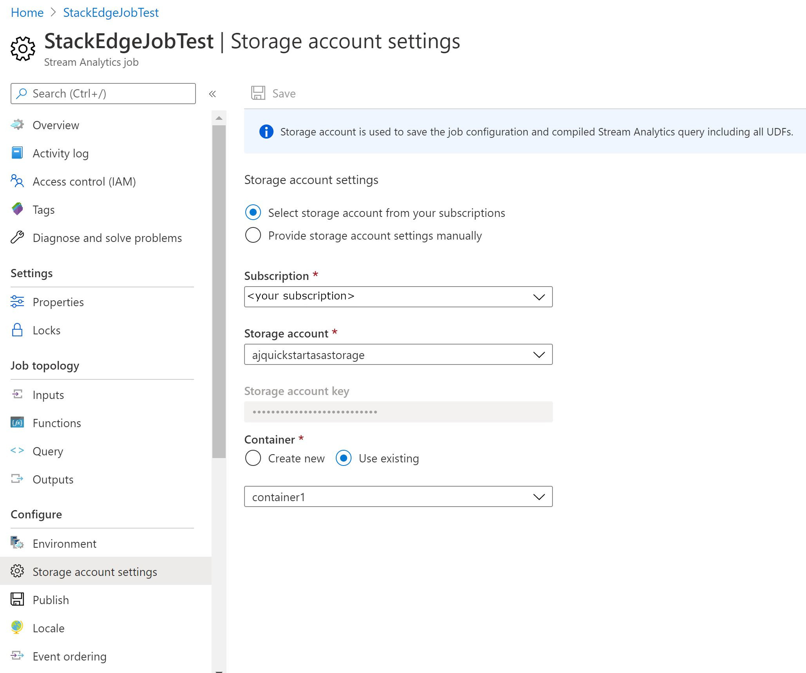
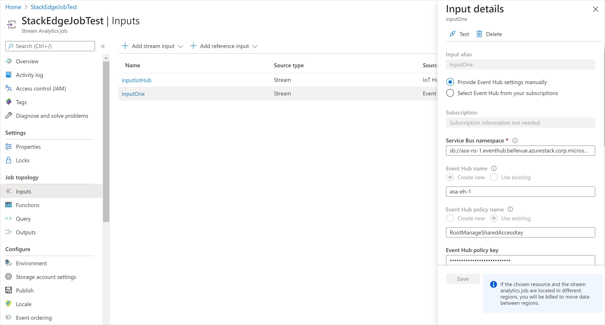
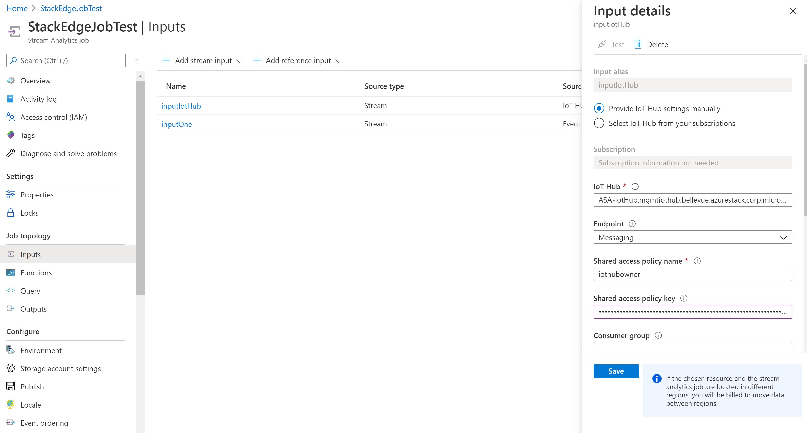
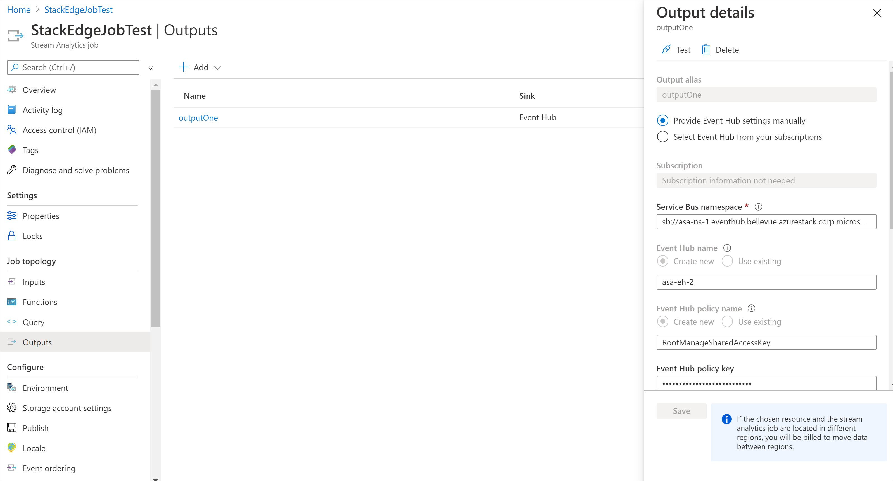
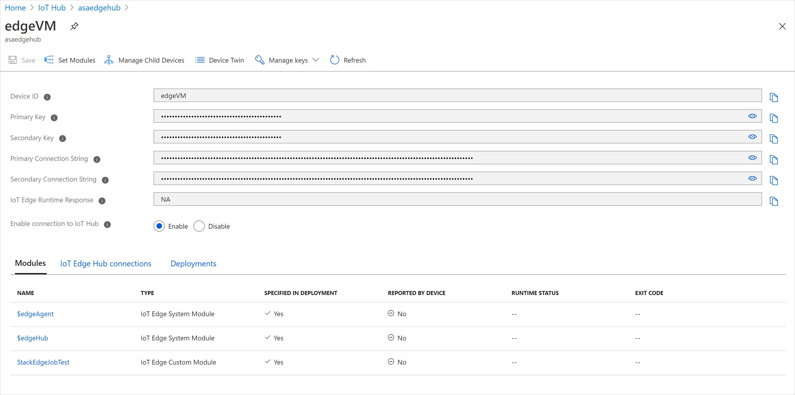
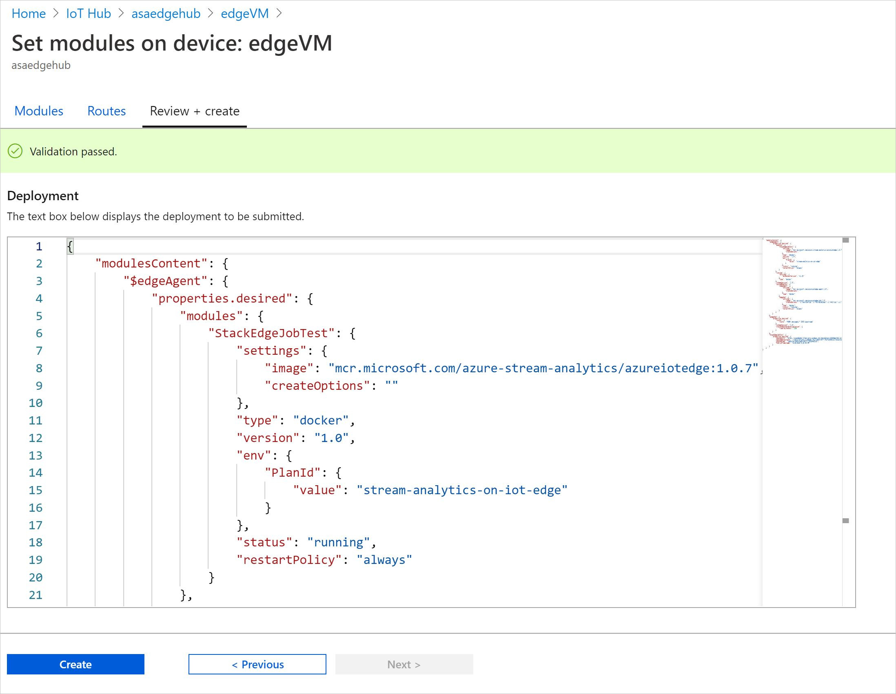
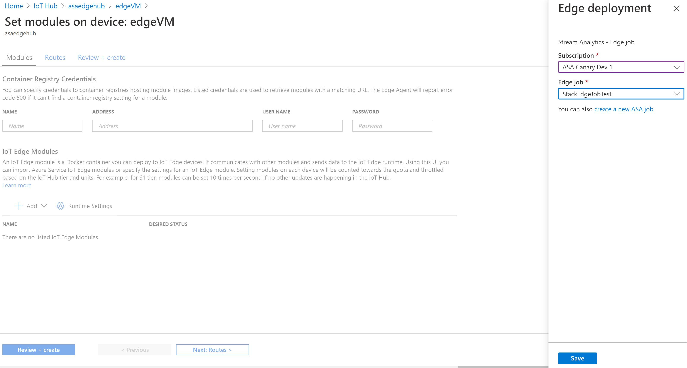

# Run Azure Stream Analytics on Azure Stack (Preview)

> [!IMPORTANT]
> This functionality is in preview and is not recommended for use in production.

You can run Azure Stream Analytics on Azure Stack Hub as an IoT Edge module. Configurations have been added to the IoT Edge module which allows it to interact with blob storage, Event Hubs, and IoT Hubs running in an Azure Stack Hub subscription by allowing custom URLs found in every Azure Stack Hub employment.

With Stream Analytics on Azure Stack, you can build truly hybrid architectures for stream processing in your own private, autonomous cloud – which can be connected or disconnected with cloud-native apps using consistent Azure services on-premises. 

This article shows you how to stream data from IoT Hub or Event Hub to another Event Hub or Blob Storage in an Azure Stack Hub subscription and process it with Stream Analytics.

## Set up environments

Azure Stream Analytics is a hybrid service on Azure Stack Hub. It is an IoT Edge module which is configured in Azure but can be run on Azure Stack Hub.  

If you are new to Azure Stack Hub or IoT Edge, please follow the instructions below to set up environments.

### Prepare the Azure Stack Hub environment

Create an Azure Stack Hub subscription. For more information, see the [tutorial for creating an Azure Stack Hub subscription.](/azure-stack/user/azure-stack-subscribe-services/)

If you'd like to evaluate Azure Stack Hub on your own server, you can use the Azure Stack Development Kit (ASDK).  For more information on the ASDK, see the [ASDK overview](/azure-stack/asdk/).

### Install the IoT Edge runtime

To run Azure Stream Analytics on Azure Stack Hub, your device must have the IoT Edge runtime and must have network connectivity to the Azure Stack Hub or be a VM running on the Azure Stack Hub. The IoT Edge runtime allows Stream Analytics Edge jobs to integrate with Azure Storage and Azure Event Hubs which are running on your Azure Stack Hub. For more information, see [Azure Stream Analytics on IoT Edge](stream-analytics-edge.md) 

In addition to having network access to the Azure Stack Hub resources, the IoT Edge device (or VM) needs access to Azure IoT Hub in the Azure public cloud to configure of the Stream Analytics module. 

The following guides show how to set up the IoT Edge Runtime on your device or VM:

* [Install the Azure IoT Edge runtime on Windows](../iot-edge/how-to-install-iot-edge.md)
* [Install the Azure IoT Edge runtime on Debian-based Linux systems](../iot-edge/how-to-install-iot-edge.md)

## Create an Azure Stream Analytics Edge job

ASA Edge jobs run in containers deployed to Azure IoT Edge devices. They are composed of two parts:
* A cloud part that is responsible for job definition: users define inputs, output, query, and other settings (out of order events, etc.) in the cloud.
* A module running on your IoT devices. It contains the ASA engine and receives the job definition from the cloud.

### Create a storage account

When you create an Azure Stream Analytics job to run on an IoT Edge device, it needs to be stored in a way that can be called from the device. You can use an existing Azure storage account or create a new one.
1. In the Azure portal, go to **Create a resource > Storage > Storage account - blob, file, table, queue**.
2. Provide the following values to create your storage account:

   | Field | Value |
   | --- | --- |
   | Name | Provide a unique name for your storage account. |
   | Location | Choose a location close to you.|
   | Subscription | Choose the same subscription as your IoT hub.|
   | Resource Group | We recommend that you use the same resource group for all of the test resources that you create during the [IoT Edge quickstarts](../iot-edge/quickstart.md) and tutorials. For example, **IoTEdgeResources**. |

3. Keep the default values for the other fields and select **Create**.

### Create a new job

1. In the Azure portal, go to **Create a resource > Internet of Things > Stream Analytics Job**.
2. Provide the following values to create your storage account:

   | Field | Value |
   | --- | --- |
   | Job Name | Provide a name for your job. For example, **IoTEdgeJob** |
   | Subscription | Choose the same subscription as your IoT hub.|
   | Resource Group | We recommend that you use the same resource group for all of the test resources that you create during the [IoT Edge quickstarts](../iot-edge/quickstart.md) and tutorials. For example, **IoTEdgeResources**. |
   | Location | Choose a location close to you. |
   | Hosting Environment | Select **Edge**. |

3. Select **Create**.

### Configure your job

Once your Stream Analytics job is created in the Azure portal, you can configure it with an input, an output, and a query to run on the data that passes through. You can manually specify inputs from an IoT Hub or an Event Hub in an Azure Stack Hub subscription.

1. Navigate to your Stream Analytics job in the Azure portal.
2. Under **Configure**, select **Storage account settings** and choose the storage account you created in the previous step.
   > [!div class="mx-imgBorder"]
   > 
3. Under **Job Topology**, select **Inputs** then **Add stream input.**
4. Choose **IoT Hub**, **Event Hub**, or **Edge Hub** from the drop-down list. 
5. If the input is an Event Hub or IoT Hub in an Azure Stack Hub subscription, please provide information manually as shown below.

   #### Event Hub

   | Field | Value |
   | --- | --- |
   | Input alias | A friendly name that you use in the job's query to reference this input. |
   | Service Bus namespace | The namespace is a container for a set of messaging entities. When you create a new event hub, you also create the namespace. (Example: *sb://<Event Hub Name>.eventhub.shanghai.azurestack.corp.microsoft.com*) |
   | Event Hub name | The name of the event hub to use as input. |
   | Event Hub policy name | The shared access policy that provides access to the Event Hub. Each shared access policy has a name, permissions that you set, and access keys. This option is automatically populated, unless you select the option to provide the Event Hub settings manually. |
   | Event Hub policy key | The shared access key used to authorize access to the Event Hub. This option is automatically populated in unless you select the option to provide the Event Hub settings manually. You can find it in the Event Hub settings. |
   | Event Hub consumer group(optional) | It is highly recommended to use a distinct consumer group for each Stream Analytics job. This string identifies the consumer group to use to ingest data from the event hub. If no consumer group is specified, the Stream Analytics job uses the $Default consumer group. |
   | Partition count | Partition count is the number of partitions in an Event Hub. |

   > [!div class="mx-imgBorder"]
   > 

   #### IoT Hub

   | Field | Value |
   | --- | --- |
   | Input alias | A friendly name that you use in the job's query to reference this input. |
   | IoT Hub | The name of the IoT Hub to use as input. (Example:*<IoT Hub Name>.shanghai.azurestack.corp.microsoft.com*) |
   | Shared access policy name | The shared access policy that provides access to the IoT Hub. Each shared access policy has a name, permissions that you set, and access keys. |
   | Shared access policy key | The shared access key used to authorize access to the IoT Hub. This option is automatically populated in unless you select the option to provide the Iot Hub settings manually. |
   | Consumer group (optional) | It is highly recommended that you use a different consumer group for each Stream Analytics job. The consumer group is used to ingest data from the IoT Hub. Stream Analytics uses the $Default consumer group unless you specify otherwise. |
   | Partition count | Partition count is the number of partitions in an Event Hub. |

   > [!div class="mx-imgBorder"]
   > 

6. Keep the default values for the other fields, and select Save.
7. Under Job Topology, open Outputs then select Add.
8. Choose Blob Storage, Event Hub, or Edge Hub from the drop-down list.
9. If the output is an Event Hub or Blob Storage in an Azure Stack Hub subscription, please provide information manually as shown below.

   #### Event Hub

   | Field | Value |
   | --- | --- |
   | Output alias | A friendly name used in queries to direct the query output to this event hub. |
   | Service Bus namespace | A container for a set of messaging entities. When you created a new event hub, you also created a service bus namespace.(Example: *sb://<Event Hub Name>.eventhub.shanghai.azurestack.corp.microsoft.com*) |
   | Event Hub name | The name of your event hub output. |
   | Event Hub policy name | The shared access policy, which you can create on the event hub's Configure tab. Each shared access policy has a name, permissions that you set, and access keys. |
   | Event Hub policy key | The shared access key that's used to authenticate access to the event hub namespace. |

   > [!div class="mx-imgBorder"]
   > 

   #### Blob Storage 

   | Field | Value |
   | --- | --- |
   | Output alias | A friendly name used in queries to direct the query output to this blob storage. |
   | Storage account | The name of the storage account where you're sending your output.(Example: *<Storage Account Name>.blob.shanghai.azurestack.corp.microsoft.com*) |
   | Storage account key | The secret key associated with the storage account. This option is automatically populated in unless you select the option to provide the Blob storage settings manually. |

> [!NOTE]
> Parquet format is not supported for edge jobs on Azure Stack Hub. For Minimum rows and Maximum time, please use 0 or leave them blank.

## Deploy Stream Analytics on a VM or device connected to Azure Stack

1. In the Azure portal, open IoT Hub. Navigate to **IoT Edge** and click on the device (VM) you want to target for this deployment.
2. Select **Set modules**. Then, select **+ Add** and choose **Azure Stream Analytics Module**. 
3. Select the subscription and the Steam Analytics Edge job that you created. Click **Save** and select **Next:Routes**.

   > [!div class="mx-imgBorder"]
   > 

4. Click **Review + create >**.
5. In the **Review + create** step, select **Create**. 
   > [!div class="mx-imgBorder"]
   > 
6. Confirm that the module is added to the list.
   > [!div class="mx-imgBorder"]
   > 

## Next steps
- [Azure Stream Analytics on IoT Edge](./stream-analytics-edge.md)
- [Develop Stream Analytics Edge jobs](/stream-analytics-query/stream-analytics-query-language-reference)