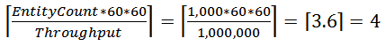

# Power BI output from Azure Stream Analytics

You can use [Power BI](/power-bi/fundamentals/power-bi-overview) as an output for a Stream Analytics job to provide a rich visualization experience of analysis results. Use this capability for operational dashboards, report generation, and metric-driven reporting.

> [!NOTE]
> Power BI output from Stream Analytics isn't currently available in Microsoft Azure operated by 21Vianet and Azure Germany (T-Systems International).

> [!Important]
> Real-time streaming in Power BI is deprecated. For more information about the retirement of real-time streaming in Power BI, see the [blog](https://powerbi.microsoft.com/en-us/blog/announcing-the-retirement-of-real-time-streaming-in-power-bi/).
> Beginning Oct 31, 2027, you can't create Stream Analytics jobs with Power BI output connector, and existing jobs running with Power BI connector are stopped. Microsoft recommends that you explore Real-Time Intelligence in Microsoft Fabric. If you're interested in migrating to Fabric Real-Time Intelligence, you can use the guidance provided in this [blog](https://techcommunity.microsoft.com/blog/analyticsonazure/simplifying-migration-to-fabric-real-time-intelligence-for-power-bi-real-time-re/4283180) post. If you need more migration guidance from Microsoft, such as architecture review or clarification about specific capabilities, fill out your request [here](https://forms.office.com/r/sQeaA8KLAZ).

## Output configuration

The following table lists property names and their descriptions to configure your Power BI output.

| Property name | Description |
| --- | --- |
| Output alias |Provide a friendly name that's used in queries to direct the query output to this Power BI output. |
| Group workspace |To enable sharing data with other Power BI users, select groups inside your Power BI account or choose **My Workspace** if you don't want to write to a group. Updating an existing group requires renewing the Power BI authentication. |
| Dataset name |Provide a dataset name that you want the Power BI output to use. |
| Table name |Provide a table name under the dataset of the Power BI output. Currently, Power BI output from Stream Analytics jobs can have only one table in a dataset. |
| Authorize connection | Authorize with Power BI to configure your output settings. After you grant this output access to your Power BI dashboard, you can revoke access by changing the user account password, deleting the job output, or deleting the Stream Analytics job. | 

For a walkthrough of configuring a Power BI output and dashboard, see the [Tutorial: Analyze fraudulent call data with Stream Analytics and visualize results in Power BI dashboard](stream-analytics-real-time-fraud-detection.md) tutorial.

> [!NOTE]
> Don't explicitly create the dataset and table in the Power BI dashboard. The dataset and table are automatically populated when the job starts and the job starts pumping output into Power BI. If the job query doesn't generate any results, the dataset and table aren't created. If Power BI already had a dataset and table with the same name as the one provided in this Stream Analytics job, the existing data is overwritten.


### Create a schema

Azure Stream Analytics creates a Power BI dataset and table schema for you if they don't already exist. In all other cases, the table is updated with new values. Currently, only one table can exist within a dataset. 

Power BI uses the first-in, first-out (FIFO) retention policy. Data is collected in a table until it reaches 200,000 rows.

> [!NOTE]
> Don't use multiple outputs to write to the same dataset because it can cause several problems. Each output tries to create the Power BI dataset independently, which can result in multiple datasets with the same name. Additionally, if the outputs don't have consistent schemas, the dataset changes the schema on each write, which leads to too many schema change requests. Even if you avoid these problems, multiple outputs are less performant than a single merged output.

### Convert a data type from Stream Analytics to Power BI

Azure Stream Analytics updates the data model dynamically at runtime when the output schema changes. It tracks column name changes, column type changes, and the addition or removal of columns.

This table covers the data type conversions from [Stream Analytics data types](/stream-analytics-query/data-types-azure-stream-analytics) to Power BI [Entity Data Model (EDM) types](/dotnet/framework/data/adonet/entity-data-model), if a Power BI dataset and table don't exist.

| From Stream Analytics | To Power BI |
| -----|----- |
| bigint | Int64 |
| nvarchar(max) | String |
| datetime | Datetime |
| float | Double |
| Record array | String type, constant value `IRecord`, or `IArray` |

### Update the schema

Stream Analytics infers the data model schema based on the first set of events in the output. Later, if necessary, it updates the data model schema to accommodate incoming events that might not fit into the original schema.

Avoid using the `SELECT *` query to prevent dynamic schema updates across rows. In addition to potential performance implications, it might result in uncertainty about the time taken for the results. Select the exact fields that you want to show on the Power BI dashboard. Additionally, ensure the data values are compliant with the chosen data type.

| Previous/current | Int64 | String | Datetime | Double |
| ---|---|---|---|--- |
| Int64 | Int64 | String | String | Double |
| Double | Double | String | String | Double |
| String | String | String | String | String  |
| Datetime | String | String |  Datetime | String |

## Limitations and best practices
Currently, you can call Power BI roughly once per second. Streaming visuals support packets of 15 KB. Beyond that size, streaming visuals fail (but push continues to work). Because of these limitations, Power BI works best when Azure Stream Analytics significantly reduces the data load. Use a tumbling window or hopping window to ensure that you push data at most once per second and that your query meets the throughput requirements. For more info on output batch size, see [Power BI REST API limits](/power-bi/developer/automation/api-rest-api-limitations).

Use the following equation to compute the value to give your window in seconds:

  

For example:

* You have 1,000 devices sending data at one-second intervals.
* You're using the Power BI Pro Stock Keeping Unit (SKU) that supports 1,000,000 rows per hour.
* You want to publish the amount of average data per device to Power BI.

As a result, the equation becomes:

  

Given this configuration, you can change the original query to the following:

```SQL
    SELECT
        MAX(hmdt) AS hmdt,
        MAX(temp) AS temp,
        System.TimeStamp AS time,
        dspl
    INTO "CallStream-PowerBI"
    FROM
        Input TIMESTAMP BY time
    GROUP BY
        TUMBLINGWINDOW(ss,4),
        dspl
```

### Renew authorization
If the password changed since you created your job or last authenticated, reauthenticate your Power BI account. If Microsoft Entra multifactor authentication is configured on your Microsoft Entra tenant, you also need to renew Power BI authorization every two weeks. If you don't renew, you might see symptoms such as a lack of job output or an `Authenticate user error` in the operation logs.

Similarly, if a job starts after the token expires, an error occurs and the job fails. To resolve this issue, stop the running job and go to your Power BI output. To avoid data loss, select the **Renew authorization** link, and then restart your job from the **Last Stopped Time**.

After you refresh the authorization with Power BI, a green alert appears in the authorization area to show that the issue is resolved. To overcome this limitation, [use managed identity to authenticate your Azure Stream Analytics job to Power BI](powerbi-output-managed-identity.md).

## Related content

* [Use managed identity to authenticate your Azure Stream Analytics job to Power BI](powerbi-output-managed-identity.md)
* [Quickstart: Create a Stream Analytics job by using the Azure portal](stream-analytics-quick-create-portal.md)
