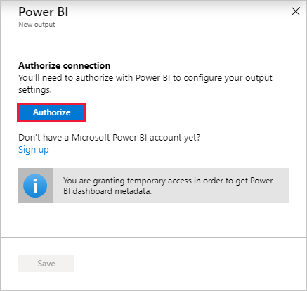
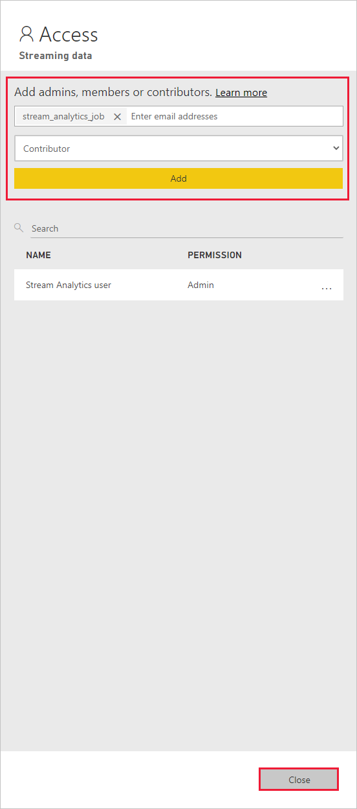

# Use Managed Identity to authenticate your Azure Stream Analytics job to Power BI

[Managed Identity authentication](../active-directory/managed-identities-azure-resources/overview.md) for output to Power BI gives Stream Analytics jobs direct access to a workspace within your Power BI account. This feature allows for deployments of Stream Analytics jobs to be fully automated, since it's no longer required for a user to interactively sign in to Power BI via the Azure portal. Additionally, long running jobs that write to Power BI are now better supported, since you won't need to periodically reauthorize the job.

This article shows you how to enable Managed Identity for the Power BI output(s) of a Stream Analytics job through the Azure portal and through an Azure Resource Manager deployment.

> [!NOTE]
> Only **system-assigned** managed identities are supported with the Power BI output. Currently, using user-assigned managed identities with the Power BI output isn't supported. 

## Prerequisites

You must have the following prerequisites before you use this feature:

- A Power BI account with a [Pro license](/power-bi/service-admin-purchasing-power-bi-pro).
- An upgraded workspace within your Power BI account. For more information, see [Power BI's announcement](https://powerbi.microsoft.com/blog/announcing-new-workspace-experience-general-availability-ga/).

## Create a Stream Analytics job using the Azure portal

1. Create a new Stream Analytics job or open an existing job in the Azure portal. 
1. From the menu bar located on the left side of the screen, select **Managed Identity** located under **Settings**. 

    :::image type="content" source="./media/stream-analytics-powerbi-output-managed-identity/managed-identity-select-button.png" alt-text="Screenshot showing the Managed Identity page with Select identity button selected." lightbox="./media/stream-analytics-powerbi-output-managed-identity/managed-identity-select-button.png":::
1. On the **Select identity** page, select **System assigned identity***. If you select the latter option, specify the managed identity you want to use. Then, select **Save**.

    :::image type="content" source="./media/stream-analytics-powerbi-output-managed-identity/system-assigned-identity.png" alt-text="Screenshot showing the Select identity page with System assigned identity selected." lightbox="./media/stream-analytics-powerbi-output-managed-identity/system-assigned-identity.png":::
1. On the **Managed identity** page, confirm that you see the **Principal ID** and **Principal name** assigned to your Stream Analytics job. The principal name should be same as your Stream Analytics job name. 
2. Before configuring the output, give the Stream Analytics job access to your Power BI workspace by following the directions in the [Give the Stream Analytics job access to your Power BI workspace](#give-the-stream-analytics-job-access-to-your-power-bi-workspace) section of this article.
3. Navigate to the **Outputs** section of your Stream Analytic's job, select **+ Add**, and then choose **Power BI**. Then, select the **Authorize** button and sign in with your Power BI account.

   [  ](./media/stream-analytics-powerbi-output-managed-identity/stream-analytics-authorize-powerbi.png#lightbox)

4. Once authorized, a dropdown list will be populated with all of the workspaces you have access to. Select the workspace that you authorized in the previous step. Then select **Managed Identity** as the "Authentication mode". Finally, select the **Save** button.

    :::image type="content" source="./media/stream-analytics-powerbi-output-managed-identity/stream-analytics-configure-powerbi-with-managed-id.png" alt-text="Screenshot showing the Power BI output configuration with Managed identity authentication mode selected."  lightbox="./media/stream-analytics-powerbi-output-managed-identity/stream-analytics-configure-powerbi-with-managed-id.png":::

## Azure Resource Manager deployment

Azure Resource Manager allows you to fully automate the deployment of your Stream Analytics job. You can deploy Resource Manager templates using either Azure PowerShell or the [Azure CLI](/cli/azure/). The below examples use the Azure CLI.


1. You can create a **Microsoft.StreamAnalytics/streamingjobs** resource with a Managed Identity by including the following property in the resource section of your Resource Manager template:

    ```json
    "identity": {
        "type": "SystemAssigned",
    }
    ```

   This property tells Azure Resource Manager to create and manage the identity for your Stream Analytics job. Below is an example Resource Manager template that deploys a Stream Analytics job with Managed Identity enabled and a Power BI output sink that uses Managed Identity:

    ```json
    {
        "$schema": "http://schema.management.azure.com/schemas/2015-01-01/deploymentTemplate.json#",
        "contentVersion": "1.0.0.0",
        "resources": [
            {
                "apiVersion": "2017-04-01-preview",
                "name": "pbi_managed_id",
                "location": "[resourceGroup().location]",
                "type": "Microsoft.StreamAnalytics/StreamingJobs",
                "identity": {
                    "type": "systemAssigned"
                },
                "properties": {
                    "sku": {
                        "name": "standard"
                    },
                    "outputs":[
                        {
                            "name":"output",
                            "properties":{
                                "datasource":{
                                    "type":"PowerBI",
                                    "properties":{
                                        "dataset": "dataset_name",
                                        "table": "table_name",
                                        "groupId": "01234567-89ab-cdef-0123-456789abcdef",
                                        "authenticationMode": "Msi"
                                    }
                                }
                            }
                        }
                    ]
                }
            }
        ]
    }
    ```

    Deploy the job above to the Resource group **ExampleGroup** using the below Azure CLI command:

    ```azurecli
    az deployment group create --resource-group ExampleGroup -template-file StreamingJob.json
    ```

2. After the job is created, use Azure Resource Manager to retrieve the job's full definition.

    ```azurecli
    az resource show --ids /subscriptions/<subsription-id>/resourceGroups/<resource-group>/providers/Microsoft.StreamAnalytics/StreamingJobs/<resource-name>
    ```

    The above command will return a response like the below:

    ```json
    {
        "id": "/subscriptions/<subscription-id>/resourceGroups/<resource-group>/providers/Microsoft.StreamAnalytics/streamingjobs/<resource-name>",
        "identity": {
            "principalId": "<principal-id>",
            "tenantId": "<tenant-id>",
            "type": "SystemAssigned",
            "userAssignedIdentities": null
        },
        "kind": null,
        "location": "West US",
        "managedBy": null,
        "name": "<resource-name>",
        "plan": null,
        "properties": {
            "compatibilityLevel": "1.0",
            "createdDate": "2019-07-12T03:11:30.39Z",
            "dataLocale": "en-US",
            "eventsLateArrivalMaxDelayInSeconds": 5,
            "jobId": "<job-id>",
            "jobState": "Created",
            "jobStorageAccount": null,
            "jobType": "Cloud",
            "outputErrorPolicy": "Stop",
            "package": null,
            "provisioningState": "Succeeded",
            "sku": {
                "name": "Standard"
            }
        },
        "resourceGroup": "<resource-group>",
        "sku": null,
        "tags": null,
        "type": "Microsoft.StreamAnalytics/streamingjobs"
    }
    ```

    If you plan to use the Power BI REST API to add the Stream Analytics job to your Power BI workspace, make note of the returned `principalId`.

3. Now that the job is created, continue to the [Give the Stream Analytics job access to your Power BI workspace](#give-the-stream-analytics-job-access-to-your-power-bi-workspace) section of this article.


## Give the Stream Analytics job access to your Power BI workspace

Now that the Stream Analytics job has been created, it can be given access to a Power BI workspace. Once you have given your job access, allow a few minutes for the identity to propagate.

### Use the Power BI UI

   > [!Note]
   > In order to add the Stream Analytics job to your Power BI workspace using the UI, you also have to enable service principal access in the **Developer settings** in the Power BI admin portal. For more information, see [Get started with a service principal](/power-bi/developer/embed-service-principal).

1. Navigate to the workspace's access settings. For more information, see [Give access to your workspace](/power-bi/service-create-the-new-workspaces#give-access-to-your-workspace).

2. Type the name of your Stream Analytics job in the text box and select **Contributor** as the access level.

3. Select **Add** and close the pane.

   [  ](./media/stream-analytics-powerbi-output-managed-identity/stream-analytics-add-job-to-powerbi-workspace.png#lightbox)

### Use the Power BI PowerShell cmdlets

1. Install the Power BI `MicrosoftPowerBIMgmt` PowerShell cmdlets.

   > [!Important]
   > Please ensure you are using version 1.0.821 or later of the cmdlets.

    ```powershell
    Install-Module -Name MicrosoftPowerBIMgmt
    ```    
2. Sign in to Power BI.

    ```powershell
    Login-PowerBI
    ```    
3. Add your Stream Analytics job as a Contributor to the workspace.

    ```powershell
    Add-PowerBIWorkspaceUser -WorkspaceId <group-id> -PrincipalId <principal-id> -PrincipalType App -AccessRight Contributor
    ```

### Use the Power BI REST API

The Stream Analytics job can also be added as a Contributor to the workspace by using the "Add Group User" REST API directly. Full documentation for this API can be found here: [Groups - Add Group User](/rest/api/power-bi/groups/addgroupuser).

**Sample Request**
```http
POST https://api.powerbi.com/v1.0/myorg/groups/{groupId}/users
```
Request Body
```json
{
    "groupUserAccessRight": "Contributor",
    "identifier": "<principal-id>",
    "principalType": "App"
}
```

### Use a Service Principal to grant permission for an ASA job's Managed Identity

For automated deployments, using an interactive sign-in to give an ASA job access to a Power BI workspace isn't possible. It can be done using service principal to grant permission for an ASA job's managed identity. This is possible using PowerShell:

```powershell
Connect-PowerBIServiceAccount -ServicePrincipal -TenantId "<tenant-id>" -CertificateThumbprint "<thumbprint>" -ApplicationId "<app-id>"
Add-PowerBIWorkspaceUser -WorkspaceId <group-id> -PrincipalId <principal-id> -PrincipalType App -AccessRight Contributor
```

## Remove Managed Identity

The Managed Identity created for a Stream Analytics job is deleted only when the job is deleted. There's no way to delete the Managed Identity without deleting the job. If you no longer want to use the Managed Identity, you can change the authentication method for the output. The Managed Identity will continue to exist until the job is deleted, and will be used if you decide to used Managed Identity authentication again.

## Limitations
Below are the limitations of this feature:

- Classic Power BI workspaces aren't supported.

- Azure accounts without Azure Active Directory.

- Multi-tenant access isn't supported. The Service principal created for a given Stream Analytics job must reside in the same Azure Active Directory tenant in which the job was created, and can't be used with a resource that resides in a different Azure Active Directory tenant.

- [User Assigned Identity](../active-directory/managed-identities-azure-resources/overview.md) isn't supported. This means you aren't able to enter your own service principal to be used by their Stream Analytics job. The service principal must be generated by Azure Stream Analytics.

## Next steps

- [Tutorial: Analyze fraudulent call data with Stream Analytics and visualize results in Power BI dashboard](stream-analytics-real-time-fraud-detection.md) 
* [Understand outputs from Azure Stream Analytics](./stream-analytics-define-outputs.md)
