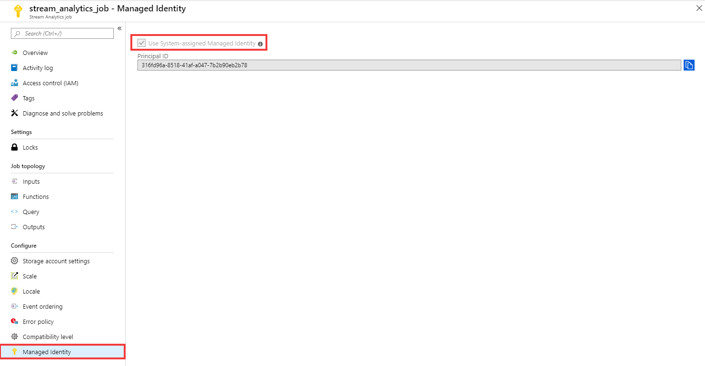

# Use Managed Identity to authenticate your Azure Stream Analytics job to Power BI (Preview)

[Managed Identity authentication](../active-directory/managed-identities-azure-resources/overview.md) for output to Power BI is now available for Azure Stream Analytics as a preview. This gives Stream Analytics jobs direct access to a workspace within your Power BI account. This feature allows for deployments of Stream Analytics jobs to be fully automated, since it is no longer required for a user to interactively login via the Azure Portal.

This article shows you how to enable Managed Identity for the Power BI output(s) of a Stream Analytics job through the Azure portal and through an Azure Resource Manager deployment.

## Prerequisites

The following are required for using this feature:

1. A Power BI account with a Pro license

2. An upgraded workspace within your Power BI account. See [Power BI's announcement](https://powerbi.microsoft.com/en-us/blog/announcing-new-workspace-experience-general-availability-ga/) of this feature for more details.

## Create a Stream Analytics job using the Azure portal

1. Create a new Stream Analytics job or open an existing job in the Azure portal. From the menu bar located on the left side of the screen, select **Managed Identity** located under **Configure**. Ensure that "Use System-assigned Managed Identity" is selected and then click the **Save** button on the bottom of the screen.

   

2. In the output properties window of the Power BI output sink, select the Authentication mode drop-down and choose **Managed Identity**. For information regarding the other output properties, see [Understand outputs from Azure Stream Analytics](./stream-analytics-define-outputs.md). When you are finished, click **Save**.

<!--
    Image placeholder: photo of Power BI output blade.
-->

3. Now that the job is created, see the [Give the Stream Analytics job access to your Power BI workspace](#give-the-stream-analytics-job-access-to-your-powerbi-workspace) section of this article.

## Azure Resource Manager deployment

Using Azure Resource Manager allows you to fully automate the deployment of your Stream Analytics job. You can deploy Resource Manager templates using either Azure PowerShell or the [Azure CLI](https://docs.microsoft.com/cli/azure/?view=azure-cli-latest). The below examples use the Azure CLI.


1. You can create a **Microsoft.StreamAnalytics/streamingjobs** resource with a Managed Identity by including the following property in the resource section of your Resource Manager template:

    ```json
    "identity": {
        "type": "SystemAssigned",
    }
    ```

   This property tells Azure Resource Manager to create and manage the identity for your Stream Analytics job. Below is an example Resource Manager template that deploys a Stream Analytics job with Managed Identity enabled and a Power BI output sink that uses Managed Identity:

    ```json
    {
        "$schema": "http://schema.management.azure.com/schemas/2015-01-01/deploymentTemplate.json#",
        "contentVersion": "1.0.0.0",
        "resources": [
            {
                "apiVersion": "2017-04-01-preview",
                "name": "pbi_managed_id",
                "location": "[resourceGroup().location]",
                "type": "Microsoft.StreamAnalytics/StreamingJobs",
                "identity": {
                    "type": "systemAssigned"
                },
                "properties": {
                    "sku": {
                        "name": "standard"
                    },
                    "outputs":[
                        {
                            "name":"output",
                            "properties":{
                                "datasource":{
                                    "type":"PowerBI",
                                    "properties":{
                                        "dataset": "dataset_name",
                                        "table": "table_name",
                                        "groupId": "ae969eeb-e7a2-436e-aba3-851e948584bc",
                                        "authenticationMode": "Msi"
                                    }
                                }
                            }
                        }
                    ]
                }
            }
        ]
    }
    ```

    The above job can be deployed to the Resource group **ExampleGroup** using the below Azure CLI command:

    ```azurecli
    az group deployment create --resource-group ExampleGroup -template-file StreamingJob.json
    ```

2. After the job is created, you can use Azure Resource Manager to retrieve the job's full definition.

    ```azurecli
    az resource show --ids /subscriptions/{SUBSCRIPTION_ID}/resourceGroups/{RESOURCE_GROUP}/providers/Microsoft.StreamAnalytics/StreamingJobs/{RESOURCE_NAME}
    ```

    The above command will return a response like the below:

    ```json
    {
        "id": "/subscriptions/{SUBSCRIPTION_ID}/resourceGroups/{RESOURCE_GROUP}/providers/Microsoft.StreamAnalytics/streamingjobs/{RESOURCE_NAME}",
        "identity": {
            "principalId": "{PRINCIPAL_ID}",
            "tenantId": "{TENANT_ID}",
            "type": "SystemAssigned",
            "userAssignedIdentities": null
        },
        "kind": null,
        "location": "West US",
        "managedBy": null,
        "name": "{RESOURCE_NAME}",
        "plan": null,
        "properties": {
            "compatibilityLevel": "1.0",
            "createdDate": "2019-07-12T03:11:30.39Z",
            "dataLocale": "en-US",
            "eventsLateArrivalMaxDelayInSeconds": 5,
            "jobId": "{JOB_ID}",
            "jobState": "Created",
            "jobStorageAccount": null,
            "jobType": "Cloud",
            "outputErrorPolicy": "Stop",
            "package": null,
            "provisioningState": "Succeeded",
            "sku": {
                "name": "Standard"
            }
        },
        "resourceGroup": "{RESOURCE_GROUP}",
        "sku": null,
        "tags": null,
        "type": "Microsoft.StreamAnalytics/streamingjobs"
    }
    ```

   Take note of the **principalId** from the job's definition, which identifies your job's Managed Identity within Azure Active Directory and will be used in the next step to grant the Stream Analytics job access to the storage account.

3. Now that the job is created, see the [Give the Stream Analytics job access to your Power BI workspace](#give-the-stream-analytics-job-access-to-your-powerbi-workspace) section of this article.


## Give the Stream Analytics job access to your Power BI workspace

### Grant access via Power BI portal


1. Navigate to the Workspace's access settings.

2. Type the name of your Stream Analytics job in the text box and select **Contributor** as the access level.

3. Click **Add** and close the pane.

<!--
    Image placeholder: Photo of Power BI ACL page.
-->


### Grant access via the command line

**TODO**

## Limitations
Below are the current limitations of this feature:

1. Classic Power BI workspaces

2. Azure accounts without Azure Active Directory.

3. Multi-tenant access is not supported. The Service principal created for a given Stream Analytics job must reside in the same Azure Active Directory tenant in which the job was created, and cannot be used with a resource that resides in a different Azure Active Directory tenant.

4. [User Assigned Identity](../active-directory/managed-identities-azure-resources/overview.md) is not supported. This means the user is not able to enter their own service principal to be used by their Stream Analytics job. The service principal must be generated by Azure Stream Analytics.

## Next steps

* [Understand outputs from Azure Stream Analytics](./stream-analytics-define-outputs.md)
