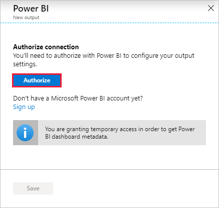
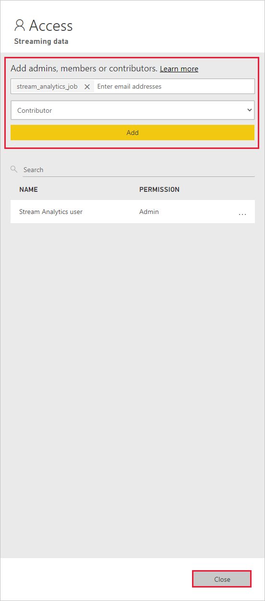

# Use managed identity to authenticate your Azure Stream Analytics job to Power BI

[Managed identity authentication](../active-directory/managed-identities-azure-resources/overview.md) for output to Power BI gives Stream Analytics jobs direct access to a workspace within your Power BI account. This feature allows for deployments of Stream Analytics jobs to be fully automated, since a user no longer needs to interactively sign in to Power BI via the Azure portal. Additionally, long running jobs that write to Power BI are now better supported, since you don't need to periodically reauthorize the job.

This article shows you how to enable managed identity for the Power BI outputs of a Stream Analytics job through the Azure portal and through an Azure Resource Manager deployment.

> [!IMPORTANT]
> Real-time streaming in Power BI is being retired. Beginning October 31, 2027, users can't create Azure Stream Analytics jobs that use the Power BI output connector, and existing jobs that use this connector stop running. Microsoft recommends exploring Real-Time Intelligence in Microsoft Fabric for real-time scenarios. For migration guidance, see the power-bi-output.md article.

> [!NOTE]
> Only **system-assigned** managed identities are supported with the Power BI output. Currently, using user-assigned managed identities with the Power BI output isn't supported. 

## Prerequisites

To use this feature, you need the following prerequisites:

- A Power BI account with a [Pro license](/power-bi/service-admin-purchasing-power-bi-pro).
- An upgraded workspace within your Power BI account. For more information, see [Power BI's announcement](https://powerbi.microsoft.com/blog/announcing-new-workspace-experience-general-availability-ga/).

## Create a Stream Analytics job using the Azure portal

1. Create a new Stream Analytics job or open an existing job in the Azure portal.
1. From the menu bar on the left side of the screen, select **Managed Identity** under **Settings**. 

    :::image type="content" source="./media/stream-analytics-powerbi-output-managed-identity/managed-identity-select-button.png" alt-text="Screenshot showing the Managed Identity page with Select identity button selected." lightbox="./media/stream-analytics-powerbi-output-managed-identity/managed-identity-select-button.png":::
1. On **Select identity**, select **System assigned identity**. Then, select **Save**.

    :::image type="content" source="./media/stream-analytics-powerbi-output-managed-identity/system-assigned-identity.png" alt-text="Screenshot showing the Select identity page with System assigned identity selected." lightbox="./media/stream-analytics-powerbi-output-managed-identity/system-assigned-identity.png":::
1. On **Managed identity**, confirm that you see the **Principal ID** and **Principal name** assigned to your Stream Analytics job. The principal name should be the same as your Stream Analytics job name. 
1. Before configuring the output, give the Stream Analytics job access to your Power BI workspace by following the directions in the [Give the Stream Analytics job access to your Power BI workspace](#give-the-stream-analytics-job-access-to-your-power-bi-workspace) section of this article.
1. Go to the **Outputs** section of your Stream Analytics job, select **+ Add**, and then choose **Power BI**. Then, select the **Authorize** button and sign in with your Power BI account.

   [  ](./media/stream-analytics-powerbi-output-managed-identity/stream-analytics-authorize-powerbi.png#lightbox)

1. After you're authorized, a dropdown list populates with all of the workspaces you have access to. Select the workspace that you authorized in the previous step. Then select **Managed Identity** as the **Authentication mode**. Finally, select the **Save** button.

    :::image type="content" source="./media/stream-analytics-powerbi-output-managed-identity/stream-analytics-configure-powerbi-with-managed-id.png" alt-text="Screenshot showing the Power BI output configuration with Managed identity authentication mode selected."  lightbox="./media/stream-analytics-powerbi-output-managed-identity/stream-analytics-configure-powerbi-with-managed-id.png":::

## Azure Resource Manager deployment

Azure Resource Manager enables you to fully automate the deployment of your Stream Analytics job. You can deploy Resource Manager templates by using either Azure PowerShell or the [Azure CLI](/cli/azure/). The following examples use the Azure CLI.


1. Create a **Microsoft.StreamAnalytics/streamingjobs** resource with a managed identity by including the following property in the resource section of your Resource Manager template:

    ```json
    "identity": {
        "type": "SystemAssigned",
    }
    ```

   This property tells Azure Resource Manager to create and manage the identity for your Stream Analytics job. The following example shows a Resource Manager template that deploys a Stream Analytics job with managed identity enabled and a Power BI output sink that uses managed identity:

    ```json
    {
        "$schema": "http://schema.management.azure.com/schemas/2015-01-01/deploymentTemplate.json#",
        "contentVersion": "1.0.0.0",
        "resources": [
            {
                "apiVersion": "2017-04-01-preview",
                "name": "pbi_managed_id",
                "location": "[resourceGroup().location]",
                "type": "Microsoft.StreamAnalytics/StreamingJobs",
                "identity": {
                    "type": "systemAssigned"
                },
                "properties": {
                    "sku": {
                        "name": "standard"
                    },
                    "outputs":[
                        {
                            "name":"output",
                            "properties":{
                                "datasource":{
                                    "type":"PowerBI",
                                    "properties":{
                                        "dataset": "dataset_name",
                                        "table": "table_name",
                                        "groupId": "01234567-89ab-cdef-0123-456789abcdef",
                                        "authenticationMode": "Msi"
                                    }
                                }
                            }
                        }
                    ]
                }
            }
        ]
    }
    ```

    Deploy the preceding job to the resource group **ExampleGroup** by using the following Azure CLI command:

    ```azurecli
    az deployment group create --resource-group ExampleGroup -template-file StreamingJob.json
    ```

1. After you create the job, use Azure Resource Manager to retrieve the job's full definition.

    ```azurecli
    az resource show --ids /subscriptions/<subscription-id>/resourceGroups/<resource-group>/providers/Microsoft.StreamAnalytics/StreamingJobs/<resource-name>
    ```

    The preceding command returns a response like the following:

    ```json
    {
        "id": "/subscriptions/<subscription-id>/resourceGroups/<resource-group>/providers/Microsoft.StreamAnalytics/streamingjobs/<resource-name>",
        "identity": {
            "principalId": "<principal-id>",
            "tenantId": "<tenant-id>",
            "type": "SystemAssigned",
            "userAssignedIdentities": null
        },
        "kind": null,
        "location": "West US",
        "managedBy": null,
        "name": "<resource-name>",
        "plan": null,
        "properties": {
            "compatibilityLevel": "1.0",
            "createdDate": "2019-07-12T03:11:30.39Z",
            "dataLocale": "en-US",
            "eventsLateArrivalMaxDelayInSeconds": 5,
            "jobId": "<job-id>",
            "jobState": "Created",
            "jobStorageAccount": null,
            "jobType": "Cloud",
            "outputErrorPolicy": "Stop",
            "package": null,
            "provisioningState": "Succeeded",
            "sku": {
                "name": "Standard"
            }
        },
        "resourceGroup": "<resource-group>",
        "sku": null,
        "tags": null,
        "type": "Microsoft.StreamAnalytics/streamingjobs"
    }
    ```

    If you plan to use the Power BI REST API to add the Stream Analytics job to your Power BI workspace, make note of the returned `principalId`.

1. Now that the job is created, continue to the [Give the Stream Analytics job access to your Power BI workspace](#give-the-stream-analytics-job-access-to-your-power-bi-workspace) section of this article.


## Give the Stream Analytics job access to your Power BI workspace

After you create the Stream Analytics job, give it access to a Power BI workspace. Once you give your job access, allow a few minutes for the identity to propagate.

### Use the Power BI UI

   > [!NOTE]
   > To add the Stream Analytics job to your Power BI workspace by using the UI, you also need to enable service principal access in the **Developer settings** in the Power BI admin portal. For more information, see [Get started with a service principal](/power-bi/developer/embed-service-principal).

1. Go to the workspace's access settings. For more information, see [Give access to your workspace](/power-bi/service-create-the-new-workspaces#give-access-to-your-workspace).

1. Enter the name of your Stream Analytics job in the text box and select **Contributor** as the access level.

1. Select **Add** and close the pane.

   [  ](./media/stream-analytics-powerbi-output-managed-identity/stream-analytics-add-job-to-powerbi-workspace.png#lightbox)

### Use the Power BI PowerShell cmdlets

1. Install the Power BI `MicrosoftPowerBIMgmt` PowerShell cmdlets.

   > [!Important]
   > Make sure you're using version 1.0.821 or later of the cmdlets.

    ```powershell
    Install-Module -Name MicrosoftPowerBIMgmt
    ```    
1. Sign in to Power BI.

    ```powershell
    Login-PowerBI
    ```    
1. Add your Stream Analytics job as a Contributor to the workspace.

    ```powershell
    Add-PowerBIWorkspaceUser -WorkspaceId <group-id> -PrincipalId <principal-id> -PrincipalType App -AccessRight Contributor
    ```

### Use the Power BI REST API

You can add the Stream Analytics job as a Contributor to the workspace by using the "Add Group User" REST API directly. For full documentation, see [Groups - Add Group User](/rest/api/power-bi/groups/addgroupuser).

**Sample Request**
```http
POST https://api.powerbi.com/v1.0/myorg/groups/{groupId}/users
```
Request Body
```json
{
    "groupUserAccessRight": "Contributor",
    "identifier": "<principal-id>",
    "principalType": "App"
}
```

### Use a service principal to grant permission for an ASA job's managed identity

For automated deployments, using an interactive sign-in to give an ASA job access to a Power BI workspace isn't possible. You can use a service principal to grant permission for an ASA job's managed identity. You can use PowerShell for this approach:

```powershell
Connect-PowerBIServiceAccount -ServicePrincipal -TenantId "<tenant-id>" -CertificateThumbprint "<thumbprint>" -ApplicationId "<app-id>"
Add-PowerBIWorkspaceUser -WorkspaceId <group-id> -PrincipalId <principal-id> -PrincipalType App -AccessRight Contributor
```

## Remove managed identity

The managed identity you create for a Stream Analytics job is deleted only when you delete the job. There's no way to delete the managed identity without deleting the job. If you no longer want to use the managed identity, you can change the authentication method for the output. The managed identity continues to exist until you delete the job. If you decide to use managed identity authentication again, the managed identity is used.

## Limitations

This feature has the following limitations:

- Classic Power BI workspaces aren't supported.

- Azure accounts without Microsoft Entra ID aren't supported.

- Multitenant access isn't supported. The service principal you create for a given Stream Analytics job must reside in the same Microsoft Entra tenant in which you created the job. You can't use it with a resource that resides in a different Microsoft Entra tenant.

- [User-assigned identity](../active-directory/managed-identities-azure-resources/overview.md) isn't supported. You can't enter your own service principal to be used by your Stream Analytics job. Azure Stream Analytics must generate the service principal.

## Next steps

- [Tutorial: Analyze fraudulent call data with Stream Analytics and visualize results in Power BI dashboard](stream-analytics-real-time-fraud-detection.md) 
* [Understand outputs from Azure Stream Analytics](./stream-analytics-define-outputs.md)
