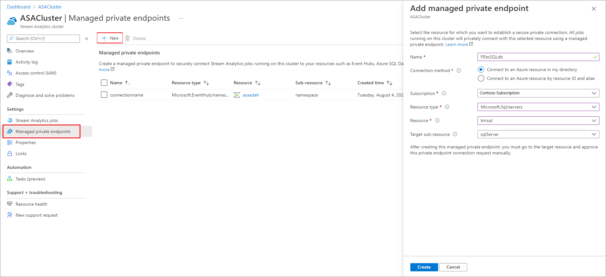
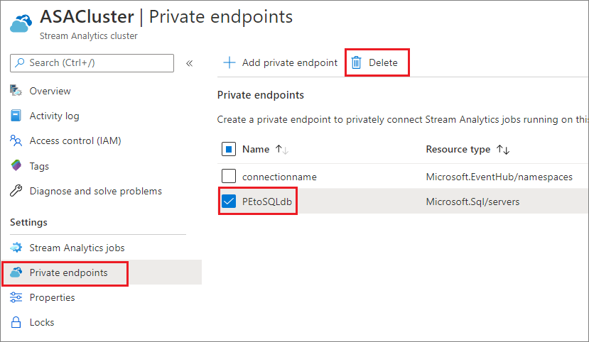

# Create and delete managed private endpoints in an Azure Stream Analytics cluster

You can connect your Azure Stream Analytics jobs running on a cluster to input and output resources that are behind a firewall or an Azure Virtual Network (VNet). First, you create a managed private endpoint for a resource, such as Azure Event Hub or Azure SQL Database, in your Stream Analytics cluster. Then, approve the private endpoint connection from your input or output.

Once you approve the connection, any job running in your Stream Analytics cluster can access the resource through the private endpoint. This article shows you how to create and delete private endpoints in a Stream Analytics cluster. You can create private endpoints for:
* Azure SQL Database
* Azure Cosmos DB
* Azure Blob Storage
* Azure Data Lake Storage Gen2
* Azure Event Hub
* Azure IoT Hubs
* Azure Service Bus
* Azure Synapse Analytics - Dedicated SQL pool
* Azure Data Explorer (kusto)

## Create managed private endpoint in Stream Analytics cluster

In this section, you learn how to create a private endpoint in a Stream Analytics cluster.

1. In the Azure portal, locate and select your Stream Analytics cluster.

1. Under **Settings**, select **Managed private endpoints**.

1. Select **New** and enter the following information to choose the resource you want to access securely through a private endpoint.

   |Setting|Value|
   |---|---|
   |Name|Enter any name for your private endpoint. If this name is taken, create a unique name.|
   |Connection method|Select **Connect to an Azure resource in my directory**.  You can choose one of your resources to securely connect to using the private endpoint, or you can connect to someone else's resource by using a resource ID or alias that they've shared with you.|
   |Subscription|Select your subscription.|
   |Resource type|Choose the [resource type that maps to your resource](../private-link/private-endpoint-overview.md#private-link-resource).|
   |Resource|Select the resource you want to connect to using private endpoint.|
   |Target subresource|The type of subresource for the resource selected above that your private endpoint will be able to access.|

   

1. Approve the connection from the target resource. For example, if you created a private endpoint to an Azure SQL Database instance in the previous step, you should go to this SQL Database instance and see a pending connection that should be approved. It might take a few minutes for connection request to show up.

    

1. You can go back to your Stream Analytics cluster to see the state change from **Pending customer approval** to **Pending DNS Setup** to **Set up complete** within couple of minutes.

## Delete a managed private endpoint in a Stream Analytics cluster

1. In the Azure portal, locate and select your Stream Analytics cluster.

1. Under **Settings**, select **Managed private endpoints**.

1. Choose the private endpoint you want to delete and select **Delete**.

   

## Limitation
When configuring managed private endpoints to Azure Synapse Analytics (Dedicated SQL pool), you must add your Synapse SQL output to your job using **Provide SQL Database settings manually** mode. Provide the full Dedicated Synapse SQL pool URL such as **{WorkspaceName}.sql.azuresynapse.net** for the **Server name** field. 

## Next steps

You now have an overview of how to manage private endpoints in an Azure Stream Analytics cluster. Next, you can learn how to scale your clusters and run jobs in your cluster:

* [Scale an Azure Stream Analytics cluster](scale-cluster.md)
* [Manage Stream Analytics jobs in a Stream Analytics cluster](manage-jobs-cluster.md)
