# Quickstart: Create an Azure Stream Analytics cloud job in Visual Studio Code (Preview)

This quickstart shows you how to create and run a Stream Analytics job using the Azure Stream Analytics extension for Visual Studio Code. The example job reads streaming data from an IoT Hub device. You define a job that calculates the average temperature when over 27° and writes the resulting output events to a new file in blob storage.

## Before you begin

* If you don't have an Azure subscription, create a [free account](https://azure.microsoft.com/free/).

* Sign in to the [Azure portal](https://portal.azure.com/).

* Install [Visual Studio Code](https://code.visualstudio.com/).

## Install the Azure Stream Analytics extension

1. Open Visual Studio Code.

2. From **Extensions** on the left pane, search for **Stream Analytics** and select **Install** on the **Azure Stream Analytics** extension.

3. Once the extension is installed, verify that **Azure Stream Analytics Tools** is visible in your **Enabled Extensions**.

   

## Activate the Azure Stream Analytics extension

1. Select the **Azure** icon on the VS Code activity bar. **Stream Analytics** will be visible in the side bar. Under **Stream Analytics**, select **Sign in to Azure**. 

   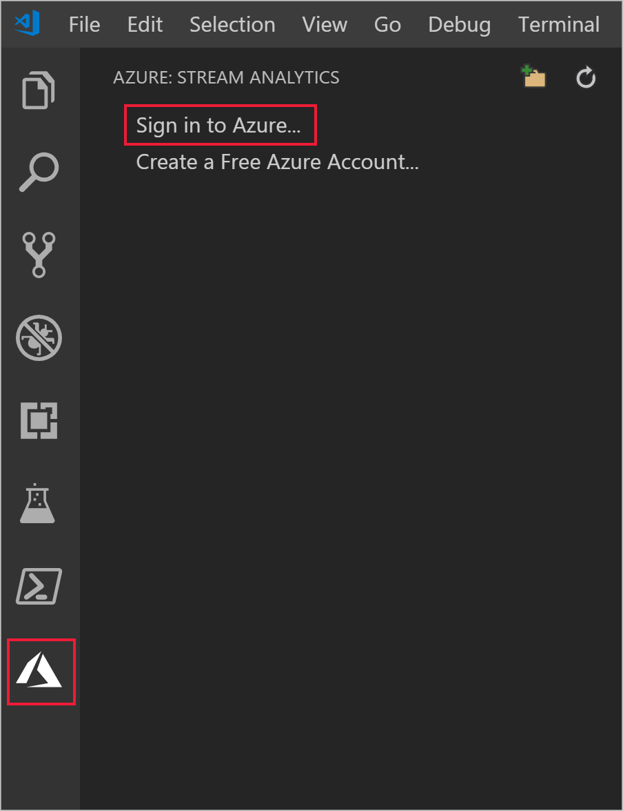

2. When you are signed in, your Azure account name appears on the status bar in the lower-left corner of the VS Code window.

> [!NOTE]
> Azure Stream Analytics tools will automatically sign in the next time if you don't sign out.
> If your account has two-factor authentication, it is recommended that you use phone authentication rather than using a PIN.
> If you have issues listing resources, signing out and signing in again usually helps. To sign out, enter the command `Azure: Sign Out`.

## Prepare the input data

Before defining the Stream Analytics job, you should prepare the data, which is later configured as the job input. To prepare the input data required by the job, complete the following steps:

1. Sign in to the [Azure portal](https://portal.azure.com/).

2. Select **Create a resource** > **Internet of Things** > **IoT Hub**.

3. In the **IoT Hub** pane, enter the following information:
   
   |**Setting**  |**Suggested value**  |**Description**  |
   |---------|---------|---------|
   |Subscription  | \<Your subscription\> |  Select the Azure subscription that you want to use. |
   |Resource group   |   asaquickstart-resourcegroup  |   Select **Create New** and enter a new resource-group name for your account. |
   |Region  |  \<Select the region that is closest to your users\> | Select a geographic location where you can host your IoT Hub. Use the location that's closest to your users. |
   |IoT Hub Name  | MyASAIoTHub  |   Select a name for your IoT Hub.   |

   

4. Select **Next: Set size and scale**.

5. Choose your **Pricing and scale tier**. For this quickstart, select the **F1 - Free** tier if it's still available on your subscription. If the free tier is unavailable, choose the lowest tier available. For more information, see [IoT Hub pricing](https://azure.microsoft.com/pricing/details/iot-hub/).

   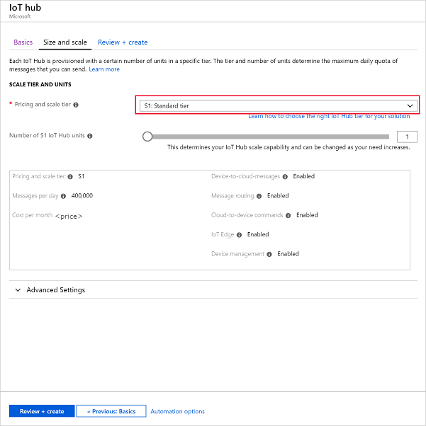

6. Select **Review + create**. Review your IoT Hub information and click **Create**. Your IoT Hub might take a few minutes to create. You can monitor the progress in the **Notifications** pane.

7. In your IoT Hub navigation menu, click **Add** under **IoT devices**. Add a **Device ID** and click **Save**.

   

8. Once the device is created, open the device from the **IoT devices** list. Copy the **Connection string -- primary key** and save it to a notepad to use later.

   

## Create blob storage

1. From the upper left-hand corner of the Azure portal, select **Create a resource** > **Storage** > **Storage account**.

2. In the **Create storage account** pane, enter a storage account name, location, and resource group. Choose the same location and resource group as the IoT Hub you created. Then click **Review + create** to create the account.

   

3. Once your storage account is created, select the **Blobs** tile on the **Overview** pane.

   

4. From the **Blob Service** page, select **Container** and provide a name for your container, such as *container1*. Leave the **Public access level** as **Private (no anonymous access)** and select **OK**.

   

## Create a Stream Analytics project

1. In Visual Studio Code, press **Ctrl+Shift+P** to open the command palette. Then type **ASA** and select **ASA: Create New Project**.

   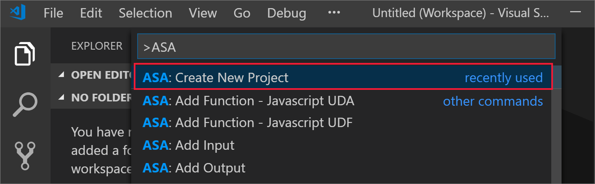

2. Input your project name, like **myASAproj** and select a folder for your project.

    

3. The new project will be added to your workspace. An ASA project consists of the query script **(*.asaql)**, a **JobConfig.json** file, and an **asaproj.json** configuration file.

   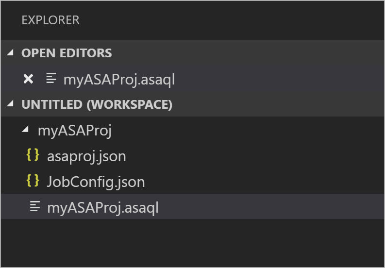

4. The **asaproj.json** configuration file contains the inputs, outputs, and job configuration file information needed for submitting the Stream Analytics job to Azure.

   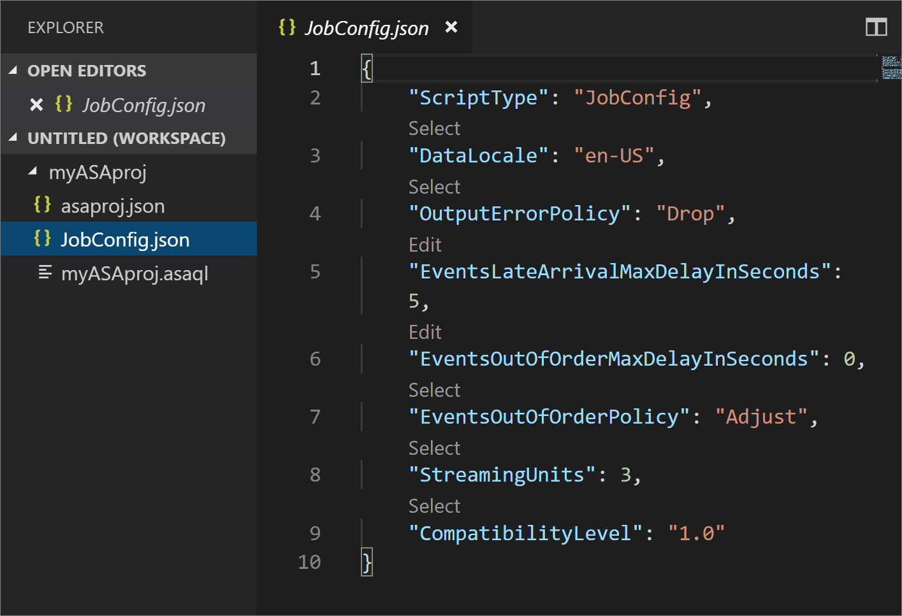

> [!Note]
> When adding inputs and outputs from the command palette, the corresponding paths will be added into **asaproj.json** automatically. If you add or remove inputs or outputs on disk directly, you need to manually add or remove them from **asaproj.json**. You can choose to put the inputs and outputs in one place then reference them in different jobs by specifying the paths in each **asaproj.json**.

## Define an input

1. Select **Ctrl+Shift+P** to open the command palette and enter **ASA: Add Input**.

   

2. Choose **IoT Hub** for the input type.

   

3. Choose the ASA query script that will use the input. It should automatically populate with the file path to **myASAproj.asaql**.

   

4. Enter the input file name as **IotHub.json**.

5. Edit **IoTHub.json** with the following values. Keep default values for fields not mentioned below. You can use the CodeLens to help you enter a string, select from a dropdown list, or change the text directly in the file.

   |Setting|Suggested value|Description|
   |-------|---------------|-----------|
   |Name|Input|Enter a name to identify the job’s input.|
   |IotHubNamespace|MyASAIoTHub|Choose or enter the name of your IoT Hub. IoT Hub names are automatically detected if they are created in the same subscription.|
   |EndPoint|Messaging| |
   |SharedAccessPolicyName|iothubowner| |

## Define an output

1. Select **Ctrl+Shift+P** to open the command palette. Then, enter **ASA: Add Output**.

   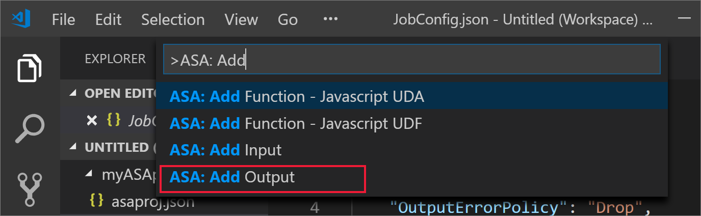

2. Choose **Blob Storage** for the Sink type.

3. Choose the ASA query script that will use this input.

4. Enter the output file name as **BlobStorage.json**.

5. Edit **BlobStorage.json** with the following values. Keep default values for fields not mentioned below. Use the CodeLens to help you enter a string or select from a dropdown list.

   |Setting|Suggested value|Description|
   |-------|---------------|-----------|
   |Name|Output| Enter a name to identify the job's output.|
   |Storage Account|asaquickstartstorage|Choose or enter the name of your storage account. Storage account names are automatically detected if they are created in the same subscription.|
   |Container|container1|Select the existing container that you created in your storage account.|
   |Path Pattern|output|Enter the name of a file path to be created within the container.|

## Define the transformation query

1. Open **myASAproj.asaql** from your project folder.

2. Add the following query:

   ```sql
   SELECT * 
   INTO Output
   FROM Input
   HAVING Temperature > 27
   ```

## Compile the script

Script compilation does two things: check syntax and generate the Azure Resource Manager templates for autodeployment.

There are two ways to trigger script compilation:

1. Select the script from workspace and then trigger compile from the command palette. 

   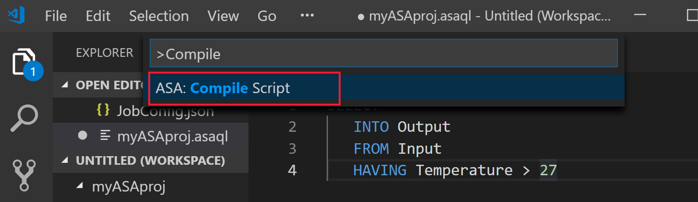

2. Right click on the script and select **ASA: compile script**.

    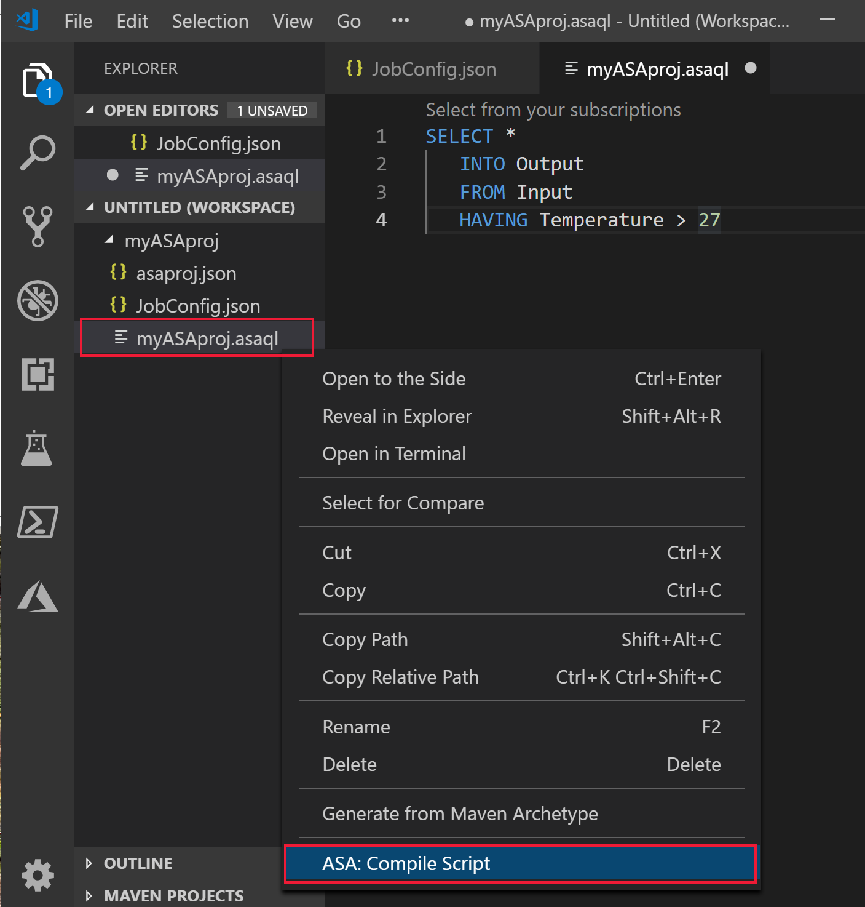

3. After compilation, you can find the two generated Azure Resource Manager templates in **Deploy** folder of your project. These two files are used for autodeployment.

    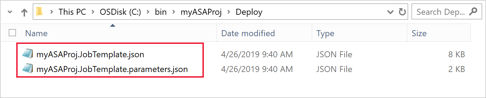

## Submit a Stream Analytics job to Azure

1. In the script editor window of Visual Studio Code, select **Select from your subscriptions**.

   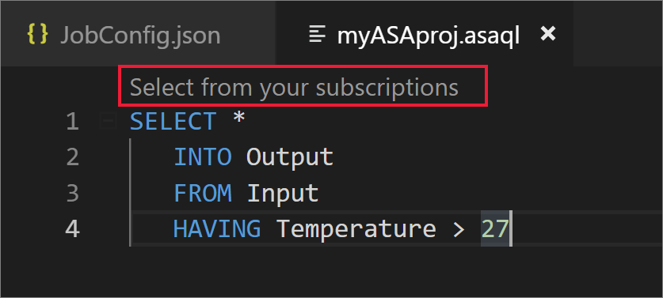

2. Select your subscription from the popup list.

3. Select a job**. Then choose Create a new job.

4. Enter your job name, **myASAjob** and then follow the instructions to choose the resource group and location.

5. Select **Submit to Azure**. The logs can be found in the output window. 

6. When your job is created, you can see it in the Stream Analytics Explorer.

## Run the IoT simulator

1. Open the [Raspberry Pi Azure IoT Online Simulator](https://azure-samples.github.io/raspberry-pi-web-simulator/) in a new browser tab or window.

2. Replace the placeholder in Line 15 with the Azure IoT Hub device connection string you saved in a previous section.

3. Click **Run**. The output should show the sensor data and messages that are being sent to your IoT Hub.

   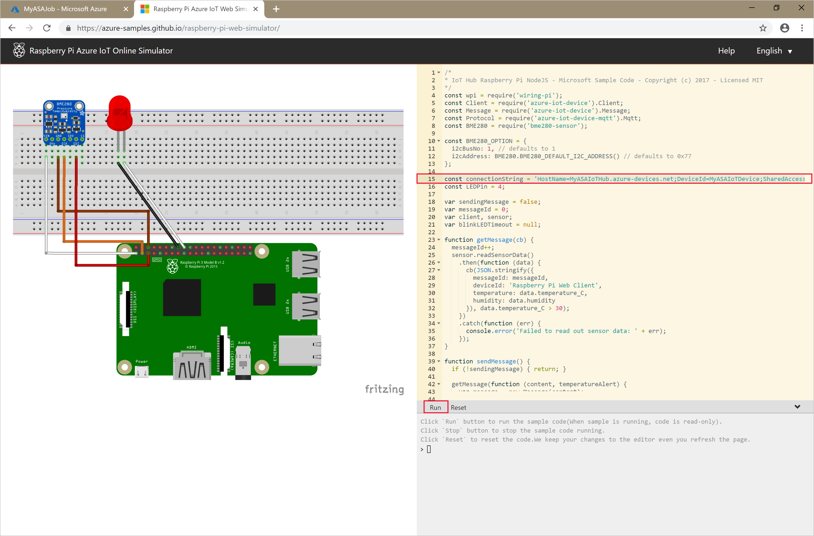

## Start the Stream Analytics job and check output

1. Open **Stream Analytics Explorer** in Visual Studio Code and find your job, **myASAJob**.

2. Right-click on the job name. Then, select **Start** from the context menu.

   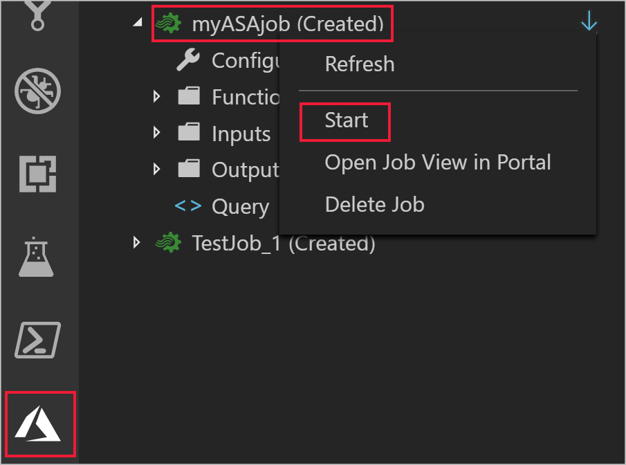

3. Choose **Now** in the popup window to start the job.

4. Note the job status has changed to **Running**. Right-click on the job name and choose **Open Job View in Portal** to see the input and output event metrics. This action may take a few minutes.

5. To view the results, open the blob storage in the Visual Studio Code extension or in the Azure portal.

## Clean up resources

When no longer needed, delete the resource group, the streaming job, and all related resources. Deleting the job avoids billing the streaming units consumed by the job. If you're planning to use the job in future, you can stop it and restart it later when you need. If you are not going to continue to use this job, delete all resources created by this quickstart by using the following steps:

1. From the left-hand menu in the Azure portal, select **Resource groups** and then select the name of the resource you created.  

2. On your resource group page, select **Delete**, type the name of the resource to delete in the text box, and then select **Delete**.

## Next steps

In this quickstart, you deployed a simple Stream Analytics job using Visual Studio Code. You can also deploy Stream Analytics jobs using the [Azure portal](stream-analytics-quick-create-portal.md), [PowerShell](stream-analytics-quick-create-powershell.md), and Visual Studio (stream-analytics-quick-create-vs.md). 

To learn about Azure Stream Analytics tools for Visual Studio, continue to the following article:

> [!div class="nextstepaction"]
> [Use Visual Studio to view Azure Stream Analytics jobs](stream-analytics-vs-tools.md)
