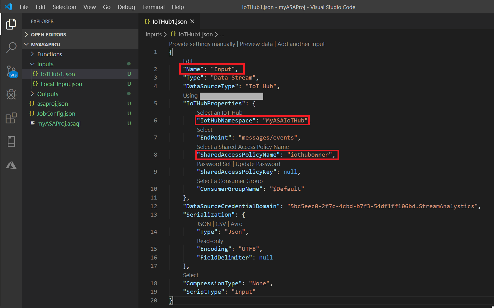
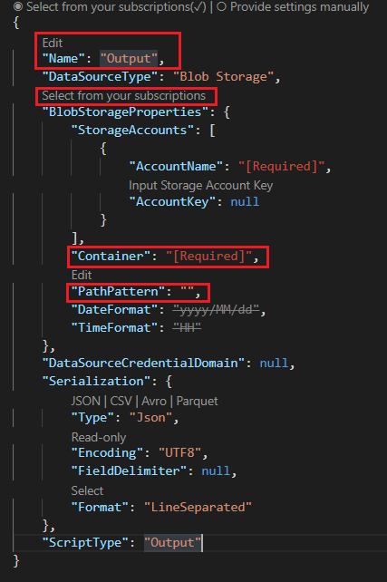
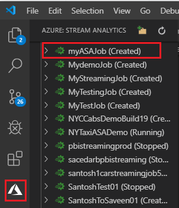

# Quickstart: Create an Azure Stream Analytics job in Visual Studio Code (preview)

This quickstart shows you how to create and run an Azure Stream Analytics job by using the Azure Stream Analytics Tools extension for Visual Studio Code. The example job reads streaming data from an Azure IoT Hub device. You define a job that calculates the average temperature when over 27° and writes the resulting output events to a new file in blob storage.

> [!NOTE]
> Visual Studio and Visual Studio Code tools don't support jobs in the China East, China North, Germany Central, and Germany NorthEast regions.

## Before you begin

* If you don't have an Azure subscription, create a [free account](https://azure.microsoft.com/free/).

* Sign in to the [Azure portal](https://portal.azure.com/).

* Install [Visual Studio Code](https://code.visualstudio.com/).

## Install the Azure Stream Analytics Tools extension

1. Open Visual Studio Code.

2. From **Extensions** on the left pane, search for **Stream Analytics** and select **Install** on the **Azure Stream Analytics Tools** extension.

3. After the extension is installed, verify that **Azure Stream Analytics Tools** is visible in **Enabled Extensions**.

   

## Activate the Azure Stream Analytics Tools extension

1. Select the **Azure** icon on the Visual Studio Code activity bar. Under **Stream Analytics** on the side bar, select **Sign in to Azure**.

   

2. When you're signed in, your Azure account name appears on the status bar in the lower-left corner of the Visual Studio Code window.

> [!NOTE]
> The Azure Stream Analytics Tools extension will automatically sign you in the next time if you don't sign out.
> If your account has two-factor authentication, we recommend that you use phone authentication rather than using a PIN.
> If you have issues with listing resources, signing out and signing in again usually helps. To sign out, enter the command `Azure: Sign Out`.

## Prepare the input data

Before you define the Stream Analytics job, you should prepare the data that's later configured as the job input. To prepare the input data that the job requires, complete the following steps:

1. Sign in to the [Azure portal](https://portal.azure.com/).

2. Select **Create a resource** > **Internet of Things** > **IoT Hub**.

3. In the **IoT Hub** pane, enter the following information:

   |**Setting**  |**Suggested value**  |**Description**  |
   |---------|---------|---------|
   |Subscription  | \<Your subscription\> |  Select the Azure subscription that you want to use. |
   |Resource Group   |   asaquickstart-resourcegroup  |   Select **Create New** and enter a new resource-group name for your account. |
   |Region  |  \<Select the region that is closest to your users\> | Select a geographic location where you can host your IoT hub. Use the location that's closest to your users. |
   |IoT Hub Name  | MyASAIoTHub  |   Select a name for your IoT hub.   |

   

4. Select **Next: Set size and scale**.

5. Make a selection for **Pricing and scale tier**. For this quickstart, select the **F1 - Free** tier if it's still available on your subscription. If the free tier is unavailable, choose the lowest tier available. For more information, see [Azure IoT Hub pricing](https://azure.microsoft.com/pricing/details/iot-hub/).

   

6. Select **Review + create**. Review your IoT hub information and select **Create**. Your IoT hub might take a few minutes to create. You can monitor the progress on the **Notifications** pane.

7. On your IoT hub's navigation menu, select **Add** under **IoT devices**. Add an ID for **Device ID**, and select **Save**.

   

8. After the device is created, open the device from the **IoT devices** list. Copy the string in **Connection string (primary key)** and save it to a notepad to use later.

   

## Run the IoT simulator

1. Open the [Raspberry Pi Azure IoT Online Simulator](https://azure-samples.github.io/raspberry-pi-web-simulator/) in a new browser tab or window.

2. Replace the placeholder in line 15 with the IoT hub device connection string that you saved earlier.

3. Select **Run**. The output should show the sensor data and messages that are being sent to your IoT hub.

   

## Create blob storage

1. From the upper-left corner of the Azure portal, select **Create a resource** > **Storage** > **Storage account**.

2. In the **Create storage account** pane, enter a storage account name, location, and resource group. Choose the same location and resource group as the IoT hub that you created. Then select **Review + create** to create the account.

   

3. After your storage account is created, select the **Blobs** tile on the **Overview** pane.

   

4. From the **Blob Service** page, select **Container** and provide a name for your container, such as **container1**. Leave **Public access level** as **Private (no anonymous access)** and select **OK**.

   

## Create a Stream Analytics project

1. In Visual Studio Code, select **Ctrl+Shift+P** to open the command palette. Then enter **ASA** and select **ASA: Create New Project**.

   

2. Enter your project name, like **myASAproj**, and select a folder for your project.

    

3. The new project is added to your workspace. A Stream Analytics project consists of three folders: **Inputs**, **Outputs**, and **Functions**. It also has the query script **(*.asaql)**, a **JobConfig.json** file, and an **asaproj.json** configuration file.

    The **asaproj.json** configuration file contains the inputs, outputs, and job configuration file information needed for submitting the Stream Analytics job to Azure.

    

> [!Note]
> When you're adding inputs and outputs from the command palette, the corresponding paths are added to **asaproj.json** automatically. If you add or remove inputs or outputs on disk directly, you need to manually add or remove them from **asaproj.json**. You can choose to put the inputs and outputs in one place and then reference them in different jobs by specifying the paths in each **asaproj.json** file.

## Define the transformation query

1. Open **myASAproj.asaql** from your project folder.

2. Add the following query:

   ```sql
   SELECT *
   INTO Output
   FROM Input
   HAVING Temperature > 27
   ```

## Define a live input

1. Right-click the **Inputs** folder in your Stream Analytics project. Then select **ASA: Add Input** from the context menu.

    

    Or select **Ctrl+Shift+P** to open the command palette and enter **ASA: Add Input**.

   

2. Choose **IoT Hub** for the input type.

   

3. If you added the input from the command palette, choose the Stream Analytics query script that will use the input. It should be automatically populated with the file path to **myASAproj.asaql**.

   

4. Choose **Select from your Azure Subscriptions** from the drop-down menu.

    

5. Edit the newly generated **IoTHub1.json** file with the following values. Keep default values for fields not mentioned here.

   |Setting|Suggested value|Description|
   |-------|---------------|-----------|
   |Name|Input|Enter a name to identify the job's input.|
   |IotHubNamespace|MyASAIoTHub|Choose or enter the name of your IoT hub. IoT hub names are automatically detected if they're created in the same subscription.|
   |SharedAccessPolicyName|iothubowner| |

   You can use the CodeLens feature to help you enter a string, select from a drop-down list, or change the text directly in the file. The following screenshot shows **Select from your Subscriptions** as an example. The credentials are auto-listed and saved in local credential manager.

   

   

## Preview input

Select **Preview data** in **IoTHub1.json** from the top line. Some input data will be fetched from the IoT hub and shown in the preview window. This process might take a while.

 

## Define an output

1. Select **Ctrl+Shift+P** to open the command palette. Then, enter **ASA: Add Output**.

   

2. Choose **Blob Storage** for the sink type.

3. Choose the Stream Analytics query script that will use this input.

4. Enter the output file name as **BlobStorage**.

5. Edit **BlobStorage** by using the following values. Keep default values for fields not mentioned here. Use the CodeLens feature to help you select from a drop-down list or enter a string.

   |Setting|Suggested value|Description|
   |-------|---------------|-----------|
   |Name|Output| Enter a name to identify the job's output.|
   |Storage Account|asaquickstartstorage|Choose or enter the name of your storage account. Storage account names are automatically detected if they're created in the same subscription.|
   |Container|container1|Select the existing container that you created in your storage account.|
   |Path Pattern|output|Enter the name of a file path to be created within the container.|

   

## Compile the script

Script compilation checks syntax and generates the Azure Resource Manager templates for automatic deployment.

There are two ways to trigger script compilation:

- Select the script from the workspace and then compile from the command palette.

   

- Right-click the script and select **ASA: Compile Script**.

    

After compilation, you can find the two generated Azure Resource Manager templates in the **Deploy** folder of your project. These two files are used for automatic deployment.


## Submit a Stream Analytics job to Azure

1. In the script editor window of your query script, select **Submit to Azure**.

   

2. Select your subscription from the pop-up list.

3. Choose **Select a job**. Then choose **Create New Job**.

4. Enter your job name, **myASAjob**. Then follow the instructions to choose the resource group and location.

5. Select **Submit to Azure**. You can find the logs in the output window. 

6. When your job is created, you can see it in **Stream Analytics Explorer**.

    

## Start the Stream Analytics job and check output

1. Open **Stream Analytics Explorer** in Visual Studio Code and find your job, **myASAJob**.

2. Right-click the job name. Then, select **Start** from the context menu.

   

3. Choose **Now** in the pop-up window to start the job.

4. Note that the job status has changed to **Running**. Right-click the job name and select **Open Job View in Portal** to see the input and output event metrics. This action might take a few minutes.

5. To view the results, open the blob storage in the Visual Studio Code extension or in the Azure portal.

## Clean up resources

When they're no longer needed, delete the resource group, the streaming job, and all related resources. Deleting the job avoids billing the streaming units that the job consumes. 

If you're planning to use the job in the future, you can stop it and restart it later. If you're not going to use this job again, use the following steps to delete all resources that you created in this quickstart:

1. From the left menu in the Azure portal, select **Resource groups** and then select the name of the resource that you created.  

2. On your resource group page, select **Delete**. Enter the name of the resource to delete in the text box, and then select **Delete**.

## Next steps

In this quickstart, you deployed a simple Stream Analytics job by using Visual Studio Code. You can also deploy Stream Analytics jobs by using the [Azure portal](stream-analytics-quick-create-portal.md), [PowerShell](stream-analytics-quick-create-powershell.md), and [Visual Studio](stream-analytics-quick-create-vs.md).

To learn about Azure Stream Analytics Tools for Visual Studio Code, continue to the following articles:

* [Test Stream Analytics queries locally with sample data using Visual Studio Code](visual-studio-code-local-run.md)

* [Test Azure Stream Analytics jobs locally against live input with Visual Studio Code](visual-studio-code-local-run-live-input.md)

* [Use Visual Studio Code to view Azure Stream Analytics jobs](visual-studio-code-explore-jobs.md)

* [Set up CI/CD pipelines by using the npm package](setup-cicd-vs-code.md)
