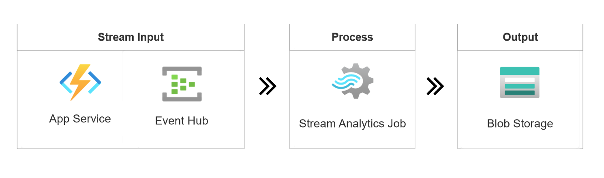
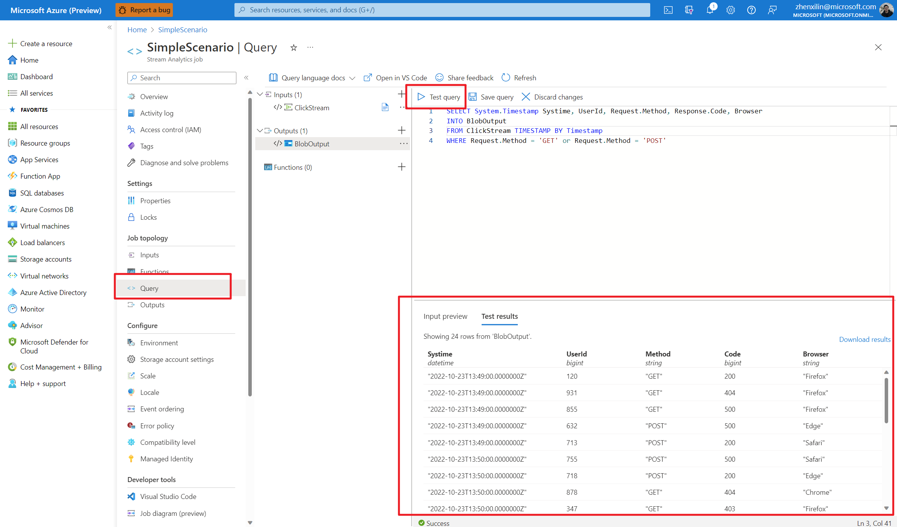
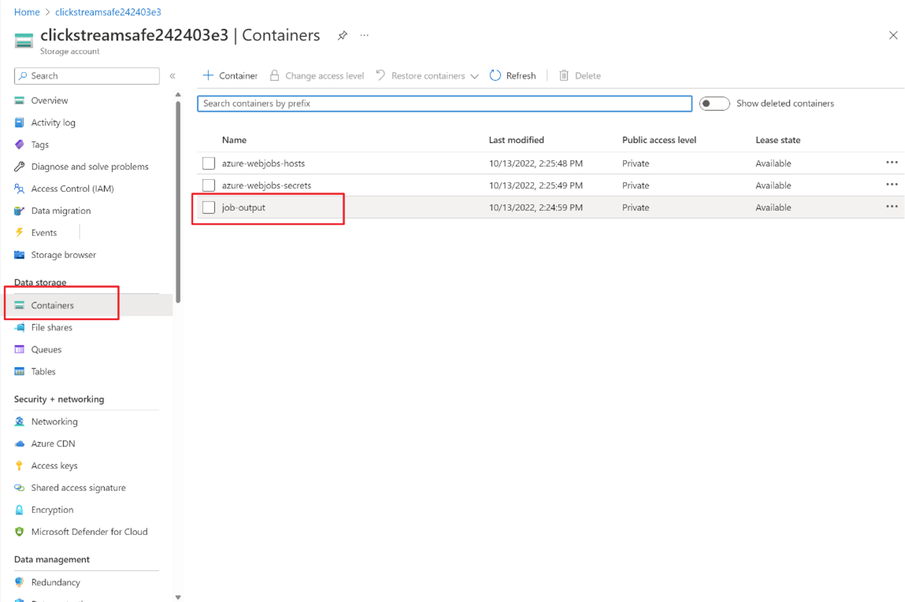
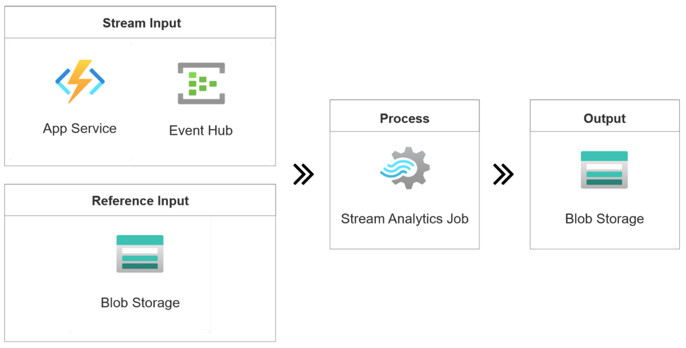

# Quickstart: Build an e2e Streaming Application for Clickstream Analysis

Analyzing clickstream data is an effective way for businesses to optimize website traffic and gain insights into user behavior. This quickstart outlines how you can build a streaming application for analyzing website clickstream data.

The method outlined in this guide uses a PowerShell script to deploy Azure resources with autogenerated sample data streams. The autogenerated data enables exploring various stream analytic scenarios and helps you deploy Azure resources effortlessly.

Here are the typical scenarios for processing and analyzing clickstream: 
- Filter clickstream requests
- Join clickstream with a file

## Prerequisites
* Azure subscription. If you don't have an Azure subscription, [create a free account](https://azure.microsoft.com/free/).
* Install [Git](https://git-scm.com/downloads).
* Azure PowerShell module. [Visit here to install or upgrade](/powershell/azure/install-azure-powershell).

## Filter clickstream requests

In this example, you learn to extract `GET` and `POST` requests from a website clickstream and store the output results to an Azure Blob Storage. Here's the architecture for this example:


Sample of a website clickstream:

```json
{
    "EventTime": "2022-09-09 08:58:59 UTC",
    "UserID": 465,
    "IP": "145.140.61.170",
    "Request": {
    "Method": "GET",
    "URI": "/index.html",
    "Protocol": "HTTP/1.1"
    },
    "Response": {
    "Code": 200,
    "Bytes": 42682
    },
    "Browser": "Chrome"
}
```

We'll be using the scripts available in the [GitHub repository](https://github.com/Azure/azure-stream-analytics) for deploying our required resources:

1. Open **PowerShell** from the Start menu, clone this GitHub repository to your working directory.

    ```powershell
    git clone https://github.com/Azure/azure-stream-analytics.git
    ```

2. Go to **BuildApplications** folder.

    ```powershell
    cd .\azure-stream-analytics\BuildApplications\
    ```

3. Sign in to Azure and enter your Azure credentials in the pop-up browser.

    ```powershell
    Connect-AzAccount
    ```

4. Replace `$subscriptionId` with your Azure subscription ID and run the following command to deploy Azure resources. This process may take a few minutes to complete.

    ```powershell
    .\CreateJob.ps1 -job ClickStream-Filter -eventsPerMinute 11 -subscriptionid $subscriptionId
    ```

    * `eventsPerMinute` is the input rate for generated data. In this case, the input source generates 11 events per minute.
    * You can find your subscription ID in **Azure portal > Subscriptions**.

5. Once the deployment is completed, it opens your browser automatically, and you can see a resource group named **ClickStream-Filter-rg-\*** in the Azure portal. The resource group contains the following five resources:

    | Resource Type | Name | Description |
    | ------------ | --------------------------------------------- | -------------------------------- |
    | Azure Function | clickstream* | Generate clickstream data |
    | Event Hubs | clickstream* | Ingest clickstream data for consuming |
    | Stream Analytics Job | ClickStream-Filter | Define a query to extract `GET` requests from the clickstream input |
    | Blob Storage | clickstream* | Output destination for the ASA job |
    | App Service Plan | clickstream* | A necessity for Azure Function |

6. **Congratulation!** You've deployed a streaming application to extract requests from a website clickstream. 

7. The ASA job **ClickStream-Filter** uses the following query to extract HTTP requests from the clickstream. Select **Test query** in the query editor to preview the output results.

    ```sql
    SELECT System.Timestamp Systime, UserId, Request.Method, Response.Code, Browser
    INTO BlobOutput
    FROM ClickStream TIMESTAMP BY Timestamp
    WHERE Request.Method = 'GET' or Request.Method = 'POST'
    ```

    

8. There are sample codes in the query comments that you can use for other stream analytic scenarios with one stream input.

    * Count clicks for every hour

        ```sql
        select System.Timestamp as Systime, count( * )
        FROM clickstream
        TIMESTAMP BY EventTime
        GROUP BY TumblingWindow(hour, 1)
        ```

    * Select distinct user

        ```sql
        SELECT *
        FROM clickstream
        TIMESTAMP BY Time
        WHERE ISFIRST(hour, 1) OVER(PARTITION BY userId) = 1
        ```

8. All output results are stored as `JSON` file in the Blog Storage. You can find it via: **Blob Storage > Containers > job-output**.


## Clickstream-RefJoin

If you want to find out the username for the clickstream using a user file in storage, you can join the clickstream with a reference input as following architecture:


Assume you've completed the steps for previous example, run following commands to create a new resource group: 

1. Replace `$subscriptionId` with your Azure subscription ID and run the following command to deploy Azure resources. This process may take a few minutes to complete.

    ```powershell
    .\CreateJob.ps1 -job ClickStream-RefJoin -eventsPerMinute 11 -subscriptionid $subscriptionId
    ```

2. Once the deployment is completed, it opens your browser automatically, and you can see a resource group named **ClickStream-RefJoin-rg-\*** in the Azure portal. The resource group contains five resources.

3. The ASA job **ClickStream-RefJoin** uses the following query to join the clickstream with reference sql input.

    ```sql
    CREATE TABLE UserInfo(
      UserId bigint,
      UserName nvarchar(max),
      Gender nvarchar(max)
    );
    SELECT System.Timestamp Systime, ClickStream.UserId, ClickStream.Response.Code, UserInfo.UserName, UserInfo.Gender
    INTO BlobOutput
    FROM ClickStream TIMESTAMP BY EventTime
    LEFT JOIN UserInfo ON ClickStream.UserId = UserInfo.UserId
    ```

4. **Congratulation!** You've deployed a streaming application to join your user file with a website clickstream.

## Clean up resources

If you've tried out this project and no longer need the resource group, run this command on PowerShell to delete the resource group.

```powershell
Remove-AzResourceGroup -Name $resourceGroup
```

If you're planning to use this project in the future, you can skip deleting it, and stop the job for now.

## Next steps

To learn about Azure Stream Analytics, continue to the following articles:

* [Quickstart: Create an Azure Stream Analytics job in VS Code](quick-create-visual-studio-code.md)

* [Test ASA queries locally against live stream input](visual-studio-code-local-run-live-input.md)

* [Use Visual Studio Code to view Azure Stream Analytics jobs](visual-studio-code-explore-jobs.md)

* [Set up CI/CD pipelines by using the npm package](./cicd-overview.md)
