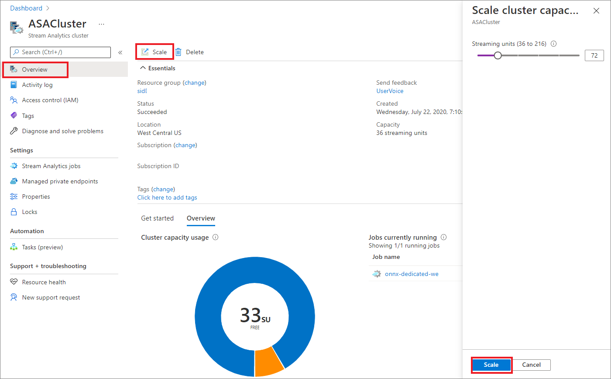

# Resize an Azure Stream Analytics cluster

The capacity of a Stream Analytics cluster is measured in Streaming Units (SU). Multiple jobs can run in parallel in the same cluster as long as the sum of SUs assigned to all running jobs does not exceed the capacity of the cluster.

The capacity of the cluster can be scaled up and down to match the size of your streaming workloads. Scaling a cluster takes time and frequent scaling is not intended. We recommend you plan and provision a cluster with an accurate number of SUs you plan to consume.

## Change the scale of your cluster

1. In the Azure portal, locate and select your Stream Analytics cluster.

1. In the **Overview** section, select **Scale**. You can see how many SUs are assigned to your cluster. Use the selector to increase or decrease SUs as needed.

   

The scaling operation does not impact any jobs that are currently running.

## Next steps

You now know how to scale up and down your Stream Analytics clusters. Next, you can learn about managing private endpoints and autoscaling your jobs:

* [Manage private endpoints in an Azure Stream Analytics cluster](private-endpoints.md)
* [Manage jobs in an Azure Stream Analytics cluster](manage-jobs-cluster.md)
