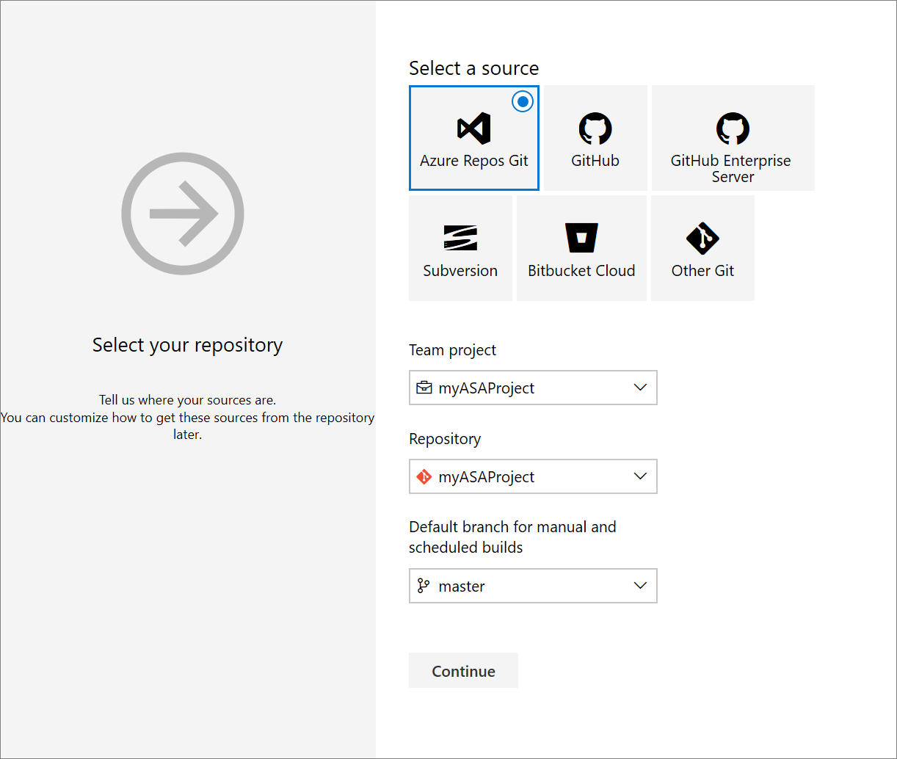
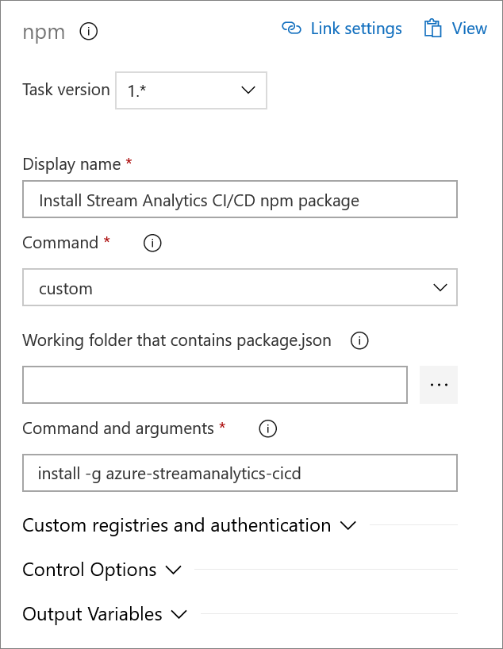
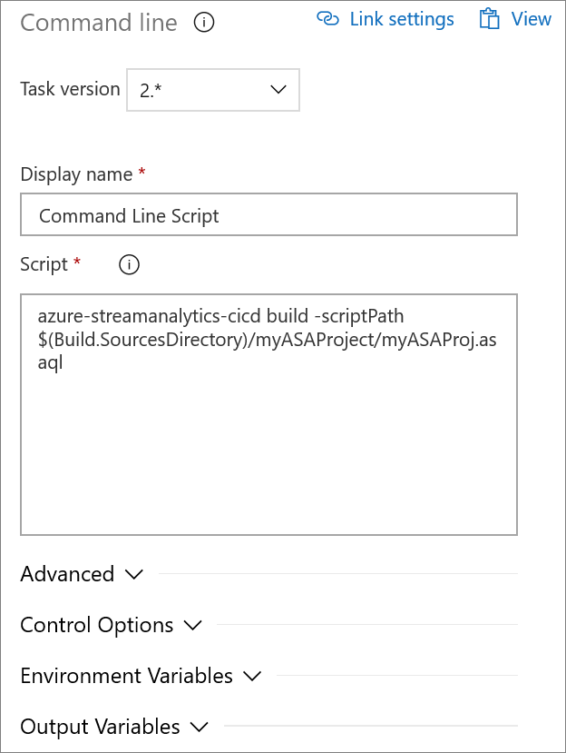
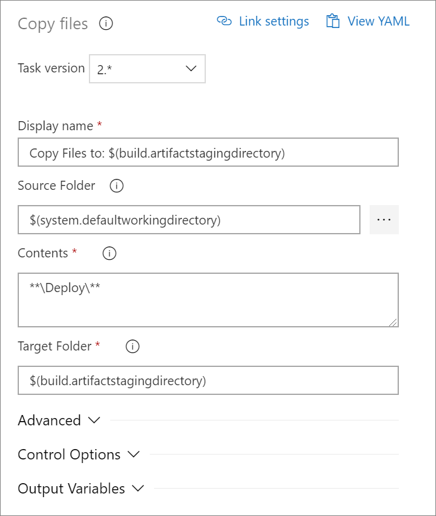
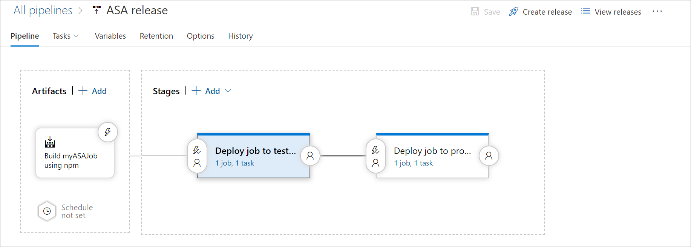

# Deploy an Azure Stream Analytics job using CI/CD npm package 

You can use the Azure Stream Analytics CI/CD npm package to set up a continuous integration and deployment process for your Stream Analytics jobs. This article describes how to use the npm package in general with any CI/CD system, as well as specific instructions for deployment with Azure Pipelines.

For more information about deploying with Powershell, see [deploy with a Resource Manager template file and Azure PowerShell](https://docs.microsoft.com/azure/azure-resource-manager/resource-group-template-deploy). You can also learn more about how to [use an object as a parameter in a Resource Manager template](https://docs.microsoft.com/azure/architecture/building-blocks/extending-templates/objects-as-parameters).

## Build the VS Code project

You can enable continuous integration and deployment for Azure Stream Analytics jobs using the **asa-streamanalytics-cicd** npm package. The npm package provides the tools to generate Azure Resource Manager templates of [Stream Analytics Visual Studio Code projects](quick-create-vs-code.md). It can be used on Windows, macOS, and Linux without installing Visual Studio Code.

You can [download the package](https://www.npmjs.com/package/azure-streamanalytics-cicd) directly, or install it [globally](https://docs.npmjs.com/downloading-and-installing-packages-globally) via the `npm install -g azure-streamanalytics-cicd` command. This is the recommended approach, which can also be used in a PowerShell or Azure CLI script task of a build pipeline in **Azure Pipelines**.

Once you have installed the package, use the following command to output the Azure Resource Manager templates. The **scriptPath** argument is the absolute path to the **asaql** file in your project. Make sure the asaproj.json and JobConfig.json files are in the same folder with the script file. If the **outputPath** is not specified, the templates will be placed in the **Deploy** folder under the project's **bin** folder.

```powershell
azure-streamanalytics-cicd build -scriptPath <scriptFullPath> -outputPath <outputPath>
```
Example (on macOS)
```powershell
azure-streamanalytics-cicd build -scriptPath "/Users/roger/projects/samplejob/script.asaql" 
```

When a Stream Analytics Visual Studio Code project builds successfully, it generates the following two Azure Resource Manager template files under the **bin/[Debug/Retail]/Deploy** folder: 

*  Resource Manager template file

       [ProjectName].JobTemplate.json 

*  Resource Manager parameters file

       [ProjectName].JobTemplate.parameters.json   

The default parameters in the parameters.json file are from the settings in your Visual Studio Code project. If you want to deploy to another environment, replace the parameters accordingly.

> [!NOTE]
> For all the credentials, the default values are set to null. You are **required** to set the values before you deploy to the cloud.

```json
"Input_EntryStream_sharedAccessPolicyKey": {
      "value": null
    },
```

## Deploy with Azure Pipelines

This section details how to create Azure Pipelines [build](https://docs.microsoft.com/azure/devops/pipelines/get-started-designer?view=vsts&tabs=new-nav) and [release](https://docs.microsoft.com/azure/devops/pipelines/release/define-multistage-release-process?view=vsts) pipelines using npm.

Open a web browser and navigate to your Azure Stream Analytics Visual Studio Code project.

1. Under **Pipelines** in the left navigation menu, select **Builds**. Then select **New pipeline**

   

2. Select **Use the classic editor** to create a pipeline without YAML.

3. Select your source type, team project, and repository. Then select **Continue**.

   

4. On the **Choose a template** page, select **Empty job**.

### Add npm task

1. On the **Tasks** page, select the plus sign next to **Agent job 1**. Enter "npm" in the task search and select **npm**.

   

2. Give the task a **Display name**. Change the **Command** option to *custom* and enter the following command in **Command and arguments**. Leave the remaining default options.

   ```cmd
   install -g azure-streamanalytics-cicd
   ```

   

### Add command line task

1. On the **Tasks** page, select the plus sign next to **Agent job 1**. Search for **Command line**.

2. Give the task a **Display name** and enter the following script. Modify the script with your repository name and project name.

   ```cmd
   azure-streamanalytics-cicd build -scriptPath $(Build.SourcesDirectory)/myASAProject/myASAProj.asaql
   ```

   

### Add copy files task

1. On the **Tasks** page, select the plus sign next to **Agent job 1**. Search for **Copy files**. Then enter the following configurations.

   |Parameter|Input|
   |-|-|
   |Display name|Copy Files to: $(build.artifactstagingdirectory)|
   |Source Folder|`$(system.defaultworkingdirectory)`| 
   |Contents| `**\Deploy\**` |
   |Target Folder| `$(build.artifactstagingdirectory)`|

   

### Add Publish build artifacts task

1. On the **Tasks** page, select the plus sign next to **Agent job 1**. Search for **Publish build artifacts** and select the option with the black arrow icon. 

2. Do not change any of the default configurations.

### Save and run

Once you have finished adding the npm, command line, copy files, and publish build artifacts tasks, select **Save & queue**. When you are prompted, enter a save comment and select **Save and run**.

## Release with Azure Pipelines

Open a web browser and navigate to your Azure Stream Analytics Visual Studio Code project.

1. Under **Pipelines** in the left navigation menu, select **Releases**. Then select **New pipeline**.

2. Select **start with an Empty job**.

3. In the **Artifacts** box, select **+ Add an artifact**. Under **Source**, select the build pipeline you just created and select **Add**.

   

4. Change the name of **Stage 1** to **Deploy job to test environment**.

5. Add a new stage and name it **Deploy job to production environment**.

### Add tasks

1. From the tasks dropdown, select **Deploy job to test environment**. 

2. Select the **+** next to **Agent job** and search for *Azure resource group deployment*. Enter the following parameters:

   |Setting|Value|
   |-|-|
   |Display name| *Deploy myASAJob*|
   |Azure subscription| Choose your subscription.|
   |Action| *Create or update resource group*|
   |Resource group| Choose a name for the test resource group that will contain your Stream Analytics job.|
   |Location|Choose the location of your test resource group.|
   |Template location| *Linked artifact*|
   |Template| $(Build.ArtifactStagingDirectory)\drop\myASAJob.JobTemplate.json |
   |Template parameters|($(Build.ArtifactStagingDirectory)\drop\myASAJob.JobTemplate.parameters.json|
   |Override template parameters|-Input_IoTHub1_iotHubNamespace $(test_eventhubname)|
   |Deployment mode|Incremental|

3. From the tasks dropdown, select **Deploy job to production environment**.

4. Select the **+** next to **Agent job** and search for *Azure resource group deployment*. Enter the following parameters:

   |Setting|Value|
   |-|-|
   |Display name| *Deploy myASAJob*|
   |Azure subscription| Choose your subscription.|
   |Action| *Create or update resource group*|
   |Resource group| Choose a name for the production resource group that will contain your Stream Analytics job.|
   |Location|Choose the location of your production resource group.|
   |Template location| *Linked artifact*|
   |Template| $(Build.ArtifactStagingDirectory)\drop\myASAJob.JobTemplate.json |
   |Template parameters|($(Build.ArtifactStagingDirectory)\drop\myASAJob.JobTemplate.parameters.json|
   |Override template parameters|-Input_IoTHub1_iotHubNamespace $(eventhubname)|
   |Deployment mode|Incremental|

### Create release

To create a release, select **Create release** in the top right corner.



## Additional resources

To use Managed Identity for Azure Data Lake Store Gen1 as output sink, you need to provide Access to the service principal using PowerShell before deploying to Azure. Learn more about how to [deploy ADLS Gen1 with Managed Identity with Resource Manager template](stream-analytics-managed-identities-adls.md#resource-manager-template-deployment).


## Next steps

* [Quickstart: Create an Azure Stream Analytics cloud job in Visual Studio Code (Preview)](quick-create-vs-code.md)
* [Test Stream Analytics queries locally with Visual Studio Code (Preview)](visual-studio-code-local-run.md)
* [Explore Azure Stream Analytics with Visual Studio Code (Preview)](visual-studio-code-explore-jobs.md)
